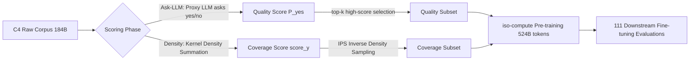

# How to Train Data-Efficient LLMs

**Conference**: ICLR 2026  
**OpenReview**: [https://openreview.net/forum?id=yKUbw7q1IA](https://openreview.net/forum?id=yKUbw7q1IA)  
**Code**: To be confirmed  
**Area**: LLM Pre-training / Data Selection  
**Keywords**: Data-efficient pre-training, Data selection, Quality scoring, Coverage sampling, Ask-LLM, Density sampling  

## TL;DR
This paper systematically compares 22 data selection strategies for LLM pre-training. It proposes **Ask-LLM**, which uses instruction-tuned LLMs to directly provide quality scores, and **Density**, which performs coverage sampling based on kernel density estimation. The study finds that quality filtering (Ask-LLM) can outperform full-scale training while converging 70% faster even when keeping only 10% of the data, whereas coverage sampling typically only "matches" the full-scale performance.

## Background & Motivation
- **Background**: LLM pre-training is the most data- and compute-intensive task in machine learning. However, constrained by the power-law scaling law, the returns from linearly increasing data or parameters diminish sharply. Prior work (LIMA, Phi-2, D4) suggests that meticulously curated small datasets can allow small models to outperform baselines dozens of times larger, making data selection a key lever to break the soft upper bound of scaling laws.
- **Limitations of Prior Work**: Data selection is generally divided into **coverage** (ensuring the model sees the full spectrum of topics/languages) and **quality** (prioritizing high-value samples). However, there is a lack of large-scale fair comparison regarding which is superior or at what stage each functions—partly because such experiments require repeated pre-training across multiple model sizes, sampling rates, and strategies, making the cost prohibitive.
- **Key Challenge**: **Are cheap coverage heuristics (e.g., max-coverage, clustering) sufficient to train SoTA LLMs? Or do expensive, sample-wise quality evaluators possess irreplaceable value?** This is the core research question of this study.
- **Goal**: Construct two samplers—one focusing purely on **quality** and the other on **coverage**—placing them at the extremes of the quality-coverage spectrum to conduct an exhaustive benchmark. This aims to clarify the roles of coverage, quality, and sampling costs during different stages of pre-training.
- **Core Idea**: **Leverage the zero-shot reasoning capabilities of instruction-tuned LLMs as a "quality reviewer"** (Ask-LLM) and use **kernel density summation for efficient local density estimation to perform coverage sampling** (Density). The study conducts a comprehensive comparison using 220 pre-training runs and 1100 fine-tuning evaluations on the T5 series.

## Method

### Overall Architecture
The paper decomposes data selection into two steps: "Scoring + Sampling." First, a sampler assigns a floating-point score (measuring quality or coverage) to each sample in the dataset, followed by selecting a subset via top-k or Importance Sampling (IPS). The two samplers represent opposite ends of the spectrum: Ask-LLM performs highly contextualized quality assessment (expensive, requiring per-sample LLM inference), while Density merely asks "have we already sampled many similar instances?" (cheap, faster than clustering).

### Key Designs

**1. Ask-LLM Quality Sampling: Outsourcing data review to instruction-tuned LLMs.** Instead of using the perplexity of a sample under a specific model as a quality proxy, candidate training samples are directly fed into a fixed prompt: "Does the text between ### contain informative signal for pre-training an LLM? Requirements: well-formatted, contains useful world knowledge, and free of harmful/racist/sexist content. Options: yes / no." The softmax probability of the proxy LLM outputting the "yes" token is taken as the quality score: $\text{score} = P(\text{"yes"} \mid \text{prompt})$. This design bypasses typical failure modes of perplexity filtering, such as the preference for samples lacking context (e.g., questions without answers) or the selection of repetitive nonsense due to high likelihood of common word combinations. Ask-LLM utilizes the reasoning and contextual understanding of LLMs to identify such cases. Crucially, by using the LLM for "quality judgment" rather than "likelihood estimation," it eliminates the **in-distribution bias** of perplexity filters—this remains true even if Ask-LLM uses a model of the same size as the perplexity scorer, as confirmed by the zero correlation between their scores.

**2. Density Coverage Sampling: Estimating local density via kernel density summation for inverse sampling.** The intuition is that the data distribution itself is a strong coverage signal—high-density regions contain many near-duplicate "prototype" samples, while low-density regions contain outliers or unique inputs. To maximize topic coverage, under-represented regions should be amplified while redundant high-density information is suppressed. Given an embedded dataset $D$ and a kernel function $k(x, y)$, the density for each sample is estimated as: $\text{score}(y) = \sum_{x \in D} k_\lambda(x, y)$, where the bandwidth $\lambda$ controls the scale of the points' influence. While naive summation is $O(N^2)$, this work utilizes approximate hashing techniques to reduce complexity to $O(N \log N)$. Unlike the clustering approach used in D4, Density performs density estimation directly in the model's latent space (rather than using n-gram Jaccard distance) and adopts a two-pass sampling algorithm with stronger theoretical guarantees (Theorem C.2). Finally, Density uses IPS (Importance Sampling) based on the inverse of density to maximize coverage—top-K/bottom-K approaches were found to fail at maintaining coverage.

**3. iso-compute Evaluation Protocol: Fixing training tokens instead of epochs.** Low sampling rates result in tiny datasets. Training with fixed epochs would disadvantage methods that "sample a small number of high-quality repeatable tokens." This study standardizes training under an **iso-compute** setting—all models are trained on exactly 524B tokens. A smaller sampling rate implies more repeated epochs. This provides each selection method an equal opportunity to perform without penalizing high-quality repeatable data or favoring large volumes of non-repeating data, ensuring the comparison of 22 samplers is built on a fair compute budget.

**4. Effective Model Size Normalized Metric: Compressing 111 heterogeneous tasks into a comparable figure.** Since 111 downstream tasks respond differently to data/model optimizations, a single metric is insufficient. Inspired by scaling law literature, the paper defines **Effective Model Size**: a parameterized fit based on the "parameter count vs. downstream evaluation" trend. It answers: "If a technique provides performance $x$, how large would an LLM need to be to reach the same $x$ without that technique?" This translates "performance gain" into "equivalent model size," providing a unified and readable scale for weighing coverage, quality, and cost.

## Key Experimental Results

### Main Results
T5-Large fixed sampling at approximately 10% (18B tokens) then iso-compute pre-trained for 524B tokens, comparing various samplers (selected from Table 1, higher Effective Model Size is better):

| Sampler | # Tokens | Effective Model Size | GLUE | SuperGLUE | MMLU | BBH |
|---|---|---|---|---|---|---|
| Full T5-Large | 184B | 800M | 88.2 | 82.5 | 40.7 | 33.6 |
| Random | 18B | 713M | 88.4 | 82.3 | 41.8 | 33.6 |
| Density | 18B | 802M | 88.0 | 80.5 | 42.6 | 35.5 |
| Prototypes | 18B | 423M | 87.7 | 80.5 | 36.7 | 33.0 |
| Perplexity (Small) | 18B | 301M | 87.6 | 80.2 | 36.8 | 33.8 |
| DSIR | 18B | 476M | 87.3 | 81.7 | 39.8 | 33.3 |
| Q-Classifier | 18B | 797M | 88.7 | 83.6 | 40.5 | 35.0 |
| **Ask-LLM (Gemma-7B)** | 18B | **1.5B** | 88.2 | 82.5 | 44.2 | 37.1 |

Using only 10% of the data, Ask-LLM (G.7B) trains the 800M T5-Large to the level of an equivalent 1.5B model, nearly doubling it. Coverage-based methods like Density roughly "match" the full training (802M), while perplexity filtering causes significant degradation (301M).

### Ablation Study
Accelerator-hour costs for training and scoring (Table 2, average of 30 runs):

| Metric (Accelerator-Hr) | T5-XXL | T5-XL | T5-Large | T5-Base | T5-Small |
|---|---|---|---|---|---|
| Scoring Cost (C4) | 49.0 | 10.0 | 1.7 | 0.76 | 0.24 |
| Training Cost (C4) | — | — | 24.0 | — | 9.3 |

Taking Ask-LLM-T5-XL scoring for training T5-Large as an example: Figure 1 shows that 44% of the training budget can be conservatively cut without performance loss. The total cost is approximately $56\% \times 24 + 10 \approx 23.44$ accelerator hours, which still provides a net gain compared to the 24 hours for full training, and the scoring cost can be amortized across multiple runs.

### Key Findings
- **Reasoning Improves Efficiency**: Ask-LLM trains an 800M model to an equivalent 1.5B level, consistently outperforming perplexity filtering and coverage baselines of the same model capacity (XL), while converging faster (Figure 5).
- **Zero Correlation between Quality Score and Perplexity** (Figure 7): Prompting injects critical information into the sampler that perplexity lacks, suggesting "reasoning + context" is an irreplaceable component.
- **When Expensive Scoring is Worth It**: Other samplers only approach Ask-LLM at high sampling rates (≥60%); Ask-LLM leads significantly in the low-data regime. Thus, LLM-level filtering is most cost-effective for (i) pushing the ceiling of full-scale training by removing low-quality data and (ii) maximizing gains in low-data regimes.
- **Coverage vs. Quality**: Coverage sampling generally "restores" full training performance, but quality filtering (Ask-LLM) can "exceed" it.

## Highlights & Insights
- Responds directly to the long-standing debate of "cheap coverage heuristics vs. expensive quality review" through an exhaustive large-scale comparison (22 samplers × multiple sizes × multiple sampling rates). The conclusions are clear and actionable.
- The essence of Ask-LLM lies in **redefining "quality" from likelihood estimation to "LLM reasoning judgment,"** thereby escaping the in-distribution bias of perplexity. This perspective explains why the scores remain uncorrelated even when using models of the same size.
- Effective Model Size and iso-compute are two robust methodological contributions: the former makes heterogeneous multi-task results comparable, while the latter ensures fair comparison across different sampling rates.

## Limitations & Future Work
- The experiments primarily focus on T5-style encoder-decoder models (60M / 800M) and the C4 dataset. It remains to be verified if the conclusions hold for decoder-only LLMs, trillions of tokens, and diverse corpora mixes.
- Ask-LLM requires one LLM inference per sample; scoring costs scale linearly with data size. While amortizable, this remains a significant overhead for massive corpora. The paper acknowledges that its cost-effectiveness depends on "training costs being large enough to offset scoring costs."
- The authors anticipate that stronger prompting, such as Chain-of-Thought, could further improve Ask-LLM, though it was not explored here. The sensitivity of Density to bandwidth $\lambda$ selection and latent space embedding quality also warrants deeper analysis.

## Related Work & Insights
- Similar to D4 (Tirumala et al., 2023), it assumes availability of pre-trained LLM embeddings, but Density replaces clustering with kernel density summation, performs density estimation in latent space rather than n-gram Jaccard, and offers stronger theoretical guarantees.
- Unifies perplexity/loss filtering as "model-based density sampling" and SemDeDup/SSL Prototypes as "discretized similarity density estimation + outlier filtering," providing a unified "quality-coverage spectrum" framework for future sampler designs.
- Insight for practitioners: In compute-constrained single-epoch scenarios, using LLM review to discard the lowest quality data is currently the most stable means of improving both quality and speed. Coverage sampling is better suited for "matching performance at lower cost" rather than "breaking the ceiling."
- Subsequent research has further decomposed LLM data efficiency into "quality filtering + data mixing" (Li et al., 2024), leading to directions such as score-based corpus reweighting, multi-rubric score aggregation, and inferring quality scores from small proxy LLM training results. Ask-LLM serves as a representative starting point for the "quality filtering" branch of this lineage.

## Rating
- **Novelty**: ⭐⭐⭐⭐ — Redefining data review as LLM reasoning and using KDE for efficient coverage sampling are both original contributions within a unified framework.
- **Experimental Thoroughness**: ⭐⭐⭐⭐⭐ — 22 samplers × multiple sizes × multiple sampling rates, 220 pre-training runs + 1100 fine-tunings + 111 downstream tasks. Rare scale and fair controls.
- **Writing Quality**: ⭐⭐⭐⭐ — Clear research questions, sufficient charts, and well-explained methodology (iso-compute / Effective Model Size).
- **Value**: ⭐⭐⭐⭐⭐ — Directly addresses core controversies in data selection with strong implications for industrial-scale data-efficient pre-training.

<!-- RELATED:START -->

## Related Papers

- [\[ICLR 2026\] Train on Validation (ToV): Fast Data Selection with Applications to Fine-Tuning](train_on_validation_tov_fast_data_selection_with_applications_to_fine-tuning.md)
- [\[ICLR 2026\] How Text Quality Interventions Reshape Neural Scaling Laws for LLMs: Empirical Study](how_text_quality_interventions_reshape_neural_scaling_laws_for_llms_empirical_st.md)
- [\[ICLR 2026\] GneissWeb: Preparing High Quality Data for LLMs at Scale](gneissweb_preparing_high_quality_data_for_llms_at_scale.md)
- [\[ICLR 2026\] How Learning Rate Decay Wastes Your Best Data in Curriculum-Based LLM Pretraining](how_learning_rate_decay_wastes_your_best_data_in_curriculum-based_llm_pretrainin.md)
- [\[ICLR 2026\] Imagine How To Change: Explicit Procedure Modeling for Change Captioning](imagine_how_to_change_explicit_procedure_modeling_for_change_captioning.md)

<!-- RELATED:END -->
