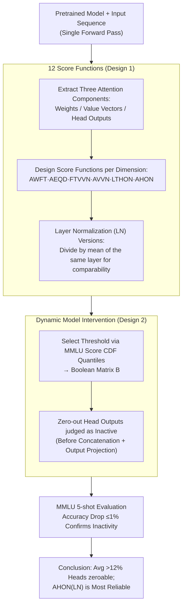

# Identifying and Evaluating Inactive Heads in Pretrained LLMs

**Conference**: ICLR 2026  
**arXiv**: [2504.03889](https://arxiv.org/abs/2504.03889)  
**Code**: [GitHub](https://github.com/psandovalsegura/inactive-heads)  
**Area**: LLM Pre-training / Model Analysis  
**Keywords**: Inactive Attention Head, Score Function, Attention Sink, Model Intervention, Head Output Norm

## TL;DR

This paper systematically evaluates 12 score functions for identifying inactive attention heads in LLMs. The study finds that score functions based on head output norms (AHON LN) identify inactive heads more consistently across model families than traditional attention weight metrics. On average, across 14 models, more than 12% of heads can be zeroed out while maintaining MMLU accuracy within 1%.

## Background & Motivation

**Background**: The attention mechanism is a core component of Transformer LLMs. Existing research has found that some attention heads exhibit the "attention sink" phenomenon, where the first token receives the most attention weight despite limited semantic importance. Guo et al. (2024a) proposed the concept of "dormant heads" based on this, determining head activity by the attention weight of the first token. **Limitations of Prior Work**: Judgments based solely on attention weights have blind spots: (1) a head might attend to multiple tokens with near-zero value vectors, resulting in a near-zero output even without the "high weight on first token" pattern; (2) a head's attention weights might appear "dormant," but its actual output is not near zero; (3) attention patterns vary significantly across model families (Llama, OLMo, Qwen), making weight-based metrics model-dependent. **Key Challenge**: There are multiple definitions of inactive heads—attention focused on irrelevant tokens, near-zero value vectors, or near-zero head output—but prior work focused only on the first, leading to an underestimation of their prevalence. Using AWFT (Average Weight of First Token) only identifies ~4.6% of inactive heads, missing approximately 7.6%. **Goal**: To systematically answer "how prevalent are inactive attention heads" and find the best model-agnostic identification method. **Key Insight**: Inactivity should not be limited to attention weights; instead, all three components of attention—weights, value vectors, and head output—should be examined. By designing 12 simple score functions and validating them through threshold classification and model intervention experiments, the study identifies which heads are truly inactive. **Core Idea**: Inactive attention heads should be identified by the head output norm rather than attention weight patterns, as small outputs truly signify a lack of contribution to the model.

## Method

### Overall Architecture

The paper addresses the question of how many attention heads in pretrained LLMs are "inactive." It employs a diagnostic pipeline of **Measure $\rightarrow$ Classify $\rightarrow$ Verify**: first, attention is decomposed into weights, value vectors, and head outputs during a single forward pass; 12 simple score functions are used to rate each head from different perspectives. Heads are then classified as "potentially inactive" or "active" based on scores and thresholds. Finally, model intervention—dynamically zeroing out outputs of heads judged as inactive and monitoring MMLU accuracy—is used to verify inactivity. This process is conducted across 14 models (Llama-3.1/3.2, OLMo-2, Qwen2.5), leading to the conclusion that an average of over 12% of heads can be safely zeroed out, with the most reliable signal coming from the Attention Head Output Norm (AHON).

### Key Designs

**1. 12 Score Functions: Quantifying "Inactivity" beyond single weights**

Prior work focused exclusively on attention weights, mistakenly treating "focusing on irrelevant tokens" as the sole sign of inactivity. Ours decomposes attention into weights, value vectors, and head outputs, designing simple score functions for each that can be calculated in a single forward pass. **Attention Weight Metrics** measure the distribution: Avg Weight of First Token (AWFT) checks $\frac{1}{N}\sum_i \mathbf{A}_{i,0} > \tau$; Avg Entropy of Query Distributions (AEQD) checks if entropy $< \tau$ (lower entropy means attention is more concentrated). **Value Vector Metrics** bypass weights to examine aggregated content: First Token Value Vector Norm (FTVVN) checks if the first token's value norm $< \tau$; Avg Value Vector Norm (AVVN) checks if the average value norm $< \tau$—even if weights are high, the head output remains near zero if values are near zero. **Head Output Metrics** examine the final vector: Last Token Head Output Norm (LTHON) checks if the last token's output norm $< \tau$; Avg Head Output Norm (AHON) checks the average output norm $< \tau$. This provides the most direct signal of a head's contribution.

Since raw scores vary across layers and models, each function includes a Layer Normalization (LN) version, dividing a head's score by the average of other heads in the same layer:

$$\frac{\text{AvgNorm}(\text{head}^i)}{\frac{1}{N_{\text{layer}}}\sum_j \text{AvgNorm}(\text{head}^j)}$$

This allows thresholds to be universal across layers and model families. IoU analysis shows the maximum IoU between any two functions is 0.58, and maximum Precision is 0.73, indicating that "dormant weights" and "near-zero output" do not refer to the same set of heads.

**2. Dynamic Model Intervention: Verifying inactivity via accuracy impact**

Score functions only provide candidates; inactivity must be cross-verified through intervention. During each forward pass, a boolean matrix $\mathbf{B} \in \{0,1\}^{N_{\text{heads}} \times N_{\text{layers}}}$ is constructed based on scores and thresholds calculated for the current input. The outputs of heads marked at True positions are zeroed out before concatenation and projection. Thresholds are dynamically selected based on score CDF quantiles on MMLU inputs ($p=0, 5, \dots, 30$), controlling the proportion of zeroed heads up to 30%, which is compared against a "randomly zeroed" baseline.

Dynamic zeroing per input is used rather than one-time pruning because head activity can vary by input. If a head is truly inactive, zeroing its output should not significantly affect MMLU accuracy. The more heads a score function can zero out within a 1% accuracy drop, the more reliable it is.

### Loss & Training

This is an analytical work and does not involve training. All evaluations are based on pretrained or fine-tuned models. Scores are calculated via forward passes on 100 FineWeb-Edu samples or MMLU evaluation samples. Standardized evaluation is performed using `lm-evaluation-harness`.

## Key Experimental Results

### Main Results

**Proportion of zeroable heads across 14 models** (Table 2, MMLU accuracy maintained within 1% of baseline):

| Model | Zeroable via AWFT (%) | Zeroable via Best Function (%) | Gain | Best Score Function |
|------|-------------|-----------------|------|------------|
| Llama-3.1-8B | 8.56 | **17.11** | +8.55 | AHON (LN) |
| Llama-3.1-8B-Inst | 1.01 | **10.97** | +9.95 | AHON (LN) |
| OLMo-2-7B | 0.42 | **8.34** | +7.93 | AHON (LN) |
| OLMo-2-7B-DPO | 2.14 | **20.60** | +18.46 | AHON (LN) |
| OLMo-2-7B-Inst | 1.46 | **19.54** | +18.07 | AHON (LN) |
| Qwen2.5-0.5B | 7.43 | **14.42** | +6.99 | LTHON (LN) |
| Qwen2.5-3B | 5.67 | **8.78** | +3.11 | AHON |
| Qwen2.5-7B | 1.25 | **7.54** | +6.29 | AHON (LN) |
| **Average** | **4.61** | **12.18** | **+7.56** | — |

AHON (LN) ranked 1st in 8/14 models and top 3 in 13/14 models.

### Ablation Study

**Cross-dataset stability** (OLMo-2-7B-Inst, identifying 15% heads as inactive):

| Score Function | MMLU Threshold | PIQA Threshold | WinoGrande Threshold | Stability |
|---------|----------|----------|----------------|--------|
| AWFT | 0.077 | 0.265 | 0.109 | Unstable (3.4x diff) |
| AHON (LN) | 0.457 | 0.435 | 0.473 | Stable (<9% diff) |

### Key Findings

- **Output over Weights**: Head output norm is the true indicator of inactivity—heads with "dormant" weights might not have zero output, and vice versa.
- **>12% Safe Removal**: Significantly higher than the ~4.6% estimated by AWFT, indicating previous methods missed 7.6% of inactive heads.
- **Model Agnosticism**: AHON (LN) is consistently effective across Llama, OLMo, and Qwen, while AWFT fails almost completely on OLMo (identifying only 0.42-2.14%).
- **Fine-tuning preserves behavior**: Score distributions after SFT, DPO, or RLHF are nearly identical to base models (minimal Wasserstein distance), suggesting attention behaviors are fixed after pre-training.
- **Scaling Thresholds**: Qwen2.5 scores are similar from 0.5B to 7B, but 14B shows significant differences, suggesting larger models learn different head specialization patterns.

## Highlights & Insights

- Extremely simple method—12 threshold functions effectively identify inactive heads without complex optimization.
- Deep Insight: Attention weights are "misleading signals"—appearing dormant is not equivalent to being inactive; one must focus on actual output contribution.
- Comprehensive experiment matrix (14 models × 12 functions × multiple thresholds × 3 benchmarks) ensures high reliability.
- Dynamic zeroing (per-input) provides a more precise measurement of computational redundancy than permanent pruning.
- Provides better head identification for KV cache compression and inference acceleration—AHON (LN) can be directly applied to practical systems.

## Limitations & Future Work

- Focus is on understanding and identification; actual inference acceleration was not implemented (zeroing was only for verification).
- MLP modules were not analyzed—MLPs following attention might also be inactive per token.
- Lack of specific discussion on GQA (Grouped-Query Attention)—shared KV heads in modern models might affect the analysis.
- Evaluation relies primarily on MMLU; inactive head patterns might differ in generation tasks.
- Zeroing does not equal actual parameter removal—real memory and compute savings require additional engineering.

## Related Work & Insights

- **vs Dormant Attention (Guo et al., 2024a)**: Relying solely on attention weights is insufficient; AHON-based functions identify 2.6x more inactive heads than AWFT.
- **vs Attention Sinks (Xiao et al., 2024)**: First-token aggregation is one manifestation of inactivity but not the only one; this work reveals a richer variety of inactive patterns.

## Rating
- Novelty: ⭐⭐⭐⭐ Redefining inactivity from an output rather than weight perspective is a key innovation.
- Experimental Thoroughness: ⭐⭐⭐⭐⭐ Covers 14 models across 3 families and 12 functions.
- Writing Quality: ⭐⭐⭐⭐ Clear logic, rich visuals, and rigorous design.
- Value: ⭐⭐⭐⭐ Provides a reliable methodological foundation for understanding LLM redundancy.

<!-- RELATED:START -->

## Related Papers

- [\[ICLR 2026\] How to Train Data-Efficient LLMs](how_to_train_data-efficient_llms.md)
- [\[ICLR 2026\] StochasTok: Improving Fine-Grained Subword Understanding in LLMs](stochastok_improving_fine-grained_subword_understanding_in_llms.md)
- [\[ICLR 2026\] GneissWeb: Preparing High Quality Data for LLMs at Scale](gneissweb_preparing_high_quality_data_for_llms_at_scale.md)
- [\[ICLR 2026\] Unveiling Downstream Performance Scaling of LLMs: A Clustering-Based Perspective](unveiling_downstream_performance_scaling_of_llms_a_clustering-based_perspective.md)
- [\[ICML 2025\] Evaluating Morphological Alignment of Tokenizers in 70 Languages](../../ICML2025/llm_pretraining/evaluating_morphological_alignment_of_tokenizers_in_70_languages.md)

<!-- RELATED:END -->
