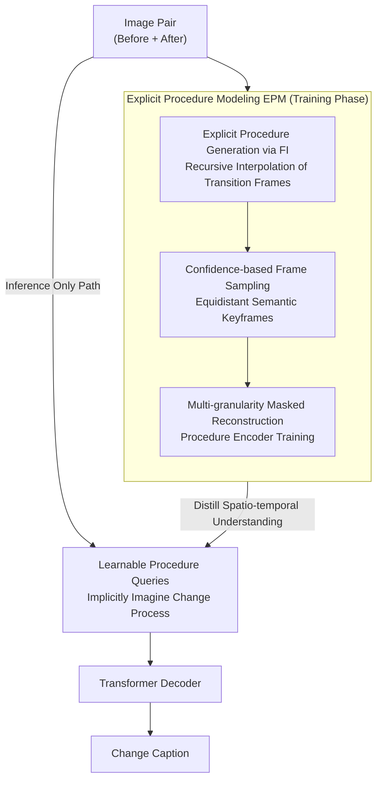

# Imagine How To Change: Explicit Procedure Modeling for Change Captioning

**Conference**: ICLR 2026  
**arXiv**: [2603.05969](https://arxiv.org/abs/2603.05969)  
**Code**: [GitHub](https://github.com/BlueberryOreo/ProCap)  
**Area**: LLM Pre-training  
**Keywords**: Change Captioning, Procedure Modeling, Frame Interpolation, Masked Reconstruction, Learnable Queries, Vision-Language  

## TL;DR

Proposing the ProCap framework, which redefines change captioning from static image pair comparison to dynamic procedure modeling. The first stage trains a procedure encoder to learn spatio-temporal change dynamics through frame interpolation and masked reconstruction, while the second stage employs learnable procedure queries to implicitly infer change processes, outperforming SOTA on three datasets.

## Background & Motivation

**Change Captioning** generates textual descriptions of differences between two similar images, with applications in remote sensing monitoring, medical diagnosis, urban planning, and industrial quality control.

**Limitations of Prior Work**:

- **Static Image Pair Modeling**: Methods only compare "before" and "after" frames, ignoring the **dynamic process** of change.
- **Missing Temporal Cues**: Inability to understand "how the change occurred."
- **Encoder Limitations**: Various difference extractors and alignment mechanisms focus on spatial comparison rather than spatio-temporal modeling.

**Key Insight**: An implicit continuous transition process exists between two images, containing rich spatio-temporal dynamics. For instance, object displacement can be revealed through motion trajectories in intermediate frames.

## Method

### Overall Architecture

ProCap addresses a long-neglected issue in change captioning: existing methods perform static comparisons between "before" and "after" images, leaving the model blind to "how the change happened." The **Mechanism** is to model the change as a **continuous process**, split into two stages for training and inference. The first stage is **Explicit Procedure Modeling (EPM)**, which uses frame interpolation to "hallucinate" a sequence of continuous transition frames between the two images, selects the most critical frames, and trains a procedure encoder to learn spatio-temporal dynamics through multi-granularity masked reconstruction. The second stage is **Implicit Procedure Captioning (IPC)**, which distills the spatio-temporal understanding from the first-stage encoder into a small set of learnable queries. During inference, intermediate frames are no longer explicitly generated; instead, queries "imagine" the change process directly from the image pair, which is then translated into a caption by the decoder. The **Design Motivation** balances "heavy training, light inference"—the training relies on real interpolated frames, while inference only adds a few parameters.

### Key Designs

**1. Explicit Procedure Generation via Frame Interpolation: Complementing "Before and After" into a Continuous Trajectory**

The pain point of change captioning is having only the start and end frames, leaving the model unaware of "how" the change occurred. ProCap uses a pre-trained Frame Interpolation (FI) model to recursively interpolate intermediate frames between the two images. FI first predicts bidirectional optical flow, warps the starting and ending frames to the intermediate time to obtain candidate frames, and then uses a Transformer to estimate a soft mask and residual to fuse the warped images into an intermediate frame. Recursive interpolation expands a single change into a multi-frame sequence. Continuous trajectories, such as object displacement, are thus explicitly "drawn," providing the previously missing temporal cues for spatio-temporal modeling.

**2. Confidence-based Frame Sampling: Selecting "Semantically Equidistant" Key Moments**

Interpolated frames can be numerous and inconsistent in quality; using all of them is inefficient and introduces noise. ProCap utilizes a confidence score to select keyframes, preferring frames that are semantically equidistant from the starting and ending frames—representing the transition moments with the highest information density. The scoring uses the squared difference of semantic distances $(d_{\text{start}}-d_{\text{end}})^2$ as a penalty. Regardless of which end a frame leans toward, it is penalized equally, stabilizing sampling on equidistant intermediate frames rather than degenerate "no-change" frames that nearly duplicate the start or end.

**3. Multi-granularity Masked Reconstruction: Forcing the Encoder to Learn from Local Texture to Full-frame Semantics**

Simply having intermediate frames is insufficient; tasks must be designed to force the model to truly understand the process. The procedure modeling module is a Transformer encoder with an image tokenizer. Input includes a vision stream (patch features), a text stream (caption tokens), and special tokens for frame consistency and cross-modal alignment. During training, one of four masks is randomly applied: a whole-frame mask forces reconstruction via captioning to establish language-to-visual mapping; random patch masks encourage distributed representations; intra-block masks focus on local texture; and extra-block masks learn the relationship between regions and the overall scene. Alternating these granularities forces the encoder to learn reconstructible spatio-temporal representations at frame, region, and patch levels, which are subsequently distilled into queries.

**4. Learnable Procedure Queries: Replacing "Generation" with "Imagination" during Inference**

Frame interpolation is too slow for inference in real-world applications. In the second stage, ProCap introduces $k\cdot n_I$ learnable procedure queries to replace explicit intermediate frames. These queries inherit the understanding of change dynamics from the first-stage encoder, implicitly "imagining" the change process directly from the image pair before being translated into a caption by the Transformer decoder. Inference thus requires no frame interpolation. Compared to the first stage, this adds only $k\cdot n_I$ parameters. When $k=2$, the overhead is negligible while retaining the representation advantages of explicit procedure modeling.

### Loss & Training

The loss for the first-stage procedure modeling consists of three terms: $L_{\text{PRO}} = L_{\text{msm}} + L_{\text{align}} + L_{\text{csy}}$. Here, $L_{\text{msm}}$ predicts discrete image tokens at masked positions (cross-entropy), serving as the primary masked reconstruction task. $L_{\text{align}}$ enables the model to distinguish between matching and non-matching caption-procedure pairs, strengthening cross-modal alignment. $L_{\text{csy}}$ requires the model to distinguish between normal and shuffled frame sequences, forcing it to learn temporal consistency rather than treating frames as an unordered set. The second stage utilizes an autoregressive generation loss to train the learnable queries and decoder end-to-end, distilling the spatio-temporal understanding into the queries. Overall, the training stage is heavier due to frame interpolation, but the inference stage remains lightweight, adding only $k\cdot n_I$ parameters.

## Key Experimental Results

### Main Results

**SOTA Comparison on Three Datasets** (Table 1, CIDEr):

| Method | CLEVR-Change | Spot-the-Diff | Image-Editing |
|------|-------------|---------------|---------------|
| DUDA (2019) | 112.3 | 32.5 | 22.8 |
| SCORER+CBR (2023) | 126.8 | 38.9 | 33.4 |
| MCT-CCDiff (2025) | 131.7 | 41.7 | 38.3 |
| FINER (LLM, 2024) | 137.2 | 61.8 | 50.5 |
| LLaVA-1.5+RP (LLM) | — | 43.2 | 60.9 |
| **ProCap (Ours)** | **135.6** | **42.7** | **40.6** |

Ours leads comprehensively among non-LLM methods and significantly narrows the gap with LLM-based methods.

### Ablation Study

**Component Ablation** (CLEVR-Change CIDEr):

| EPM | IPC | k | CIDEr |
|-----|-----|---|-------|
| N | N | 0 | 108.4 |
| Y | N | 0 | 112.7 |
| N | Y | 1 | 106.2 |
| Y | Y | 1 | **128.5** |

The combination of both leads to a Gain of +20.1 in CIDEr (108.4 -> 128.5).

**Query Length k**:

| k | TPS | CIDEr |
|---|-----|-------|
| 1 | 766 | 128.5 |
| 2 | 699 | **135.6** |
| 4 | 461 | 128.7 |
| 7 | 271 | 130.5 |

k=2 is optimal with reasonable efficiency.

**Loss Ablation** (CLEVR / StD CIDEr):

| msm | align | csy | CLEVR | StD |
|-----|-------|-----|-------|-----|
| Y | N | N | 127.5 | 29.7 |
| Y | N | Y | 128.6 | 36.3 |
| Y | Y | Y | **135.6** | **42.7** |

The full combination provides a 13.0 improvement on StD compared to MSM only.

### Key Findings

1. **Procedure modeling is significantly superior to static comparison.**
2. **Pre-training + Query Synergy**: Pre-training provides spatio-temporal understanding, while queries enable efficient inference.
3. **Lightweight but Powerful**: Non-LLM performance approaches or even surpasses LLM methods.
4. **Cross-scenario Generalization**: Strong performance across synthetic, natural, and open types.

## Highlights & Insights

1. **Paradigm Shift**: Moving from "static spatial comparison" to "dynamic spatio-temporal procedure modeling."
2. **Exquisite Two-stage Design**: Uses explicit frames for training and implicit queries for inference—balancing representation and efficiency.
3. **Creative Confidence Sampling**: Selecting "semantically equidistant" frames to focus on key transition moments.
4. **Multi-granularity Masking**: Multi-scale understanding from frame level down to patch level.
5. **Non-LLM Competitiveness**: Demonstrates that architectural innovation, rather than just scale, can significantly improve performance.

## Limitations & Future Work

1. **Dependency on Frame Interpolation Quality**: The ceiling of performance is directly affected by FI quality.
2. **Assumption of Interpolatable Change**: Sudden appearance/disappearance of objects cannot be modeled via optical flow.
3. **Absence of LLM Decoder**: Integration with LLMs might offer even larger improvements.
4. **Limited to Image Pairs**: Has not yet been extended to video change captioning.
5. **Confidence Sampling Requires Pre-defined Similarity Functions**.

## Related Work & Insights

- **DUDA** [Park et al., 2019]: Foundational framework—ProCap fundamentally extends the paradigm.
- **FINER** [Zhang et al., 2024]: LLM enhancement—ProCap achieves comparable performance without LLMs.
- **VideoMAE** [Han et al., 2022]: Video masked autoencoding—Inspired ProCap's procedure modeling.
- **VQGAN** [Esser et al., 2021]: Image tokenizer—Used for reconstruction targets.
- **RIFE** [Lu et al., 2022]: Frame interpolation—Used for explicit procedure generation.

## Rating

| Dimension | Rating |
|------|------|
| Theoretical Depth | ⭐⭐⭐ |
| Novelty | ⭐⭐⭐⭐⭐ |
| Experimental Thoroughness | ⭐⭐⭐⭐ |
| Writing Quality | ⭐⭐⭐⭐ |
| Value | ⭐⭐⭐⭐ |
| Overall Evaluation | ⭐⭐⭐⭐ |

<!-- RELATED:START -->

## Related Papers

- [\[NeurIPS 2025\] Optimal Online Change Detection via Random Fourier Features](../../NeurIPS2025/llm_pretraining/optimal_online_change_detection_via_random_fourier_features.md)
- [\[ICLR 2026\] RECON: Robust symmetry discovery via Explicit Canonical Orientation Normalization](recon_robust_symmetry_discovery_via_explicit_canonical_orientation_normalization.md)
- [\[ICLR 2026\] Learned Meta-Tokens for Language Modeling](learned_meta-tokens_for_language_modeling.md)
- [\[ICLR 2026\] How to Train Data-Efficient LLMs](how_to_train_data-efficient_llms.md)
- [\[ICLR 2026\] Should We Still Pretrain Encoders with Masked Language Modeling?](should_we_still_pretrain_encoders_with_masked_language_modeling.md)

<!-- RELATED:END -->
