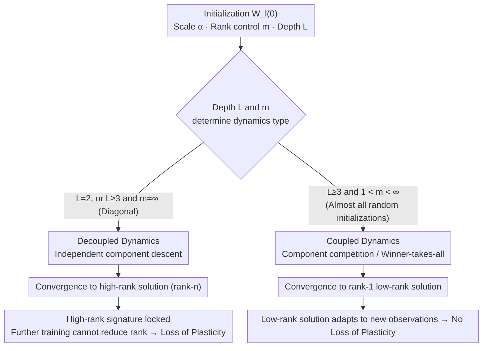

# Implicit Bias and Loss of Plasticity in Matrix Completion: Depth Promotes Low-Rank

**Conference**: ICLR 2026  
**arXiv**: [2603.04703](https://arxiv.org/abs/2603.04703)  
**Code**: None  
**Area**: LLM Pre-training  
**Keywords**: Matrix completion, Deep matrix factorization, Implicit bias, Low-rank preference, Loss of plasticity

## TL;DR

By analyzing the gradient flow dynamics of deep matrix factorization (deep linear networks) in matrix completion tasks, this work proves that coupled dynamics are the key mechanism for low-rank implicit bias. It demonstrates that networks with depth $L \geq 3$ inevitably exhibit coupling (except for diagonal initialization), thereby explaining why deep models avoid the loss of plasticity.

## Background & Motivation

Matrix completion is a fundamental task: recovering a full matrix from partial observations. Deep matrix factorization (representing the target matrix as $W = W_L \cdot W_{L-1} \cdots W_1$) is equivalent to a deep linear neural network and serves as an ideal simplified testbed for studying how depth affects learning dynamics.

While deep matrix factorization has been widely studied, existing theories have two key deficiencies:

**Most theories focus on shallow (depth-2) models**: They fail to fully explain the stronger low-rank preference observed in deeper networks. Why do deeper models tend to converge to lower-rank solutions? Previous work (e.g., Menon, 2024) identified this as an open problem.

**Lack of theoretical explanation for the loss of plasticity**: Kleinman et al. (2024) found that in matrix completion, pre-training with a few observations followed by training with more data can lead to performance degradation—a phenomenon known as loss of plasticity. Deep networks are immune to this, while shallow networks are severely affected, and the mechanism remains unclear.

The core contribution of this paper is its identification of **coupled dynamics** as the key mechanism that unifies depth, low-rank bias, and loss of plasticity within a single theoretical framework.

## Method

### Overall Architecture

This is a purely theoretical paper aiming to answer why deep networks spontaneously prefer low-rank solutions and avoid the loss of plasticity experienced by shallow networks. It treats deep matrix factorization $W = W_L \cdots W_1$ as a minimal solvable testbed. Under the setting of **block-diagonal observations**, the authors use gradient flow (the limit of gradient descent as the learning rate approaches zero) to track the ODEs of parameter evolution. The entire argument centers on **coupled dynamics**: providing a formal definition, proving that "depth $L \geq 3$ almost inevitably leads to coupling," and then proving that "coupling $\iff$ convergence to rank-1." This closes the causal chain: `Depth ≥ 3 ⟹ Coupling ⟹ Low-Rank`. The same chain explains the loss of plasticity—coupling determines whether the model moves toward a low-rank or high-rank solution, where high-rank solutions "lock" the model. Analytical tools include conservation laws of gradient flow and the Łojasiewicz inequality. The block-diagonal structure allows high-dimensional problems to be decomposed into traceable low-dimensional components.

### Key Designs

**1. Formal Definition of Coupled Dynamics: Characterizing Component Competition**

In the evolution of the product matrix $W = W_L \cdots W_1$, the gradient flow of all trainable parameters $\theta$ is decomposed according to the sub-blocks of the observation set $\Omega$. If $\Omega$ can be partitioned into disjoint subsets such that the gradients of any two observation terms $w_{ij}$ and $w_{pq}$ across subsets are always orthogonal—$\langle \nabla_\theta w_{ij}(t), \nabla_\theta w_{pq}(t)\rangle = 0,\ \forall t$—then the components descend independently, termed **decoupled dynamics**. When such a partition is impossible, the dynamics are **coupled**. This distinction is the pivot of the paper: coupling causes different components to compete for the same "energy," leading to the suppression of certain directions and a slide toward low-rank solutions; decoupling allows each direction to act independently, preserving high rank.

**2. Inevitability of Coupling for Depth $L \geq 3$: Explaining Weaker Bias in Shallow Networks**

The first core conclusion (Proposition 3.2 / B.1) proves that for networks with depth $L \geq 3$, gradient flow is inevitably coupled unless the initialization is exactly a diagonal matrix ($m=\infty$). Any random initialization from an absolutely continuous distribution (Gaussian, Uniform, etc.) falls into the coupled category with probability 1. In contrast, depth-2 networks maintain decoupling over a much wider range of initializations ($m>1$). This is the root cause of the weaker low-rank preference in shallow networks: it is a qualitative shift from depth-2 to depth-3.

**3. Equivalence of Coupling and Rank-1 Convergence: Necessary and Sufficient Conditions**

The second core conclusion (Theorem 3.3 + Corollary 3.4) proves under block-diagonal settings: when $L \geq 3$ and $1 < m < \infty$ (coupling), as the initial scale $\alpha \to 0$, the **stable rank** (defined as $\|W\|_F^2/\|W\|_2^2$) of the limit product matrix converges to 1. In the decoupled case ($L=2$, or $L \geq 3$ with $m=\infty$), the singular values $\sigma_1, \dots, \sigma_n$ all tend toward $\sqrt{w^* s}$, independent of scale $\alpha$, resulting in a high-rank (rank-$n$) solution. This clean equivalence—**convergence to rank-1 if and only if dynamics are coupled**—directly answers the open question posed by Menon (2024). Intuitively, coupling creates a "winner-takes-all" competition where energy concentrates in the dominant direction.

**4. Mechanism of Loss of Plasticity: Locking High-Rank "Signatures" due to Decoupling**

The framework explains the loss of plasticity observed by Kleinman et al. (2024). For deep networks ($L \geq 3$), the pre-training phase is already coupled and converges to a low-rank solution. Continued training remains coupled, allowing the model to adapt smoothly to new data—the implicit bias of depth is adaptive. For depth-2 networks, if the pre-training phase is decoupled, the model converges to a high-rank solution. Even if subsequent observations introduce coupling conditions, the gradient flow starting from a high-rank solution cannot descend back to a low-rank state. The high-rank "signature" from pre-training locks the model. Thus, loss of plasticity is a "sequela" of decoupled dynamics.

## Key Experimental Results

### Main Results: Numerical Validation of Coupling and Rank

Numerical simulations verify the theoretical findings in synthetic matrix completion tasks:

| Depth L | Initialization Type | Coupled? | Converged Rank | Loss of Plasticity |
| :--- | :--- | :--- | :--- | :--- |
| 2 | General | Decoupled | High Rank | ✓ Present |
| 2 | Special | Coupled | Rank-1 | ✗ Absent |
| 3 | General | Coupled | Rank-1 | ✗ Absent |
| 3 | Diagonal | Decoupled | High Rank | ✓ Present |
| 5 | General | Strongly Coupled | Rank-1 | ✗ Absent |

### Ablation Study: Impact of Depth on Coupling Strength

| Depth $L$ | Coupling Strength | Speed of Rank-1 Conv. | Note |
| :--- | :--- | :--- | :--- |
| 2 | None/Weak | Slow/None | Dependent on init |
| 3 | Moderate | Moderate | Coupled for almost all init |
| 5 | Strong | Fast | Coupling increases with depth |
| 10 | Very Strong | Very Fast | Stronger low-rank preference |

### Loss of Plasticity Experiments

| Configuration | Pre-training Phase | Continued Training Phase | Final Performance |
| :--- | :--- | :--- | :--- |
| Depth-2, sparse pre-train | Decoupled $\to$ High rank | Add observations | Decreased (Loss of Plasticity) |
| Depth-3, sparse pre-train | Coupled $\to$ Low rank | Add observations | Improved (No Loss of Plasticity) |
| Depth-2, no pre-train | - | Full observations | Normal convergence |

### Key Findings

1.  **Coupling is a necessary and sufficient condition**: Rank-1 convergence $\iff$ coupled dynamics.
2.  **Depth $L \geq 3$ is a qualitative turning point**: There is a fundamental difference between depth-2 and depth-3.
3.  **Loss of plasticity is a consequence of decoupling**: High-rank representations learned under decoupled conditions "lock" subsequent learning capabilities.
4.  **Depth provides implicit regularization**: Depth itself inherently prefers low-rank solutions without explicit rank constraints or regularization terms.

## Highlights & Insights

-   **Clean Theoretical Contribution**: Two main theorems effectively characterize key aspects of the problem, answering how depth promotes low-rank convergence.
-   **New Perspective on Plasticity**: Connects the widely discussed loss of plasticity in neural networks to the specific mathematical structure of linear networks.
-   **Resolution of Open Problems**: Explicitly addresses questions from Menon (2024) regarding depth and low-rank convergence conditions.
-   **Implications for Practice**: While the analysis is restricted to linear networks, the insight that "depth brings implicit low-rank preference" can be generalized to non-linear settings.

## Limitations & Future Work

1.  **Limited to Linear Networks**: The non-linear dynamics of real deep networks may exhibit different behaviors from matrix factorization.
2.  **Specific Block-Diagonal Observations**: Theoretical results rely on this structural assumption; generalization to arbitrary masks requires verification.
3.  **Gradient Flow vs. Discrete GD**: Analysis is performed in the continuous-time limit; finite learning rates might introduce additional effects.
4.  **Interaction between Depth and Width**: The synergistic effects of width and depth on implicit bias are not addressed.
5.  **Initialization Scale**: While structural initialization is discussed, the impact of initialization magnitude is limited.

## Related Work & Insights

-   **Connection to Arora et al. (2019), Razin & Cohen (2020)**: These works identified low-rank preferences in matrix factorization; this paper provides more precise necessary and sufficient conditions.
-   **Complementary to Lyle et al. (2023), Kumar et al. (2024)**: While others observe plasticity loss empirically in non-linear networks, this work provides a precise theory for linear ones.
-   **Inspiration for Continual Learning**: Reveals the depth-coupling-low-rank mechanism as a theoretical basis for designing methods to mitigate plasticity loss.
-   **Impact on Matrix Recovery**: Suggests that deep parameterization can serve as an implicit nuclear norm regularization.

## Rating
- Novelty: ⭐⭐⭐⭐⭐ (Formal analysis of coupled dynamics is a fresh perspective)
- Experimental Thoroughness: ⭐⭐⭐⭐ (Solid numerical validation, but limited to synthetic data)
- Writing Quality: ⭐⭐⭐⭐⭐ (Model theoretical paper with clear theorem statements)
- Value: ⭐⭐⭐⭐ (Strong theoretical contribution, though practical distance remains)

<!-- RELATED:START -->

## Related Papers

- [\[ICML 2026\] FlexRank: Nested Low-Rank Knowledge Decomposition for Adaptive Model Deployment](../../ICML2026/llm_pretraining/flexrank_nested_low-rank_knowledge_decomposition_for_adaptive_model_deployment.md)
- [\[ICCV 2025\] ETA: Energy-based Test-time Adaptation for Depth Completion](../../ICCV2025/llm_pretraining/eta_energy-based_test-time_adaptation_for_depth_completion.md)
- [\[ICML 2025\] Inductive Gradient Adjustment for Spectral Bias in Implicit Neural Representations](../../ICML2025/llm_pretraining/inductive_gradient_adjustment_for_spectral_bias_in_implicit_neural_representatio.md)
- [\[NeurIPS 2025\] Breaking the Frozen Subspace: Importance Sampling for Low-Rank Optimization in LLM Pretraining](../../NeurIPS2025/llm_pretraining/breaking_the_frozen_subspace_importance_sampling_for_low-rank_optimization_in_ll.md)
- [\[ICML 2026\] Inverse Depth Scaling From Most Layers Being Similar](../../ICML2026/llm_pretraining/inverse_depth_scaling_from_most_layers_being_similar.md)

<!-- RELATED:END -->
