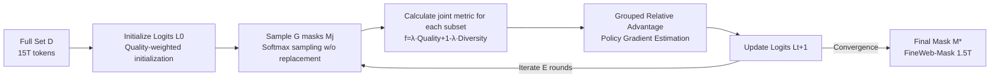

# Joint Selection for Large-Scale Pre-Training Data via Policy Gradient-based Mask Learning

**Conference**: ICLR 2026  
**OpenReview**: [https://openreview.net/forum?id=fs2uDib85s](https://openreview.net/forum?id=fs2uDib85s)  
**Code**: [https://github.com/ByteDance-Seed/DATAMASK](https://github.com/ByteDance-Seed/DATAMASK)  
**Area**: LLM Pre-training / Data Selection  
**Keywords**: Pre-training Data Selection, Quality-Diversity Joint Optimization, Mask Learning, Policy Gradient, FineWeb  

## TL;DR
The trillion-token scale pre-training data selection problem is reformulated as a "learnable mask" task. By using grouped policy gradients to simultaneously optimize both quality and diversity metrics, the method is 98.9% faster than greedy algorithms. It selects 1.5T of FineWeb-Mask from the 15T FineWeb dataset, achieving average improvements of 3.2% and 1.9% on 1.5B and 7B models, respectively.

## Background & Motivation
**Background**: The core of "data recipes" for open-source pre-training corpora (e.g., FineWeb, DCLM) is scoring and filtering samples. These scores generally fall into two categories: **quality metrics** (heuristic rules, LLM-as-a-judge, fastText classifiers like FineWeb-Edu, UltraFineWeb, DCLM) and **diversity metrics** (pair-wise similarity, facility location, DiSF dimensional collapse, Semdedup deduplication).

**Limitations of Prior Work**: Empirical studies by the authors reveal flaws in both categories. Selecting by quality alone leads to **severe diminishing marginal returns** during long-term pre-training—high-quality samples cluster tightly in embedding space (high semantic redundancy, low informational diversity), leaving less to learn as training progresses. Selecting by diversity alone often **erroneously deletes valuable high-quality samples**, causing performance to drop below the original FineWeb.

**Key Challenge**: The most direct solution is joint selection using both metrics. However, **quality scores are calculated independently per sample (top-k), whereas diversity is a set function defined over a collection**, requiring expensive greedy algorithms to solve. At a trillion-token scale, greedy algorithms take 78 hours for even 100,000 samples, making them computationally infeasible. Consequently, existing works rarely consider both metrics jointly in a single selection process.

**Goal**: Enable trillion-scale corpora to simultaneously optimize quality and diversity in a single selection pipeline with acceptable execution time.

**Core Idea (Mask Learning + Policy Gradient)**: Model "which samples to select" as learning a **binary mask $M$** over the full set, followed by **probabilistic relaxation**. Instead of directly optimizing discrete masks, the method learns sampling logits for each sample. It uses **grouped policy gradients** to estimate gradients for iterative updates, bypassing the obstacles of non-differentiable set functions and massive combinatorial spaces.

## Method

### Overall Architecture
DATAMASK formulates subset selection under a budget $S$ as an optimization problem to "learn an optimal mask." It transforms non-differentiable discrete sampling into iterative continuous optimization through three steps: probabilistic relaxation, policy gradient estimation, and grouped advantage updates. The final subset is sampled from the converged logits.

### Key Designs
**1. Mask Learning + Probabilistic Relaxation: Converting combinatorial selection into a continuous optimization problem.** For a full set $D=\{x_i\}_{i=1}^N$, a binary mask $M\in\{0,1\}^N$ is introduced, where $M_i=1$ indicates selection into subset $U=\Phi_M(D)$. Selection is equivalent to $M^*=\arg\max_M f(\Phi_M(D))$ s.t. $\sum_i M_i=S$. Since binary masks are discrete and non-differentiable, the authors view the mask as sampled from a distribution $P(M|L)$, where the selection probability of each sample is given by a softmax $P(M_i|L)=e^{L_i}/\sum_j e^{L_j}$ across $S$ samples without replacement. The objective becomes finding optimal logits $L^*=\arg\max_L \mathbb{E}_{M\sim P(M|L)}[f(\Phi_M(D))]$. Since logits are continuous, the problem becomes optimizable at scale.

**2. Policy Gradient Estimation with Grouped Relative Advantage: Reducing variance and stabilizing convergence.** To handle non-differentiable sampling, the authors use Policy Gradient Estimation (REINFORCE): $\nabla_L \mathbb{E}[f]=\mathbb{E}[f(\Phi_M(D))\nabla_L\ln P(M|L)]$. However, because the selected sample count is much smaller than the full set, single updates suffer from high variance. Borrowing the relative advantage concept from GRPO, the authors sample $G$ masks per iteration and normalize rewards using the group mean $\mu_G$ and standard deviation $\sigma_G$ as a baseline: $\nabla_L \mathbb{E}[f]\approx \frac{1}{G}\sum_{j=1}^G \frac{f(\Phi_{M_j}(D))-\mu_G}{\sigma_G}\nabla_L\ln P(M_j|L)$. Logits are then updated with learning rate $\eta$. Group normalization significantly reduces variance and accelerates training.

**3. Quality-Diversity Joint Objective: Tuning metrics with λ.** The joint objective is defined as $f(U)=\lambda f_{qua}(U)+(1-\lambda)f_{div}(U)$. The quality term sums DCLM, Edu, and Wiki classifiers. The diversity term is ablated across pair-wise similarity, facility location, and DiSF. Results show that on FineWeb, DiSF conflicts most with quality scores, while **pair-wise similarity with $\lambda\in[0.1,0.5]$ performs best**. This essentially injects quality scores as rewards into diversity optimization, preserving high-quality samples while deduplicating.

**4. Engineering Acceleration Trio: Making trillion-token processing feasible.** (i) **Quality-aware Pruning + Initialization**: Filter the bottom 40–50% of samples by quality to avoid low-quality data and initialize sampling probabilities proportional to quality scores, improving performance and convergence. (ii) **Block-wise Updates**: Since loading billions of files is impossible, the data is split into random blocks of 1 million samples (much larger than DiSF's 1,024). (iii) **Batch Updates**: Only 5–10% of samples update their logits per step. This saves time and introduces random noise that helps escape local optima. A group size $G$ of 128/256 is recommended. This combination reduces DiSF solving time from 78 hours (greedy) to roughly 50 minutes.

## Key Experimental Results

### Main Results
Average scores across 12 tasks in three capability categories (1.5B dense trained on 400B tokens / 7B MoE trained on 300B tokens):

| Corpus | 1.5B Avg | vs FineWeb | 7B MoE Avg | vs FineWeb |
|---|---|---|---|---|
| FineWeb (Original) | 44.9 | — | 50.7 | — |
| FineWeb-Semdedup (Diversity only) | 43.8 | -1.1 | 50.0 | -0.7 |
| FineWeb-Edu (Quality only) | 46.8 | +1.4 | 51.2 | +0.5 |
| UltraFineWeb-en | 45.8 | +0.9 | 49.5 | -1.2 |
| FineWebPro | 47.2 | +2.3 | 51.4 | +0.7 |
| FineWeb-DCLM | 46.9 | +2.0 | 52.2 | +1.5 |
| **FineWeb-Mask (Ours)** | **48.1** | **+3.2** | **52.6** | **+1.9** |

Win rates across 12 tasks: 6/12 for 1.5B (highest), 4/12 for 7B MoE (highest). +0.9% (dense) / +0.4% (MoE) gain over the strongest baseline.

### Ablation Study

| Dimension | Setting | Conclusion |
|---|---|---|
| Diversity Metric | pair-wise / facility location / DiSF | pair-wise and facility location outperform pure quality; DiSF conflicts with quality, leading to negative effects. |
| Balance Coefficient λ | 1.0→0.1 | λ∈[0.1,0.5] recommended. All joint configs beat original FineWeb; most beat FineWeb-Edu. |
| Group Size G | 32→512 | G too small causes divergence; too large is compute-intensive. 128/256 recommended. |
| Quality Pruning+Init | Random→+Pruning→+Init | Performance 44.3→45.0→45.1; Selection time 18h→10h→7h. |
| Batch Update Ratio | 100%/10%/5%/1% | 5–10% saves time and improves scores by escaping local optima via noise. |

### Key Findings
- **Speedup**: 98.9% faster than greedy algorithms on DiSF (78 hours to 50 minutes for 100k samples).
- **Root Cause of Conflict**: Heatmaps of quality vs. diversity (using 10k clusters) show semantic redundancy exists in both high and low-quality regions. Pure diversity methods delete high-quality samples indiscriminately; joint learning controls this via quality rewards.
- **Length Bias**: Quality classifiers (FineWeb-Edu 147%, UltraFineWeb 114%) prefer long documents, while diversity methods prefer short ones (embeddings are token averages; short sentences show higher similarity variance).
- **Architecture Robustness**: UltraFineWeb performs better on dense but worse on MoE; FineWeb-Mask is optimal across both architectures.

## Highlights & Insights
- **Elegant Reformulation**: Converting set-function data selection into learning sampling logits bypasses the scalability bottlenecks of greedy algorithms. This is a classic paradigm for RL-ifying combinatorial optimization.
- **Empirical-First Approach**: The root cause of the "quality vs. diversity conflict" is clearly explained through quality-initialized control curves (Figure 3) and t-SNE visualizations before presenting the method.
- **Cross-domain GRPO**: Naturally migrates the grouped relative advantage idea from LLM post-training to policy gradients for data selection to reduce variance.
- **Large-Scale Deployment**: This is not a toy experiment; it was validated by selecting 1.5T tokens from the 15T FineWeb and training 1.5B/7B models on 384 GPUs, with FineWeb-Mask publicly released.

## Limitations & Future Work
- **Binary Combinations**: Only combinations of one quality and one diversity metric were verified. Although the framework claims to support $n$-metrics, complex combinations are left for future work.
- **Hyperparameter Dependency**: λ, G, and batch ratios were tuned specifically for FineWeb. Transferability to different corpora or model scales (as seen with DiSF's failure) remains to be fully verified.
- **Embedding Bottleneck**: Diversity relies entirely on E5 text embeddings. Length biases in embeddings directly affect the selected data's length distribution; embedding bias propagates to selection results.
- **Absolute Gains**: The +1.9% gain on 7B MoE (+0.4% over strongest baseline) is relatively modest; whether this advantage holds for even larger models/tokens is yet to be observed.

## Related Work & Insights
- **Quality Metrics**: QuRating, FineWeb-Edu (LLM judge), UltraFineWeb, DCLM (fastText), GneissWeb (substring deduplication + ensemble).
- **Diversity Metrics**: pair-wise similarity, facility location, DiSF, Semdedup (embedding deduplication).
- **Methodological Roots**: REINFORCE Policy Gradient (Williams 1992), GRPO relative advantage (DeepSeek), and probabilistic relaxation for combinatorial optimization.
- **Insights**: Solving "expensive and discrete" data filtering tasks via probabilistic relaxation and policy gradients is a generalizable strategy for data pruning, coreset selection, and active learning.

## Rating
- **Novelty**: ⭐⭐⭐⭐ — Reformulating set-function selection as mask learning via grouped policy gradients is a novel and self-consistent paradigm.
- **Experimental Thoroughness**: ⭐⭐⭐⭐ — Validated on 15T corpus with 1.5B/7B architectures; covers metrics/λ/G/pruning/batching. However, absolute gains are small and transferability is not extensively tested.
- **Writing Quality**: ⭐⭐⭐⭐ — Driven by empirical motivation, rich in visualizations, and logically structured.
- **Value**: ⭐⭐⭐⭐ — Direct engineering value for large-scale pre-training data recipes via the release of FineWeb-Mask and an extensible framework.

<!-- RELATED:START -->

## Related Papers

- [\[ICLR 2026\] LLM-JEPA: Large Language Models Meet Joint Embedding Predictive Architectures](llm-jepa_large_language_models_meet_joint_embedding_predictive_architectures.md)
- [\[ICLR 2026\] Learning Facts at Scale with Active Reading](learning_facts_at_scale_with_active_reading.md)
- [\[ICLR 2026\] SPICE: Submodular Penalized Information–Conflict Selection for Efficient Large Language Model Training](spice_submodular_penalized_informationconflict_selection_for_efficient_large_lan.md)
- [\[ICLR 2026\] GneissWeb: Preparing High Quality Data for LLMs at Scale](gneissweb_preparing_high_quality_data_for_llms_at_scale.md)
- [\[ICLR 2026\] Rewriting Pre-training Data Boosts LLM Performance in Math and Code](rewriting_pre-training_data_boosts_llm_performance_in_math_and_code.md)

<!-- RELATED:END -->
