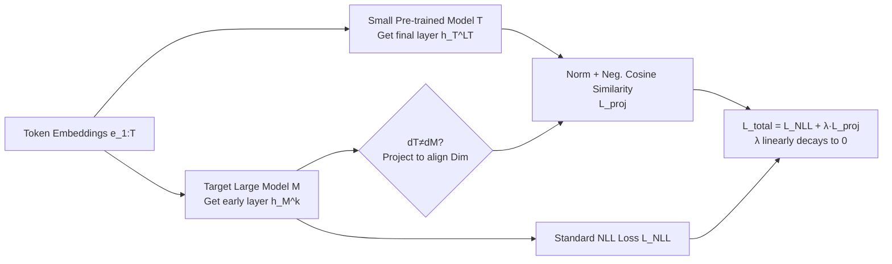

# Late-to-Early Training: Enabling LLMs to Learn Late-Stage Knowledge Earlier for Faster and Better Training

**Conference**: ICLR 2026  
**OpenReview**: [https://openreview.net/forum?id=EVZMZQogUm](https://openreview.net/forum?id=EVZMZQogUm)  
**Code**: To be confirmed  
**Area**: LLM Pre-training / Training Acceleration  
**Keywords**: Pre-training acceleration, representation alignment, knowledge distillation, model growth, convergence acceleration  

## TL;DR
LET uses the **final-layer representations** of a significantly smaller (up to 10×) open-source pre-trained model to align with the **early-layer representations of the target large model during early training steps**. This allows the large model to "prematurely" acquire knowledge that would otherwise only form in later stages, achieving approximately 1.6× acceleration and nearly a 5% improvement in downstream accuracy on 1.4B/7B scales.

## Background & Motivation
- **Background**: The success of LLM pre-training relies on scaling, but the costs are extreme (training a 12B model requires approximately 72,000 A100 GPU hours). Meanwhile, the open-source community has accumulated numerous pre-trained models of various scales; this "burned" compute should ideally be reused.
- **Limitations of Prior Work**: Traditional knowledge distillation (KD) requires a **larger** teacher, which introduces significant memory/compute overhead, and students typically underperform teachers, making it difficult to use as a base for further scaling. While SALT (Rawat et al. 2024) proposed that small models can bootstrap large ones, the teacher-student scale gap was only 1.87× (the teacher remained large) and relied on heavy data preprocessing. Model growth methods require deliberate architectural changes (deepening or widening), limiting the range of feasible architectures.
- **Key Challenge**: The goal is to use "small, cheap, and ready-made" open-source models to accelerate the training of "large" models. However, small models have limited capacity—later in training, the large model will naturally **surpass** the small model. At that point, rigidly aligning with the small model's representations will only hinder learning.
- **Goal**: Propose an **architecture-agnostic**, representation-based, and robust universal paradigm that can stably accelerate large model pre-training using a model 10× smaller than the target.
- **Core Idea**: **Late-to-early alignment**—take the representations of a small model (at its "late training stage," final layer) to guide the **early layers** of the large model during its **early training steps**. The alignment weight is gradually decayed to zero, allowing subsequent layers to naturally take over and refine these representations.

## Method

### Overall Architecture
Beyond the standard causal language modeling loss, LET adds a **representation alignment loss**. During the forward pass, data is passed through both the target model $M$ and a small pre-trained model $T$. The final-layer representation of $T$ is used to align with the $k$-th layer (an early layer) representation of $M$. The alignment strength $\lambda$ linearly decays to 0 over the training steps. Two mechanisms are central: **late-to-early-step** (using $T$ only in early steps, phasing it out) and **late-to-early-layer** (using the final layer of $T$ to align an early layer of $M$).

### Key Designs

**1. Late-to-Early-Layer Alignment: Feeding early large model layers with late small model layers.** Standard pre-training only optimizes the NLL loss $L_{\text{NLL}} = -\sum_{t=1}^{T}\log P_M(x_t\mid x_{<t})$. LET additionally takes the final-layer representation $h^{(L_T)}_T$ of the small model $T$ and the $k$-th layer representation $h^{(k)}_M$ of the target model $M$, normalizes them, and uses negative cosine similarity as the alignment loss $L_{\text{proj}} = -\tilde h^{(k)\top}_M \tilde h^{(L_T)}_T$ (a projection is used to match dimensions if $d_T\ne d_M$). Placing the alignment at the **early layers** rather than the final layer is a key insight: $M$ retains a significant number of layers after the early layers to act as a "buffer," where representations from $T$ can be naturally absorbed and **refined** within the training dynamics. Once the overall capacity of $M$ exceeds $T$, the subsequent layers are not constrained by the limited representations of $T$. Ablations show that L2E (final layer of $T \to$ early layer of $M$) achieves the lowest perplexity and best robustness across six alignment configurations, whereas forcing $T$'s representations onto $M$'s final layer (L2L) causes a perplexity spike after alignment ends.

**2. Late-to-Early-Step Annealing: Leveraging early, exiting late.** The alignment weight decays linearly according to $\lambda = \lambda_0\cdot\max\!\big(0, \frac{S_{\text{stop}}-s}{S_{\text{stop}}}\big)$, where $s$ is the current step and $S_{\text{stop}}$ is the step where the weight reaches zero. The total loss is $L_{\text{total}} = L_{\text{NLL}} + \lambda L_{\text{proj}}$. In the early stages, a larger $\lambda$ allows $M$ to fully absorb the representational guidance of $T$ (since $T$ is stronger than the "just starting" $M$). As training progresses and $\lambda$ decays, $M$ shifts its focus back to the primary objective $L_{\text{NLL}}$, preventing the weaker $T$ from constraining $M$ in the later stages. This directly addresses the core contradiction where small models are eventually surpassed by large ones—treating the small model as an early scaffold rather than a long-term ceiling.

**3. Robustness and Architecture Agnosticism.** Because it only aligns representations (without distilling logits, reusing weights, or modifying architecture), LET works across small models with different tokenizers and architectures. Experiments using OPT-125M, Pythia-160M, and SmolLM-135M (all around 125–160M) consistently reduced perplexity. SmolLM as $T$ yielded the best results, indicating that while different small models provide different representations affecting $M$'s training dynamics, the overall gains are robust. Ablations on $\lambda$ further suggest that $\lambda=0.1$ is the optimal balance: too large (e.g., 3.0) causes $M$ to over-align with $T$ and suppresses learning from the data itself, while too small (0.01) results in insufficient alignment and limited gains.

## Key Experimental Results

Setup: Based on LLaMA architecture (RMSNorm + SwiGLU, BF16), trained on ~20B tokens from The Pile, across 1.4B/3B/7B scales using 32×A100 80GB GPUs, AdamW + cosine schedule. The small model $T$ is drawn from the OPT/Pythia/SmolLM families. Downstream evaluation follows the one-shot accuracy on 9 tasks from Groeneveld et al. (2024).

### Main Results Table (Average Accuracy over 9 Tasks, %)

| Model Scale | Method | Avg. |
|---|---|---|
| 1.4B | Baseline | 41.6 |
| 1.4B | RKD | 41.4 |
| 1.4B | SALT | 42.9 |
| 1.4B | LET (67% steps) | 42.5 |
| 1.4B | **Ours (LET)** | **43.6** |
| 7B | Baseline | 43.3 |
| 7B | RKD | 42.2 |
| 7B | SALT | 44.7 |
| 7B | LET (67% steps) | 43.9 |
| 7B | **Ours (LET)** | **45.5** |

Highlights: On the 1.4B scale, LET exceeds the baseline's final average performance using **<67%** of the training steps (with $T$ being 10× smaller than $M$); full training further increases accuracy to 43.6. Figure 1 shows approximately **1.6× acceleration + 4.68% Gain** for 1.4B, and **1.56× acceleration + 5.13% Gain** for 7B.

### Ablation Study (Core Conclusions)

| Ablation Dimension | Setting | Conclusion |
|---|---|---|
| Alignment Layer Combos | L2E/L2M/L2L, M2E/M2M/M2L | **L2E (Final $\to$ Early) is optimal and most robust**; using $T$'s middle layers (M2*) is strictly weaker than final layers (L2*); L2L shows PPL spikes after alignment. |
| Weight $\lambda$ | {0.01, 0.1, 0.3, 1.0, 3.0} | **$\lambda=0.1$ is optimal**; $>0.1$ over-aligns and suppresses data learning; $=0.01$ provides insufficient alignment. |
| Small Model Selection | OPT-125M / Pythia-160M / SmolLM-135M | All three consistently reduce perplexity (robust across tokenizers); **SmolLM is best**. |

### Key Findings
- RKD performs **below baseline** when the teacher is significantly smaller than the student: it strengthens reasoning tasks like ARC-c/LAMB but collapses on scientific multiple-choice tasks like SciQ, indicating that rigid distillation can damage overall learning capacity.
- Perplexity (Figure 2) decreases consistently across three different vocabularies, matching downstream improvement trends and verifying that gains are independent of specific tokenization.
- Representation similarity increases steadily during training and is insensitive to $\lambda$, suggesting that even a small $\lambda$ provides effective alignment.
- LET not only accelerates language modeling and downstream generalization; paper appendices show its representational guidance can transfer across domains (e.g., time-series classification), suggesting the paradigm is not limited to text pre-training.
- Acceleration comes from the "premature formation of useful early-layer representations": the large model is pushed toward representation distributions that would otherwise only appear in later steps, essentially "pre-loading" knowledge learned later, which is the literal meaning of the title "Late-to-Early."

## Highlights & Insights
- **Counter-intuitively "Teaching Big with Small"**: Breaks the KD paradigm of "large teachers teaching small students," proving that existing models 10× smaller can accelerate large models and monetize compute already spent by the community.
- **"Early Layers + Annealing" is the masterstroke**: Injecting external representations into early layers + using subsequent layers as buffers + weight decay for exit—together these solve the fundamental contradiction of "small models eventually being surpassed." This is the essential reason why LET is more robust than SALT/RKD.
- **Minimalist and Universal**: Adds only one cosine alignment loss, requires no architectural changes, no weight initialization, and no data preprocessing dependencies, resulting in low implementation costs.

## Limitations & Future Work
- Experimental datasets are concentrated on The Pile (~20B tokens) up to the 7B scale. Whether gains persist at larger scales (hundreds of billions of tokens, dozens of billions of parameters) and under more diverse corpora requires further verification.
- Simultaneous forward passes of $T$ are required, introducing extra compute/memory in early stages. Although $T$ is small, hyperparameters like alignment layer $k$, $\lambda_0$, and $S_{\text{stop}}$ still require tuning.
- The theoretical explanation for why "early layer alignment + buffer layer refinement" is superior relies primarily on empirical evidence; formal analysis is lacking, and the selection criteria for the best small model (SmolLM) remain empirical.

## Related Work & Insights
- **Knowledge Distillation (KD/RKD)**: LET replaces "matching logit distributions" with "aligning hidden representations" and inverts the teacher-student size relationship, avoiding large teacher overhead and student suppression.
- **Small Models Bootstrapping Large Models (SALT)**: LET increases the teacher-student scale gap from 1.87× to 10× and removes the dependency on data preprocessing, making it more universal.
- **Model Growth (Inheriting weights via deepening/widening)**: LET does not change the architecture and uses pure representation alignment, imposing fewer constraints.
- **Inspiration**: Representation-level, annealable "soft guidance" may be a more flexible transfer paradigm than weight inheritance, potentially extendable to multimodal or time-series scenarios (as shown in the appendix for time-series classification).

## Rating
- Novelty: ⭐⭐⭐⭐ The combination of "teaching big with small + late-to-early layer alignment + annealing" addresses an overlooked but practical problem with a clear and counter-intuitive approach.
- Experimental Thoroughness: ⭐⭐⭐⭐ Coverage of 1.4B/7B scales, three small models, and complete ablations on layers and $\lambda$ is thorough; however, the scale and data volume are relatively small, lacking validation at extreme scales.
- Writing Quality: ⭐⭐⭐⭐ The logic from motivation to mechanism to experiments is smooth, with clear formulas and charts (though some paragraphs contain repetitive statements).
- Value: ⭐⭐⭐⭐ Reusing existing community compute to accelerate pre-training at low cost has high engineering value.

<!-- RELATED:START -->

## Related Papers

- [\[ICLR 2026\] Scaling with Collapse: Efficient and Predictable Training of LLM Families](scaling_with_collapse_efficient_and_predictable_training_of_llm_families.md)
- [\[ICLR 2026\] Rewriting Pre-training Data Boosts LLM Performance in Math and Code](rewriting_pre-training_data_boosts_llm_performance_in_math_and_code.md)
- [\[ICLR 2026\] Pre-training LLM without Learning Rate Decay Enhances Supervised Fine-Tuning](pre-training_llm_without_learning_rate_decay_enhances_supervised_fine-tuning.md)
- [\[ACL 2026\] Demystifying Data Organization for Enhanced LLM Training](../../ACL2026/llm_pretraining/demystifying_data_organization_for_enhanced_llm_training.md)
- [\[ICLR 2026\] Rethinking Data Curation in LLM Training: Online Reweighting Offers Better Generalization than Offline Methods](rethinking_data_curation_in_llm_training_online_reweighting_offers_better_genera.md)

<!-- RELATED:END -->
