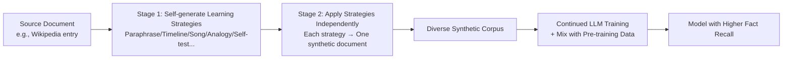

# Learning Facts at Scale with Active Reading

**Conference**: ICLR 2026  
**OpenReview**: [https://openreview.net/forum?id=mRi2cJDtIS](https://openreview.net/forum?id=mRi2cJDtIS)  
**Code**: Open-sourced WikiExpert-8B model and 1T-token synthetic dataset  
**Area**: LLM Pre-training / Knowledge Injection / Synthetic Data  
**Keywords**: Active Reading, Synthetic Data Generation, Fact Recall, Knowledge Injection, Continued Pre-training  

## TL;DR
The model is allowed to generate a set of "learning strategies" (paraphrasing, self-testing, knowledge association, analogy, etc.) for each document, which are then used to synthesize diverse training data to efficiently embed closed-form knowledge into parameters. The 8B WikiExpert outperforms 405B Llama and 236B DeepSeekV2 on SimpleQA.

## Background & Motivation
**Background**: LLMs store massive world knowledge in their parameters, but there are few controllable means to "reliably teach a model a specific set of knowledge." During pre-training, long-tail facts are poorly learned due to sparse occurrences; during fine-tuning, injecting new knowledge often leads to hallucinations or rote memorization without generalization.

**Limitations of Prior Work**: Common practices to increase coverage of a specific knowledge source involve simply increasing its mixing weight, but simple repetition leads to overfitting on surface forms rather than generalization. Paraphrase augmentation proposed by Allen-Zhu & Li mitigates this to an extent, but paraphrasing is only one of many learning methods, and the variety of paraphrases a model can generate is limited, saturating quickly as scale increases. Synthetic QA (synth QA) is strong at small scales but also stagnates when scaled up.

**Key Challenge**: Humans actively utilize multiple strategies when learning new knowledge—active recall, spaced repetition, mapping, self-questioning, and analogies—and different knowledge types suit different strategies (e.g., timelines for history, concrete analogies for abstract math). However, existing synthetic data methods are fixed to a single template, lacking this "tailored" diversity, which leads to homogeneous training signals and low knowledge absorption efficiency.

**Goal**: Given a closed-form knowledge corpus, train the model to internalize the facts as completely and generalizably as possible (approaching perfect fact recall), applicable to both expert domain adaptation and scaling to pre-training levels.

**Core Idea**: **Instead of manually designing the "best learning strategy," let the model itself propose a variety of learning strategies for each document and then execute them to generate self-training data.** This is Active Reading, a two-stage pipeline of "Self-generated strategies → Synthesis based on strategies."

## Method

### Overall Architecture
Active Reading is a simple two-stage synthetic data pipeline: in the first stage, the model is given a source document and asked to propose several learning strategies specific to that document; in the second stage, each strategy is applied independently to the document to generate synthetic documents in various styles. All synthetic documents are aggregated into a self-training corpus for continued training (fine-tuning or continued pre-training) of the model.

### Key Designs

**1. Self-generated Learning Strategies: Letting the model decide "how to learn."** Active Reading does not preset any fixed augmentation templates. Instead, it uses a prompt to have the model list suitable learning strategies after reading the source document—such as "create a timeline of winners to find patterns," "compose a rhyming song for names," or "make associations with familiar people or events." This step is the soul of the method: because strategies are generated on-the-fly for specific content, they naturally possess contextual relevance and uniqueness. The authors found that this free generation actually **automatically reproduces** various augmentations proposed by predecessors (paraphrasing, synth QA, and EntiGraph concept maps are all covered), indicating that Active Reading is a superset of these methods, with its superior performance derived from the added diversity.

**2. Task-agnostic vs. Task-specific prompts.** The authors instantiate the framework with two types of prompts. The task-agnostic version generally requests a way to "thoroughly learn this material." The task-specific version informs the model how it will be tested later (e.g., trivia contests, financial analysis), prompting the model to **first imagine potential downstream questions and then design learning strategies around them.** The latter provides two benefits: first, the data is more aligned with downstream tasks (e.g., focus on long-tail facts for trivia); second, the data is more diverse (focusing on different facets of the document each time). In experiments, the task-specific version slightly outperformed on SimpleWikiQA and showed lower self-BLEU (higher diversity), confirming the judgment that "diversity → better scalability."

**3. Transforming fine-tuning into continued pre-training for scalability.** When the training corpus expands from SimpleWikiQA's ~0.1% of Wikipedia to 4× or 16× more documents, the recall of target facts drops sharply due to "distractor documents" (analogous to scaling challenges in dense/generative retrieval). The authors found that two modifications can reverse this deterioration: first, significantly increasing the learning rate from the $1\text{e-}5$ common in fine-tuning to $3\text{e-}4$, more akin to continued pre-training—high learning rates push the model out of local minima, creating "elastic capacity" for learning new facts; second, **increasing the weight of pre-training data in the mixing ratio** to repair existing capabilities "damaged" by the high learning rate. A counter-intuitive phenomenon: keeping the gradient steps for SimpleWikiQA constant while compressing its relative proportion from 80% to 2.5% (while scaling up augmented Wikipedia and pre-training data) not only restores guardrail metrics like NaturalQuestions but also improves the target task SimpleWikiQA—suggesting that the degradation here is not fully explained by classic "catastrophic forgetting"; mixing pre-training data seems to give the model stronger "plasticity" to organize new knowledge.

**4. Self-generation outperforms generation by larger models.** The authors additionally used a 70B model to generate data to train the 8B model, which surprisingly performed worse than the 8B model using its own generated data (62.26 vs. 66.25). One hypothesis is that training data is more effective and less "beyond the syllabus" when it closely aligns with the model's own comprehension and existing knowledge; thus, generation by the "model to be trained" might be crucial. This distinguishes Active Reading from the paradigm of "distillation from a stronger teacher."

## Key Experimental Results

Setup: Continued training from Llama 3.1 8B Base for 20,000 steps, with each baseline generating approximately 4 billion tokens; 10% DCLM pre-training data is mixed during training to prevent degradation; answers are scored using GPT-4o.

### Main Results (Expert Domain, Fact Recall %)

| Method | SimpleWikiQA | FinanceBench info. | FinanceBench all |
|---|---|---|---|
| Llama 3.1 8B Base | 7.42 | 3.93 | 6.00 |
| repeat (Fine-tuning on raw docs) | 15.92 | 18.43 | 10.49 |
| paraphrase | 25.74 | 43.87 | 17.64 |
| synth QA | 47.87 | 44.23 | 17.16 |
| **Active Reading (Task-agnostic)** | 63.33 | **66.18** | **26.83** |
| **Active Reading (Task-specific)** | **66.25** | 61.49 | 25.16 |
| paraphrase+synthQA+AR | 66.66 | 64.45 | 26.12 |
| gold context (8B, upper bound ref) | 65.85 | 84.71 | 44.36 |
| gold ceiling (70B Instruct) | 90.55 | 92.49 | 57.43 |

On SimpleWikiQA, the score increased from 15.92 (raw fine-tuning) to 66.25 (+313% relative), even **matching the gold context 8B baseline** where documents are placed in the context window. The FinanceBench information extraction subset saw a +160% gain over raw fine-tuning. However, the overall FinanceBench remains far from the gold ceiling—for questions requiring additional reasoning, pure parametric methods still lose to online context reading.

### WikiExpert Scaling Results (1T synthetic tokens, 8T tokens total training)

| Model | SimpleQA | NQ | TQA |
|---|---|---|---|
| Llama 8B | 7.3 | 29.0 | 64.3 |
| **WikiExpert-8B** | **23.5** | 31.2 | 68.5 |
| Qwen2.5 72B | 9.1 | 33.2 | 71.9 |
| DeepSeekV2 236B | 10.2 | 38.6 | 80.0 |
| Llama 405B | 17.1 | 41.5 | 82.7 |
| DeepSeekV3 671B | 24.9 | 40.0 | 82.9 |

WikiExpert-8B improved by +222% (7.3 → 23.5) on long-tail facts in SimpleQA, **outperforming 236B DeepSeekV2 and 405B Llama**, approaching 671B DeepSeekV3.

### Ablation Study

| Analysis Dimension | Key Finding |
|---|---|
| Data Scaling (Fig.2) | paraphrase saturates quickly, synth QA also stagnates; Active Reading continues to grow up to 4B tokens without saturating |
| Answer Coverage (Fig.5) | synth QA has highest coverage but performs worse → advantage **does not come from** answer coverage |
| Data Diversity self-BLEU (Fig.6) | AR (especially task-specific) has lowest self-BLEU = highest diversity, matching better scalability |
| Model Size (Table 3) | 8B using self-generated data (66.25) > using 70B generated data (62.26); self-generation is superior |
| Distractor Docs (Fig.3/4) | Scaling Wikipedia in a fine-tuning setup causes collapse; high LR + heavy pre-training data mix enables recovery |

### Key Findings
- The advantage of Active Reading **is not** based on higher answer coverage, but rather on **data diversity** (lower self-BLEU), which leads to better scaling trends.
- Learning knowledge using "self-generated data" is more effective than using "data generated by larger models," challenging the intuition that "stronger teachers are always better."
- Mixing pre-training data not only repairs guardrail metrics but also restores target performance when SimpleWikiQA steps are kept constant—suggesting its role goes beyond "preventing forgetting" to providing "plasticity" to the model.

## Highlights & Insights
- **Integrating human learning theory into synthetic data**: The core insight is "do not engineer a single optimal strategy; let the model brainstorm multiple tailored strategies," which transforms fixed-template methods into a subset of this approach, allowing diversity to emerge naturally.
- **Small models overtaking large models via data methodology**: The 8B model's ability to surpass 405B/236B models in fact recall provides strong evidence for the "small model + sophisticated synthetic data" route.
- **Practical recipes for scaling**: Increasing the learning rate (fine-tuning → continued pre-training) + heavier pre-training data mixing is a valuable recipe for scaling any knowledge injection method.
- **Commitment to Open Source**: Releasing WikiExpert-8B and the full 1T-token synthetic dataset facilitates reproduction and future research.

## Limitations & Future Work
- **Reasoning problems remain a weakness**: A large gap exists between FinanceBench's overall performance and the gold ceiling; pure parametric methods still fail against online context reading (RAG) for questions requiring extra reasoning.
- **Unclear mechanisms**: Hypotheses were provided for "why pre-training data restores knowledge learning" and "why self-generated data is superior to larger model generation," but mechanical explanations are still lacking.
- **Cost**: 1T token synthesis + 8T token training represents a massive scale, making it difficult for small to medium teams to reproduce the full WikiExpert route.
- **Evaluation reliance on LLM scoring**: Main results rely on GPT-4o for scoring, posing a potential risk of evaluator bias.
- **Future Work**: The authors list "how pre-training data brings plasticity/reverses knowledge entropy decay" as a key future direction, viewing it as a milestone toward lifelong learning (continuous absorption of new knowledge).

## Related Work & Insights
- **Knowledge Injection**: Follows the lineage of LLMs as implicit knowledge bases (Petroni, Roberts), addressing known issues like long-tail fact degradation and fine-tuning induced hallucinations/knowledge conflicts with an injection method scalable to pre-training sizes.
- **Synthetic Data**: Compared to the Phi series (focused on reasoning/understanding, explicitly not pursuing knowledge) and EntiGraph (concept maps, good generalization but weaker than synth QA), this method positions itself as a "superset" of fixed templates, winning through diversity.
- **Domain Adaptation**: Unlike most works relying on manually curated large-scale domain data, Active Reading is both general (applicable to any domain) and adaptive (automatically tailoring to the applied domain).
- **Insights**: For teams wanting to inject private/long-tail knowledge into their own models, "let the target model generate diverse learning materials + continued pre-training hyper-parameters + heavy general data mixing" is an engineering paradigm that can be directly transferred.

## Rating
- Novelty: ⭐⭐⭐⭐ The framework perspective of "letting the model self-generate learning strategies" is novel and elegant, proving it is a superset of existing augmentation methods.
- Experimental Thoroughness: ⭐⭐⭐⭐⭐ Comprehensive experiments from expert domains to 1T-token pre-training scales, including scaling curves and ablations on coverage/diversity/model size, complemented by released models and datasets.
- Writing Quality: ⭐⭐⭐⭐ Progressive structure from motivation to method to scaling to analysis; clear charts, though some mechanisms remain hypothetical.
- Value: ⭐⭐⭐⭐⭐ The 8B model surpassing hundred-billion parameter models and the open-source dataset provide a high-impact empirical baseline for "reliable fact learning via synthetic data."

<!-- RELATED:START -->

## Related Papers

- [\[ICLR 2026\] Joint Selection for Large-Scale Pre-Training Data via Policy Gradient-based Mask Learning](joint_selection_for_large-scale_pre-training_data_via_policy_gradient-based_mask.md)
- [\[ICLR 2026\] GneissWeb: Preparing High Quality Data for LLMs at Scale](gneissweb_preparing_high_quality_data_for_llms_at_scale.md)
- [\[NeurIPS 2025\] Mouse-Guided Gaze: Semi-Supervised Learning of Intention-Aware Representations for Reading Detection](../../NeurIPS2025/llm_pretraining/mouse-guided_gaze_semi-supervised_learning_of_intention-aware_representations_fo.md)
- [\[ICLR 2026\] Nemotron-CC-Math: A 133 Billion-Token-Scale High Quality Math Pretraining Dataset](nemotron-cc-math_a_133_billion-token-scale_high_quality_math_pretraining_dataset.md)
- [\[NeurIPS 2025\] Memory Mosaics at Scale](../../NeurIPS2025/llm_pretraining/memory_mosaics_at_scale.md)

<!-- RELATED:END -->
