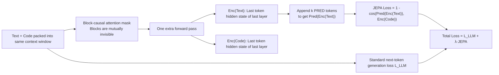

# LLM-JEPA: Large Language Models Meet Joint Embedding Predictive Architectures

**Conference**: ICLR 2026  
**OpenReview**: [https://openreview.net/forum?id=GbXKPo9QfH](https://openreview.net/forum?id=GbXKPo9QfH)  
**Code**: [https://github.com/galilai-group/llm-jepa](https://github.com/galilai-group/llm-jepa)  
**Area**: LLM Pre-training / Representation Learning / Self-supervised  
**Keywords**: JEPA, latent space training, joint embedding prediction, multi-view, LLM fine-tuning and pre-training  

## TL;DR
The successful Joint Embedding Predictive Architecture (JEPA) from computer vision is adapted for LLMs for the first time. By adding a latent space objective—"predicting Code embeddings from Text embeddings"—alongside the standard next-token reconstruction loss, this method significantly outperforms standard fine-tuning and pre-training across four model families and four datasets without sacrificing generative capabilities or suffering from overfitting.

## Background & Motivation
**Background**: Representation learning has long been split into two schools: (i) Generative/reconstructive (input space reconstruction like GPT and MAE), and (ii) Non-reconstructive JEPA (predicting embeddings of one view from another in latent space while preventing representation collapse). In computer vision, JEPA has demonstrated multiple provable advantages in perception tasks with fewer biases.

**Limitations of Prior Work**: In NLP/LLM, autoregressive reconstruction in the input space remains the dominant paradigm. LLMs are typically evaluated by their ability to generate correct answers in text space, making it difficult to directly apply JEPA-style latent space objectives. Existing latent space methods (e.g., SimCSE, Sentence-BERT) learn high-quality sentence embeddings but **lose generative capabilities**, severely limiting their applicability.

**Key Challenge**: LLM tasks encompass perception and reasoning (where JEPA excels), yet the rigid requirements of LLM evaluation demand the retention of token-level generation. The gap lies in enabling the structural benefits of JEPA's latent space while **simultaneously maintaining** the LLM's generative ability.

**Goal**: Design the first training objective that preserves LLM generation while incorporating JEPA embedding prediction, validated across both fine-tuning and pre-training stages.

**Core Idea**: **Treat (Text, Code) as two views of the same underlying knowledge.** Many NLP datasets are naturally paired (natural language ↔ regex, problem description ↔ SQL, git issue ↔ code diff), representing "two views of the same function." A JEPA loss can be **superimposed** on the standard generation loss: requiring `Pred(Enc(Text))` to approximate `Enc(Code)`, thereby introducing JEPA's alignment structure into LLMs while the generation head continues to function normally.

## Method

### Overall Architecture
The LLM-JEPA loss consists of two components: the original next-token generation loss $\mathcal{L}_{\text{LLM}}$ (ensuring generative capacity) and a JEPA embedding prediction loss (aligning the predicted embedding of the Text view with the embedding of the Code view):

$$
\mathcal{L}_{\text{LLM-JEPA}} = \sum_{\ell=2}^{L}\mathcal{L}_{\text{LLM}}(\text{Text}_{1:\ell-1},\text{Text}_{\ell}) + \lambda \cdot d\big(\text{Pred}(\text{Enc}(\text{Text})),\ \text{Enc}(\text{Code})\big)
$$

Where $\lambda \ge 0$ balances the two terms, $d$ is the cosine similarity, and both the encoder and predictor **reuse the LLM's own weights** without introducing additional networks. The method is agnostic to $\mathcal{L}_{\text{LLM}}$ and can be seamlessly integrated into various models and tasks.

### Key Designs

**1. Encoder: Reusing LLM hidden states as embeddings with block-causal masking.** The encoder extracts the hidden state of the last token in the last layer as the sequence embedding. To obtain embeddings for both Text and Code views simultaneously, a **block-causal attention mask** is used. By splitting the sequence into Text and Code blocks and applying `-inf` masking between them, the views remain independent within a single forward pass, preventing the Text representation from being "contaminated" by Code tokens through standard causal attention.

**2. Predictor: Using weight-tied [PRED] tokens to utilize the LLM as its own prediction network.** JEPA requires a predictor to map the Text embedding into the Code embedding space. Instead of adding a separate network, the model's autoregressive and self-attention properties are leveraged. By appending $k$ special tokens `[PRED_1],...,[PRED_k]` after the Text, the model performs further non-linear processing. The final `[PRED]` token's hidden state serves as $\text{Pred}(\text{Enc}(\text{Text}))$. Ablations show that gains come primarily from **increasing prediction FLOPs** rather than token embedding diversity.

**3. Metric: Cosine similarity alignment instead of InfoNCE contrastive targets.** To compare view embeddings, the authors use cosine similarity. Experiments replacing it with InfoNCE (a contrastive loss) resulted in **performance dropping below the baseline with increased variance** (34.40±6.10 vs. 71.46±1.34 for LLM-JEPA). The insight is that gain derives from **representation alignment**—compressing semantically similar Text/Code into a narrow, near-linear subspace—whereas InfoNCE explicitly pushes representations apart, destroying this alignment.

**4. "Good NTP ≠ Good JEPA" and Loss Dropout.** A control experiment shows that standard Next-Token Prediction (NTP) does not implicitly minimize the JEPA loss. Explicitly adding the JEPA term improves accuracy (from 51.95% to 71.10%) without altering the NTP loss curve. To mitigate the computational overhead of the extra forward pass, **Random JEPA-loss Dropout (LD)** is introduced. Dropping the JEPA term at a certain ratio per mini-batch saves compute and often **further improves performance** (e.g., LD=0.75 performing better than LD=0).

## Key Experimental Results

### Main Results (Fine-tuning on NL-RX-SYNTH, etc., Accuracy %)

| Setting | Model / Dataset | Baseline (L_LLM) | LLM-JEPA (Ours) |
|---|---|---|---|
| Fine-tuning | Llama3.2-1B / SYNTH | 37.0 | 51.6 |
| Fine-tuning | gemma2 / SYNTH | 51.3 | 66.6 |
| Fine-tuning | OpenELM / SYNTH | 56.0 | 70.4 |
| Fine-tuning | Llama3.2-1B / Spider | 55.2 | 70.9 |
| Fine-tuning | Llama3.2-1B / GSM8K | 51.5 | 71.8 |
| Pre-training | Llama3.2-1B / SYNTH | 54.38 ± 1.70 | 60.59 ± 1.01 (p=2.94e-4) |

Consistent improvements are observed across four model families (Llama3, gemma2, OpenELM, OLMo), four datasets, and four scales (1B/3B/7B/8B). Notably, **LLM-JEPA demonstrates resistance to overfitting**, whereas standard fine-tuning often overfits.

### Extended Experiments: Beyond Code Views and Reasoning Models (Llama3.2-1B / GSM8K, Accuracy %)

| Dataset / Model | Baseline | LLM-JEPA | Configuration |
|---|---|---|---|
| NQ-Open | 20.12 ± 0.41 | 21.59 ± 0.40 | λ=1024, k=0 |
| HellaSwag | 27.93 ± 0.46 | 35.22 ± 2.09 | λ=1, k=4 |
| Qwen3-1.7B / GSM8K | 44.32 ± 0.39 | 45.00 ± 0.40 | λ=1, k=0 |
| R1-Distill-Qwen-1.5B / GSM8K | 13.87 ± 1.01 | 15.04 ± 0.15 | λ=0.5, k=1 |

Statistically significant improvements are achieved even on QA tasks without natural dual views and on specialized reasoning models.

### Ablation Study (NL-RX-SYNTH, lr=2e-5, λ=1, k=1, Accuracy %)

| Variant | Accuracy |
|---|---|
| Baseline | 57.29 ± 5.32 |
| **LLM-JEPA (Cosine)** | **71.46 ± 1.34** |
| ℓ2-norm | 2.22 ± 0.07 |
| MSE | 70.64 ± 2.05 |
| Prepend [PRED] | 68.07 ± 2.57 |
| Code → Text Direction | 65.70 ± 2.63 |
| InfoNCE | 34.40 ± 6.10 |
| Mean Pooling | 65.46 ± 3.51 |
| Linear Predictor (λ=0.5) | 70.16 ± 1.87 |

### Key Findings
- **Structured Representations**: t-SNE visualizations show LLM-JEPA creates clear structures for Text/Code representations, whereas pure NTP fine-tuning disrupts the original structure. The singular values of `Enc(Text)−Enc(Code)` are orders of magnitude lower than the baseline, indicating the mapping is constrained to a narrow subspace and approximates a **linear transformation**.
- **No Generative Degradation**: Adding the JEPA term maintains the NTP loss curve while increasing accuracy from 51.95% to 71.10%, proving gains come from latent space structure rather than sacrificing generation.
- **Direction and Metric Matter**: Text→Code direction is superior to Code→Text. Cosine/MSE metrics are effective, while InfoNCE/ℓ2-norm fail.

## Highlights & Insights
- **First Generative-Preserving LLM-JEPA**: Fills the gap of missing JEPA objectives in language modeling; lightweight implementation reuses model weights and adds a single loss.
- **Clever Dual-View Implementation**: Reinterprets paired data (NL↔Code, Question↔Answer) as multi-view JEPA inputs, finding natural linguistic counterparts to vision-style augmentation.
- **Rigorous Control Experiments**: Using a "monitored-but-no-gradient" setup cleanly proves that NTP does not implicitly optimize JEPA and that the JEPA term does not harm generation.
- **Overfitting Resistance + Loss Dropout**: Provides practical benefits like reduced overfitting while leveling the computational cost of extra forward passes using Loss Dropout.

## Limitations & Future Work
- **Reliance on Non-trivial Dual Views**: The method requires datasets to provide two meaningful views. General-purpose corpora currently lack a mechanism for "view synthesis" similar to vision data augmentation.
- **Training Overhead**: Despite being optimized to one extra forward pass, training is still slower than the baseline; Loss Dropout helps but does not eliminate the cost. Pre-training remains exploratory.
- **Hyperparameter Sensitivity**: $\lambda$ and $k$ require grid searching, as optimal values vary significantly across tasks (optimal $\lambda$ ranged from 0.5 to 1024).

## Related Work & Insights
- **Vision JEPA** (I-JEPA, data2vec, V-JEPA): The conceptual origin for latent space prediction and bias reduction, now systematically ported to language.
- **Latent Space LLM Objectives**: SimCSE and Sentence-BERT focus on sentence embeddings but lack generative ability. LLM-JEPA differentiates itself by **preserving generation alongside pure JEPA-style alignment**.
- **Paired Generation Tasks**: Historically viewed as "learning to generate one given the other," these tasks are reframed here as multi-view JEPA, representing a paradigm shift.
- **Insight**: The near-linear, low-dimensional alignment conferred by JEPA may serve as the geometric foundation for extrapolation and generalization in LLMs.

## Rating
- **Novelty**: ⭐⭐⭐⭐⭐ First LLM-JEPA to preserve generation; successful cross-modal transfer of the JEPA concept.
- **Experimental Thoroughness**: ⭐⭐⭐⭐ Evaluated across four model families, multiple datasets, and scales with rigorous statistical testing and detailed ablations.
- **Writing Quality**: ⭐⭐⭐⭐ Clear logical flow from motivation to method and control experiments.
- **Value**: ⭐⭐⭐⭐⭐ Opens a scalable path for latent space training in LLMs with potential long-term impact on the pre-training paradigm.

<!-- RELATED:START -->

## Related Papers

- [\[ICLR 2026\] Joint Selection for Large-Scale Pre-Training Data via Policy Gradient-based Mask Learning](joint_selection_for_large-scale_pre-training_data_via_policy_gradient-based_mask.md)
- [\[ICLR 2026\] Selective Rotary Position Embedding](selective_rotary_position_embedding.md)
- [\[NeurIPS 2025\] Scaling Embedding Layers in Language Models](../../NeurIPS2025/llm_pretraining/scaling_embedding_layers_in_language_models.md)
- [\[ICLR 2026\] MrRoPE: Mixed-radix Rotary Position Embedding](mrrope_mixed-radix_rotary_position_embedding.md)
- [\[ICLR 2026\] Soft-Masked Diffusion Language Models](soft-masked_diffusion_language_models.md)

<!-- RELATED:END -->
