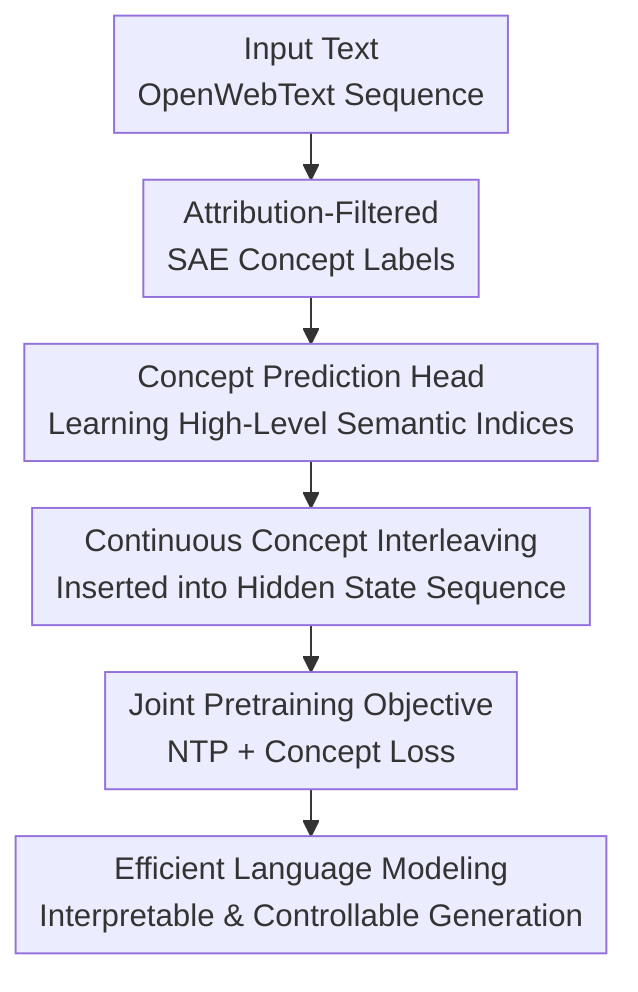

# LLM Pretraining with Continuous Concepts

**Conference**: ICLR 2026  
**OpenReview**: [https://openreview.net/forum?id=wTGcb3DxOn](https://openreview.net/forum?id=wTGcb3DxOn)  
**Code**: No public code available  
**Area**: LLM Pretraining  
**Keywords**: Continuous Concepts, Sparse Autoencoders, Next-Token Prediction, Weak-to-Strong Supervision, Interpretable Pretraining

## TL;DR

This paper proposes CoCoMix, which goes beyond standard next-token prediction by having the model predict high-level concepts extracted via SAE and filtered by attribution. These concepts are compressed into continuous vectors and interleaved into the Transformer hidden state sequence, achieving higher efficiency in language modeling, downstream reasoning, and controllable generation compared to vanilla NTP and knowledge distillation.

## Background & Motivation

**Background**: The most common pretraining objective for Large Language Models remain next-token prediction (NTP), which predicts the next discrete token given a context. This paradigm is simple, scalable, and capable of consuming massive unlabeled text, forming the foundation for the GPT series and subsequent open models. Semantic representations, reasoning abilities, and world knowledge within these models mostly emerge indirectly during the optimization of token-level perplexity.

**Limitations of Prior Work**: Tokens are discrete symbols on the surface of language, consisting of both semantic-bearing words and numerous functional words, punctuation, and local collocations. Relying solely on token-by-token fitting compresses the training signal onto a narrow linguistic surface, where high-level concepts and long-range reasoning only emerge slowly as byproducts. For tasks requiring planning, abstraction, or multi-step dependencies, this signal is insufficiently direct, often requiring more tokens and larger model scales to achieve the same capacity.

**Key Challenge**: Next-token prediction cannot be simply abandoned because models must still generate coherent text. However, relying only on discrete tokens makes concept learning too implicit. The real problem is how to convert the high-level semantic concepts already existing within the model into supervisable, usable, and analyzable training signals without disrupting token-level language modeling.

**Goal**: The authors aim to extend the pretraining objective from "predicting only the next token" to "predicting both the next token and continuous concepts useful for that prediction." Specifically, it addresses three sub-problems: extracting interpretable concepts from existing LLM hidden states, determining which concepts actually influence next-token prediction, and training a new model to predict these concepts and use them as extra information in subsequent Transformer computations.

**Key Insight**: The paper borrows Sparse Autoencoders (SAE) from mechanistic interpretability. SAEs can decompose LLM hidden states into sparse concept dimensions, where each activation dimension often corresponds to a semantic feature. This property is ideal for "concept labels": it is sparser and more interpretable than full hidden states, and closer to the internal abstract semantics used by the model than discrete tokens.

**Core Idea**: Using SAE-extracted and attribution-filtered concepts to supervise LLM pretraining. The model predicts not only tokens but also "concepts that are truly useful next," and inserts these concepts as continuous vectors into the hidden sequence for use by subsequent layers.

## Method

### Overall Architecture

The training pipeline of CoCoMix can be viewed as adding a concept channel to next-token prediction. On the offline side, a pretrained concept model and TopK SAE decompose the hidden state at each position into sparse concepts, followed by attribution scoring to select the concept indices most influential to the actual next token. On the online training side, the new model predicts these concept indices from its own intermediate hidden states, sparsifies and projects the prediction logits into a continuous concept vector, and interleaves it with the token hidden representation. This allows subsequent Transformer blocks to process both token and concept information simultaneously.

This is neither traditional KD that directly mimics the teacher's full output distribution, nor a pause token approach that only provides extra computation slots. CoCoMix ensures the extra positions carry explicit semantic content: derived from the SAE concept space, filtered by attribution, and explicitly learned by the model via auxiliary loss.

### Key Designs

**1. Attribution-Filtered SAE Concept Labels: Supervising Concepts with Causal Impact**

The SAE first maps the hidden state $h^{con}_t$ of a pretrained model $M_{con}=f_{con}\circ h_{con}$ at a certain layer into a high-dimensional sparse concept space. The encoding process of a TopK SAE is defined as $c^{pre}_t=E(h^{con}_t)$, $c_t=TopK(c^{pre}_t)$, $\hat{h}^{con}_t=D(c_t)$, constrained by a reconstruction loss $\|h^{con}_t-\hat{h}^{con}_t\|_2^2$ during training. The resulting $c_t$ is not a dense black-box vector but a set of activated concept dimensions.

However, "activated" does not mean "important for the current prediction." A context might activate many semantic features, but only a few determine the next token. CoCoMix uses an attribution score (activation multiplied by gradient) to select target concepts: $a_t=c_t\odot\nabla_{c_t}-\log f_{con}(x_{t+1}\mid D(c_t),h_{<t})$. Intuitively, if a slight change in a concept significantly affects the negative log-likelihood of the actual next token, that concept is more worthy of supervision. The paper then takes the top-$K_{attr}$ concept indices $I=\{i_1,\ldots,i_{K_{attr}}\}$ of $a_t$ as training labels.

The key to this design is that the supervision signal is not an average compression of all teacher knowledge, but a "concept slice with causal influence on the current token." This explains why it is more stable than KD in weak-to-strong scenarios: the full output distribution of a small teacher might be noisy, but SAE concepts filtered by attribution only transmit relatively useful semantic directions to a larger student.

**2. Concept Prediction Head: Making High-Level Semantic Learning an Explicit Auxiliary Goal**

After obtaining concept labels, the new model doesn't directly regress the teacher's hidden state. Instead, it attaches a linear prediction head $M$ to its own intermediate hidden state $h_t=h(x)_t$ to output concept logits $z_t=M(h_t)\in\mathbb{R}^C$. For each concept index $i\in I$ selected by attribution, the model performs multi-target concept prediction using cross-entropy, with the loss $L_{concept}(a_t)=\frac{1}{K_{attr}}\sum_{i\in I}CE(z_t,i)$.

This choice appears more "discrete" than directly fitting hidden states, but it avoids the noise present in dense representations. Full hidden states are mixed with syntax, position, local morphology, and the teacher's own redundant features; regressing them forces the student to learn details unnecessary for next-token prediction. CoCoMix only predicts SAE concept indices, essentially projecting the teacher's representation into an interpretable, sparse, and semantic coordinate system before the student learns the most important directions.

The paper's analytical experiments support this: using $\ell_1$, $\ell_2$, or cosine loss to directly predict hidden states significantly worsens perplexity, while concept prediction maintains a better training curve. This indicates that the performance gain comes not from the "extra teacher signal" itself, but from the effective filtering of that signal by the concept space.

**3. Continuous Concept Interleaving: Using Predicted Concepts as Independent Information Units**

Predicting concepts is insufficient because auxiliary losses might only change the geometric structure of the hidden states without ensuring subsequent layers actually use these concepts. CoCoMix thus TopK-sparsifies the predicted logits $z_t$ and compresses them via a learnable projection into a continuous concept vector $\hat{c}_t=WTopK(z_t)+b$ with the same dimension as the hidden state. The model then transforms the sequence from the standard $(h_1,\ldots,h_t)$ to an interleaved form $(h_1,\hat{c}_1,\ldots,h_t,\hat{c}_t)$ before feeding it into the remaining Transformer blocks.

This "insertion" differs from directly adding concept vectors to hidden states. Additive intervention merges token and concept representations into a single vector, making it difficult for subsequent layers to distinguish which information comes from the original token versus the predicted concept. Interleaving preserves concepts as separate token-like units, allowing attention to explicitly choose when to read concepts and when to read tokens. Comparative results in the paper show that interleaving outperforms direct adding.

This design also provides interpretability and controllability. Since the intermediate $z_t$ are logits over the SAE concept space, researchers can directly observe which concepts the model predicts at any position, or amplify/dampen specific concept dimensions to influence generation. In qualitative experiments, magnifying concepts like "website address," "phone," or "politics/law" shifts the CoCoMix output toward the corresponding semantic direction.

**4. Joint Pretraining Objective: Consolidating Token Fluency and Concept Abstraction**

CoCoMix ultimately maintains standard language modeling as its primary objective, adding the concept prediction term at each position. The training objective is $\sum_{t=1}^{T-1}-\log f(x_{t+1}\mid h_{\leq t},\hat{c}_{\leq t})+\lambda L_{concept}(a_t)$. The paper sets $\lambda = 0.1$, with the clear intent: concept loss provides direction but must not overwhelm next-token prediction.

This ensures compatibility with the pretraining paradigm. The model still learns to generate real text without requiring extra human annotation or massive synthetic corpora generated by a teacher; the new components only rely on a pretrained SAE and a concept prediction head. Meanwhile, once concept vectors enter subsequent layers, they are not just regularizers but actual components that change the next-token prediction path, tying concept learning and language modeling together end-to-end.

### A Complete Example

Suppose the context is "The best platform for buying tickets is the". Standard NTP only requires the model to predict the next token, perhaps "website," "app," or a specific platform name. CoCoMix first lets a GPT-2 + SAE extract concepts at the current position, such as "ticketing," "website address," "phone app," or "price" activation dimensions. It then uses attribution to judge which concepts most influence the actual next token.

If attribution finds "website address" is critical for prediction, this concept index enters $I$ as a label for the new model. During training, CoCoMix predicts this concept from the current hidden state and compresses the result into $\hat{c}_t$ inserted after $h_t$. Subsequent layers no longer see only the token hidden states for "The best platform...", but also an explicit "website-address-related" continuous concept unit.

During generation, this design also allows for intervention. The paper demonstrates that amplifying a specific concept logit can shift the model output from a general description to more specific website, price, or mobile-related expressions. This manipulation is not induced externally via prompts but occurs directly on the model's internal concept channel, making it closer to "what concept the model is currently thinking" than standard output analysis.

### Loss & Training

The training uses GPT-2 style Transformers and tokenizers with a context length of 1024. The SAE is an open-source TopK SAE trained on GPT-2 124M, with a concept space size of 32,768, $K_{concept}=32$ activated concepts, and the extraction layer fixed at GPT-2's 6th layer. CoCoMix predicts concepts from the 4th layer for the 69M model, and from the 6th layer for the 386M and 1.38B models.

Main experiments are trained on OpenWebText, with primary results using 200B tokens and most analysis using 20B tokens. Optimization settings follow GPT-3 pretraining conventions: warmup for $1/300$ of total steps, followed by cosine decay to 10% of the maximum learning rate. Maximum learning rates for 69M, 386M, and 1.38B are $6e^{-4}$, $3e^{-4}$, and $2e^{-4}$ respectively, with weight decay at 0.1 and AdamW parameters $\beta_1=0.9, \beta_2=0.95$.

The concept prediction loss weight $\lambda=0.1$, and the number of attribution-selected concepts $K_{attr}=4$. The KD baseline uses KL divergence between teacher and student output distributions, also with a weight of 0.1 to maintain comparability with the auxiliary signal strength of CoCoMix.

## Key Experimental Results

### Main Results

The paper evaluates OpenWebText validation perplexity and downstream tasks like LAMBADA, WikiText-103, HellaSwag, PIQA, SIQA, Arc-Easy, and WinoGrande. The most critical conclusion is that CoCoMix outperforms NTP across nearly all scales (69M, 386M, 1.38B) and is more stable than KD in weak-to-strong supervision scenarios.

| Model Size | Method | OWT PPL↓ | LAMBADA PPL↓ | Wiki PPL↓ | Avg PPL↓ | Avg Acc↑ |
|:---:|:---:|:---:|:---:|:---:|:---:|:---:|
| 69M | NTP | 25.3 | 107.6 | 52.3 | 61.8 | 42.7 |
| 69M | KD | 25.2 | 99.3 | 51.0 | 58.5 | 42.8 |
| 69M | CoCoMix | 24.7 | 99.1 | 50.9 | 58.2 | 42.9 |
| 386M | NTP | 16.3 | 26.3 | 29.9 | 24.2 | 46.8 |
| 386M | KD | 16.4 | 24.6 | 29.1 | 23.4 | 47.0 |
| 386M | CoCoMix | 15.9 | 19.3 | 29.1 | 21.4 | 47.5 |
| 1.38B | NTP | 14.3 | 16.6 | 25.0 | 18.6 | 48.7 |
| 1.38B | KD | 14.2 | 16.6 | 24.9 | 18.5 | 49.1 |
| 1.38B | CoCoMix | 13.9 | 15.4 | 24.9 | 18.1 | 49.7 |

As shown, CoCoMix significantly improves the average PPL at the 386M scale from 24.2 (NTP) to 21.4. At the 1.38B scale, average accuracy is boosted from 48.7 (NTP) to 49.7. The paper also reports that on the 1.38B model training curve with 200B tokens, CoCoMix reaches the same validation perplexity as NTP while using 21.5% fewer training tokens.

| Setup | Comparison | Key Result | Explanation |
|:---:|:---:|:---:|:---:|
| 200B Token Training | CoCoMix vs NTP | 1.38B model uses 21.5% fewer tokens for equivalent PPL | Concept channel improves sample efficiency |
| Weak-to-Strong | CoCoMix vs KD | 386M Avg PPL 21.4 (Ours) vs 23.4 (KD) vs 24.2 (NTP) | Small teacher concepts can supervise larger student |
| Distribution Shift | OpenWebMath Training | CoCoMix curve superior to KD and NTP | Teacher from OWT; concepts transfer to math corpora |
| Controllable Gen | Amplify Concept Logits | Output shifts to website, phone, politics/law concepts | Concept space is analyzable and steerable |

### Ablation Study

Ablations address three questions: how to select concepts, whether to insert concepts, and if the insertion method matters. Conclusions are consistent: attribution is better than activation, SAE concept prediction is better than dense hidden state regression, and both prediction and interleaving components are indispensable.

| Configuration | Key Metrics / Phenomena | Explanation |
|:---:|:---:|:---:|
| Concept via Activation | Less efficient than attribution | Activation selects concepts irrelevant to next-token prediction |
| Concept via Attribution | 17.5% fewer tokens for equivalent PPL vs Activation | Gradients $\times$ activations closer to "impactful concepts" |
| Direct Hidden Regression | $\ell_1, \ell_2$, or cosine loss are significantly worse | Dense states are noisy; SAE concepts provide sparsity |
| Concept Loss Only | Slight PPL improvement | Auxiliary concept target itself is beneficial |
| Concept Interleaving Only | Increased parameters with limited gain | Without supervision, insertion slots lack clear semantics |
| Prediction + Interleaving | 69M OWT PPL 24.7 | Combination of both components yields best results |
| Adding Concept Vectors | Better than NTP but weaker than interleaving | Merging with hidden states reduces separability |
| Pause Token Baseline | PPL 25.1 vs 24.7 (CoCoMix) at 20B tokens | Extra slots alone are insufficient; explicit semantics matter |

### Key Findings

- **Attribution filtering is the core filter of CoCoMix.** SAE activation indicates "the concept appeared," but attribution clarifies "this concept influences the current next token," making it a superior training label.
- **Direct regression of teacher hidden states is not optimal distillation.** The hidden prediction baseline shows that without discretization and filtering through concept space, teacher representations pass noise to the student.
- **Interleaving is more natural than additive intervention.** Interleaving treats concepts as independent sequence elements that attention can explicitly read; adding blurs the concepts into token vectors, making interpretability and usage more vague.
- **Increased computational cost is manageable.** At 69M/20B tokens, NTP FLOPs are $2.88\times10^{18}$, while CoCoMix is $3.37\times10^{18}$. However, with 200B tokens, CoCoMix reaches NTP's final PPL with only 141B tokens, resulting in lower total FLOPs.
- **Weak-to-strong supervision provides valuable signals.** Concepts from a 124M GPT-2 assist 386M and 1.38B models, suggesting small model concepts are not necessarily limiting for larger models if filtered correctly.

## Highlights & Insights

- CoCoMix integrates mechanistic interpretability tools directly into the pretraining objective rather than just using them for post-hoc analysis. SAE concepts serve as both supervision labels and steerable internal interfaces.
- The paper avoids using text labels or manual ontologies for "concepts," extracting them automatically from LLM hidden states. This avoids manual labeling costs and maintains compatibility with large-scale unsupervised pretraining.
- The use of attribution is clever as it transforms concept selection from "semantic presence" to "causal utility for prediction." This makes concept supervision behave like a training signal rather than an explanatory display.
- Continuous concept interleaving can be interpreted as a semantic "pause token." While pause tokens only provide extra computation time, CoCoMix concept tokens provide both computation slots and high-level semantic direction.
- This approach is transferable to safety and alignment pretraining. Identifying concepts related to harm, bias, or refusal could allow selective dampening or filtering during the pretraining stage rather than relying solely on post-training remediation.

## Limitations & Future Work

- **Dependence on a pretrained model and SAE.** Current experiments rely on SAEs trained on GPT-2 124M, which demonstrates feasibility but limits concept quality and coverage; if the SAE concepts are biased or incomplete, subsequent training inherits these issues.
- **Higher training computation and complexity.** Although FLOPs are more efficient than pause tokens relative to performance, interleaving lengthens the sequence for upper layers, requiring engineering for attention masks, position embeddings, and memory overhead.
- **Lack of exploration in larger-scale and modern corpora.** While 1.38B and 200B tokens represent an academic-scale study, they remain orders of magnitude away from frontier pretraining; whether SAE concepts remain stable on larger models requires validation.
- **Limited quantitative assessment of controllability.** Amplifying concept logits shifts output direction qualitatively, but the boundaries of this steering, safety risks, and its impact on factuality have not been systematically evaluated.
- **Potential for self-bootstrapping concept learning.** As the paper notes, if continuous concepts could be learned synchronously during pretraining rather than being provided by an external LLM + SAE, CoCoMix would move closer to a fully self-bootstrapping pretraining framework.

## Related Work & Insights

- **vs Next Token Prediction**: NTP only provides supervision at the discrete token level. CoCoMix keeps NTP as the primary objective but requires the model to predict impactful continuous concepts and use them in subsequent layers. The advantage lies in improved sample efficiency and interpretability at the cost of SAE and extra computation.
- **vs Knowledge Distillation**: KD usually mimics the teacher's output probability distribution, which can transmit noise in weak-to-strong scenarios. CoCoMix extracts and filters high-level concepts instead of full distributions, proving more stable for larger students.
- **vs Pause Token**: Pause tokens insert learnable tokens to give models more computation space but lack external semantic labels. CoCoMix inserts continuous concept vectors produced by a concept head, ensuring extra positions carry interpretable semantics.
- **vs Hidden-state Regression**: Directly predicting teacher hidden states seems richer in information but yields worse results. CoCoMix suggests that pretraining supervision is not "the denser the better"; sparse signals filtered by interpretable space and attribution are more effective.
- **vs Mechanistic Interpretability Intervention**: Traditional representation engineering or SAE steering occurs mostly as post-training intervention. CoCoMix incorporates these concept interfaces into the pretraining loop, demonstrating that interpretability methods can become part of the training algorithm itself.

## Rating

- **Novelty**: ⭐⭐⭐⭐⭐ End-to-end integration of SAE concepts, attribution filtering, and LLM pretraining objectives is a significant step from interpretability to training mechanisms.
- **Experimental Thoroughness**: ⭐⭐⭐⭐ Covers multiple scales, NTP/KD/pause token baselines, weak-to-strong, and distribution shifts, though validation on larger models and modern corpora is pending.
- **Writing Quality**: ⭐⭐⭐⭐ Methodological diagrams and ablation logic are clear; some qualitative steering figures have messy text and require reading context to understand tables.
- **Value**: ⭐⭐⭐⭐⭐ If scalable, CoCoMix could provide a practical path toward more abstract, controllable, and interpretable LLM pretraining.

<!-- RELATED:START -->

## Related Papers

- [\[ICLR 2026\] How Learning Rate Decay Wastes Your Best Data in Curriculum-Based LLM Pretraining](how_learning_rate_decay_wastes_your_best_data_in_curriculum-based_llm_pretrainin.md)
- [\[ICLR 2026\] Beyond URLs: Metadata Diversity and Position for Efficient LLM Pretraining](beyond_urls_metadata_diversity_and_position_for_efficient_llm_pretraining.md)
- [\[ICLR 2026\] Synthetic Bootstrapped Pretraining](synthetic_bootstrapped_pretraining.md)
- [\[ICLR 2026\] Beyond Length: Quantifying Long-Range Information for Long-Context LLM Pretraining Data](beyond_length_quantifying_long-range_information_for_long-context_llm_pretrainin.md)
- [\[ICLR 2026\] Reformulation for Pretraining Data Augmentation](reformulation_for_pretraining_data_augmentation.md)

<!-- RELATED:END -->
