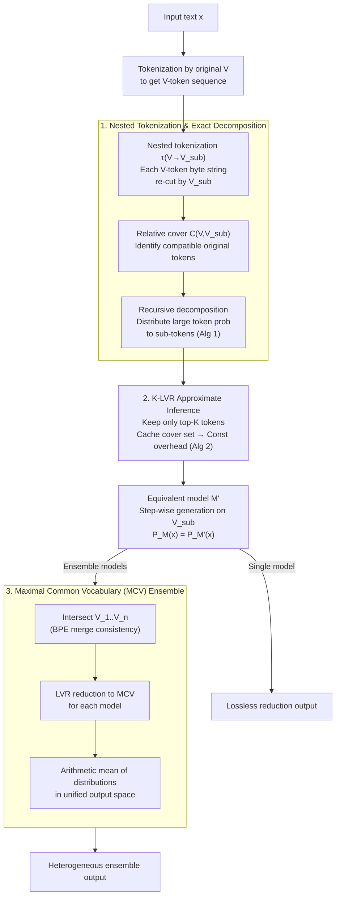

# Lossless Vocabulary Reduction for Auto-Regressive Language Models

**Conference**: ICLR 2026  
**arXiv**: [2510.08102](https://arxiv.org/abs/2510.08102)  
**Code**: None  
**Area**: LLM Pre-training  
**Keywords**: Vocabulary Reduction, Auto-Regressive LM, Tokenization, Model Ensemble, Maximal Common Vocabulary

## TL;DR

Proposes the theoretical framework of **Lossless Vocabulary Reduction (LVR)**. By utilizing nested tokenization, any auto-regressive language model is precisely converted into an equivalent model using an arbitrary sub-vocabulary. Based on the **Maximal Common Vocabulary (MCV)**, the method achieves efficient ensemble of language models with different tokenization schemes, validating effectiveness across tasks like GSM8K, MATH, and translation.

## Background & Motivation

**Background**: Tokenization is a core component of language models, with various algorithms like BPE, SentencePiece, and Unigram being widely used. Each language model possesses an independent vocabulary $V$, and auto-regressive models generate text by predicting the next-token distribution $p(v_t | v_{<t})$ over this vocabulary one token at a time.

**Limitations of Prior Work**: Vocabularies of different language models are typically incompatible (e.g., Qwen uses 151,643 tokens while Falcon uses 131,072 tokens), resulting in their next-token distributions being defined in entirely different probability spaces. This prevents techniques requiring collaboration at the token distribution level—such as model ensemble and cross-model knowledge distillation—from being directly applied to models with different vocabularies.

**Key Challenge**: Existing solutions are either restricted to ensembles of models with the same vocabulary or employ byte-level reduction (degrading all models to a byte-level vocabulary). The former limits the range of model selection, while the latter results in extremely long sequences and low efficiency due to the small vocabulary size. There is a lack of a vocabulary conversion framework that guarantees both lossless precision and balance between efficiency and generality.

**Goal**: How to **losslessly** convert any auto-regressive language model into an equivalent model using an arbitrary sub-vocabulary? Furthermore, how to find the optimal common vocabulary among multiple models to maximize generation efficiency while ensuring losslessness?

**Key Insight**: From a probabilistic perspective, vocabulary reduction is formalized as a distribution equivalence problem under nested tokenization. The paper proves that as long as the target sub-vocabulary satisfies the coverage condition, a unique equivalent next-token distribution exists, and a recursive construction algorithm is provided.

**Core Idea**: Precise probability decomposition via nested tokenization enables lossless conversion from a large vocabulary to any small vocabulary. The Maximal Common Vocabulary (MCV) is used to unify the output spaces of different models for ensemble.

## Method

### Overall Architecture

LVR addresses a specific problem: given an auto-regressive language model $M$ (vocabulary $V$) and a smaller target sub-vocabulary $V_{\text{sub}}$, transform $M$ into an equivalent model $M'$ that only outputs tokens from $V_{\text{sub}}$, ensuring string-level probability equality $P_M(x) = P_{M'}(x)$ for **any text** $x$. The pipeline consists of three steps: text is first tokenized by the original vocabulary $V$, then the byte string of each $V$-token is re-tokenized using $V_{\text{sub}}$ (nested tokenization). The original "single-step large token generation" becomes "multi-step generation on the sub-vocabulary," where the probability along this path is precisely calculated by a recursive decomposition formula to ensure no loss of precision (the mathematical foundation of losslessness, Algorithm 1). Since the exact algorithm requires iterating over the entire $V$ at each step, K-LVR is used during inference for top-$K$ truncation, reducing overhead to a constant level (Algorithm 2). Together, these steps form the lossless reduction engine. Finally, for ensembles of multiple heterogeneous models, their vocabularies are intersected to obtain the MCV. All models are losslessly reduced to this MCV by the engine, allowing their distributions to be averaged in a unified output space.

### Key Designs

**1. Nested Tokenization and Exact Probability Decomposition: Decomposing "Large Token Generation" into "Multiple Sub-token Steps"**

Directly truncating probabilities by a sub-vocabulary (Naive Restriction) breaks normalization and results in incorrect distributions. LVR defines a nested tokenization $\tau_{V \to V_{\text{sub}}}$ to re-tokenize the byte string of each token in $V$ using $V_{\text{sub}}$. For example, if "abc" in $V$ is split into "a"+"b"+"c" in $V_{\text{sub}}$, the probability of generating "abc" in one step must be precisely propagated to the multi-step path "a", then "b", then "c". The difficulty lies in intermediate steps: when generating "a", one must account not only for the probability of "abc" but also for all other $V$-tokens starting with "a" (e.g., "ab", "axy") to ensure the conditional probability sums to one. The paper uses a **relative cover** ($C_{V, V_{\text{sub}}}(y_{1:k})$, characterizing which original $V$-tokens remain compatible given the generated sub-token prefix $y_{1:k}$) to define the contributing token set. A recursive decomposition formula is provided to calculate the conditional probability of each sub-vocabulary token, ensuring the product along the path equals the original token probability. This exact version, Algorithm 1, provides the existence, uniqueness, and constructive proof for $P_M(x) = P_{M'}(x)$.

**2. K-LVR Approximate Inference: Reducing Exact Algorithms to Constant Overhead via Top-$K$ Truncation**

Although Algorithm 1 is lossless, it requires iterating through all tokens in the original vocabulary $V$ for decomposition at each step, with complexity proportional to $|V|$, which is too costly for models with 150k+ tokens. Algorithm 2 (K-LVR) retains only the $K$ tokens with the highest probabilities ($V^{(K)}$) for decomposition and reuses cached intermediate results of the relative cover. Experiments observe that the cover set size stabilizes around $K$ after a few steps and does not grow with sequence length, making the inference overhead practically constant. There are clear guidelines for $K$: $K=1$ precisely reproduces greedy decoding; $K \geq 10$ is sufficient for greedy ensemble; and $K \geq 250$ is needed to approximate the full distribution for random sampling. The trade-off is that top-$K$ truncation makes K-LVR no longer strictly lossless, but larger $K$ converges toward exact LVR.

**3. Maximal Common Vocabulary (MCV): Finding the Largest Shared Output Space for Heterogeneous Models**

With the lossless reduction engine, ensembling models with different tokenization schemes becomes a task of projecting them into the same token space before averaging. Given multiple vocabularies $V_1, V_2, \ldots, V_n$, the MCV is defined as the largest set that can be formed from their common tokens under the constraints of BPE merge rules. This is essentially an intersection that maintains compatibility with merging rules. After all models are losslessly reduced to the MCV using LVR, their next-token distributions are defined in the same space and can be directly averaged or mixed. Compared to degrading to the byte-level (where the common vocabulary has only 256 tokens and results in very long sequences), MCV preserves shared high-frequency sub-tokens, significantly reducing generation steps.

### Loss & Training

- **No Additional Training Required**: LVR is a pure inference-time probability transformation algorithm involving no parameter learning or gradient updates.
- **Theoretical Guarantee**: Under exact LVR (Algorithm 1), the transformation satisfies text-level distribution equivalence $P_M(x) = P_{M'}(x)$, which is a rigorous mathematical theorem.
- **Approximation Strategy**: K-LVR introduces approximation via top-$K$ truncation. Larger $K$ approaches exact LVR, and $K=300$ covers almost all scenarios with minimal precision loss in experiments.
- **Ensemble Strategy**: After reduction to MCV, next-token distributions are directly averaged, requiring no additional ensemble weight learning.

## Key Experimental Results

### Main Results

Verification of losslessness and ensemble effectiveness on GSM8K and MATH benchmarks (greedy decoding, $K=300$):

| Model / Configuration | GSM8K Acc (%) | MATH Acc (%) | Description |
|---|---|---|---|
| Qwen2.5-3B (Original Vocab) | 79.1 | 42.4 | Original model baseline |
| Qwen2.5-3B (K-LVR, N-bytes ≥ 3) | ~79 | ~42 | Losslessness: Equivalent to original |
| Falcon3-7B (Original Vocab) | 77.9 | 30.2 | Original model baseline |
| Falcon3-7B (K-LVR, N-bytes ≥ 3) | ~78 | ~30 | Losslessness: Equivalent to original |
| Naive Restriction (Qwen) | Significant drop | Significant drop | Naive truncation fails severely |
| **MCV Ensemble (Qwen + Falcon)** | **82.6** | **44.2** | MCV ensemble significantly outperforms both |
| Byte-level Ensemble | ~80 | ~41 | Byte-level is less efficient and sub-optimal |

### Ablation Study

Impact of hyperparameter $K$ on K-LVR approximation accuracy (Qwen2.5-3B):

| Hyperparameter $K$ | Greedy Acc (GSM8K) | Random Sampling Dist. | Description |
|---|---|---|---|
| $K = 1$ | ~79% (Matches original) | Large | top-1 sufficient for greedy |
| $K = 10$ | ~79% | Medium | Sufficient for greedy ensemble |
| $K = 100$ | ~79% | Small | Approaching exact distribution |
| $K = 250$ | ~79% | Minimal | Sufficient for random sampling |
| $K = 300$ | ~79% | Negligible | Default setting in paper |

### Key Findings

- **Verification of Losslessness**: K-LVR with $N$-bytes reduction ($N \geq 3$) maintains the same accuracy as the original models on GSM8K and MATH, proving the theoretical guarantee holds in practice.
- **Naive Restriction Fails**: Directly truncating the probability distribution by a sub-vocabulary leads to a collapse in accuracy, highlighting the necessity of precise probability decomposition.
- **Effectiveness of MCV Ensemble**: Cross-vocabulary ensemble consistently outperforms single models across multiple model pairs (Qwen+Falcon, Qwen+OLMo2, OLMo2+Falcon, Phi2+Llama3.1, Phi2+Yi1.5) and improves BLEU in translation tasks (En↔Fr, En↔De).
- **Stable Computation Cost**: The relative cover size stabilizes around $K$ after initial steps, meaning inference overhead is practically constant regardless of sequence length.

## Highlights & Insights

- **Outstanding Theoretical Contribution**: A mathematically complete framework providing existence, uniqueness, and constructive proofs for vocabulary reduction, turning a heuristic problem into a guaranteed algorithm.
- **Breaking Vocabulary Barriers**: Long perceived as incompatible, LLMs with different tokenization schemes can now interoperate, opening paths for ensemble, distillation, and unified evaluation.
- **Training-free Inference Method**: Unlike learned vocabulary reduction, LVR can be directly applied to any existing pre-trained model as a plug-and-play solution.
- **Elegant MCV Design**: The Maximal Common Vocabulary constructed via intersection and BPE merge rules finds the optimal balance between byte-level (low efficiency) and full vocabulary (incompatible).
- **Practicality of K-LVR**: Top-$K$ approximation transforms the theory into a deployable algorithm with clear guidelines for selecting $K$.

## Limitations & Future Work

- **Drop in Generation Efficiency**: Reducing to a smaller vocabulary increases sequence length (e.g., MCV size < original size), increasing inference steps and latency.
- **K-LVR is not Strictly Lossless**: Algorithm 2 introduces top-$K$ truncation, which theoretically no longer guarantees exact distribution equivalence and lacks a theoretical error bound.
- **Limited Model Scale**: Experiments were primarily conducted on 3B-13B models; performance and overhead on larger models (70B+) require further testing.
- **Limited to AR Models**: The framework relies on the sequential nature of auto-regressive generation and cannot be directly extended to BERT-like bidirectional models or diffusion models.
- **Potential MCV Degradation**: If two tokenization schemes differ significantly, the MCV might approach the byte-level, weakening efficiency advantages.

## Related Work & Insights

- **Tokenization Algorithms**: BPE, SentencePiece, and Unigram LM each have pros and cons; this work provides a unified solution for cross-tokenization collaboration.
- **Byte-level reduction**: This is the simplest commonization scheme but suffers from low efficiency; LVR is a theoretical generalization and efficiency improvement over byte-level reduction.
- **Model Ensemble**: Traditional ensemble requires a shared output space; this work breaks that limitation via MCV.
- **Cross-vocabulary Distillation**: Existing works use heuristics to align vocabularies; the LVR framework could be applied to distillation with theoretical guarantees.

## Rating

- Novelty: ⭐⭐⭐⭐⭐ 
- Experimental Thoroughness: ⭐⭐⭐⭐ 
- Writing Quality: ⭐⭐⭐⭐ 
- Value: ⭐⭐⭐⭐ 

<!-- RELATED:START -->

## Related Papers

- [\[ACL 2025\] Large Vocabulary Size Improves Large Language Models](../../ACL2025/llm_pretraining/large_vocabulary_size_improves_large_language_models.md)
- [\[ICLR 2026\] Soft-Masked Diffusion Language Models](soft-masked_diffusion_language_models.md)
- [\[ICLR 2026\] Steering Language Models with Weight Arithmetic](steering_language_models_with_weight_arithmetic.md)
- [\[ICLR 2026\] Scaling Behavior of Discrete Diffusion Language Models](scaling_behavior_of_discrete_diffusion_language_models.md)
- [\[ICLR 2026\] Pretraining Scaling Laws for Generative Evaluations of Language Models](pretraining_scaling_laws_for_generative_evaluations_of_language_models.md)

<!-- RELATED:END -->
## Related Papers

- [\[ACL 2025\] Large Vocabulary Size Improves Large Language Models](../../ACL2025/llm_pretraining/large_vocabulary_size_improves_large_language_models.md)
- [\[ICLR 2026\] Soft-Masked Diffusion Language Models](soft-masked_diffusion_language_models.md)
- [\[ICLR 2026\] Steering Language Models with Weight Arithmetic](steering_language_models_with_weight_arithmetic.md)
- [\[ICLR 2026\] Pretraining Scaling Laws for Generative Evaluations of Language Models](pretraining_scaling_laws_for_generative_evaluations_of_language_models.md)
- [\[ACL 2025\] FR-Spec: Accelerating Large-Vocabulary Language Models via Frequency-Ranked Speculative Sampling](../../ACL2025/llm_pretraining/fr_spec_speculative_sampling.md)

<!-- RELATED:END -->
