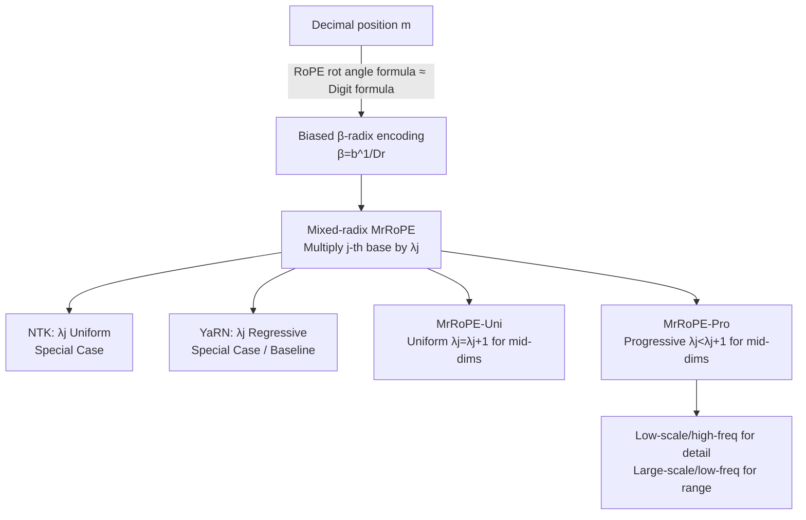

# MrRoPE: Mixed-radix Rotary Position Embedding

**Conference**: ICLR 2026  
**OpenReview**: [https://openreview.net/forum?id=1J63FJYJKg](https://openreview.net/forum?id=1J63FJYJKg)  
**Code**: To be confirmed  
**Area**: Large Model Pre-training / Long-context Extrapolation  
**Keywords**: RoPE, Position Encoding, Long-context Extrapolation, Radix Conversion, training-free  

## TL;DR
This paper re-examines RoPE from the perspective of "radix conversion" and proposes a unified framework, MrRoPE. It explains extrapolation methods such as PI, NTK, and YaRN as different mixed-radix conversion strategies. Based on this, MrRoPE-Pro (Progressive Radix Conversion) is designed to double the retrieval and dialogue accuracy of YaRN on 128K long contexts without fine-tuning.

## Background & Motivation
- **Background**: RoPE is the position encoding foundation for almost all mainstream LLMs. It encodes position information of each dimension into rotation angles of different frequencies, where high dimensions rotate slowly and low dimensions rotate quickly. To enable "short training, long testing," various RoPE extrapolation methods have emerged—PI (Linear Interpolation), NTK-aware scaling, and YaRN's segmented (NTK-by-parts) strategy.
- **Limitations of Prior Work**: These methods are fragmented with diverse motivations and lack a unified theoretical explanation. Why should NTK scale uniformly? Why does YaRN divide dimensions into high/medium/low segments and use linear interpolation for the middle? These choices appear to be empirical engineering heuristics; the optimal frequency redistribution strategy remains undefined. Furthermore, fine-tuning for window expansion is prohibitively expensive (expanding Llama2-70B to 32K requires 57,740 GPU hours).
- **Key Challenge**: The root cause of RoPE generalization failure is that **high dimensions "do not complete a full cycle."** When $L/\theta_j < 2\pi$, these dimensions never encounter a complete rotation angle during training, leading to collapse when meeting OOD (Out-of-Distribution) angles during testing. Existing methods essentially "redistribute the rotation cycles of each dimension," but they lack a unified metric to measure effectiveness.
- **Goal**: Establish a unified theoretical framework that incorporates all existing extrapolation methods and find a superior conversion strategy for intermediate dimensions compared to YaRN.
- **Core Idea**: **RoPE is essentially a biased radix conversion**—it rewrites the decimal position $m$ as a string of digits in base $b^{1/D_r}$. Consequently, "window expansion" is equivalent to "increasing the radix base for certain digits," making all extrapolation methods different values of the $\lambda$ vector under the same mixed-radix system.

## Method

### Overall Architecture
The core of MrRoPE is aligning the RoPE rotation angle formula with the digit extraction formula of radix conversion. Both rely on modulo/periodicity to generate carries. By ignoring quantization and modulo periods, RoPE serves as a conversion from decimal to $\beta$-radix ($\beta=b^{1/D_r}$). Based on this, multiplying the base of the $j$-th digit by a scaling factor $\lambda_j$ yields the unified formula for "Mixed-radix RoPE (MrRoPE)." Different extrapolation methods correspond to different $\lambda=\{\lambda_1,...,\lambda_{D_r}\}$ values. The authors recover NTK (uniform scaling) and YaRN (regressive scaling) as special cases of this framework and propose two new strategies: MrRoPE-Uni (Uniform) and MrRoPE-Pro (Progressive) to systematically compare intermediate dimension conversions.

### Key Designs

**1. Rewriting RoPE as biased radix encoding: The theoretical starting point.** RoPE splits $q/k$ vectors into $D_r=|D|/2$ blocks, where the rotation angle of the $j$-th block is $m\theta_j=(m\cdot b^{-(j-1)/D_r})\bmod 2\pi$. The authors observe a striking similarity to the radix digit extraction formula $(m_{(\beta)})_j=\lfloor m\cdot\beta^{-(j-1)}\rfloor\bmod\beta$. When $\beta=b^{1/D_r}$, both share the term $m\cdot\beta^{-(j-1)}$, and both modulo operations and trigonometric functions contribute periodicity. By restoring the previously ignored flooring and modulo operations, a biased position estimate $\hat m=\sum_j \beta^{(j-1)}(m\theta_j)$ is recovered. Experiments (Figure 2) show that $\hat m$ is approximately linear with the true position, and larger bases result in longer linear intervals—theoretically explaining "why increasing the base expands the window."

**2. Mixed-radix window expansion: Unifying extrapolation as $\lambda$ vector selection.** OOD problems correspond to "high digits never carrying" in a radix system. When the input is restricted to $[0,L]$, for $j$ starting from a certain point, $\lfloor L\cdot\beta^{-(j-1)}\rfloor\bmod\beta<\beta-1$, meaning high digits never complete a carry cycle. To extend such an imbalanced radix system, the natural approach is to expand the base of the lower digits (before $d$). Formally, multiplying the $j$-th digit by $\lambda_j$ expands the representable range by $\prod_j\lambda_j$ times. For RoPE, this corresponds to $m\theta'_j=(m\cdot b^{-(j-1)/D_r}/\prod_{d=1}^{j-1}\lambda_d)\bmod 2\pi$. This formula is the MrRoPE framework: **any extrapolation method satisfying this equation is a mixed-radix conversion of position encoding.** NTK corresponds to uniform $\lambda_j=S^{1/(D_r-1)}$; YaRN corresponds to no conversion for high/low frequencies ($\lambda_j=1$) and linear interpolation for mid-frequencies—the authors prove that YaRN is implicitly a **regressive scaling ($\lambda_j>\lambda_{j+1}$)**.

**3. MrRoPE-Pro: Progressive Radix Conversion, the optimal strategy.** Since the conversion method for intermediate dimensions is the key degree of freedom, the authors propose three candidates: Uniform ($\lambda_j=\lambda_{j+1}$, i.e., MrRoPE-Uni), Regressive (YaRN), and Progressive ($\lambda_j<\lambda_{j+1}$, i.e., MrRoPE-Pro). The design philosophy of Pro is "**small scaling for high-frequency dimensions, large scaling for low-frequency dimensions**": low dimensions (high frequency) carry local fine-grained position info and should be minimally disturbed; high dimensions (low frequency) are the disaster zones for OOD and should be significantly expanded. By setting $\lambda_j=S^{1/(D_r-1)}$ and defining $\epsilon$ as an arithmetic progression constrained by $\sum\epsilon_j=1$, the intermediate dimensions are solved as $\epsilon_j=\frac{2(1+j-d_l)}{(1+d_h-d_l)(d_h-d_l)}$, forming a scaling curve from gradual to steep. This avoids high-dimension OOD while preserving the original high-frequency structure of RoPE.

**4. Unified formula and provable upper bound improvement.** The general formula sets $\lambda_d=1$ for low/high-frequency dimensions, and intermediate dimensions take values according to Uni or Pro formulas. Other implementation details (values of $d_l, d_h$, etc.) are consistent with YaRN—meaning the only essential difference between this work and YaRN lies in the extrapolation strategy of intermediate dimensions. Based on RoPE Bound Theory + cosine similarity, the authors further prove that MrRoPE-Pro significantly raises the theoretical upper bound of reachable encoding length and stabilizes the attention score distribution in intermediate dimensions, providing theoretical rather than purely empirical support for "why Pro is better."

## Key Experimental Results

### Main Results
On the RULER retrieval benchmark (all 13 subtasks) using LLaMA3-8B / Qwen2.5-3B, with the training window expanded to 128K:

| Model | Method | 8K | 16K | 32K | 64K | 128K |
|---|---|---|---|---|---|---|
| LLaMA3-8B | YaRN | 95.5 | 92.1 | 92.7 | 89.5 | 79.9 |
| LLaMA3-8B | **MrRoPE-Pro** | **96.2** | **94.2** | **94.3** | **91.3** | **86.6** |
| Qwen2.5-3B | YaRN | 78.1 | 77.7 | 75.6 | 63.2 | 50.1 |
| Qwen2.5-3B | **MrRoPE-Pro** | **82.3** | **82.9** | **78.5** | **70.4** | **53.2** |

While YaRN drops sharply from 89.5 to 79.9 at 64K→128K, MrRoPE-Pro only slightly decreases to 86.6, demonstrating a clear advantage in long-range stability. On Infinite-Bench (100K–128K), MrRoPE-Pro significantly outperforms YaRN in KV Retrieve (27% vs 9%) and QA Dialogue (22% vs 10%). Passkey Retrieval reaches 100% (matching GPT-4), exceeding specifically fine-tuned models like Yi-34B-200K and Kimi-Chat across several subsets—all without any training.

### Ablation Study
Proofpile perplexity (lower is better, comparing three conversion strategies for intermediate dimensions):

| Model | Method | 8K | 16K | 32K | 64K | 128K |
|---|---|---|---|---|---|---|
| LLaMA3-8B | YaRN (Regressive) | 3.68 | 3.08 | 2.75 | 2.49 | 2.38 |
| LLaMA3-8B | MrRoPE-Uni (Uniform) | 3.66 | 3.06 | 2.74 | 2.47 | 2.41 |
| LLaMA3-8B | **MrRoPE-Pro (Progressive)** | **3.63** | **3.03** | **2.71** | **2.45** | **2.34** |

Uni is better than YaRN at short lengths but slightly worse at long lengths; only Pro achieves the lowest perplexity across the entire range (8K→128K), validating that "Progressive" is superior to "Uniform" and "Regressive."

### Key Findings
- **Needle In A Haystack (NIAH)**: MrRoPE-Pro pushes the effective window of LLaMA3-8B to $\ge$96K. Even at 120K (15x the training length), it maintains >85% recall at most depths, whereas YaRN degrades early.
- **Inherent flaws in YaRN's regressive scaling**: Performing conversion in low-dimensional spaces disturbs local position information, causing degradation in short contexts—this confirms the design motivation of Pro's "low disturbance for low dimensions."

## Highlights & Insights
- **Elegance of a Unified Perspective**: Measuring PI/NTK/YaRN with the "radix conversion" ruler transforms scattered extrapolation tricks into different values of the $\lambda$ vector. This reduction of engineering heuristics into a single axiom is highly explanatory.
- **Closed Loop of Theory and Practice**: The paper not only proposes a framework but also predicts that "Progressive is superior to Regressive," confirms it empirically, and uses RoPE Bound Theory to prove the upper bound improvement, completing the "Theory → Design → Experiment → Theory" cycle.
- **Completely Training-free**: All results are achieved without fine-tuning, making deployment costs nearly zero and extremely friendly for industrial window expansion.

## Limitations & Future Work
- **Intermediate Dimension Design is Still Empirical**: Pro assumes $\epsilon$ to be an arithmetic progression, which is one specific solution among many progressive forms. Whether optimal non-linear progressive curves exist or how to make $d_l/d_h$ boundaries adaptive was not fully explored.
- **Small Model Scale**: Experiments focused on 3B–8B models. Performance on 70B+ or MoE models remains unverified, and stability in ultra-long (>128K) scenarios was only tested up to 15x the training length.
- **Task Coverage**: Primarily focuses on retrieval and language modeling tasks. The impact on complex abilities like long-chain reasoning or multi-hop QA requires further assessment.

## Related Work & Insights
- **RoPE and Extrapolation Lineage**: PI (Linear Interpolation), NTK-aware (Uniform Scaling), and YaRN (NTK-by-parts) are three special cases of the unified framework. YaRN is further proven to be "regressive" and serves as the primary baseline.
- **Theoretical Tools**: The work draws from the cosine similarity upper bound analysis in RoPE Bound Theory (Men et al. 2024) and the stability analysis of attention scores in intermediate dimensions (Liu et al. 2023b; Barbero et al. 2024).
- **Inspiration**: Understanding position encoding as a "number system" is a transferable perspective—future work could design learnable $\lambda$ vectors or extend mixed-radix ideas to multi-dimensional positions (e.g., 2D images, video RoPE).

## Rating
- **Novelty**: ⭐⭐⭐⭐⭐ "RoPE = Biased Radix Conversion" is a truly new theoretical perspective that unifies existing methods, far beyond "just another extrapolation trick."
- **Experimental Thoroughness**: ⭐⭐⭐⭐ Covers Perplexity/RULER/NIAH/Infinite-Bench multiple benchmarks across multiple models up to 128K with clear ablations; however, model scale is relatively small and ultra-long validation is limited.
- **Writing Quality**: ⭐⭐⭐⭐ Theoretical derivations are logically sound, illustrations (unified framework diagram, cumulative scaling factor curves) are effective, and though the formulas are dense, the logic is clear.
- **Value**: ⭐⭐⭐⭐⭐ Provides the community with both a unified theoretical framework for understanding RoPE extrapolation and a practical, training-free SoTA method, a win-win for theory and application.

<!-- RELATED:START -->

## Related Papers

- [\[ICLR 2026\] Selective Rotary Position Embedding](selective_rotary_position_embedding.md)
- [\[ICLR 2026\] LLM-JEPA: Large Language Models Meet Joint Embedding Predictive Architectures](llm-jepa_large_language_models_meet_joint_embedding_predictive_architectures.md)
- [\[ICLR 2026\] Deconstructing Positional Information: From Attention Logits to Training Biases](deconstructing_positional_information_from_attention_logits_to_training_biases.md)
- [\[ICLR 2026\] Beyond URLs: Metadata Diversity and Position for Efficient LLM Pretraining](beyond_urls_metadata_diversity_and_position_for_efficient_llm_pretraining.md)
- [\[ICLR 2026\] Predicting Training Re-evaluation Curves Enables Effective Data Curriculums](predicting_training_re-evaluation_curves_enables_effective_data_curriculums_for_.md)

<!-- RELATED:END -->
