# Nemotron-CC-Math: A 133 Billion-Token-Scale High Quality Math Pretraining Dataset

**Conference**: ICLR 2026  
**OpenReview**: [https://openreview.net/forum?id=rhPnkTKfMy](https://openreview.net/forum?id=rhPnkTKfMy)  
**Code**: [NVIDIA-NeMo/Curator (tutorials/math)](https://github.com/NVIDIA-NeMo/Curator/tree/main/tutorials/math) · [Dataset](https://huggingface.co/datasets/nvidia/Nemotron-CC-Math-v1)  
**Area**: LLM Pre-training Data / Math Corpus Construction  
**Keywords**: Math Pre-training Corpus, Common Crawl, HTML Extraction, LaTeX Standardization, Data Cleaning  

## TL;DR
A domain-agnostic pipeline utilizing "lynx layout rendering + lightweight LLM cleaning" is proposed to reliably extract and standardize math/code content from Common Crawl. This constructs Nemotron-CC-Math (133B tokens), the highest-quality open-source math pre-training corpus to date, which consistently outperforms FineMath, MegaMath, and OpenWebMath across math, code, and general knowledge tasks.

## Background & Motivation
**Background**: High-quality structured data such as mathematics and code is crucial for the reasoning capabilities of LLMs. The mathematical prowess of models like o1 and DeepSeek-R1 heavily depends on large-scale, high-quality math pre-training data. However, the math corpora used by SOTA models like DeepSeekMath, Minerva, and Qwen-2.5-Math remain private. Open-source alternatives (OpenWebMath, FineMath, InfiMM-WebMath, MathPile) are limited in scale and fidelity.

**Limitations of Prior Work**: The core bottleneck of open-source math corpora lies in the **extraction pipeline**. Math formulas on web pages exist in diverse formats (MathML, LaTeX, KaTeX, MathJax, images, custom delimiters, `<pre>` blocks, etc., see Figure 2 in the paper), and rendering strategies evolve constantly, making fixed heuristic rules fragile. General text extraction tools (jusText, Trafilatura, Resiliparse) designed for "de-templating + narrative text extraction" tend to strip or damage formulas, lose inline LaTeX, and flatten code blocks that require strict indentation. Furthermore, HTML in Common Crawl often lacks accompanying CSS/JS, hindering formula recovery.

**Key Challenge**: Common Crawl is the primary source for large-scale pre-training, but its mathematical value is under-exploited. On one hand, math content accounts for $< 1\%$, making classifiers extremely difficult to train (manual labeling is hard; only ultra-fast methods like FastText are feasible, but precision collapses when recall increases). On the other hand, DOM-based parsers systematically destroy mathematical structures.

**Goal**: To build a **modular, scalable, and domain-agnostic** framework to reliably extract math-rich content from raw web pages and produce a large-scale, high-fidelity math corpus.

**Core Idea**: **"Replace DOM parsing with text browser rendering + Replace heuristics with LLM standardization."** The lynx text browser is used to execute HTML layout rules, rendering web pages into plain text that preserves formulas and code indentation. Subsequently, a lightweight LLM unifies heterogeneous math representations into LaTeX, removes template noise, and corrects errors.

## Method

### Overall Architecture
The pipeline originates from Common Crawl (98 snapshots, 2014–2024). It first reuses URL lists from filtered community datasets (OWM, InfiMM-WebMath, FineMath, MegaMath) to identify math pages, retrieving 229.54M raw HTML files. These undergo lynx rendering $\rightarrow$ Phi-4 LLM cleaning and LaTeX standardization $\rightarrow$ FineMath quality classification $\rightarrow$ fuzzy deduplication $\rightarrow$ decontamination, resulting in Nemotron-CC-Math with 101.15M documents and 133.26B tokens.

```mermaid
flowchart LR
    A[Common Crawl<br/>98 Snapshots] --> B[URL Filtering<br/>Reuse OWM/FineMath/<br/>MegaMath/InfiMM URLs]
    B --> C[Retrieve 229.54M<br/>Raw HTML]
    C --> D[lynx Layout Rendering<br/>Preserve Formulas + Code Indentation]
    D --> E[Phi-4 LLM Cleaning<br/>De-templating + LaTeX Std + Correction]
    E --> F[FineMath Quality-Classification<br/>5-point Scoring]
    F --> G[MinHash LSH Fuzzy Deduplication]
    G --> H[Qwen2.5 Embedding Decontamination]
    H --> I[Nemotron-CC-Math<br/>133B / 52B Variants]
```

### Key Designs

**1. Bypassing the "Classifier Dilemma" via URL Reuse:** The authors initially attempted to train a lightweight classifier for technical pages but identified a fundamental contradiction: math content accounts for less than 1% of Common Crawl, making ground truth annotation extremely difficult. Classifiers scanning the full Common Crawl must be extremely fast (e.g., FastText with simplified HTML parsing), which naturally leads to high bias where increasing recall causes precision to plummet. Instead of marginal optimization, the authors directly extracted URLs from four community datasets (including all major subsets), inheriting various filtering strategies from multiple research groups and bypassing the limitations of a single classifier.

**2. "Structure-Fidelity" Rendering with lynx:** This is the most critical design choice. HTML in raw WARC files is too verbose for direct LLM input, and traditional DOM-based parsers lose critical information. lynx is unique because it **actually executes HTML layout rules**, producing a page structure consistent with human visual perception, thereby reliably capturing formulas and maintaining code indentation. In contrast, tools like jusText/Trafilatura/Resiliparse change inline formula semantics and flatten indentation-dependent code blocks like Python. This step ensures the integrity of the "structural layer."

**3. "Semantic-Layer" Cleaning and LaTeX Unification via Lightweight LLM:** lynx output still contains template noise like navigation bars and redundant headers. The authors used **Phi-4 (14B)** for a cleaning pass: retaining main text and references while deleting non-essential content. Simultaneously, various math representations (MathML, custom delimiters, `<pre>` blocks, image alt text) are **standardized into LaTeX** (Figure 2 in the paper lists mapping for 7 input formats to $f(x)=x^{2}$) and typographical errors are corrected. This two-stage "lynx structure fidelity + LLM semantic refinement" approach avoids fragile heuristic rules. Ablations show that this cleaning task is simple enough for small models to perform excellently.

**4. Fuzzy Deduplication + Strict Decontamination:** Deduplication utilizes MinHash LSH from NeMo-Curator, with a collision probability $P = 1 - (1 - S^{b})^{r}$, using $r{=}20$ bands and $b{=}13$ hash functions per band for a target Jaccard similarity threshold of 0.8 (calculated via 24-grams). Decontamination uses Qwen2.5 32B to embed all documents alongside prompts/answers from MMLU/MMLU-Pro/MATH/GSM8K; documents with cosine similarity $> 0.9$ are removed (actual removal $< 0.002\%$). Two versions were produced: Nemotron-CC-Math-4+ (scores 4–5, 52.32B tokens) and Nemotron-CC-Math-3+ (scores 3–5, 133.26B tokens).

## Key Experimental Results

**Experimental Setup**: Annealing ablations were performed on Nemotron-T 8B checkpoints by upsampling the target math dataset to 30% of the data mix (downscaling the remaining 70%) to isolate the contribution of math data. Two settings: 100B token annealing (comparing to small high-quality sets $\leq 30$B, e.g., FineMath-4+/MegaMath-Pro/OWM) and 300B token annealing (comparing to larger sets like FineMath-3+/MegaMath-Web).

### Main Results

100B Token Annealing (Comparison with 4+ Quality Datasets, Selected):

| Metric | OWM | MegaMath-Pro | FineMath-4+ | **Nemotron-CC-Math-4+** |
|---|---|---|---|---|
| MATH (EM) | 29.20 | 34.00 | 35.80 | **40.60** |
| GSM8K (EM) | 71.42 | 73.46 | 75.97 | **76.27** |
| HumanEval+ (avg@20) | 32.53 | 31.01 | 32.16 | **34.82** |
| MBPP+ (avg@20) | 43.76 | 46.03 | 28.88 | 45.11 |
| MMLU-Pro (EM) | 35.49 | 36.41 | 36.74 | **38.49** |
| MMLU-Stem (EM) | 58.83 | 60.86 | 61.62 | **62.67** |

300B Token Annealing (Comparison with 3+ Large-Scale Datasets, Selected):

| Metric | OWM | MegaMath-Web | FineMath-3+ | **Nemotron-CC-Math-3+** |
|---|---|---|---|---|
| MATH (EM) | 34.20 | 31.60 | 34.60 | **44.20** |
| GSM8K (EM) | 76.42 | 78.24 | 79.45 | **80.06** |
| HumanEval+ (avg@20) | 33.54 | 32.29 | 34.18 | **37.16** |
| MBPP+ (avg@20) | 37.59 | 38.89 | 29.19 | **43.51** |
| MMLU-Stem (EM) | 59.20 | 59.88 | 62.29 | **64.26** |

Dataset scale comparison: Nemotron-CC-Math-4+ contains 52.32B tokens, which is **5.5$\times$** that of the previously highest-quality open-source math dataset, FineMath-4+ (9.6B).

### Ablation Study

Cleaning Model Selection (Sampling 7M documents, comparing different instruction-tuned LLMs for template removal):

| Model | Parameters | MATH (EM) | GSM8K (EM) |
|---|---|---|---|
| DeepSeek-V3 | 671B | — | — |
| Qwen2.5-72B-Instruct | 72B | — | — |
| **Phi-4** | **14B** | **40.6** | **79.98** |

Phi-4 achieved the best performance on mathematical tasks with 14B parameters, matching or exceeding DeepSeek-V3 (671B) and Qwen2.5-72B, and was thus selected as the default cleaning model.

### Key Findings
- **Quality scales with training size**: From 100B to 300B, MATH performance increased from 40.6 to 44.2, indicating that high-quality data continues to be effective as training scales.
- **Unexpected Code Gains**: Despite not specifically targeting the code domain, Nemotron-CC-Math-3+/4+ contain approximately 4.3M / 1.44M samples with code snippets. The pipeline preserved code syntax and structure perfectly, leading to an MBPP+ gain of +14.32 relative to FineMath-3+.
- **LLM-aided Quality Assessment**: Using GPT-5.1 as a judge on 100 shared samples across four dimensions (Math preservation, Code preservation, Faithfulness, Readability), Nemotron-CC-Math scored highest in math and code preservation (e.g., Math 2.87, Code 3.00), as well as readability.
- Template removal does not require large models; small instruction-tuned models can complete it efficiently.

## Highlights & Insights
- **Paradigm Shift**: This work is the first to use the lynx text browser for HTML-to-plain text conversion to preserve math/code formatting and introduce LLM-based standardization. Replacing fragile heuristics with "layout rendering + LLM semantic cleaning" represents a substantial advancement in extraction methodology.
- **Domain Agnostic**: The pipeline is not inherently bound to mathematics; it is merely applied to the math domain. In principle, it can be extended to extract any technical content, including physics, computer science, and statistics.
- **Engineering Scalability**: Optimized with Polars and Ray, the pipeline efficiently processes TB-level HTML, making full-scale Common Crawl processing feasible.
- **Fully Open-Sourced**: Both the dataset and the complete pipeline (extraction/processing/scoring) are released, providing high value for community reproduction and extension.

## Limitations & Future Work
- **Reliance on External LLM for Cleaning**: The Phi-4 cleaning step introduces model bias and potential risks of hallucinations or rewriting. Whether the standardization process alters formula semantics in edge cases lacks large-scale manual verification.
- **URL Reuse Inherits Upstream Bias**: Locating math pages by extracting URLs from OWM/FineMath/MegaMath means coverage is bounded by the filtering strategies of these upstream datasets, potentially missing mathematical web pages they overloooked.
- **Evaluation Centered on 8B Model Annealing**: Gains have not been verified in larger-scale models or from-scratch pre-training settings.
- **Small Sample Size for Quality Assessment**: The LLM-aided evaluation sampled only 100 documents out of 97,788 shared samples, which is limited in scale.
- **Future Work**: Extending the pipeline to other scientific domains, exploring more lightweight cleaning models, and verifying scaling behavior on larger models.

## Related Work & Insights
- **Math Pre-training Corpora**: OpenWebMath, FineMath, InfiMM-WebMath, MathPile, MegaMath, DeepSeekMath, and Minerva are direct competitors. This work surpasses open-source counterparts in both scale and fidelity.
- **Text Extraction Tools**: jusText, Trafilatura, and Resiliparse are identified as general tools that "damage math/code," highlighting the necessity of domain-specific extraction.
- **Deduplication/Decontamination**: Follows MinHash LSH (NeMo-Curator) and embedding-based decontamination workflows.
- **Insight**: The approach of "changing to a layout-executing renderer (lynx) + letting LLM handle standardization" is valuable for any data engineering task requiring structured technical content (formulas, code, tables) from messy HTML. It also confirms that "high-quality math data not only improves math but also boosts code and general reasoning."

## Rating
- **Novelty**: ⭐⭐⭐⭐ — The combination of lynx rendering + LLM standardization is a first in math corpus extraction, representing substantial methodological innovation, though individual techniques are clever assemblies of existing tools.
- **Experimental Thoroughness**: ⭐⭐⭐⭐ — 100B/300B annealing variants, multi-baseline comparisons, cleaning model ablations, and LLM-aided quality assessments are comprehensive, lacking only verification on larger models and from-scratch training.
- **Writing Quality**: ⭐⭐⭐⭐ — Motivation is clear, pain points are well-analyzed (Figure 2's formatting diversity is highly persuasive), and the pipeline explanation is systematic.
- **Value**: ⭐⭐⭐⭐⭐ — The release of the highest-quality open-source math corpus to date (133B tokens, 5.5$\times$ FineMath-4+) along with the complete pipeline is a high-value asset for open-source math/reasoning model pre-training.

<!-- RELATED:START -->

## Related Papers

- [\[ICLR 2026\] GneissWeb: Preparing High Quality Data for LLMs at Scale](gneissweb_preparing_high_quality_data_for_llms_at_scale.md)
- [\[ACL 2025\] Nemotron-CC: Transforming Common Crawl into a Refined Long-Horizon Pretraining Dataset](../../ACL2025/llm_pretraining/nemotron_cc_pretraining_data.md)
- [\[ICLR 2026\] Rewriting Pre-training Data Boosts LLM Performance in Math and Code](rewriting_pre-training_data_boosts_llm_performance_in_math_and_code.md)
- [\[ICLR 2026\] Scaling Laws Revisited: Modeling the Role of Data Quality in Language Model Pretraining](scaling_laws_revisited_modeling_the_role_of_data_quality_in_language_model_pretr.md)
- [\[ICLR 2026\] FictionalQA: A Dataset for Studying Memorization and Knowledge Acquisition](fictionalqa_a_dataset_for_studying_memorization_and_knowledge_acquisition.md)

<!-- RELATED:END -->
