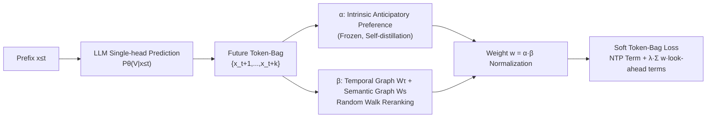

# Next-ToBE: Probabilistic Next Token-Bag Exploitation for Activating Anticipatory Capacity in LLMs

**Conference**: ICLR 2026  
**OpenReview**: [https://openreview.net/forum?id=T8IJojfaOh](https://openreview.net/forum?id=T8IJojfaOh)  
**Code**: TBD  
**Area**: LLM Pre-training / Training Objectives  
**Keywords**: Next Token Prediction, Multi-token Prediction, Anticipatory Capacity, Soft Target Distribution, Reasoning Enhancement  

## TL;DR
Next-ToBE replaces the one-hot target of standard NTP with a "soft token-bag distribution" covering multiple tokens within a future window. Without adding any extra parameters, it activates the latent "anticipatory planning" capability of LLMs, consistently outperforming strong baselines like MTP in math, code, and common-sense reasoning.

## Background & Motivation
**Background**: Although autoregressive LLMs are only trained to predict the next token, substantial evidence suggests they possess "anticipatory capacity"—inner-layer hidden states can predict tokens further in the future, even encoding global response features before generating the first token. This "think before speaking" ability is crucial for tasks requiring multi-step planning and long-range logical consistency, such as mathematical reasoning and code generation.

**Limitations of Prior Work**: The one-hot fitting target of NTP inadvertently **suppresses** this anticipatory capacity. It forces probability mass toward a "single correct answer," biasing toward the marginal distribution of tokens and encouraging short-range pattern matching while punishing reasonable high-confidence alternatives (synonyms/paraphrases), thereby weakening long-range semantic modeling and multi-step planning. To compensate, Multi-Token Prediction (MTP) uses multiple parallel auxiliary heads to predict multiple future tokens simultaneously. However, MTP still faces issues: **large additional parameter/memory overhead**, and continued reliance on one-hot targets, inheriting flaws like decreased semantic flexibility and over-concentration of probability.

**Key Challenge**: LLMs inherently possess anticipatory capacity that correlates positively with generation quality, yet mainstream training paradigms (NTP and MTP) either suppress it or bypass it at a high cost. **Few works systematically characterize and directly activate this capacity.**

**Goal**: To quantify, enhance, and utilize the anticipatory capacity of LLMs to improve reasoning performance without modifying the architecture or adding parameters.

**Core Idea**: Replace the NTP one-hot target with a **flexible "token-bag" distribution** composed of tokens within a future window. The immediate next token remains dominant, while further "look-ahead tokens" are integrated into supervision, dynamically weighted by their alignment with the model's intrinsic preferences, temporal order, and semantic relevance. This injects anticipatory pressure while respecting the inherent tendencies of the pre-trained model to maintain training stability.

## Method

### Overall Architecture
At each time step, Next-ToBE constructs a "future token-bag" $\{x_{t+1},\dots,x_{t+k}\}$ of length $k$ and converts it into a soft target distribution for fitting. The first term is standard NTP (fitting the immediate next token $x_{t+1}$), and the second term involves weighted fitting of the $k-1$ look-ahead tokens. Weights $w_{x_{t+j}}=\alpha_{x_{t+j}}\beta_{x_{t+j}}$ are derived by multiplying two signals: $\alpha$ encodes the model's own anticipatory preference, and $\beta$ encodes temporal-semantic relevance (re-ranked via a random walk). During inference, the model remains a single-head, one-token-at-a-time generator, where the token-by-token generation process continuously activates the latent anticipatory capacity. It essentially sits between NTP and MTP: single-headed like NTP, but considering multiple future tokens per step like MTP.

### Key Designs

**1. Quantifiable Characterization of Anticipatory Capacity (FtHR): Proving "it is indeed looking ahead."** The premise is that LLMs already look ahead. The authors use the Future Token Hit Rate $\text{FtHR}^k_m=\frac{1}{k(N-k-1)}\sum_t\sum_{j=1}^k \mathbb{1}\{x_{t+j}\in\text{top}_m[P_\theta(V|x_{\le t})]\}$ to quantify the degree to which the top-$m$ slots of the current softmax "pre-capture" the future $k$ tokens. On Qwen-Math-1.5B, $\text{FtHR}^k_{50}$ drops from 0.79 to 0.40 as the window increases from 2 to 10, indicating the model sees distant future tokens at every step. Critically, the higher a future token ranks in the current prediction, the more likely it is to be generated autoregressively later—anticipatory capacity correlates positively with generation accuracy. This empirical relationship justifies "activating anticipation = improving generation."

**2. Soft Target Bag Loss: Replacing pure one-hot with weighted future terms.** The training objective is formulated as $L=-\sum_t\big[\log P_\theta(x_{t+1}|x_{\le t})+\lambda\sum_{j=2}^k w_{x_{t+j}}\log P_\theta(x_{t+j}|x_{\le t})\big]$. The first term ensures local coherence, prevents semantic drift, and stabilizes large-scale optimization; thus, a small coefficient $\lambda\in(0,1)$ (0.05 in experiments) is used to keep it dominant. The second term injects anticipatory pressure by using $k-1$ future tokens as additional supervision. This modification only affects the target distribution without adding parameters, allowing it to be embedded directly into standard NTP training. It is essentially a special form of "label smoothing" that softens the one-hot label of the immediate next token using temporal-semantic relationships of future tokens.

**3. Dual Weights $w=\alpha\beta$: Respecting both model preferences and data relevance.** $\alpha_{x_{t+j}}=P_\theta(x_{t+j}|x_{\le t})^\gamma$ ($\gamma=1/10$, with a threshold $\varepsilon$ to filter negligible probabilities; frozen during training to avoid gradient backpropagation) tracks the LLM's current pre-capture preference for future tokens. This acts as a form of self-distillation, preserving the base model's knowledge and confidence while mitigating conflicts between training signals and existing predictions. $\beta$ encodes external data signals: temporal score $\tau(t{+}j)=\exp(-j^2/2h^2)$ decays the weights of distant tokens, and semantic score $s(t{+}j)=\exp(x_{t+1}^\top x_{t+j})$ prioritizes tokens semantically close to the next word. Only tokens that are both pre-captured by the model and actually present in the near-future window are prioritized for fitting.

**4. Random Walk Reranking: Modeling interdependencies between look-ahead tokens.** Simple point-wise multiplication for $\beta$ ignores relationships among the $k-1$ future tokens. The authors construct a $k\times k$ temporal matrix $W_\tau$ and a semantic matrix $W_s$ for the token-bag, merging them into a transition matrix (matrix multiplication $W=W_\tau W_s$, termed ASAP-attention, performs better than weighted sum). Starting from the immediate next token $x_{t+1}$, a random walk with restart probability $\rho$ is performed: $\beta^{(q+1)}=(1-\rho)W\beta^{(q)}+\rho e^{(0)}$. The closed-form solution $\beta^*=(I-(1-\rho)W)^{-1}e^{(0)}$ simultaneously characterizes the relationships between the next token and each look-ahead token, as well as among the look-ahead tokens themselves, performing significantly better than point-to-point fusion.

**5. Normalized Objective: Avoiding dominance by infinitesimal probabilities.** Actual probabilities of future tokens can be as low as $10^{-7}$, and taking the log directly produces large negative values that could dominate the loss and cause instability. The authors normalize the second term's probability over the look-ahead tokens: $L=-\sum_t[\log P_\theta(x_{t+1}|x_{\le t})+\lambda\sum_{j=2}^k w_{x_{t+j}}\log\frac{P_\theta(x_{t+j}|x_{\le t})}{\sum_i P_\theta(x_{t+i}|x_{\le t})}]$. The overall objective can be interpreted as the sum of two cross-entropies: one-hot cross-entropy for the immediate next token, and cross-entropy between the predicted distribution and the weight distribution $\{w\}$ over look-ahead tokens. Ablation shows this normalization is vital for performance.

## Key Experimental Results

Setup: 4×A6000, LoRA (rank 8) fine-tuning for 3 epochs, token-bag $k=10$, $\varepsilon=10^{-8}$, $h=2$, $\rho=0.3$, $\lambda=0.05$; baselines include NTP, Medusa (MTP), and MuToR.

### Main Results (Mathematical Reasoning, Mean of 5 Datasets)

| Base Model | Method | MATH | Minerva | Olympiad | AIME24 | AMC23 | Avg. |
|------------|--------|------|---------|----------|--------|-------|------|
| Qwen2.5-Math-1.5B | NTP | 64.8 | 19.1 | 30.7 | 10.0 | 45.0 | 33.9 |
| | MTP | 66.0 | 20.6 | 29.0 | 10.0 | 47.5 | 34.6 |
| | MuToR | 67.6 | 22.1 | 31.4 | 6.7 | 52.5 | 36.1 |
| | **Next-ToBE** | **68.2** | **23.2** | **31.9** | **13.3** | **55.0** | **38.3** |
| Qwen2.5-Math-7B | NTP / MuToR / **Next-ToBE** | 71.4/72.2/**73.6** | — | — | 10.0/20.0/20.0 | — | 39.4/41.1/**42.7** |
| Llama3.1-8B-instruct | NTP / MuToR / **Next-ToBE** | 48.6/49.6/**50.6** | — | — | — | 25.0/27.5/**32.5** | 23.9/24.5/**26.7** |

### Ablation / Code & Common Sense Table

| Base Model | Method | Code Avg.(HumanEval/MBPP) | Common Sense Avg.(5 tasks) |
|------------|--------|--------------------------|-------------------|
| Qwen2.5-1.5B | NTP / MTP / MuToR / **Next-ToBE** | 52.6 / 51.2 / 52.9 / **55.1** | 77.7 / 76.2 / 78.2 / **79.5** |
| Qwen2.5-7B | NTP / MTP / MuToR / **Next-ToBE** | 71.6 / 72.8 / 72.5 / **75.2** | 88.1 / 87.8 / 88.4 / **89.4** |
| Llama3.1-8B | NTP / MuToR / **Next-ToBE** | 64.5 / 65.4 / **67.3** | 85.7 / —  / **87.8** |

Key Ablation Conclusions: Normalized objective, random walk $\beta^*$ (better than dot-product fusion), and ASAP matrix multiplication (better than weighted sum) are all necessary for performance (see Appendix E.1/E.3).

### Key Findings
- **Next-ToBE achieved the highest accuracy in 35 out of 36 comparisons**, spanning 3 base model scales and three domains (Math/Code/Common Sense). Gains in long-range multi-step reasoning are particularly significant.
- Post-finetuning $\text{FtHR}^k_{50}$ improved across the entire range $k\in[2,10]$ (Fig. 3a), and token-level generation accuracy rose in tandem (Fig. 3b), validating that "Anticipation↑ → Generation Quality↑." Top-token confidence mean dropped slightly from 0.81 to 0.87, resulting in a smoother distribution (mitigating over-concentration).
- **Good Scalability**: Absolute gains over MTP/MuToR on Qwen3-14B (+3.4%/+1.6%) are larger than on 7B; benefits stabilize as the model size increases.
- **Valid for Pre-training**: Training GPT-2 (124M) from scratch on WikiText-103 showed FtHR improved by +3.29% over NTP and +2.42% over MTP; HellaSwag improved by +0.86%/+1.29%, proving anticipatory capacity can be cultivated from scratch.

## Highlights & Insights
- **"Zero extra parameters" is the biggest selling point**: Compared to MTP's multiple prediction heads or MuToR's register tokens, Next-ToBE only modifies the target distribution. It is more efficient in memory and computation, with almost zero engineering cost for deployment.
- **Transforms "anticipatory capacity" from a vague observation into a quantifiable object (FtHR)** and designs supervision signals accordingly. The logical loop is clear: quantify → prove correlation → activate.
- **Decoupled weight design ($w=\alpha\beta$)** is clever: it neither blindly trusts ground-truth future tokens nor lets the model self-reinforce unchecked. Only their intersection is prioritized for fitting.
- Reducing the method to "label smoothing with future temporal-semantic relationships" provides a unified and intuitive theoretical perspective.

## Limitations & Future Work
- **Numerous hyperparameters**: The token-bag window $k=10$ and others ($\lambda,\rho,h,\gamma,\varepsilon$) might require tuning for different tasks/scales; no adaptive scheme is provided.
- The random walk requires constructing and inverting a $k\times k$ matrix for every token-bag. Though $k$ is small, there is still extra overhead on the training side. The paper emphasizes memory savings over MTP, but absolute training time comparisons are insufficient.
- Main experiments focus on 1.5B–8B (14B only in the appendix), and all utilize LoRA finetuning. Full-parameter finetuning, larger scales, and integration with inference acceleration like speculative decoding remain to be verified.
- Semantic scores use $x^\top x$ from the initial embedding layer, which might not capture context-dependent semantic relationships.

## Related Work & Insights
- **MTP Variants** (parallel heads like Medusa/Gloeckle, non-adjacent tokens, mask-generation + distillation): This paper provides the most direct comparison, emphasizing parameter efficiency and independence from one-hot constraints.
- **Enhancements within the NTP Framework** (MuToR's register tokens, auxiliary losses for predicting future token ranks): These follow the "no architecture change" route; this paper goes further by only changing the target distribution.
- **Label Smoothing / Self-distillation** (Szegedy, Müller, Li & Lu): This paper provides a new instance of "softening labels using future temporal-semantic relationships."
- **Insight**: Quantifying an implicit model capability and then directly aligning it with a differentiable objective is a generalizable strategy. It could be transferred to other capacities suppressed by one-hot/short-range targets, such as long-range consistency, planning, and alignment.

## Rating
- **Novelty**: ⭐⭐⭐⭐ — "Soft target token-bag + dual weights + random walk reranking" carves a zero-parameter path between NTP and MTP. FtHR quantification is also highly instructive.
- **Experimental Thoroughness**: ⭐⭐⭐⭐ — 3 domains, 12 categories, 36 comparisons + 3 base models + pre-training validation + multiple ablations. Score deducted for relying primarily on LoRA and relegating large-scale/cost comparisons to the appendix.
- **Writing Quality**: ⭐⭐⭐⭐ — Clear logical loop (quantify → correlation → activation), complete formulas and diagrams, good readability.
- **Value**: ⭐⭐⭐⭐ — Zero extra parameters, plug-and-play, stable improvements across tasks, and scalable. It has clear practical value for actual training pipelines.

<!-- RELATED:START -->

## Related Papers

- [\[ICLR 2026\] Understanding the Emergence of Seemingly Useless Features in Next-Token Predictors](understanding_the_emergence_of_seemingly_useless_features_in_next-token_predicto.md)
- [\[ICLR 2026\] Beyond Multi-Token Prediction: Pretraining LLMs with Future Summaries](beyond_multi-token_prediction_pretraining_llms_with_future_summaries.md)
- [\[NeurIPS 2025\] Next Semantic Scale Prediction via Hierarchical Diffusion Language Models](../../NeurIPS2025/llm_pretraining/next_semantic_scale_prediction_via_hierarchical_diffusion_language_models.md)
- [\[ICLR 2026\] Identifying and Evaluating Inactive Heads in Pretrained LLMs](identifying_and_evaluating_inactive_heads_in_pretrained_llms.md)
- [\[ICLR 2026\] How to Train Data-Efficient LLMs](how_to_train_data-efficient_llms.md)

<!-- RELATED:END -->
