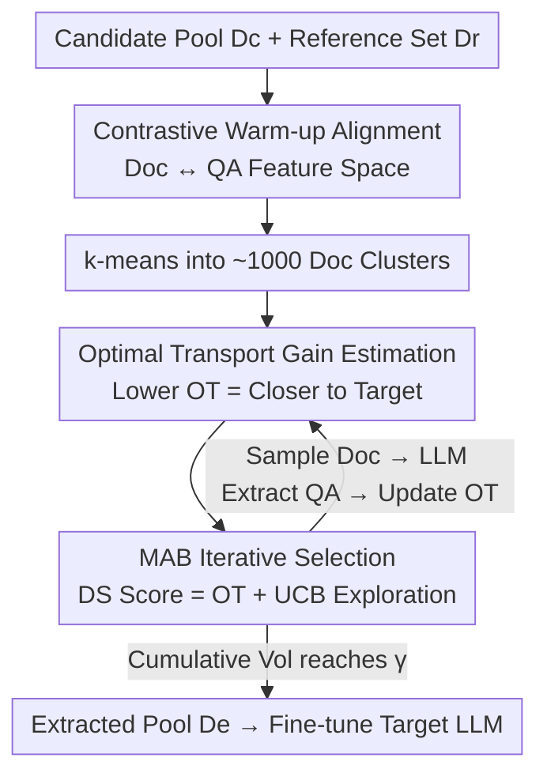

# Not All Documents Are What You Need for Extracting Instruction Tuning Data

**Conference**: ICLR 2026  
**Code**: https://anonymous.4open.science/r/EQUAL-DD20  
**Area**: LLM Pre-training / Instruction Tuning Data / Data Selection  
**Keywords**: Instruction Tuning, Data Extraction, Multi-armed Bandit, Optimal Transport, Contrastive Learning

## TL;DR
Addressing the issue that "extracting instruction tuning QA data from web corpora is expensive and noisy," this paper proposes EQUAL. It aligns document and QA feature spaces using contrastive learning before clustering, treats each document cluster as an arm of a Multi-Armed Bandit (MAB), and utilizes Optimal Transport (OT) scores to measure how closely a cluster's projected QA distribution matches the target distribution. Through iterative "cluster selection—extraction—update," it reduces extraction costs by 5–10 times while increasing downstream accuracy by approximately 2.5%.

## Background & Motivation
**Background**: Instruction Fine-Tuning (SFT) significantly unlocks the reasoning capabilities of large models but relies heavily on high-quality training data. While weights of open-source models are public, their SFT datasets are usually proprietary. A common supplementation method is "LLM synthesis"—given a set of seed QAs or knowledge bases, a strong model expands them into new samples.

**Limitations of Prior Work**: Synthetic data inherently tends to mimic seed samples; when seeds lack diversity, the synthetic data inherits this flaw, leading to a decline in overall quality and deviation from real-world application distributions. A more knowledge-dense alternative is web corpora (e.g., Common Crawl). Existing work (Mammoth/Yue et al.) retrieves domain documents and uses high-performance LLMs to extract all possible QA pairs for fine-tuning. However, this faces two major issues: (1) **Cost explosion**—iteratively calling LLMs for every document is prohibitively expensive; (2) **Not all QAs are useful**—large corpora contain significant noise and heterogeneous data; feeding all extracted QAs into SFT may degrade performance.

**Key Challenge**: Two intuitive solutions both fail to balance trade-offs. Solution ①, "extract all QAs first, then filter," yields good results but the extraction process itself is expensive. Solution ②, "select good documents first, then extract only from them," saves money, but **Document Quality $\neq$ Extracted QA Quality**. The feature distributions of documents and QAs differ; a document embedding being close to a QA embedding does not guarantee that the document will yield a high-quality QA matching the target. Thus, looking only at the document cannot accurately predict the quality of the "extracted QA."

**Goal**: Without extracting all QAs, accurately identify the subset of documents capable of producing high-quality QAs that match the downstream target distribution, reducing extraction volume to a small fraction (e.g., 5%) without performance loss.

**Key Insight / Core Idea**: Interleave document selection and QA extraction iteratively. Every time a batch of QAs is extracted, the relationship between "document cluster → QA distribution" is characterized more precisely, which in turn makes document selection increasingly accurate. The two processes complement each other, avoiding the inaccuracies of "static document scoring."

## Method

### Overall Architecture
EQUAL aims to select a subset of QAs from a massive candidate document pool $D_c$ that can fine-tune a superior model while minimizing LLM extraction calls. The workflow is: First, a **contrastive learning warm-up** fine-tunes the document embedding model so that documents producing similar QAs are grouped together in the feature space; then k-means clusters $D_c$ into approximately 1,000 clusters. Subsequently, **each cluster is treated as an arm of a Multi-Armed Bandit (MAB)**, iteratively performing: "select the most promising cluster → sample a few documents → extract QAs using LLM → update cluster reward estimation using Optimal Transport (OT)." This continues until the cumulative extraction volume reaches a set ratio $\gamma$, after which the pool of extracted QAs $D_e$ is used to fine-tune the target LLM.

The key to this process is that cluster quality is not measured by document cleanliness but by the "proximity of its extracted QA distribution to the reference set $D_r$ (the OT score)," which becomes more accurate as more QAs are iteratively extracted.

### Key Designs

**1. Contrastive Learning Warm-up: Aligning Doc Feature Space to Produced QAs**

This directly addresses the pain point that "docs alone cannot predict QAs." Raw documents contain significant irrelevant content (boilerplate, tags, noise), so "document similarity" $\neq$ "extracted QA similarity." Clustering with raw document embeddings would lead to chaotic QA distributions within clusters. However, extracting all QAs for clustering is too expensive. Ours randomly **samples 5% of documents**, extracts their QAs via LLM, and uses them as supervision to fine-tune the document embedding model (`BAAI/bge-en-v1.5`). Documents $d$ and their extracted QA pairs $q^+$ are treated as positive pairs, while other QAs in the batch are used as negative samples $q^-$, optimized via contrastive loss:

$$\mathcal{L} = -\log \frac{e^{\mathrm{sim}(d,q^+)}}{e^{\mathrm{sim}(d,q^+)} + \sum e^{\mathrm{sim}(d,q^-)}}$$

where $\mathrm{sim}$ is cosine similarity. After fine-tuning, documents that "will produce similar QAs" are pulled closer in the embedding space. Consequently, subsequent k-means clustering ensures similar QAs within clusters, allowing for efficient quality estimation at the cluster grain—the prerequisite for saving costs in later steps.

**2. Optimal Transport for Cluster Gain: Distribution Matching Over Point-wise Scoring**

This defines how to measure if a cluster is worth extracting. Existing heuristics (influence, perplexity, etc.) assign a "contribution score" to single data points and sum them for the cluster gain, implicitly assuming "samples contribute independently"—an assumption proven false even in simple linear regression. Ours models **target data selection** as **distribution matching**: using Optimal Transport (OT) to measure the distance between the extracted QA distribution $\mu$ from a cluster and the reference set distribution $\nu$ $D_r$:

$$OT(\mu,\nu) \;\overset{\text{def}}{=}\; \inf_{\pi\in\Pi(\mu,\nu)} \mathbb{E}_{(e_\mu,e_\nu)\sim\pi}\big[c(e_\mu,e_\nu)\big]$$

where $e_\mu, e_\nu$ are embeddings of QA pairs, $\Pi(\mu,\nu)$ is the set of all joint distributions with marginals $\mu,\nu$, and the transport cost is $c(e_\mu,e_\nu)=1-\frac{e_\mu^{\top}e_\nu}{\|e_\mu\|\|e_\nu\|}$. A lower OT score indicates the cluster's QAs are more valuable. Replacing "point-wise scoring" with "distribution alignment" avoids known biases in metrics like influence (e.g., preference for short sequences).

**3. MAB Iterative Selection: Balancing Exploitation and Exploration**

Accurate OT calculation requires extracting all QAs in a cluster, which is still expensive. Furthermore, selecting only the currently best OT cluster leads to local optima and lost diversity. Ours wraps the process in an MAB framework: each cluster is an arm, and "pulling an arm" involves sampling some documents, extracting QAs, and updating the OT estimate $\hat{OT}_i$. Clusters are selected using the Document Sampling (DS) score provided by UCB:

$$DS_j = \hat{OT}_j + \alpha \sqrt{\frac{2\ln \sum_{C_k\in\mathcal{C}} T(C_k)}{T(C_j)}}$$

where $T(C_j)$ is the number of times cluster $C_j$ has been sampled. The first term is exploitation (quality), and the second is exploration—favoring less-sampled clusters. The weight $\alpha=\frac{1}{\sum_k T(C_k)+1}$ decays with iterations, favoring exploration early on. Each round selects the cluster with the highest DS, samples documents $B_i$, extracts QAs $Q_i$ via Qwen2.5-72B, updates $\hat{OT}_i = OT(\cup Q_i, D_r)$, and $T(C_i){+}{=}1$.

### Loss & Training
- Warm-up Phase: Randomly sample 5% docs to extract QAs; fine-tune `bge-en-v1.5` using contrastive loss.
- Extraction Phase: QAs extracted via Qwen2.5-72B with an additional refinement round (formatting, missing answers, error correction); prompt details are in the appendix. Ours optimizes "which documents to extract," and single-sample quality improvement is orthogonal.
- Fine-tuning Phase: SFT on $D_e$ using FULL and LoRA settings, batch size 512, peak LR $1\times10^{-5}$, cosine decay (FULL: 2 epochs / 32×H100, LoRA: 4 epochs / 16×H100).

## Key Experimental Results

Datasets: AutoMathText (Math, 1.4M docs), KnowledgePile (General), StackOverflow (Self-crawled, 1.2M docs, Code); reference set $D_r$ uses GSM8K / MBPP training sets. Downstream 13 tasks, primarily reporting GSM8K, MATH (Math) and HumanEval, MBPP (Code). FLOPs count the total cost across "Extraction + Selection + Training." Results are averaged over 3 runs.

### Main Results
With a fixed 5% extraction ratio (approx. 70k for AutoMathText, 60k for StackOverflow), LLaMA-3-8B / FULL setting:

| Domain/Task | Base | Random | Influence | LLM-scoring | Influence-MAB | EQUAL |
|--------|------|--------|-----------|-------------|---------------|-------|
| GSM8K | 55.19 | 68.92 | 65.20 | 68.38 | 67.78 | **73.01** |
| MATH | 23.04 | 32.46 | 29.64 | 33.19 | 32.86 | **35.10** |
| HumanEval | 31.1 | 42.7 | 39.6 | 46.9 | 46.3 | **49.4** |
| MBPP | 51.9 | 52.3 | 53.7 | 53.7 | 53.5 | **56.3** |

EQUAL outperforms all baselines across all models and tasks: compared to Influence, GSM8K +4.09%, MATH +2.64%, while saving ~5× computation. Similar advantages are observed for Mistral-7B. Note that methods like Influence/Perplexity/Avg-sim have very high FLOPs (100+) because they extract all QAs first, whereas EQUAL remains in the 13–20 range.

### Different Extraction Ratios (vs. Random / All, LLaMA-3-8B / FULL)

| Method | GSM8K | MATH | HumanEval | MBPP | FLOPs(Math) |
|------|-------|------|-----------|------|------|
| Random 5% | 67.40 | 32.46 | 42.7 | 52.3 | 8.83 |
| Random 20% | 70.05 | 36.18 | 44.1 | 55.0 | 34.61 |
| All(Mammoth) 100% | 70.28 | 40.02 | 45.6 | 56.0 | 164.9 |
| EQUAL 5% | 73.01 | 35.10 | 49.4 | 56.3 | 18.55 |
| EQUAL 20% | 74.40 | 41.40 | 49.6 | 56.4 | 43.67 |

EQUAL at 5% exceeds training on 100% data (All) in most tasks; the difficult MATH task only requires 20% to match All—confirming "not all documents contribute to the target task."

### Ablation Study (Table 3, LLaMA-3-8B)

| Configuration | GSM8K(LoRA) | MATH(LoRA) | GSM8K(Full) | MATH(Full) |
|------|------|------|------|------|
| no-warmup | 64.05 | 30.82 | 69.73 | 33.51 |
| no-MAB | 66.13 | 30.55 | 71.90 | 33.25 |
| no-DS | 65.59 | 31.08 | 70.77 | 33.40 |
| **EQUAL** | **67.32** | **31.86** | **73.01** | **35.10** |

### Key Findings
- Removing any of the three components (Warm-up, MAB, DS exploration) leads to performance drops, with **no-warmup causing the largest decline**. This indicates that aligning the doc/QA space is the foundation of quality; t-SNE visualizations confirm that warm-up significantly tightens QA embeddings within clusters.
- Point-wise scoring (Influence-MAB / Perplexity-MAB) shows that MAB frameworks allow these methods to approach their original performance at much lower FLOPs, confirming MAB's efficiency in cluster-based extraction.
- Rewriting (synthesis based on $D_r$) performs worst due to low diversity, highlighting the ceiling of synthetic data mimicking seeds compared to the rich knowledge found in corpora.

## Highlights & Insights
- **Upgrading Data Selection from Point-wise Scoring to Distribution Matching (OT)**: Avoids the flawed assumption of sample independence. OT measures the distance between a whole cluster and the target distribution, making it more robust to noise and sequence length biases.
- **MAB Converts Expensive Accurate Assessment into Cheap Iterative Estimation**: It does not require extracting a whole cluster to gauge its value; instead, it updates OT estimates as it samples, trading sequential sampling for total computation.
- **Contrastive Warm-up Resolves Proxy Feature Mismatch**: When document embeddings are used to predict QA quality, contrastive alignment using a small pair set is a lightweight and universal bridging trick.

## Limitations & Future Work
- Ours only optimizes "which docs to extract"; **single QA extraction quality is considered orthogonal** and depends on strong models like Qwen2.5-72B. Hallucinations or misalignments within extraction are out of scope.
- OT scores, clustering, and warm-up rely on embedding quality; Ours is **sensitive to the embedding model**. Since warm-up uses only 5% of docs, bias in that subset could affect alignment.
- Hyperparameters like cluster count (~1000), ratio $\gamma$, and $\alpha$ scheduling impact results; $D_r$ is taken directly from downstream training sets, which may not be readily available in the wild.
- Evaluation is concentrated in Math/General/Code; effectiveness in open-ended or multilingual instruction tasks remains to be verified.

## Related Work & Insights
- **vs. Synthetic Data (Rewriting / WizardLM)**: These are limited by seed diversity and suffer from hallucinations; EQUAL extracts from real corpora with richer knowledge.
- **vs. Mammoth (Retrieve then Extract All)**: Mammoth extracts all QAs from domain docs, which is costly and noisy; EQUAL outperforms it using 5–20% of the data by focusing on "selection."
- **vs. Point-wise Filtering (Influence / Perplexity / LLM-scoring)**: These are either too expensive (extract first) or biased (independence assumption); EQUAL uses OT for distribution-level assessment + MAB for efficiency.

## Rating
- Novelty: ⭐⭐⭐⭐⭐ The combination of interleaved selection/extraction, OT matching, and MAB is elegant and well-executed.
- Experimental Thoroughness: ⭐⭐⭐⭐ Extensive tasks (13), three models, two training settings; however, domains remain focused on Math/Code.
- Writing Quality: ⭐⭐⭐⭐ Motivations and limitations are clearly explained; formulas for OT/MAB are complete.
- Value: ⭐⭐⭐⭐⭐ 5–10× cost reduction with performance gains is a highly practical engineering paradigm for SFT data construction.

<!-- RELATED:START -->

## Related Papers

- [\[ICLR 2026\] Train on Validation (ToV): Fast Data Selection with Applications to Fine-Tuning](train_on_validation_tov_fast_data_selection_with_applications_to_fine-tuning.md)
- [\[ACL 2025\] SCAR: Data Selection via Style Consistency-Aware Response Ranking for Efficient Instruction-Tuning](../../ACL2025/llm_pretraining/scar_style_consistency_data_selection.md)
- [\[ICLR 2026\] Token-level Data Selection for Safe LLM Fine-tuning](token-level_data_selection_for_safe_llm_fine-tuning.md)
- [\[ICLR 2026\] What Scales in Cross-Entropy Scaling Law?](what_scales_in_cross-entropy_scaling_law.md)
- [\[ICLR 2026\] Programming by Backprop: An Instruction is Worth 100 Examples when Finetuning LLMs](programming_by_backprop_an_instruction_is_worth_100_examples_when_finetuning_llm.md)

<!-- RELATED:END -->
