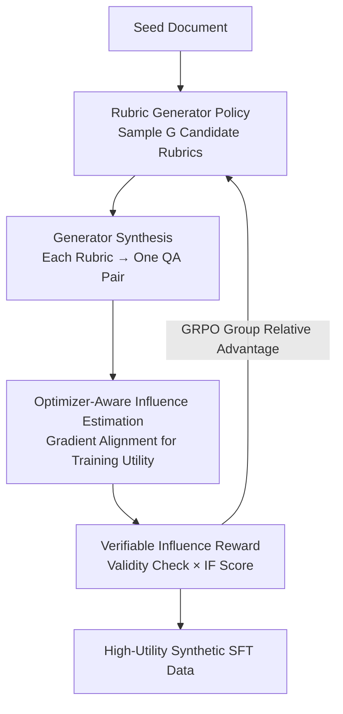

# OptimSyn: Influence-Guided Rubrics Optimization for Synthetic Data Generation

**Conference**: ICLR 2026  
**OpenReview**: [https://openreview.net/forum?id=vFcm5sOitq](https://openreview.net/forum?id=vFcm5sOitq)  
**Code**: None  
**Area**: LLM Pre-training / Synthetic Data / Reinforcement Learning  
**Keywords**: Synthetic Data, Influence Function, Rubric Optimization, GRPO, SFT

## TL;DR
OptimSyn transforms the manual task of "writing rubrics for synthetic data" into a learnable policy. It utilizes gradient-based influence scores to measure the actual contribution of each synthetic QA pair to target model training. These scores serve as rewards to train a rubric generator via GRPO, consistently achieving higher downstream accuracy in knowledge-intensive fields like humanities, social sciences (HSS), and medicine compared to mainstream open-source SFT corpora.

## Background & Motivation
**Background**: The strong downstream performance of LLMs largely stems from massive SFT data. However, in knowledge-intensive vertical domains such as HSS, medicine, law, and finance, high-quality real-world SFT data is extremely scarce due to expensive expert annotation, strict privacy constraints, and difficulty in ensuring label consistency. Consequently, the industry has turned to synthetic data: a typical approach involves feeding domain documents into a teacher model to generate QA pairs, followed by filtering and guiding using human-designed rubrics (rules or prompts).

**Limitations of Prior Work**: This paradigm suffers from two fundamental issues. First is **poor transferability**—rubrics are highly expert-dependent and strongly tied to specific domains; rules effective in one domain often fail in another. Second is **fragile heuristic optimization**—the prevailing workflow is a cycle of "manual rubric → synthetic data → model training → result observation → intuitive adjustment." This process relies entirely on experience and lacks reliable quantitative feedback; humans cannot reliably attribute changes in downstream performance to specific rubric choices, making the process slow, brittle, and uncertain.

**Key Challenge**: When evaluating whether a synthetic sample is "good," it is common to check its resemblance to real data in the embedding space. However, the authors identify a critical gap: synthetic and real samples may be close in embedding space while having vastly different actual impacts on learning. In other words, "appearing high-quality" does not equate to "being useful for training."

**Goal**: To directly measure synthetic data quality using its **training utility** on specific tasks for the target model and use this signal to guide data generation. Simultaneously, to transform rubric design from manual expert labor into a learnable and transferable optimization problem.

**Key Insight**: The authors draw inspiration from classic influence functions, which use first-order gradient information to approximate training dynamics and estimate the contribution of a single training sample to performance on a held-out set. Since modern LLMs are trained using Adam, the authors employ an Adam-compatible influence estimator to align the signal with the actual optimization process. Preliminary experiments (Fig. 1) demonstrate that synthetic samples closer to the validation set in gradient space yield better downstream performance, a pattern not observed in embedding space. Furthermore, data-set-level influence aggregation correlates strongly with held-out accuracy, validating influence as a reliable proxy for synthetic data quality.

**Core Idea**: Use "gradient influence scores" instead of "human rubric intuition" as the reward to close the "synthesis-training" feedback loop. This facilitates training a generator via RL that can automatically produce rubrics tailored to the target model and task.

## Method

### Overall Architecture
Given a batch of seed documents $S=\{S_i\}_{i=1}^N$, the goal is to construct synthetic QA pairs $\{(Q_i, A_i)\}$ for SFT. The core of OptimSyn is delegating the "rubric writing" step to a dedicated **rubric generator (prompter/policy model)**. For each seed document $S_i$ and a specified target model, the prompter generates a customized rubric $B_i$. A teacher model (generator) synthesizes a $(Q_i, A_i)$ pair conditioned on $(B_i, S_i)$, and the target model calculates a scalar reward for this pair, measuring its actual training utility. This reward is dominated by the "gradient influence score," and the prompter is updated toward "maximizing downstream improvement" using GRPO.

The entire pipeline is an RL loop: seed documents enter, the prompter samples $G$ candidate rubrics (rollout group), each rubric is transformed into a synthetic QA pair by the generator, the target model calculates influence rewards for each pair, and these are normalized into advantages within the group to update the prompter iteratively.

### Key Designs

**1. Optimizer-Aware Influence Estimation: Quantifying "Training Utility" via Gradients**

This design addresses the pain point of data that "looks similar but is hard to train on." Classic influence functions measure how a single training point affects model parameters and predictions. TracIn uses a first-order, trajectory-based scalable estimator to approximate influence by accumulating gradient inner products at training checkpoints. This is feasible at LLM scale as it only requires per-sample gradients, learning rates, and saved checkpoints. Since modern LLMs use Adam, the authors adopt an Adam-compatible variant: given a training sample $z$, its influence on an evaluation sample $z'$ is:

$$\mathrm{Inf}_{\text{Adam}}(z, z') = \sum_{i=1}^{T} \bar{\eta}_i \cos\big(\nabla_\theta \ell(z'; \theta_i),\ \Gamma(z, \theta_i)\big),$$

where $\bar{\eta}_i$ is the average learning rate at epoch $i$, $\theta_i$ is the checkpoint after that epoch, and $\Gamma$ introduces Adam's moment statistics $(m, v)$ depending on historical gradients. The authors denote this score for a synthetic pair $(Q, A)$ relative to the validation set as $\mathrm{IF}(Q, A)$. Gradients are used instead of embeddings because experiments show that synthetic sets with gradient distributions closer to the validation set perform better downstream, whereas embedding proximity often fails to predict gains—semantically aligned samples might push optimization toward suboptimal directions.

**2. Rubric Generator as a Learnable Policy: Replacing Expert Intuition with Model Feedback**

This design targets the "domain-specific and non-transferable" nature of rubrics. Traditional approaches require hand-crafting rubrics for every domain; OptimSyn provides the prompter with only a "minimal guiding text" and delegates specific rubric production entirely to a rubric-specific model, conditioned on the seed document and target model. Formally, given a seed $S$, policy $\pi_\theta$ produces rubric $B \sim \pi_\theta(\cdot \mid S)$. The teacher synthesizes $(Q, A)$ given $(S, B)$. A trajectory is $\tau = \{S, B, (Q, A)\}$, and the objective is to maximize $\mathbb{E}_{\tau \sim \pi_\theta}[R(\tau)]$. Because rubrics are learned based on the target model and task, they naturally transfer across domains/models, eliminating the need for custom rules.

**3. Verifiable Influence Reward + GRPO Optimization: Evolving Rubrics Toward Actual Downstream Gains**

The final component links the previous designs via a reward signal. OptimSyn combines lightweight validity checks with the influence score as the reward: let $\mathrm{Valid}(Q, A) \in \{0, 1\}$ be the conjunction of lightweight checkers (format, non-triviality, safety). The reward is:

$$R(\tau) = \mathrm{Valid}(Q, A) \cdot \mathrm{IF}(Q, A) - \lambda\,(1 - \mathrm{Valid}(Q, A)),$$

where $\lambda > 0$ penalizes invalid generation. This provides a verifiable signal aligned with downstream improvement while suppressing degenerate outputs. Optimization uses a GRPO/PPO-style clipping strategy with group-relative baselines to reduce variance: for each seed $S$, $G$ rubrics are sampled to obtain trajectories $\{\tau_i\}_{i=1}^G$. Advantages are normalized within the group:

$$\hat{A}_{i,t} = \frac{R(\tau_i) - \frac{1}{G}\sum_{j=1}^{G} R(\tau_j)}{\sqrt{\frac{1}{G}\sum_{j=1}^{G}\big(R(\tau_j) - \frac{1}{G}\sum_{k} R(\tau_k)\big)^2 + \delta}},$$

The objective function $J(\theta)$ utilizes an importance ratio $r_{i,t}(\theta)$ with clipping and a KL trust region $\beta$ relative to a reference policy $\pi_{\text{ref}}$, along with entropy regularization to encourage exploration.

### Loss & Training
Before influence estimation, 10% of the synthetic data from the initial prompter+generator is used for a warmup of the target model. The resulting model provides reference gradients for calculating influence scores, followed by the RL phase. GRPO is used for RL: batch size 256, learning rate $1\times10^{-6}$, rollout temperature 1.5, rollout size $n=5$, for 1 epoch, with $\lambda=0.1$. Processing approximately 20K samples took about 10 hours using 8×H200 GPUs.

## Key Experimental Results

### Main Results
Testing across two domains and 12 benchmarks. Target model: Qwen3-8B-Base; Teacher: Qwen3-235B-Instruct; Prompter: Qwen3-8B-Instruct. Partial results for HSS and Medical (accuracy, higher is better):

| Area | Benchmark | Qwen3-8B-Base | Qwen3-8B-Instruct | Prev. SOTA SFT | OptimSyn(Ours) |
|------|-----------|---------------|-------------------|----------------|----------------|
| HSS | MMLU-pro | 22.83 | 49.87 | 52.76 (Wildchat) | **56.96** |
| HSS | SuperGPQA | 20.77 | 23.44 | 24.60 (Openhermes) | **26.07** |
| HSS | HLE | 5.70 | 4.66 | 8.29 (MAGACorpus) | 7.85 |
| Med | SuperGPQA | 28.06 | 37.16 | 35.28 (Medical-R1) | **38.28** |
| Med | PubMed | 65.90 | 65.70 | 85.40 (ChatDoctor) | 80.70 |
| Med | MedQA | 51.45 | 57.09 | 58.75 (Medical-o1) | 58.75 |

Key Conclusion: OptimSyn consistently elevates the same 8B base model above mainstream open-source SFT corpora, matching or exceeding Qwen3-8B-Instruct across multiple metrics. A relative gain of +27.2% on HLE (0.0785 vs 0.0570) suggests that structured, group-aware data synthesis can distill reasoning capabilities without relying on test-time compute.

### Data Characteristics Comparison (Medical)

| Dataset | Samples | Avg. Tokens | MTLD | HDD |
|---------|---------|-------------|------|-----|
| WildChat | 529,428 | 289.59 | 52.70 | 0.9188 |
| Condor | 20,000 | 428.79 | 101.48 | 0.8650 |
| SynthQuestions | 2,500 | 634.60 | 137.02 | 0.8584 |
| OptimSyn(Ours) | 25,875 | 196.49 | 133.82 | **0.9241** |

OptimSyn achieves the highest HDD (lexical diversity) and high MTLD despite shorter token lengths, indicating that it produces concise and diverse data.

### Key Findings
- **Gradient vs Embedding**: Influence scores (gradient space) correlate strongly with downstream accuracy, whereas embedding proximity fails to predict gains.
- **IF as a Reliable Proxy**: Randomly sampling 2K/4K subsets from the synthetic pool for SFT shows that high-IF subsets consistently yield higher test accuracy ($R^2=0.57$ for 2K; $0.54$ for 4K).
- **Robustness across models**: Gains persist when swapping across Qwen3-{4B, 8B, 14B} and Llama3-8B; the transfer from Qwen3 to Llama3 suggests the method does not rely solely on specific model capacity.
- **Robustness to generator**: When using GPT-4o or Gemini-1.5-Pro as generators, gains remain, and the influence distribution is consistently pushed to higher means.
- **Rollout Group Size $G$**: Larger $G \in \{5, 10, 15\}$ leads to higher rewards, lower variance, and improved downstream accuracy, indicating that broader rubric exploration stabilizes IF-driven optimization.

## Highlights & Insights
- **Redefining "Data Quality" as "Training Utility"**: Instead of asking "Does this look like real data?", the approach asks "Does it contribute positively to the target model's gradients for this task?".
- **Influence as Reward, Rubrics as Policy**: Integrating a static offline evaluation signal (influence) into an RL loop as a reward aligns "what data to generate" with the "measured impact on the model."
- **Minimal Guiding Text + Delegated Generation**: Providing minimal human guidance and delegating domain details to conditional generation solves the engineering bottleneck of non-transferable rubrics.

## Limitations & Future Work
- **Indirect Credit Assignment**: The prompter is optimized via RL, but the reward is calculated only after an independent generator synthesizes the QA pair. Gradients cannot flow back through the generation step. This indirect path introduces noise from both the generator and influence estimation, leading to high variance in GRPO.
- **Cost of Influence Estimation**: Adam-compatible influence depends on per-sample gradients and checkpoints, incurring significant computational overhead.
- **Domain Coverage**: Only HSS and Medical were validated; high-risk domains like law and finance remain untested.
- **Future Directions**: Making the reward differentiable relative to the generation step to reduce variance, and exploring more efficient exploration mechanisms beyond increasing $G$.

## Related Work & Insights
- **vs WebR / MAmmoTH2 / Bonito**: These convert corpora into SFT dialogue data using pipelines or meta-templates but remain fixed heuristics. OptimSyn optimizes directly for downstream improvement using training-aligned objectives.
- **vs Condor / Evol-Instruct**: These iteratively improve synthetic data (e.g., via complexity evolution or reflection), but the criteria are still human-defined. OptimSyn learns rubrics from model feedback.
- **vs Montessori-Instruct**: This uses DPO to bias a teacher toward "helpful samples." OptimSyn highlights the mismatch between embedding similarity and training impact, optimizing the rubric as an upstream learnable component.

## Rating
- Novelty: ⭐⭐⭐⭐⭐ Using gradient influence as an RL reward for learning rubrics is a solid, counter-intuitive insight.
- Experimental Thoroughness: ⭐⭐⭐⭐ Extensive ablation across model families/scales, though limited to two domains.
- Writing Quality: ⭐⭐⭐⭐ Clear chain of motivation-insight-method; formulas and algorithms are complete.
- Value: ⭐⭐⭐⭐⭐ Highly valuable for providing a portable, model-aligned SFT data synthesis paradigm for data-scarce domains.

<!-- RELATED:START -->

## Related Papers

- [\[ICLR 2026\] Synthetic Bootstrapped Pretraining](synthetic_bootstrapped_pretraining.md)
- [\[ACL 2025\] Model Performance-Guided Evaluation Data Selection for Effective Prompt Optimization](../../ACL2025/llm_pretraining/model_performance-guided_evaluation_data_selection_for_effective_prompt_optimiza.md)
- [\[ICLR 2026\] SemHiTok: A Unified Image Tokenizer via Semantic-Guided Hierarchical Codebook](semhitok_a_unified_image_tokenizer_via_semantic-guided_hierarchical_codebook_for.md)
- [\[ICLR 2026\] Autoregressive Models Rival Diffusion Models at Any-Order Generation](autoregressive_models_rival_diffusion_models_at_any-order_generation.md)
- [\[ICLR 2026\] Reformulation for Pretraining Data Augmentation](reformulation_for_pretraining_data_augmentation.md)

<!-- RELATED:END -->
