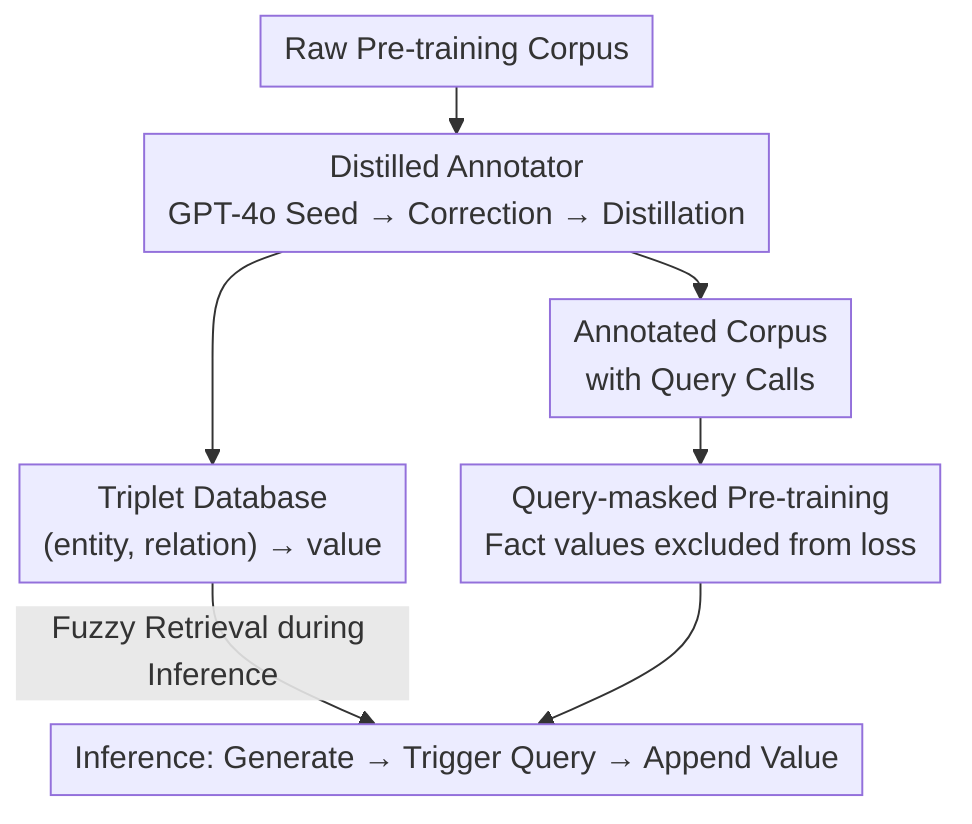

# Pre-training Limited Memory Language Models with Internal and External Knowledge

**Conference**: ICLR 2026  
**OpenReview**: [https://openreview.net/forum?id=cvztBvlglK](https://openreview.net/forum?id=cvztBvlglK)  
**Code**: https://github.com/kilian-group/LMLM  
**Area**: LLM Pre-training / External Knowledge Bases / Parameter Efficiency / Machine Unlearning  
**Keywords**: Knowledge externalization, Pre-training, Query masking, Machine unlearning, Parameter efficiency

## TL;DR
LMLM (Limited Memory Language Model) inserts entity-level factual query calls into the corpus during the **pre-training phase** and masks the retrieved factual values from the loss. This forces the model to learn "when to query" rather than memorizing by rote. Consequently, a small 382M model approaches LLaMA2-7B in factual accuracy and allows for one-click unlearning by modifying the database.

## Background & Motivation

**Background**: Neural language models are black boxes—linguistic patterns and factual knowledge are compressed into tens of billions of uninterpretable parameters. For a model to "know" a fact, it typically needs to see it hundreds of times during pre-training (studies by Allen-Zhu & Li indicate that knowledge observed fewer than several hundred times is rarely mastered).

**Limitations of Prior Work**: Knowledge and linguistic capabilities are **entangled** within the weights, leading to a dilemma. On the training side, long-tail facts require repetitive exposure to be memorized, wasting capacity; on the inference side, deleting outdated or non-compliant knowledge is extremely difficult—methods like gradient unlearning and preference optimization (GA, GD, NPO, SimNPO) either result in incomplete unlearning, collateral damage to unrelated knowledge, or degradation of overall model performance. An ideal restaurant customer service agent should not be able to answer questions about history, prescription drugs, or real estate law, yet current pre-training cannot achieve this "knowledge control."

**Key Challenge**: Hard-coding facts into parameters essentially makes "knowledge" and "linguistic ability" share the same indivisible storage, making it nearly impossible to "change one without affecting the other."

**Goal**: Can factual memory and linguistic understanding be decoupled within language models? Sub-problems include: how to automatically extract externalizable facts from the corpus, how to train the model to avoid memorizing these facts, and how to enable active querying during inference.

**Key Insight**: Contrary to the mainstream paradigm like RAG, which "adds knowledge during inference/post-training," the authors take the opposite approach—**minimizing the amount of knowledge stored in parameters during pre-training**. The observation is that entity-level atomic facts (entity, relation → value triplets) are best suited for externalization; they are easy to extract and verify, and they are precisely the long-tail content most difficult to fit into parameters.

**Core Idea**: Rewrite facts as explicit query calls inserted into the pre-training corpus and mask the "retrieved factual values" in the next-token loss, thereby teaching the model to **generate queries rather than memorize facts**.

## Method

### Overall Architecture

LMLM is a comprehensive solution spanning "data preparation → pre-training → inference." First, a lightweight ANNOTATOR extracts entity-level facts from the raw corpus into triplets to build an external database, while rewriting these facts in the text as explicit lookup calls. Pre-training follows standard next-token prediction, but the **sole key modification** is excluding tokens corresponding to factual return values from the loss. This forces the model to learn only "when to initiate a query" and not "what the fact itself is." During inference, the model generates text autoregressively; upon encountering a special token, it triggers a database lookup, appends the return value, and continues generation.

Specifically, each fact is encoded in the corpus as `<|db start|> entity <|sep|> relation <|db retrieve|> value <|db end|>`, where `value` (and the trailing `<|db end|>`) are masked during training.

### Key Designs

**1. Distilled Annotator: Scaling fact extraction for pre-training**

Manual triplet extraction at pre-training scale is impractical. The authors built a "seed annotation → filtering → distillation" pipeline (Figure 3). First, GPT-4o annotates a seed set of $M=1000$ knowledge-dense documents. Second, a CORRECTOR (LLaMA-3.1-8B-Instruct) performs quality filtering, **deliberately underfitting** it to assign high loss to queries that are "incorrectly formatted, unsupported by context, or overly specific," removing the worst 10%. Third, an ANNOTATOR (also LLaMA-3.1-8B-Instruct) is fine-tuned on the cleaned data to annotate the entire corpus. This produces 54.6M triplets and a lookup-augmented corpus.

**2. Query-masked Next-token Pre-training: Evicting facts via loss masking**

This is the core of the method. The training target remains standard next-token prediction, but each token is assigned a mask $m_t$:

$$L(\theta) = -\sum_{t=1}^{T} m_t \log p_\theta(x_t \mid x_{<t}), \quad m_t = \begin{cases} 0, & x_t \in \{\text{retrieval value},\ \texttt{<|db end|>}\} \\ 1, & \text{otherwise} \end{cases}$$

Excluding factual tokens from the loss means the model receives **no gradient signal to memorize the factual content**, yet it must still learn to generate the "initiate query" token and infer query parameters (entity, relation) from context. Modeling is thus split: the model learns "when and what to query," while factual content is explicitly stored externally. Intuitively, when the model can rely on external facts, it no longer needs to consume capacity to fit long-tail distributions, freeing capacity for reasoning and linguistic ability—explaining why LMLM converges faster and achieves lower validation perplexity.

**3. Fuzzy Matching + Database as Knowledge: Scaling unlearning to database deletion**

During inference, LMLM generates autoregressively like Toolformer until a special token triggers a lookup. Retrieval uses cosine similarity from ALL-MINILM-L6-V2 embeddings for **fuzzy matching** (threshold 0.6). The primary benefit is modularity: to unlearn a fact, one simply **deletes the corresponding database entry** without additional training or Retain Sets. Furthermore, because LMLM always relies on queries, accessing out-of-scope knowledge triggers a **detectable query failure** rather than the silent hallucinations common in traditional RAG.

### Loss & Training

The core is the masked next-token loss (Eq. 1). Pre-training is conducted from scratch on the high-quality Wikipedia corpus (approx. 3B tokens) from the OLMo2 project, using GPT-2 and LLaMA2-style architectures with standard tokenizers plus 4 special tokens. All models are trained for 8 epochs with a context length of 1024 and mixed precision, completing within 8 H100-days.

## Key Experimental Results

### Main Results

Factual accuracy (FactScore biography / T-REx EM / PopQA Acc), with subscripts indicating absolute gain over the same-sized STANDARD baseline:

| Model | Type | FactScore↑ | T-REx EM↑ | PopQA Acc↑ |
|------|------|-----------|-----------|------------|
| LLaMA2-382M | STANDARD | 14.0 | 52.0 | 22.7 |
| LLaMA2-382M | **LMLM** | **31.9** (+17.9) | **58.1** (+6.1) | **50.8** (+28.1) |
| GPT2-355M | STANDARD | 14.4 | 44.9 | 21.4 |
| GPT2-355M | **LMLM** | 23.9 (+9.5) | 58.7 (+13.8) | 52.0 (+30.6) |
| Pythia-1B* | off-the-shelf | 21.1 | 47.8 | 19.5 |
| LLaMA2-7B* | off-the-shelf | 34.0 | 60.5 | 29.2 |

The 382M LMLM approaches 7B-scale models on FactScore and surpasses them on PopQA. Regarding perplexity, LMLM is lower than the STANDARD baseline across all sizes and variants, with an average reduction of **1.98** points in Dynamic settings—proving it learns to "query accurately + generate well."

### Ablation Study

| Configuration | FactScore↑ | T-REx EM↑ | Description |
|------|-----------|-----------|------|
| STANDARD | 14.0 | 52.0 | Purely parametric baseline |
| LMLM (w/o database) | 12.8 (−19.1) | 38.5 (−19.6) | Disabling DB, forcing parameter reliance |
| LMLM (Full) | 31.9 | 58.1 | Normal querying |

### Key Findings
- **Factual accuracy collapses without the database** (FactScore 31.9 → 12.8), and training loss for factual tokens remains high (Figure 7), proving facts are not internalized.
- **Unlearning is truly one-click**: Deleting database entries in the TOFU benchmark achieves ideal unlearning (p > 0.05) with zero loss in utility, whereas NPO-style training either fails to unlearn completely or damages the Retain Set.
- **Higher externalization ratios are better**: Using the loss difference between LMLM and STANDARD to rank facts, prioritized externalization of long-tail/difficult facts leads to continued perplexity reduction and FactScore improvement without harming NLT.

## Highlights & Insights
- **Inverting the Paradigm**: While others "add knowledge" during inference, LMLM "evicts knowledge" during pre-training. A simple loss mask decouples factual memory from linguistic ability.
- **"Unlearning = Delete Row"**: Machine unlearning is reduced from a difficult optimization problem to a database DELETE operation—verifiable, traceable, and weight-independent.
- **Detectable Query Failures**: Errors trigger specific failures rather than silent internal hallucinations, which is highly valuable for fact-sensitive deployments.

## Limitations & Future Work
- Authors acknowledge that zero-error generation is not guaranteed (DB noise + fuzzy match errors); however, errors are **traceable**.
- Query calls introduce additional tokens, increasing training/inference costs.
- Currently limited to **entity-level atomic facts**; externalizing abstract knowledge remains an open question.
- Experiments are limited to small models; scaling effects require further validation.

## Related Work & Insights
- **vs RAG**: RAG adds documents to prompts but facts remain encoded in parameters. LMLM prevents facts from entering parameters.
- **vs RETRO / REALM**: These use retrieval to enhance pre-training but do not support instant unlearning. LMLM **limits** pre-training memory to support verifiable unlearning.
- **vs NPO/Machine Unlearning**: Gradient-based methods suffer from parameter entanglement; LMLM avoids entanglement by moving knowledge out of the model entirely.

## Rating
- Novelty: ⭐⭐⭐⭐⭐ Innovating at the paradigm level by moving externalization to pre-training.
- Experimental Thoroughness: ⭐⭐⭐⭐ Validated via perplexity, accuracy, and unlearning, though dataset diversity is limited.
- Writing Quality: ⭐⭐⭐⭐⭐ Clear logic; figures intuitively explain the paradigm shift.
- Value: ⭐⭐⭐⭐⭐ Provides a path toward controllable, editable, and verifiable language models.

<!-- RELATED:START -->

## Related Papers

- [\[ACL 2026\] KoCo: Conditioning Language Model Pre-training on Knowledge Coordinates](../../ACL2026/llm_pretraining/koco_conditioning_language_model_pre-training_on_knowledge_coordinates.md)
- [\[ICLR 2026\] Pre-training LLM without Learning Rate Decay Enhances Supervised Fine-Tuning](pre-training_llm_without_learning_rate_decay_enhances_supervised_fine-tuning.md)
- [\[ICLR 2026\] Late-to-Early Training: Enabling LLMs to Learn Late-Stage Knowledge Earlier for Faster and Better Training](late-to-early_training_let_llms_learn_earlier_so_faster_and_better.md)
- [\[ICLR 2026\] Pre-training under Infinite Compute](pre-training_under_infinite_compute.md)
- [\[ICLR 2026\] Soft-Masked Diffusion Language Models](soft-masked_diffusion_language_models.md)

<!-- RELATED:END -->
