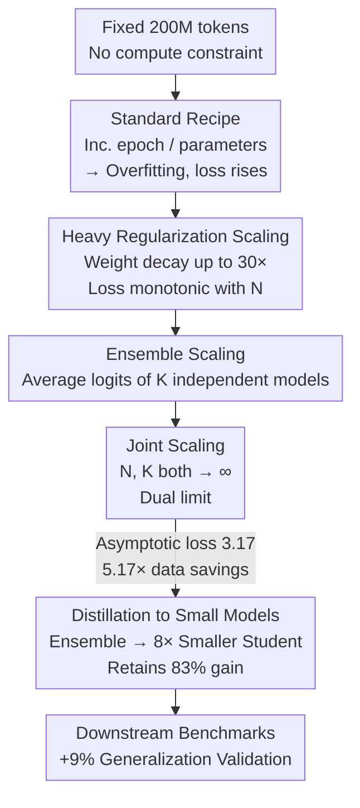

# Pre-training under Infinite Compute

**Conference**: ICLR 2026  
**OpenReview**: [https://openreview.net/forum?id=ck0aZTAnwK](https://openreview.net/forum?id=ck0aZTAnwK)  
**Code**: Open-sourced on GitHub + WandB (exact links not provided in the paper body, ⚠️ refer to the original text)  
**Area**: LLM Pre-training / Data Efficiency / Scaling Law  
**Keywords**: Data-constrained pre-training, regularization, ensemble, distillation, asymptotic Scaling Law

## TL;DR
When compute far exceeds available web data, the authors use "heavy regularization + model ensemble + joint parameter/ensemble scaling + distillation" to compress the pre-training loss of a fixed 200M token budget to an asymptotic value of 3.17. This achieves a 5.17× data efficiency gain over standard recipes, with 83% of the ensemble benefits retained even when distilled into an 8× smaller student model.

## Background & Motivation
**Background**: The current methodology for language model pre-training is built on the assumption of "compute-constrained, infinite data"—recipes like Chinchilla jointly scale data and model size (tokens being 20× parameters) under a fixed compute budget to achieve compute-optimality.

**Limitations of Prior Work**: Reality is reversing this assumption. Web text grows at only 1.03× annually, while pre-training compute grows at 4×. This implies a future regime of "extreme compute abundance, data as the sole bottleneck," yet existing scaling recipes fail to address how to train effectively when data is fixed and compute is unlimited.

**Key Challenge**: Under fixed data, following standard practices (increasing epochs or parameter size) quickly leads to **overfitting**, where the loss decreases then increases. This means even if one is willing to spend infinite compute for a better model, the standard recipe has a ceiling; spending more compute can lead to worse results. The root cause is that standard regularization strength (weight decay = 0.1, inherited from GPT-3) is insufficient for models that are severely over-parameterized relative to the data.

**Goal**: Given a fixed token budget $D$, and removing all other constraints including compute, find $L_D^* = \min_H L(A(D, H))$, the optimal achievable loss under data constraints, and identify the training recipe that approaches it.

**Key Insight**: The authors propose a fundamental shift in evaluation—instead of comparing two recipes at a fixed compute budget, one should **compare the asymptotic values of their scaling laws**. As long as a recipe's loss monotonically decreases with a variable and follows a power law, the limit as $N \to \infty$ is used to rank recipes based on "optimal achievable loss."

**Core Idea**: Re-introduce classic "data-constrained deep learning" techniques (heavy regularization, ensembles, distillation) to LLM pre-training and measure them with "asymptotic scaling laws." These simple algorithmic improvements significantly enhance data efficiency, allowing for data savings in a compute-abundant future.

## Method

### Overall Architecture
The objective is to minimize pre-training loss under fixed data and infinite compute. The approach first proves standard recipes fail due to overfitting, then incrementally layers four interventions: **Heavy regularization to restore scale monotonicity** → **Ensembles instead of solo model scaling** → **Joint parameter + ensemble scaling to reach dual limits** → **Distillation to compress large-ensemble gains back into smaller models**. Each layer is fitted with a power law to estimate its asymptotic loss, using "asymptotic value" and "equivalent data efficiency" as metrics, validated across larger token budgets and downstream tasks.

### Key Designs

**1. Heavy Regularization Restores Monotonic Scaling for Over-parameterized Models**

The pain point of standard recipes is that on 200M tokens, scaling a 300M model via epochs or increasing parameters causes the loss to rise due to overfitting (1.4B performs worse than 600M). The path of "spending compute for better models" is blocked. The authors identified that the default weight decay of 0.1 is too weak. Using a coordinate descent method inspired by Wen et al. (2025), they jointly tuned weight decay, learning rate, and epochs for each parameter size $N$. The optimal weight decay was **30×** larger than standard practice (up to 1.6/3.2 for the most over-parameterized models). After tuning, the loss strictly decreases with $N$ even at a parameter-to-token ratio 140× larger than Chinchilla's, fitting a power law with an asymptotic term:

$$\hat{L}_{D,N} := \frac{A_D}{N^{\alpha_D}} + E_D, \qquad \hat{L}_{200M,N} = \frac{0.05}{N^{1.02}} + 3.43$$

The parameter scaling exponent of 1.02 is much higher than Chinchilla's 0.34, indicating that once data is fully utilized, larger models bring faster improvements. This aligns with over-parameterized regression theory: even if double descent exists, optimal regularization ensures monotonic decrease. The optimal achievable loss is the asymptote $\lim_{N\to\infty}\hat{L}_{D,N} = E_D = 3.43$.

**2. Ensemble Scaling: Training Multiple Small Models Over One Large Model**

Since regularization only improves via $N\to\infty$, the authors asked if recipes with lower asymptotes exist. The ensemble approach involves training $K$ models of the same size, differing only in random seeds (data order/initialization), and **averaging their logits** during inference. Since forward FLOPs are proportional to parameters, a $K$-member ensemble's total parameters $NK$ are used for fair comparison with single models. Experiments show ensemble excess loss decreases with $K$ at a rate near $1/K$ (symmetrical to $1/N$ for single models). The asymptote for $N=300\text{M},\ K\to\infty$ is **3.34**, lower than the regularization asymptote of 3.43—even a $K=3$ ensemble outperforms the single-model limit. This works because of the "multi-view" theory (Allen-Zhu & Li, 2023): individual models may learn only subset features, while ensemble members learn diverse features.

**3. Joint Scaling Recipe: Dual Limits of Parameters and Ensembles**

Parameter scaling and ensemble scaling can be stacked by letting the number of members and the size of each member both tend to infinity:

$$\hat{L}_D = \lim_{N\to\infty}\lim_{K\to\infty}\min_H L(E_A(D, N, K, H))$$

If the inner $\min_H L$ decreases monotonically for both $N$ and $K$, the limit is independent of order. For tuning convenience, the authors used a heuristic: take the optimal regularization hyperparams, then double the epochs and halve the weight decay (allowing members to slightly overfit). On 200M tokens, the joint recipe's asymptotic loss is estimated at **3.17**, far superior to regularization's 3.43 and no-regularization's 3.75.

**4. Distillation Compresses Large Model Gains into Smaller Parameters**

Asymptotic gains rely on arbitrarily large sizes, which limits practicality. Distillation is used to maintain gains without increasing inference (or training) parameters. An "infinite compute" teacher $M'$ (e.g., an ensemble) is used to **unconditionally sample** (no prompt) synthetic tokens $D'$. The student is trained from scratch on a mixture of real $D$ and synthetic $D'$. **Ensemble Distillation**: Distilling an 8×300M ensemble (loss 3.32) into a single 300M student results in a loss of 3.36, retaining 83% of the gain at 1/8th the size. **Self-distillation**: When the teacher and student are the same size (both 300M), mixing real and synthetic data avoids model collapse, and the new student outperforms even the best regularized single model.

### Loss & Training
The baseline is standard autoregressive cross-entropy pre-training. The core strategy lies in three aspects: ① Using coordinate descent to jointly tune weight decay/lr/epochs for every $N$, with weight decay reaching 30× standard values; ② Ensembles differing only by seed and averaging logits; ③ Students training from scratch on a mixture of "Real $D$ + Teacher Unconditional Synthetic $D'$." The default environment uses DCLM web data and a 300M parameter base model.

## Key Experimental Results

### Main Results (Asymptotic Loss and Data Efficiency at 200M tokens)

| Recipe | Asymptotic Loss | Data Efficiency vs. Standard |
| :--- | :--- | :--- |
| Standard (No reg, tune epoch/params) | 3.75 | 1× |
| Heavy Reg Scaling ($N\to\infty$) | 3.43 | 2.29× |
| Ensemble ($N=300\text{M},\ K\to\infty$) | 3.34 | — |
| Joint Scaling ($N,K\to\infty$) | **3.17** | **5.17×** |
| Best 1.4B single model (Non-asymptotic) | — | 2.09× |
| 5×1.4B Ensemble (Non-asymptotic) | — | 3.75× |

### Ablation Study (Distillation & Downstream Analysis)

| Configuration | Key Metric | Note |
| :--- | :--- | :--- |
| 8-Ensemble Teacher (300M×8) | loss 3.32 | Ensemble upper bound |
| Ensemble Distill → 300M Student | loss 3.36 | 8× smaller, 83% gain kept, beats reg asymptote |
| Self-distill 300M→300M | < Reg 300M | Same size, avoids collapse, beats teacher |
| Best Ensemble vs. Best No-reg | Base +9% | Avg of PIQA/SciQ/ARC-Easy |
| Distilled Model vs. No-reg 300M | Base +7% | Generalization gain with same params |

### Key Findings
- **Regularization is the main switch for overfitting**: Optimal weight decay is 30× larger than practice; without this adjustment, the entire scaling law fails.
- **Ensembles outperform pure parameter scaling in the high-parameter regime**: The $1/K$ decay of ensembles leads to a lower asymptote (3.34) than the $1/N$ decay of parameter scaling (3.43).
- **Data efficiency persists at larger token budgets**: Scaling seed tokens to 1.6B shows that the asymptote itself follows a power law (index 0.23–0.24). Extrapolation suggests the 2×/5× efficiency advantage holds across scales.
- **Validation loss gains transfer to downstream tasks**: Selecting recipes based on validation loss led to a 9% improvement in downstream benchmarks, serving as a robust test of generalization.

## Highlights & Insights
- **"Asymptotic Scaling Law" as a new metric**: Moving beyond compute-optimal comparisons, using $N,K\to\infty$ limits allows "spending compute for better models" to be quantified and predicted under data constraints.
- **Counter-intuitive 30× weight decay**: Highlights how an overfitting problem long masked by the default 0.1 value is critical in data-limited regimes.
- **"Multiple small models > One huge model"**: In the compute-abundant future, the marginal benefit structure of ensembles ($1/K$) is empirically and theoretically (multi-view theory) superior to parameter scaling.
- **Engineering details for self-distillation**: Mixing real and synthetic tokens is crucial; the interpretation of self-distillation as an "implicit ensemble" of the teacher and a new student provides a clean theoretical grounding.

## Limitations & Future Work
- **Token scale is relatively small**: Core experiments are at 200M–1.6B tokens, far below frontier pre-training (trillions). Whether the 30× weight decay factor and ensemble gains hold at scale requires further validation.
- **Reliance on extrapolation**: Asymptotic losses (e.g., 3.17) are power-law limits subject to run-to-run variance (variations ≤0.02 across 3 seeds). This is an estimate rather than a direct measurement.
- **Non-optimal inner joint scaling**: Due to experimental constraints, the $K$ limit used a heuristic instead of full tuning, possibly under- or over-estimating the potential of joint recipes.
- **Compute cost**: All gains assume "infinite compute." Training $K$ models and generating $D'$ synthetic tokens multiplies training costs, which the authors acknowledge in the ethics section.

## Related Work & Insights
- **vs. Muennighoff et al. (2023) (Data-constrained epoching)**: They suggested losses decrease with epochs but filtered out overfitting runs. This paper shows the root cause is poor regularization and fixes it with 30× weight decay.
- **vs. Chinchilla / Kaplan (Compute-optimal)**: They scale $N$ and $D$ together. In this paper, $D$ is fixed and compute is unbound, leading to a parameter scaling index of 1.02, much higher than Chinchilla's 0.34.
- **vs. Classic Ensemble Theory**: Some theoretical models claim ensembles cannot beat parameter scaling; this empirical work shows the ensemble asymptote is lower in pre-training.
- **vs. Model Collapse Research (Shumailov et al. 2024)**: While pure synthetic data leads to collapse, this work shows real+synthetic mixtures allow self-distillation to exceed the teacher.

## Rating
- Novelty: ⭐⭐⭐⭐⭐ Redefines data-constrained pre-training goals as asymptotic limits.
- Experimental Thoroughness: ⭐⭐⭐⭐ Broad coverage of recipes and distillation, though absolute scale is small and relies on extrapolation.
- Writing Quality: ⭐⭐⭐⭐⭐ Logical progression from overfitting to joint scaling and distillation.
- Value: ⭐⭐⭐⭐⭐ Provides an actionable recipe for a "compute > data" future.

<!-- RELATED:START -->

## Related Papers

- [\[ICLR 2026\] Pre-training Limited Memory Language Models with Internal and External Knowledge](pre-training_limited_memory_language_models_with_internal_and_external_knowledge.md)
- [\[ICLR 2026\] Rewriting Pre-training Data Boosts LLM Performance in Math and Code](rewriting_pre-training_data_boosts_llm_performance_in_math_and_code.md)
- [\[ICLR 2026\] Pre-training LLM without Learning Rate Decay Enhances Supervised Fine-Tuning](pre-training_llm_without_learning_rate_decay_enhances_supervised_fine-tuning.md)
- [\[ICLR 2026\] Joint Selection for Large-Scale Pre-Training Data via Policy Gradient-based Mask Learning](joint_selection_for_large-scale_pre-training_data_via_policy_gradient-based_mask.md)
- [\[ICLR 2026\] Common Corpus: The Largest Collection of Ethical Data for LLM Pre-Training](common_corpus_ethical_data_for_llm_pretraining.md)

<!-- RELATED:END -->
