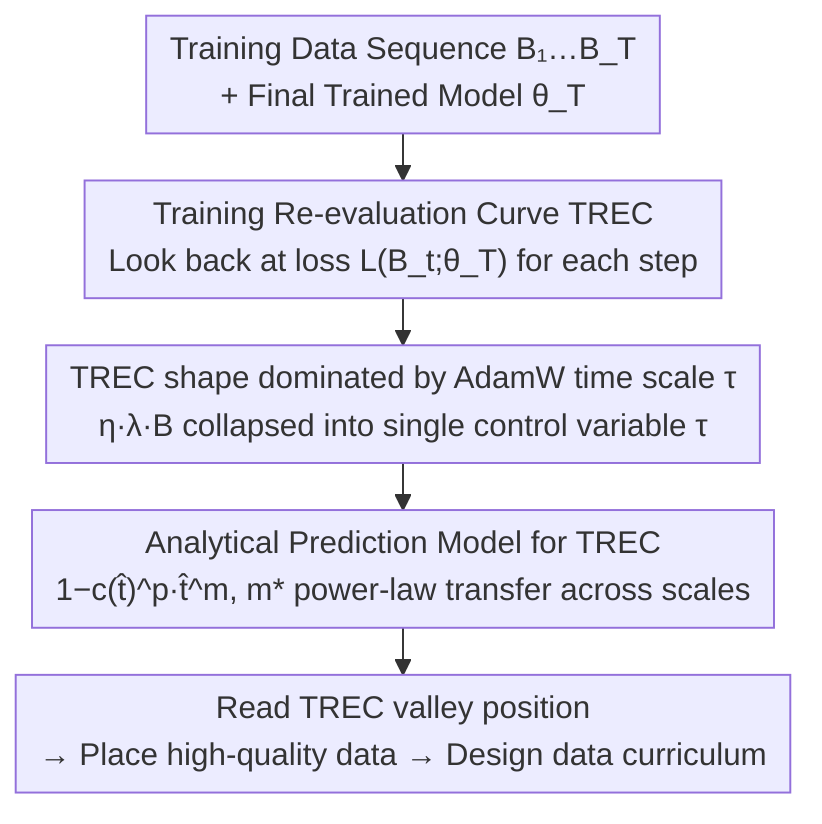

# Predicting Training Re-evaluation Curves Enables Effective Data Curriculums

**Conference**: ICLR 2026  
**arXiv**: [2509.25380](https://arxiv.org/abs/2509.25380)  
**Code**: None  
**Area**: LLM Pre-training  
**Keywords**: Training Re-evaluation Curve, Data Curriculum Learning, AdamW Time Scale, High-quality Data Placement, Continued Pre-training

## TL;DR

The authors propose the Training Re-evaluation Curve (TREC) as a diagnostic tool. By analyzing the loss of training data at each timestamp using the final model, they guide the optimal placement of high-quality data. They demonstrate that the shape of the TREC can be predicted via the implicit EMA coefficient of AdamW, enabling the design of data curriculums without actual training.

## Background & Motivation

Current LLM training commonly adopts multi-stage data curriculum strategies: introducing high-quality, domain-specific, or latest data at the end of pre-training (the annealing phase). This practice is based on the assumption that presenting data when the learning rate is near zero maximizes its effect. However, this assumption lacks theoretical support, and "many interesting questions about the optimal data distribution for pre-training remain unanswered" (Anil et al., 2023).

In practice, determining the best timing for high-quality data relies primarily on heuristics or costly ablation experiments. For instance, Llama-3 405B gained no benefit from annealing on the GSM8k training set, while OLMo-2 13B used high-quality mixtures only in the final 5.7% of training. The variance in effectiveness is significant, yet a unified theoretical framework to explain and predict these strategies is missing.

The **Key Insight** of this paper is: high-quality data should not necessarily be placed at the end of training, but rather at the position where the model can **best retain that data**—specifically, at the minimum point of the TREC.

## Method

### Overall Architecture

Ours does not modify the training algorithm but provides a diagnostic and predictive workflow for "when to place high-quality data": first define the Training Re-evaluation Curve (TREC), look back at the loss of training data at each step using the final model, and verify that the TREC minimum is the optimal placement for high-quality data; then investigate what determines the TREC shape, discovering that the implicit EMA time scale $\tau$ of AdamW is the dominant factor; finally, combine the EMA coefficient with a training progress correction term into an analytical expression to predict the entire TREC without actual training, allowing the curriculum to be designed by reading the valley position. The three stages progress sequentially, and the following framework diagram shows the complete pipeline from training data to curriculum decisions.

### Key Designs

**1. Training Re-evaluation Curve (TREC): Looking back with the final model to quantify how much each step of data is "remembered"**

A challenge in curriculum design is that the contribution of data at each time step to the final model is unequal, but this contribution cannot be directly observed during training. The TREC approach is a retrospective evaluation: given a sequence of batches $B_1,\dots,B_T$ sampled i.i.d. from distribution $D$ and parameters $\theta_T$ at the end of training, define $\mathcal{L}_{re}(t) := \mathcal{L}(B_t; \theta_T)$, which re-calculates the loss on each historical batch using the final model. A lower TREC value at a certain time step indicates a deeper "memory" of that step's data by the final model; placing high-quality data here maximizes retention. This leads to the **Core Idea**: placing high-quality data at the TREC minimum maximizes its contribution to the target task, explaining why default "end-of-training annealing" is not always optimal.

**2. TREC shape dominated by AdamW time scale $\tau$: Collapsing three hyperparameters into one variable**

To predict TREC before training, the underlying dependent variable must be identified. This paper treats AdamW parameters $\theta_t$ as an exponential moving average (EMA) of weight updates, with a time scale $\tau = \frac{1}{\eta \lambda T} = \frac{B}{\eta \lambda D}$, where $\eta$ is the learning rate, $\lambda$ is weight decay, $T$ is total steps, $B$ is batch size, and $D$ is total tokens. The **Mechanism** is as follows: regardless of whether $\tau$ is adjusted via $\eta$, $\lambda$, or $B$, as long as the resulting $\tau$ is identical, the TREC shape remains consistent—collapsing three seemingly independent hyperparameters into a single control variable. This holds across models from 111M to 3.3B parameters and computational scales spanning 1000×, enabling cross-scale prediction.

**3. Analytical Prediction Model for TREC: EMA coefficient plus progress correction, fitting once to generalize to large models**

The EMA coefficient $c(\hat{t})$ alone is insufficient because the effectiveness of early gradients decays with "minimizer drift," requiring a progress correction term. This paper provides $\hat{\mathcal{L}}_{re}(\hat{t}) = 1 - c(\hat{t})^p \cdot \hat{t}^m$, where $\hat{t} = t/T$ is the training progress fraction, $p$ is fixed at 0.5 to control EMA contribution intensity, and $m$ controls when the TREC begins reflecting the EMA. The optimal $m^*$ further follows a power law $m^* = C \cdot (\text{TPP})^{\mu_1} \cdot (\tau)^{\mu_2}$, determined solely by tokens-per-parameter (TPP) and $\tau$. Since these two variables are transferable across scales, the power law fitted at 111M scale maintains approximately 98% Pearson correlation when applied to 3.3B scale, meaning one can predict the data curriculum of a large model by computing once on a small model.

### Loss & Training

Ours does not introduce a new loss function but translates TREC predictions into data arrangement recommendations for existing AdamW training. Under a step-decay schedule, the TREC valley appears before the learning rate drop rather than at the end of training; under a decay-to-zero (D2Z) schedule, the valley falls at approximately 60–80% of training. Furthermore, the absolute drop in TREC decreases as TPP increases, suggesting that over-trained models find it harder to remember specific data, thus reducing the gains from data placement in high-TPP scenarios.

## Key Experimental Results

### Main Results: Data Placement Validation (610M model, 82 TPP)

For each learning rate schedule, 10 models were trained, each inserting 5B of code-mix (CB) data into a different 10% segment of the training.

| Learning Rate Schedule | Optimal Placement | Matches TREC Min | Gain vs. Uniform |
|-----------|------------|-------------------|--------------|
| Step-decay (drop at 70%) | Segment 6-7 (60-70%) | ✓ | Significantly better |
| 10× Linear Decay | Final Segment (90-100%) | ✓ | Significantly better |
| Decay-to-zero (D2Z) | Final Segment | ✓ | Significantly better |

### TREC Prediction Accuracy

| Model Scale | m* Prediction R² | TREC Shape Pearson rₚ |
|---------|---------|---------------------|
| 111M | 98.9% | 96.6% |
| 266M | 97.2% | 97.5% |
| 610M | 98.7% | 98.4% |
| 1.7B | 89.0% | 98.7% |
| 3.3B | 76.7% | 98.6% |

### Sparse MoE Experiments (111M base model)

| Experts E | Effective TPP | TREC Behavior |
|---------|--------|---------|
| 1 (Dense) | 20 | Shallowest decline |
| 4 | 5 | Deeper and earlier valley |
| 8 | 2.5 | Deeper and earlier |
| 32 | 0.625 | Deepest and earliest valley |

### 3.9B Continued Pre-training (CPT)

| Configuration | Math Val Performance |
|------|-------------|
| High-quality data in middle (TREC valley) | Optimal (across all LRs) |
| High-quality data at end | Sub-optimal |
| No high-quality data | Baseline |

### Ablation Study

| Ablation Dimension | Key Findings |
|---------|---------|
| Variations in β₁, β₂ | TREC shape nearly unchanged, proving $\tau$ is the dominant factor |
| Batch size > B_crit | TREC shape deviates significantly; individual batch impact weakens |
| Increased TPP | TREC drop magnitude decreases (weakened memorization) |
| Across schedules | TREC shapes align when $\tau$ is matched |

### Key Findings

1.  **TREC Valley ≠ End of Training**: Especially in Step-decay schedules, high-quality data should be placed before the learning rate drop, not at the end.
2.  **$\tau$ is the Master Key**: Changing learning rate, weight decay, or batch size results in matching TRECs as long as $\tau$ matches.
3.  **Cross-scale Predictability**: The $m^*$ power law fitted on 111M models generalizes to 3.3B (1000× compute).
4.  **Explaining Llama-3 405B Failure**: The annealing phase had only 3 optimization steps with an LR near zero, meaning the EMA coefficient was effectively zero.
5.  **MoE Experts = Reduced Effective TPP**: Leading to stronger memorization; TREC analysis can guide data strategies for MoE.

## Highlights & Insights

-   **TREC is a minimalist yet profound diagnostic tool**: Re-evaluating training data with the final model reveals the temporal structure of data influence.
-   **Solid Theoretical Foundation**: The power-law prediction model has a clear theoretical motivation (minimizer drift on quadratic loss surfaces) and has been validated from 111M to 3.9B scales.
-   **High Practical Value**: Provides practitioners with a method to determine optimal data arrangement without expensive ablation experiments.
-   **Natural Integration with Prior Work**: Successfully explains data strategy choices in published training schemes like OLMo-2, Feng et al., and Pangu-Ultra.
-   **Direct Guidance for CPT/SFT**: TREC prediction applies not only to pre-training but also to the continued pre-training (CPT) stage.

## Limitations & Future Work

1.  **Optimizer Scope**: The prediction model is designed for AdamW; extending to non-EMA optimizers like Adagrad, Adafactor, or SGD remains an open question.
2.  **TREC Absolute Values are Incomparable Across Schedules**: TREC reliably guides placement within a schedule, but absolute value comparisons across different schedules may fail.
3.  **Predicts Shape, Not Magnitude**: The current model compares shapes after normalization; predicting absolute magnitudes is yet to be explored.
4.  **No Systematic Analysis of Data Types**: Differences in TREC for factual vs. reasoning or instruction vs. narrative content are not analyzed.
5.  **Anomalous Behavior at High Learning Rates**: In 3.9B CPT, $\eta=0.015$ produced the deepest TREC valley but the worst validation performance; the mechanism is unclear.

## Related Work & Insights

-   **Complementary to AdEMAMix (Pagliardini et al., 2024)**: While AdEMAMix designs slow-forgetting optimizers, ours leverages the forgetting structure to guide data placement.
-   **Orthogonal to Data Mixing Laws (Ye et al., 2024)**: While mixing laws study "what data to put," ours studies "when to put data."
-   **Complementary Perspective to Scaling Collapse (Qiu et al., 2025)**: Both use normalized compute/training progress, but with different objectives.
-   **Practical Suggestions for Reproducibility**: Concepts like Falcon-H1's "memorization window" can be made precise using TREC.
-   **Inspiration for "Forget-free" LR Schedules**: Theoretically, schedules could be designed to flatten the TREC, though some degree of forgetting is beneficial in practice.

## Rating
- Novelty: ⭐⭐⭐⭐⭐ (TREC concept is novel, elegant, and perfectly bridges theory and practice)
- Experimental Thoroughness: ⭐⭐⭐⭐⭐ (600+ TRECs, 111M to 3.9B, multiple schedules and hyperparameters)
- Writing Quality: ⭐⭐⭐⭐⭐ (Clear logic, sequential progression, excellent visualizations)
- Value: ⭐⭐⭐⭐⭐ (Direct practical significance for data strategies in LLM training)

<!-- RELATED:START -->

## Related Papers

- [\[ACL 2025\] Model Performance-Guided Evaluation Data Selection for Effective Prompt Optimization](../../ACL2025/llm_pretraining/model_performance-guided_evaluation_data_selection_for_effective_prompt_optimiza.md)
- [\[ICLR 2026\] DUET: Optimizing LLM Training Data Mixtures via Noisy Feedback from Unseen, Downstream Evaluation Tasks](duet_optimizing_llm_training_data_mixtures_via_noisy_feedback_from_unseen_downst.md)
- [\[ACL 2026\] Data Mixing Agent: Learning to Re-weight Domains for Continual Pre-training](../../ACL2026/llm_pretraining/data_mixing_agent_learning_to_re-weight_domains_for_continual_pre-training.md)
- [\[ICLR 2026\] Accessible, Realistic, and Fair Evaluation of Positive-Unlabeled Learning Algorithms](accessible_realistic_and_fair_evaluation_of_positive-unlabeled_learning_algorith.md)
- [\[ICLR 2026\] Rewriting Pre-training Data Boosts LLM Performance in Math and Code](rewriting_pre-training_data_boosts_llm_performance_in_math_and_code.md)

<!-- RELATED:END -->
