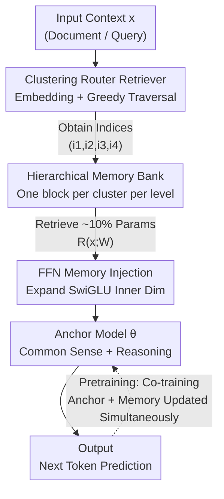

# Pretraining with Hierarchical Memories: Separating Long-Tail and Common Knowledge

**Conference**: ICLR 2026  
**OpenReview**: [https://openreview.net/forum?id=XOu5z16cbY](https://openreview.net/forum?id=XOu5z16cbY)  
**Code**: TBD  
**Area**: LLM Pretraining / LLM Efficiency  
**Keywords**: Parameterized Memory, Hierarchical Memory Bank, Long-tail Knowledge, Edge Deployment, Pretraining

## TL;DR
This paper proposes attaching a massive "hierarchical parameterized memory bank" to a small "anchor model" during pretraining. Based on input documents, hierarchical clustering routing retrieves only ~10% of memory parameters to augment the anchor model. This allows the anchor model to focus on general knowledge and reasoning while the memory bank absorbs long-tail world knowledge. Experiments on trillions of tokens show that a 160M anchor model with 18M retrieved memory (from a 4.6B bank) can match the performance of standard models more than twice its size.

## Background & Motivation

**Background**: Performance gains in modern large language models (LLMs) rely heavily on scaling parameters—larger models store more world knowledge and exhibit stronger reasoning. However, all world knowledge is compressed into a single set of parameters, requiring full loading into memory for every forward pass.

**Limitations of Prior Work**: This "all-knowledge-in-parameters" paradigm involves two types of waste. First, only a tiny fraction of knowledge is relevant to a single prompt; most permanently occupied parameters (e.g., long-tail facts like "Einstein was born on March 14, 1879") are meaningless for edge assistant tasks but still consume RAM and computation. Second, edge devices are bottlenecked by the scarcity of "large and fast" memory, making it unrealistic to fit billions of parameters into high-speed storage. While MoE only activates partial experts per token, all experts must remain in memory for random access, which is unfriendly to edge deployment.

**Key Challenge**: Long-tail knowledge and general reasoning are mixed within the same parameter set, sharing gradients. The paper notes that long-tail facts are prone to "catastrophic forgetting" because documents with vastly different content generate conflicting gradients when updating the same parameters—frequent knowledge dominates the gradient direction, washing out rare information.

**Goal**: Decouple "general knowledge + reasoning" from "long-tail world knowledge" at the parameter level. The former resides in a permanently active anchor model, while the latter is stored in on-demand retrieved memory parameters. This mechanism is designed to align naturally with hardware storage hierarchies (RAM → Flash → External Disk).

**Key Insight**: If a block of memory parameters is only activated and updated for "semantically similar" documents, the gradients it receives will come from related content, avoiding mutual interference. This ensures stable preservation of long-tail knowledge. This transforms "content-based routing + sparse updates" from an inference optimization problem into a pretraining problem that improves training dynamics.

**Core Idea**: Use a small anchor model as the base for "common sense + reasoning" and attach a large memory bank organized by hierarchical clustering. During pretraining, only ~10% of memory parameters are retrieved/updated based on document content, allowing long-tail knowledge to flow into memory while common sense remains in the anchor.

## Method

### Overall Architecture

Let the anchor model parameters be $\theta$, the memory bank parameters be $W$, and the retriever be $R$. Given context $x$, the retriever fetches relevant memory blocks $R(x;W)$, which are combined with the anchor model for next-token prediction. The pretraining objective is standard autoregressive loss, built on the combined parameters of "anchor + retrieved memory":

$$\mathcal{L}(x) = -\sum_t \log P_{\theta, R(x;W)}(x_t \mid x_{<t})$$

The parameter scales satisfy $|R(x;W)| \ll |\theta| \ll |W|$: the anchor model is small, retrieved memory is even smaller, and the total memory bank is massive (up to 21B in experiments). Since each document triggers only a small subset of the memory bank, the gradients for $W$ are naturally sparse; $\theta$ is updated for all documents, pushing it to learn general capabilities. At inference, only $|\theta| + |R(x;W)|$ parameters are used, incurring almost no extra overhead relative to a lone anchor model.

The pipeline comprises: Input document/query → Text embedding → Greedy traversal of the clustering tree to get cluster indices → Retrieve memory blocks from hierarchical bank → Inject via FFN expansion → Output. The diagram below provides an overview:

### Key Designs

**1. Clustering Router: Zero Training Overhead Parameter Retrieval**

To ensure similar documents hit the same memory parameters, a fast and stable router is required. The authors do not learn the retriever; instead, they use an off-the-shelf embedding model $\phi$ (Sentence-BERT all-MiniLM-L6-v2, dim 384) to generate embeddings for 3.2 billion DCLM documents, followed by hierarchical k-means. The data is split into $k$ clusters, with each cluster further split into $k$ sub-clusters across $p$ layers, resulting in $k^l$ nested clusters per layer. The paper uses $k=16$ and $p=4$, yielding 16, 256, 4096, and 65536 clusters at each level. During retrieval, $x$ is mapped to index tuples $I(x)=(i_1, i_2, i_3, i_4)$ by comparing $\phi(x)$ with $k$ centroids per layer using L2 distance and greedily following the closest branch. This requires only $O(pk)$ comparisons, and cluster indices can be pre-computed offline, resulting in zero overhead during training. This "non-learnable but deterministic" routing ensures同类 (same-category) documents consistently reuse memory blocks, enabling sparse updates.

**2. Hierarchical Memory Bank: Separating Common and Long-tail Knowledge**

The memory bank assigns a memory block $W_{l,i_l}\in\mathbb{R}^{s_l}$ to each cluster in the tree. The retriever outputs the concatenation of relevant blocks: $R(x;W)=[W_{1,i_1},W_{2,i_2},W_{3,i_3},W_{4,i_4}]$. The total capacity is $|W|=s_1 k + s_2 k^2 + s_3 k^3 + s_4 k^4$, while retrieval size is $|R(x;W)|=s_1+s_2+s_3+s_4$. This structure naturally layers knowledge by "commonality": blocks at layer $l$ are activated $\sim 16^l$ times less frequently than the anchor. Deeper layers receive fewer gradients from highly similar content, reducing the risk of forgetting and enabling the storage of long-tail facts. Shallow layers are updated by massive common facts, allowing common sense to dominate their gradients. This results in a spectrum from level 1 (most common) to level 4 (most specific).

**3. FFN Memory Injection: Parameters as SwiGLU Inner Extensions**

The authors compared three injection methods: LoRa-Memories (low-rank patches for Q/K, V/O, or FFN), KV-Memories (prefix-tuning extension adding KV-cache pairs), and FFN-Memories (concatenating retrieved parameters to the inner dimension of SwiGLU FFN). FFN-Memories significantly outperformed others after training for 275B tokens on a 160M frozen anchor, aligning with findings that Transformer knowledge is primarily stored in FFN layers. Block size $s_l$ is determined by a multiplier $r_l$; in practice, coarser layers are larger ($r_1\ge r_2\ge r_3\ge r_4$).

**4. Anchor-Memory Co-pretraining: From Semantics to Memory Utilization**

The authors found that training the anchor and memory simultaneously from scratch (A4) is less effective than "pretraining the anchor first, then co-training with memory" (A2). This suggests memory should be learned after the anchor has developed semantic understanding. To avoid bias toward the memory bank, a sampling factor is used: "General Memory" (non-retrieved contrast group) is used with probability $1/(16+1)$, while "Fetched Memory" is used with $16/(16+1)$. Results show co-training (A2) improves Avg-SK from 39.2% to 40.3% over a frozen anchor (A3), as the anchor learns to utilize memory more effectively.

### Loss & Training
The training target follows the standard autoregressive cross-entropy in Equation (1), with the conditional parameters being "anchor $\theta$ + retrieved memory $R(x;W)$". Training data uses DCLM-Baseline (~3.2B documents, 4.3T tokens). The anchor model is pretrained for 1.1T tokens, followed by 1.1T tokens of joint training with memory.

## Key Experimental Results

### Main Results

Core results for different anchor scales (Avg-CK: Common Knowledge, Avg-SK: Specific Knowledge, WikiEn Perplexity). "Generic" refers to same-size non-retrieved memory; "Fetched" is context-retrieved:

| Row | Anchor | Co-train | Memory Config | Bank / Fetch | Avg-SK Generic→Fetched | WikiEn Pplx Generic→Fetched |
|------|--------|------|-----------|---------------|------------------------|------------------------------|
| A1 | 160M | — | None | 0 / 0 | 34.1 (Baseline) | 17.2 |
| A2 | 160M | Yes | (256,64,16,0) | 4.6B / 18M | 35.7 → 40.3 | 16.7 → 14.2 |
| B2 | 410M | Yes | (512,128,32,0) | 12.7B / 50M | 41.8 → 45.9 | 13.8 → 12.4 |
| C2 | 1.4B | Yes | (768,256,16,0) | 21.1B / 153M | 51.3 → 54.9 | 11.0 → 10.2 |

A 160M anchor + ~240M retrieved memory (400M total active params) reached 44.5% on Avg-SK, surpassing a standard 410M model by 3.6 points—meaning "Anchor + Memory" outperforms models twice its size in active parameter count. In atomic number prediction, a 1.4B baseline had only 17% accuracy for rare elements; adding 10% memory boosted this to 83%.

### Ablation Study

| Configuration | Key Metric | Description |
|------|---------|------|
| Fetched (A3, Frozen) | Avg-SK +5.1 | Relative to A1 baseline, with only ~10% extra active params. |
| Generic (Same size) | Avg-SK 34.7 | 4.5 pts lower than Fetched, proving context retrieval works. |
| Co-train A2 vs Frozen A3 | 40.3 vs 39.2 | Co-training helps the anchor utilize memory. |
| Co-train from scratch A4 | Lower than A2 | Inferior to "Pretrain anchor then co-train" under same budget. |
| FFN vs LoRa/KV | FFN leads | FFN performed best across all memory sizes. |
| Blocking 1/16 Bank | Atomic 70%→20% | Masking matching memory causes sharp drops, showing privacy potential. |

### Key Findings
- **Long-tail Gain**: Memory significantly improves Specific Knowledge and low-frequency entities. Common Knowledge remains stable or improves slightly as the anchor is "offloaded" of long-tail data.
- **Deeper = More Specific**: Performance scales monotonically with bank size and retrieval size; deeper layers provide higher precision for fixed retrieval sizes.
- **Edge Deployment**: Hierarchical memory can be stored across hardware layers. Loading takes 38ms (vs 198ms for flat banks). During generation, shallow memory is reused, reducing overhead. Total overhead for a 1.4B model is <10%.
- **RAG Complementarity**: Combining RAG-Wiki with 10% parameterized memory on a 410M model achieved 45.7% Avg-SK, exceeding RAG-Wiki (41.6%) or memory (44.5%) alone.
- **Portability**: Adding ~10% FFN memory to frozen Gemma 3, Qwen 2.5, and Llama 3.2 improved specific knowledge, proving architecture generality.

## Highlights & Insights
- **Retrieval as a Training Dynamic Lever**: The core insight is that content-based parameter reuse creates homogenous gradients, which prevents catastrophic forgetting of long-tail knowledge. Sparse routing is not just a compute trick; it explains how models learn rare facts.
- **Hierarchical "All-in-One"**: The hierarchy simultaneously solves common/long-tail separation, decoupling bank size from retrieval size, and alignment with hardware storage.
- **Zero-Cost Routing**: Using offline embeddings avoids the instability and cost of end-to-end learnable retrievers, making it highly practical for large-scale pretraining.
- **Privacy/Editing Sub-product**: Since tokens map to specific memory blocks, deleting/modifying a block can facilitate forgetting or updating information.

## Limitations & Future Work
- **Knowledge vs. Reasoning**: The method currently targets world knowledge; enhancing anchor model reasoning is left for future work.
- **Fixed 1:10 Ratio**: The optimal ratio was derived under specific budget settings and might not generalized to all scales.
- **Non-learnable Retriever**: Greedy routing might be suboptimal compared to learned alternatives, representing a potential performance ceiling.
- **Data Quality Dependance**: Using higher quality sources than DCLM for the memory bank remains an area for improvement.

## Related Work & Insights
- **vs MoE**: MoE requires all experts in RAM for random access. This method retrieves ~10% per document, which can be loaded from slower storage, fitting edge memory hierarchies.
- **vs RAG**: RAG adds raw text to context, increasing FLOPs and KV-cache size. Hierarchical memories compress this into parameters with higher efficiency and can work alongside RAG.
- **vs Memorizing Transformers**: Unlike KNN retrieval of KV pairs, this is a systematic study of memory types (FFN/LoRa/KV) and scales, demonstrating the efficacy of hierarchical banks at the 21B parameter scale.

## Rating
- Novelty: ⭐⭐⭐⭐⭐ Establishes hierarchical routing as a pretraining paradigm with a solid explanation of training dynamics.
- Experimental Thoroughness: ⭐⭐⭐⭐⭐ Trillions of tokens, multi-scale anchors (160M-1.4B), bank up to 21B, and extensive ablations.
- Writing Quality: ⭐⭐⭐⭐ Clear motivation and rich visualizations; some notation density.
- Value: ⭐⭐⭐⭐⭐ Provides a practical path for decoupling knowledge/reasoning for edge LLMs; compatible with existing models and RAG.

<!-- RELATED:START -->

## Related Papers

- [\[ICLR 2026\] Beyond Length: Quantifying Long-Range Information for Long-Context LLM Pretraining Data](beyond_length_quantifying_long-range_information_for_long-context_llm_pretrainin.md)
- [\[ACL 2025\] Nemotron-CC: Transforming Common Crawl into a Refined Long-Horizon Pretraining Dataset](../../ACL2025/llm_pretraining/nemotron_cc_pretraining_data.md)
- [\[ICLR 2026\] Scaling Laws Revisited: Modeling the Role of Data Quality in Language Model Pretraining](scaling_laws_revisited_modeling_the_role_of_data_quality_in_language_model_pretr.md)
- [\[ICLR 2026\] SemHiTok: A Unified Image Tokenizer via Semantic-Guided Hierarchical Codebook](semhitok_a_unified_image_tokenizer_via_semantic-guided_hierarchical_codebook_for.md)
- [\[ICLR 2026\] FictionalQA: A Dataset for Studying Memorization and Knowledge Acquisition](fictionalqa_a_dataset_for_studying_memorization_and_knowledge_acquisition.md)

<!-- RELATED:END -->
