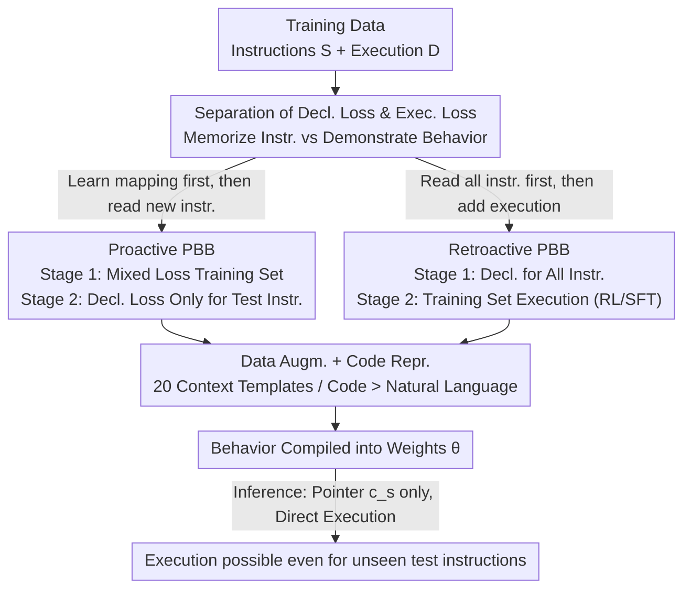

# Programming by Backprop: An Instruction is Worth 100 Examples when Finetuning LLMs

**Conference**: ICLR 2026  
**OpenReview**: [https://openreview.net/forum?id=y1OWj26FCo](https://openreview.net/forum?id=y1OWj26FCo)  
**Code**: https://github.com/jonathan-cook235/Programming-by-Backprop  
**Area**: LLM Training / Continual Pre-training / Implicit Learning  
**Keywords**: Declarative knowledge, procedural knowledge, training curriculum, sample efficiency, data safety

## TL;DR
The paper proposes Programming by Backprop (PBB)—a two-stage training curriculum that allows LLMs to "compile" corresponding executable behaviors into weights using only "declarative instructions" (such as a Python source code snippet or a set of grammar rules) in the training data, without providing execution examples. Experiments demonstrate that a single instruction can be worth up to 100 execution samples, and this phenomenon has direct implications for data governance and safety.

## Background & Motivation
**Background**: LLMs typically learn behaviors through "demonstration" (pre-training, SFT) or "experience" (RL)—essentially watching how others do things and then imitating them. However, the massive amount of data models encounter during pre-training is largely **declarative**: instructions, rules, algorithm descriptions, and documentation. These only "stipulate" how a process should be, without demonstrating how to execute it on specific inputs.

**Limitations of Prior Work**: Humans can learn a skill directly based on abstract instructions ("QuickSort is selecting a pivot, then partitioning recursively"), significantly improving learning efficiency. Whether LLMs can similarly acquire **procedural knowledge** (reusable, executable behavior) from declarative instructions in training data was previously an open question. Existing work such as "Out-of-Context Reasoning" (OOCR) and implicit meta-learning only provided scattered suggestive evidence; no one had **methodologically isolated** and verified whether seeing an instruction during training is sufficient to induce corresponding multi-step, input-dependent execution behavior, nor had anyone proposed a training method to **enhance** this internalization capability.

**Key Challenge**: Simply maximizing the likelihood of the instruction text (i.e., memorizing the instruction) **does not** automatically induce the corresponding behavior. The authors' experiments prove that if a model only reads a piece of code during training, it is almost unable to execute that code at test time (accuracy near zero). A gap exists between "knowing" and "doing"; this behavior acquisition depends on a type of implicit learning driven by the **overall distributional structure** of training data, rather than local instruction modeling objectives.

**Goal**: To find a training scheme that can "compile" declarative instructions into model parameters, allowing the model to execute the corresponding behavior during inference using only a "pointer context" directed at the instruction, and to characterize its conditions, reliability, and sample efficiency.

**Key Insight**: The authors borrow the perspective of **partial evaluation** from compiler theory—specializing a general interpreter for a fixed program to obtain a residual program that no longer requires the original instruction as input. Analogously, gradient-based training is viewed as a specialization mapping $\theta' = \Phi(\theta; \mathcal{L})$, where PBB uses an appropriate training objective $\mathcal{L}$ to specialize the semantics of instructions into the weights.

**Core Idea**: Design a training curriculum using the **separation and combined ordering** of "declarative loss (memorizing instructions)" and "execution loss (demonstrating behavior)." This allows the model to first learn the general correspondence of "how instructions map to behavior" and then transfer this correspondence to new instructions that have only been seen as declarations and never as executions.

## Method

### Overall Architecture
PBB views training data as "compilable" programs: every symbolic instruction $s$ (a Python program or a set of grammar rules) has its semantics $[\![s]\!]$, which define the behavior. During inference, the model $M_\theta$ faces a **pointer context** $c_s$ (a problem statement, task name, grammar ID, etc., pointing to a specific instruction) and an **input** $x$. An ideal "universal interpreter" satisfies $M_\theta(s, x) \approx [\![s]\!](x)$—executing the instruction when it is placed in the context. PBB aims to compile $[\![s]\!]$ into $\theta$ in advance, so that inference only requires the pointer $c_s$ without feeding the instruction into the context.

The entire process is implemented by two **complementary training curricula**, both sharing the core principle of **separating "learning the instruction $\to$ behavior mapping" from "internalizing new instructions."** The only difference lies in the sequence of the two stages:

Test instructions (evaluation instructions in the figure) correspond to the behaviors being assessed, and their execution examples **never appear** during training. The success of PBB depends on whether the model can produce correct execution for these instructions, having only read their declarations without seeing any demonstrations.

### Key Designs

**1. Compiling instructions into weights: Separation of declarative and execution loss**

All PBB designs are built on a clear distinction between two training objectives. **Declarative loss** (instruction modeling) $L_{decl}(\theta; c_s, s) := -\log p_\theta(s \mid c_s)$ is the negative log-likelihood of the next token of the instruction text $s$ conditioned on the pointer context $c_s$—essentially "memorizing the instruction." **Execution loss** (behavior modeling) $L_{exec}(\theta; c_s, x, y) := -\log p_\theta(y \mid c_s, x)$ is the next-token loss for the solution $y$ given input $x$. Optimizing only this would degenerate into Algorithm Distillation (AD), learning behavior from input-related examples. The authors' key observation is: optimizing $L_{decl}$ alone does not induce execution ability (memorizing code $\neq$ running code), but if $\theta$ is appropriately trained such that the "gradient backpropagated through $s$" aligns precisely with "execution-related parameter updates," then a single instruction modeling step $\Phi_{pro}(\theta, L_{decl}) := \theta - \eta \nabla_\theta L_{decl}(\theta; c_s, s)$ can write $[\![s]\!]$ into the weights like a "compiler." This is the theoretical basis for combining declaration and execution in stages.

**2. Proactive PBB: Establishing "Instruction $\leftrightarrow$ Behavior" rules before internalizing new instructions**

Addressing the pain point of "how to make the instruction gradient capable of compiling behavior," the Proactive curriculum divides the instruction set into a training set $S_{train}$ and an evaluation set $S_{eval}$. **Stage 1** optimizes a **mixed objective of declarative and execution loss** on training instructions:

$$\min_\theta \Big( \mathbb{E}_{s\sim S_{train}}[L_{decl}(\theta; s)] + \mathbb{E}_{D\sim D_{train}}\mathbb{E}_{(c,x,y)\sim D}[L_{exec}(\theta; c, x, y)] \Big),$$

In practice, this involves interleaving the two types of samples so the model learns the general correspondence of "how to execute upon reading an instruction." **Stage 2** exposes evaluation instructions $s \in S_{eval}$ to the model using **declarative loss only** (**without any execution examples**). Because Stage 1 has already adjusted the parameters to a state where instruction gradients predict execution updates, Stage 2's simple memorization of new instructions is sufficient to compile the corresponding behavior into weights. This is an instance of implicit meta-learning (as per Krasheninnikov et al.): Stage 1 serves as the meta-training phase, laying the groundwork for rapid generalization from instructions. Qwen3-14B achieved approximately **37%** execution accuracy on test behaviors in Random Arithmetic after a full Proactive curriculum, compared to nearly zero with only a single stage.

**3. Retroactive PBB: Hoarding declarative knowledge and "activating" it with execution supervision**

The Retroactive curriculum reverses the order to address a different realistic scenario—all instructions are first ingested in purely declarative form, followed by supplementary execution supervision. **Stage 1** performs declarative modeling on **all** instructions (training + evaluation) $\min_\theta \mathbb{E}_{s\sim S}[L_{decl}(\theta; s)]$. At this point, the model possesses declarative knowledge but no execution ability. **Stage 2** applies execution supervision only to the training set $S_{train}$, with the specialization operator $\Phi_{ret}(\theta, L_{exec}) := \theta - \eta \sum_{(c_s,x,y)\in D_{train}} \nabla_\theta L_{exec}(\theta; c_s, x, y)$. Although gradients come from the execution of training instructions, they update the **shared parameters** $\theta$, thereby "activating" the latent declarative knowledge hoarded in Stage 1, allowing evaluation instructions that never received direct execution supervision to be executed at test time. A significant finding is that **RL (GRPO) is significantly more effective than SFT** for Stage 2—SFT tends to rote-memorize execution demonstrations initially, requiring more samples to generalize, while RL drives faster and more robust generalization.

**4. Data augmentation and algorithmic representation: Necessary conditions for "compilation" to occur**

The effectiveness of PBB highly depends on two engineering factors. First is **context augmentation**: the authors define **20 context templates** for each dataset as pointers to instructions (e.g., Leetcode's "Write a Python function that solves the following problem {s}"), with one template randomly sampled for each instruction. Ablations show that removing augmentation causes PBB to degrade severely, consistent with OOCR conclusions. Second is the **algorithmic representation**: expressing the same algorithm in Python source code is easier to learn than using semantically equivalent natural language (likely due to natural language's ambiguity and length, and the strong inductive bias current LLMs have for code from pre-training distribution), though this gap narrows as model size increases. Additionally, Stage 2 of Proactive mixes in 1k OpenMathInstruct samples to prevent catastrophic forgetting of instruction-following abilities. These points are not mere refinements but prerequisites for making instruction gradients "compilable."

## Key Experimental Results

### Main Results
The authors verify PBB on three synthetic datasets across two domains and one real programming dataset.

| Task / Setting | Model | Key Findings | Note |
|------|------|------|------|
| Random Arithmetic (Full Proactive) | Qwen3-14B | ~37% Acc on test behavior execution | Single stage near 0%, Zero-shot is 0 |
| Sample Efficiency vs. AD | GPT-4o | 1 Instruction $\approx$ 100 Execution Examples | Stage 2 with 1 instr. matches/beats 100 demos |
| Leetcode (Pre-exposed) | Qwen3 | Full Proactive remains optimal | Even if zero-shot is high, further training refines execution |
| Ciphers (OOD Custom Ciphers) | GPT-4o | PBB is more robust to shift changes | AD biases towards skewed demos; PBB learns input-independent function |
| Formal Grammar Gen | Qwen3 | Full Proactive far exceeds random gen | No CoT needed; implicitly tracks grammar state in forward pass |

### Ablation Study

| Configuration | Phenomenon | Explanation |
|------|------|------|
| Stage 1 Only (Train Instr + Exec) | Very low performance on test behaviors | Training set mapping alone is insufficient |
| Stage 2 Only (Eval Instr Declaration) | Near zero | Pure instruction memorization does not induce execution |
| Full Proactive Curriculum | Significant jump to ~37% | The two-stage combination is the key |
| Code vs. Natural Language Repr. | Code is superior; gap narrows with model size | Natural language ambiguity/length hinders learning |
| No Context Augmentation | PBB degrades | Augmentation is a necessary condition |
| Retroactive: RL vs. SFT | RL generalizes faster and more steadily | SFT rote-memorizes execution demonstrations early on |

### Key Findings
- **Curriculum structure is a sufficient condition; adding instructions alone is not enough**: Simply stuffing instructions into training data does not automatically grant execution power; they must be organized in the Proactive/Retroactive two-stage sequence for "compilation" to occur.
- **Implicit forward execution**: Models trained with PBB can provide correct outputs **without generating CoT** (though with lower accuracy than using CoT), indicating multi-step algorithmic operations can be implicitly compressed into the forward pass. In grammar tasks, models can even track syntactic states within the forward pass to ensure rule compliance.
- **Compositionality**: Models can combine two **independently trained** algorithmic instructions during inference (e.g., `def Blorp(x): Zibble(Snurg(x))`). Larger models like GPT-4o show some compositional ability even without explicit reasoning.
- **Debiasing effect**: On skewed cipher demonstrations (e.g., a preference for ROT13), AD learns biased behavior, while PBB learns a general input-independent function, making it more robust to parameter changes. Mixing PBB with skewed demos works best—instructions debias while demonstrations ground.
- **Reliability boundaries**: Internalizing instructions from training data remains **less reliable** than placing instructions directly in the context. PBB is "noisy compilation."

## Highlights & Insights
- **Partial evaluation perspective unifies training and compilation**: By formalizing gradient training as a specialization operator $\Phi(\theta;\mathcal{L})$, and using the compiler theory analogy of "specializing a general interpreter into a residual program," the paper provides a clean theoretical framework for how training data shapes behavior.
- **Separation of declarative/execution loss + two-stage sequencing** is a transferable training design: Any scenario aiming to let a model acquire capabilities from rules/documentation rather than demonstrations can borrow the curriculum paradigms of "mapping rules first, then internalizing" or "hoarding declarations first, then activating with RL."
- **The "1 instruction = 100 examples" sample efficiency** conclusion is highly attractive for data governance—replacing massive annotated demonstrations with a few high-level specifications.
- **Fascinating safety implications**: Instructions existing purely as declarations in training data might unintentionally "activate" unintended behaviors during inference. This elevates data screening/governance from "filtering demonstrations" to "reviewing rules and descriptions."

## Limitations & Future Work
- **Limited execution reliability**: Behavior internalized by PBB is still significantly inferior to placing instructions directly in the context; it is "noisy compilation," with Qwen3-14B reaching only ~37% on synthetic arithmetic.
- **Reliance on controlled synthetic environments**: Core conclusions are built on self-developed synthetic data (random arithmetic, custom ciphers, artificial CFG). The strength of PBB in real-world large-scale pre-training corpora remains unclear; for instance, "activation" gains in Retroactive clearly weaken in domains already familiar to the model like Leetcode.
- **Proactive requires amortizing Stage 1 costs**: High sample efficiency comes at the cost of a one-time meta-training (Stage 1); it is only Stage 2 that achieves "1 instruction = 100 demos."
- **Mechanisms not fully decoded**: Why mixed loss allows instruction gradients to become "compilable" is explained through the partial evaluation analogy and empirical results, but a mechanistic-level explanation of internal representations is lacking.
- **Future directions**: Integrating PBB into real continual pre-training pipelines, combining it with existing work in curriculum learning, and exploring further scaling of model size and data volume (a positive scaling trend was observed).

## Related Work & Insights
- **vs. Algorithm Distillation / Learning to execute**: Traditional execution learning (Zaremba & Sutskever; Yan et al.) assumes each process has paired input-output demonstrations or execution-level supervision. PBB does the opposite, learning executable behavior from **symbolic descriptions** rather than demonstrations, treating instructions as "programs" compiled into parameters during training rather than external tools during inference.
- **vs. Code training promoting reasoning**: Existing work (Aryabumi et al.; Ruis et al.) shows that pre-training exposure to code/input-independent processes improves downstream reasoning. PBB **methodologizes** this correlation, providing a training curriculum that actively induces this effect and isolating the verification of "whether one instruction is enough for multi-step execution."
- **vs. Implicit Meta-learning / OOCR**: The Proactive curriculum closely matches the two-stage pipeline of implicit meta-learning (Krasheninnikov et al.). PBB further unifies phenomena like OOCR and implicit meta-learning into a class of mechanisms where "models learn representations of symbolic abstractions to execute at inference," providing the first training means to **enhance** this capability.

## Rating
- Novelty: ⭐⭐⭐⭐⭐ Formalizing "compiling executable behavior from declarative instructions" as a training curriculum and unifying it with a partial evaluation perspective is highly novel.
- Experimental Thoroughness: ⭐⭐⭐⭐ Two domains, three datasets + multiple model families + rich ablations, though mainly in controlled synthetic environments with modest absolute accuracy.
- Writing Quality: ⭐⭐⭐⭐⭐ Clear concepts, solid formalization, and tight correspondence between charts and conclusions.
- Value: ⭐⭐⭐⭐⭐ Direct and profound practical implications for data governance and AI safety.

<!-- RELATED:START -->

## Related Papers

- [\[ICLR 2026\] Not All Documents Are What You Need for Extracting Instruction Tuning Data](not_all_documents_are_what_you_need_for_extracting_instruction_tuning_data.md)
- [\[ICLR 2026\] How to Train Data-Efficient LLMs](how_to_train_data-efficient_llms.md)
- [\[ICLR 2026\] Identifying and Evaluating Inactive Heads in Pretrained LLMs](identifying_and_evaluating_inactive_heads_in_pretrained_llms.md)
- [\[ICLR 2026\] StochasTok: Improving Fine-Grained Subword Understanding in LLMs](stochastok_improving_fine-grained_subword_understanding_in_llms.md)
- [\[ICLR 2026\] GneissWeb: Preparing High Quality Data for LLMs at Scale](gneissweb_preparing_high_quality_data_for_llms_at_scale.md)

<!-- RELATED:END -->
