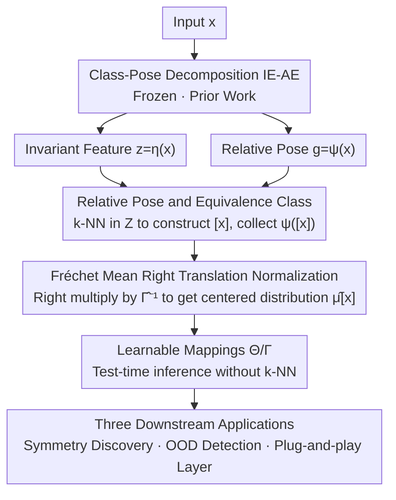

# RECON: Robust symmetry discovery via Explicit Canonical Orientation Normalization

**Conference**: ICLR 2026  
**arXiv**: [2505.13289](https://arxiv.org/abs/2505.13289)  
**Code**: [ZIB-IOL/recon](https://github.com/ZIB-IOL/recon)  
**Area**: Symmetry Discovery / Invariance Learning  
**Keywords**: Symmetry Discovery, Canonical Orientation, Class-pose Decomposition, Plug-and-play, Group Invariance

## TL;DR

RECON is proposed as a class-pose-independent canonical orientation normalization method. By correcting arbitrary canonical representations generated during training through simple right translation, it achieves unsupervised instance-level symmetry discovery, OOD pose detection, and a plug-and-play test-time normalization layer.

## Background & Motivation

### Background

Real-world data often exhibits unknown, instance-dependent symmetries that rarely match pre-fixed transformation groups $G$ exactly. Traditional equivariant/invariant network methods either hard-code specific group structures or learn them implicitly through data augmentation. Class-pose decomposition methods attempt to decompose the input into invariant features and a pose $g \in G$ relative to some canonical representation.

### Limitations of Prior Work

However, existing normalization methods suffer from a fundamental problem: **the canonical representation depends on the training process and is arbitrary**. Different training runs and initializations lead to different canonical choices, resulting in a triple dilemma: learned pose distributions are difficult to interpret, cross-model comparisons are meaningless, and pose information cannot be directly used for downstream tasks.

The key insight of RECON is that arbitrary canonical choices can be corrected through simple group operations (right translation) to align them with the natural canonical orientation of the data. This correction is post-processing and does not require retraining the model.

## Method

### Overall Architecture

RECON addresses the long-standing problem of "arbitrary canonical orientation." Class-pose decomposition methods (e.g., IE-AE) split an input $x$ into two parts: an invariant feature $z=\eta(x)$ (pose-independent, capturing "what") and a relative pose $g=\psi(x)\in G$ (the group transformation needed to rotate the network-reconstructed canonical representation $\hat x$ back to the original image). The pain point is that the orientation of $\hat x$ is determined entirely by initialization and training dynamics; thus, the same "7" rotated by ±30° would be recorded as completely different relative pose distributions across different models, making them incomparable across instances or models.

RECON does not retrain any network. Instead, after obtaining $(z, g)$ from any IE-AE, it performs three post-processing steps: first, use the invariant feature $z$ to group data into equivalence classes $[x]$ unsupervisedly; then, estimate the **offset** (Fréchet mean) of the relative pose distribution for that class; finally, apply a **right translation** to all poses to pull the center of the distribution back to the group identity $e$. The corrected distribution $\hat\mu_{[x]}$ is the "natural" symmetry distribution of the data, which is interpretable (centered at $e$), comparable (same reference frame across classes), and reusable (for downstream discovery/detection/plug-and-play normalization).

### Key Designs

**1. Relative Pose and Equivalence Classes: Gathering ingredients for normalization without labels**

For right translation to work, a set of relative poses from the same class is required. RECON builds this on the invariant feature $z$ provided by IE-AE. The paper assumes that structurally similar objects occupy adjacent, connected regions in the invariant latent space $Z$. Thus, a connectivity equivalence relation defines a class: $x\sim_\varepsilon y$ if and only if there exists a chain in $Z$ with step sizes smaller than $\varepsilon$ connecting the two, denoted as class $[x]$. In practice, instead of finding connected components, $k$-nearest neighbors of $\eta(x)$ in $Z$ are used to approximate $[x]$ (Algorithm 1, Step 2). After obtaining $[x]$, the relative poses $\psi([x])=\{\psi(s_j)\}$ obtained via $\psi$ are aggregated as input for normalization. The process does not rely on labels; the structure of the symmetry group $G$ (e.g., $SO(2)$, $SE(3)$) is the only required prior.

**2. Fréchet Mean Right Translation Normalization: Pulling arbitrary canonicals back to identity (Core)**

This is the primary innovation of RECON (Proposition 3.1). The paper characterizes a class of samples using a generative model $s=\rho_X(g)\gamma_{[x]}+\varepsilon_s,\ g\sim\mu_{[x]}$, where the true pose follows a distribution $\mu_{[x]}$ acting on a reference pose $\gamma_{[x]}$, plus some non-group deformation $\varepsilon_s$. An ideal "natural" description should have the center of $\mu_{[x]}$ at the group identity $e$ (i.e., $F(\mu_{[x]})=e$). The problem is that an arbitrary canonical representation shifts the observed $\psi([x])$ by an unknown offset relative to the truth. RECON’s key observation is that this offset is exactly the **Fréchet mean** (centroid on Riemannian manifolds) of the poses in $\psi([x])$:

$$\hat\Gamma_{[x]}=\arg\min_{y\in G}\sum_{g_i\in\psi([x])}d_G(y,g_i)^2,$$

By **right-multiplying by its inverse** for each pose $\psi'([x])=\{g_i\hat\Gamma_{[x]}^{-1}\}$, the Fréchet center of the distribution is moved back to $e$. Proposition 3.1 proves that the resulting empirical distribution $\hat\mu_{[x]}$ converges to the true distribution $\mu_{[x]}$ in Wasserstein distance as $\varepsilon'\to0$ and $N\to\infty$. Since right translation is an exact algebraic operation on the group, the correction introduces no approximation or gradient updates, making it a zero-cost post-processing step. For multimodal distributions (e.g., two equal peaks on $SO(2)$), the standard Fréchet mean might fall outside the support. Thus, the paper replaces the squared distance with a Tukey biweight loss to provide a robust **Tukey-Fréchet mean** $F_r(\mu)=\arg\min_y\mathbb{E}_{g\sim\mu}[m(d_R(y,g);c)]$.

**3. Learnable Mappings: Generalizing normalization to unseen test inputs**

Algorithm 1 only performs normalization for classes in the training set (requiring on-the-fly $k$-NN and Fréchet mean calculation). To output symmetry distributions for new inputs at test time, RECON treats the estimated distribution parameters $\hat\theta_{[x]}$ and centering transformations $\hat\Gamma_{[x]}$ from the training set as pseudo-labels to train two mappings: $\Theta$ predicts the symmetry distribution parameters, and $\Gamma$ predicts the centering transformation. This amortizes the post-processing into a single inference pass.

**4. Three Downstream Applications: Three uses for one centered distribution**

Once the centered distribution $\hat\mu_{[x]}$ is obtained, three applications follow. **Symmetry Discovery**: By relaxing the assumption that all samples share the same symmetry group, each instance has its own $\hat\mu_{[x]}$. Rotationally symmetric molecules show multimodal distributions corresponding to their symmetry order, while asymmetric molecules do not. **OOD Pose Detection**: The support of $\hat\mu_{[x]}$ characterizes the "normal poses." If a test sample's pose falls outside this support, it is judged as OOD (e.g., unstable or non-physical molecular conformations). **Plug-and-play Normalization Layer**: Reversing the right translation allows for a lightweight layer placed before any frozen pretrained model. It aligns the input to the natural canonical orientation before passing it to the downstream network, injecting group invariance geometrically without touching weights.

### Loss & Training

The core correction in RECON is an analytical group operation without learnable parameters or gradient optimization. The underlying class-pose decomposition (e.g., IE-AE) is trained separately using a standard reconstruction loss $d(\rho_X(\psi(x))\,\delta(\eta(x)),x)$. RECON only takes over the pose outputs. The only parts requiring training are the two mappings $\Theta/\Gamma$, which perform regression on the pseudo-labels $\hat\theta_{[x]}$ and $\hat\Gamma_{[x]}$ (e.g., $L_p=d_\theta(\Theta(x),\hat\theta_{[x]})$).

## Key Experimental Results

### Main Results

Experiments were validated on image datasets and molecular conformation datasets.

**Image Classification** (Rotated MNIST, etc.)

| Method | Classification Accuracy | Normalization Quality | Description |
|------|----------|----------|------|
| Baseline without Norm | Low | N/A | Lacks rotation invariance |
| Traditional Norm | Medium | Training-dependent | Normalization is arbitrary |
| **RECON** | **Best or Competitive** | **Data-aligned** | No retraining required |

**Molecular Conformation Analysis**

| Method | Symmetry Discovery | OOD Detection | Description |
|------|----------|---------|------|
| Fixed Group Methods | Cannot handle instance variance | Not supported | Assumes uniform symmetry group |
| **RECON** | **Accurate** | **Effective** | Supports instance-level symmetry |

### Ablation Study

| Configuration | Key Metric | Description |
|------|---------|------|
| Various Base Models | Stable performance | RECON is insensitive to base model choice |
| Various Group Structures | Applicable to all | Validates group-agnostic nature |
| With/Without RECON Layer | +Significant Gain | Validates the plug-and-play layer |

### Key Findings

1. RECON's normalization correction is exact—no approximation error is introduced due to group algebraic operations.
2. Discovered instance-level pose distributions align with physical/chemical intuition (e.g., symmetry orders of molecules).
3. The plug-and-play layer significantly improves the robustness of pretrained models on transformed data without retraining.
4. The method is effective across distinct domains (images and molecules), demonstrating universality.

## Highlights & Insights

1. **Theoretical Elegance**: Formulating the arbitrariness of canonical choice as a simple translation in group theory is mathematically rigorous and implementationally simple.
2. **Zero-cost Correction**: As a pure post-processing method requiring no retraining, it is highly attractive for practical applications.
3. **Instance-level Symmetry**: Breaks the common assumption that all samples share the same symmetry group, better matching real-world data properties.
4. **Plug-and-play Design**: Injects invariance into any pretrained model, similar to adapters but operating on input geometry.
5. **Cross-domain Validation**: Effectiveness from images to molecules showcases the universality of group-theoretic approaches.

## Limitations & Future Work

1. **Dependency on Base Model Quality**: If the underlying class-pose decomposition is inaccurate, RECON's correction suffers.
2. **Requirement of Group Structure $G$**: While specific symmetries need not be known, the acting group structure (e.g., $SO(2)$) must be specified.
3. **Challenges in Continuous Groups**: Estimating pose distributions on high-dimensional continuous groups faces statistical efficiency issues; multimodal cases rely heavily on Tukey-Fréchet to stabilize the transformation.
4. **Latent Space Clustering Assumption**: Equivalence classes rely on $k$-NN in invariant features $z$. If IE-AE fails to separate different classes, the pose statistics may be contaminated.
5. **Scalability**: Extending RECON to more complex group structures such as infinite-dimensional or hybrid discrete groups.

## Related Work & Insights

- **Equivariant Neural Networks** (E(n)-GNN, etc.): RECON provides an orthogonal way to achieve invariance—not by changing architecture, but by transforming the input.
- **Canonical Orientation Networks**: RECON solves the core problem of training-dependent canonicals in these methods.
- **Symmetry Discovery**: Complementary to Lie group discovery, RECON focuses on instance-level symmetry rather than global symmetry.
- Insight: Simple group-theoretic operations can sometimes be more effective than complex learning methods; the "post-processing" approach is undervalued in invariance learning.

## Rating

- Novelty: ⭐⭐⭐⭐ — The idea of right translation correction is elegant, though based on group theory applications.
- Experimental Thoroughness: ⭐⭐⭐ — Validated on two domains, though full details remain for further verification.
- Writing Quality: ⭐⭐⭐⭐ — Clear abstract and precise theoretical descriptions.
- Value: ⭐⭐⭐⭐ — Provides a practical tool for the equivariant/invariant learning community.

<!-- RELATED:START -->

<!-- RELATED:END -->

## Related Papers

- [\[ICLR 2026\] Imagine How To Change: Explicit Procedure Modeling for Change Captioning](imagine_how_to_change_explicit_procedure_modeling_for_change_captioning.md)
- [\[NeurIPS 2025\] A Practical Guide for Incorporating Symmetry in Diffusion Policy](../../NeurIPS2025/llm_pretraining/a_practical_guide_for_incorporating_symmetry_in_diffusion_policy.md)
- [\[ICML 2026\] MOOSE-Star: Unlocking Tractable Training for Scientific Discovery by Breaking the Complexity Barrier](../../ICML2026/llm_pretraining/moose-star_unlocking_tractable_training_for_scientific_discovery_by_breaking_the.md)
- [\[ICML 2025\] Language Models over Canonical Byte-Pair Encodings](../../ICML2025/llm_pretraining/language_models_over_canonical_byte-pair_encodings.md)
- [\[ICML 2025\] Towards Robust Influence Functions with Flat Validation Minima](../../ICML2025/llm_pretraining/towards_robust_influence_functions_with_flat_validation_minima.md)

<!-- RELATED:END -->
