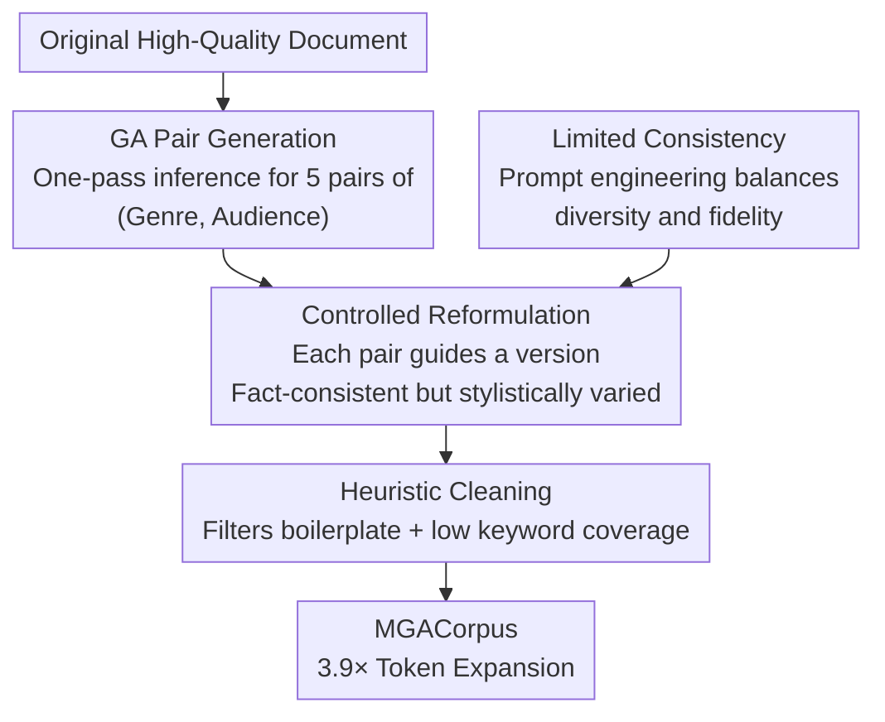

# Reformulation for Pretraining Data Augmentation

**Conference**: ICLR 2026  
**OpenReview**: [https://openreview.net/forum?id=dIOYpj9K8P](https://openreview.net/forum?id=dIOYpj9K8P)  
**Code**: Dataset open-sourced at [ByteDance-Seed/mga-fineweb-edu](https://huggingface.co/datasets/ByteDance-Seed/mga-fineweb-edu)  
**Area**: LLM Pre-training / Data Synthesis  
**Keywords**: Data Augmentation, Pre-training Corpus, Genre-Audience reformulation, Synthetic Data, Data Reuse Bottleneck  

## TL;DR
To address the scarcity of high-quality pre-training corpora and the performance degradation caused by repeating data, this paper proposes **MGA (Massive Genre-Audience reformulation)**. Utilizing a lightweight 3.3B MoE model, MGA adaptively generates multiple "Genre-Audience" pairs for each original document to rewrite it into five distinct gaya versions while maintaining factual consistency. This expands 195B high-quality tokens into 770B synthetic tokens (a 3.9× expansion), achieving superior N/D bidirectional scaling compared to "data repetition / upsampling" across models ranging from 134M to 13B parameters.

## Background & Motivation
**Background**: The capabilities of LLMs heavily rely on model and training data scales. Scaling laws indicate that performance increasingly depends on both the "quantity" and "quality" of data. However, the growth rate of truly usable high-quality tokens in web corpora after rigorous filtering lags far behind the demand for data in training.

**Limitations of Prior Work**: When high-quality data is exhausted, the simplest approach is "repeated training"—running multiple epochs on the same data. While common in traditional deep learning, this approach leads to **performance degradation** in LLM pre-training. Performance plateaus or even drops after a certain level of repetition; importantly, larger models experience divergence earlier, making repetition a bottleneck for scaling. Mitigating this degradation via regularization (weight decay, dropout) is extremely sensitive to hyperparameters and can lead to training instability.

**Key Challenge**: While LLM-synthetic data appears to offer "infinite data" to bypass repetition, mainstream synthesis routes have significant flaws. One category is **seed-based** (e.g., Phi, Cosmopedia), which requires meticulously designed seed systems and templates, incurring high engineering and compute overhead. Another category involves direct generation via giant models, which is essentially "distillation" rather than true data augmentation, making it expensive and difficult to replicate. Methods for large-scale data synthesis often remain black boxes within industry labs, lacking a transparent and reproducible methodology.

**Goal**: To build a **transparent, principled, and reproducible** corpus reformulation framework to directly alleviate the repetition bottleneck by creating more **truly unique** tokens rather than simple copies. Simultaneously, the study aims to answer whether MGA is complementary to existing strategies, why diversity helps in high-repetition scenarios, and at what level reformulation improves model learning.

**Key Insight**: Data reformulation involves an inherent tension between creating novel, diverse content (variance) and preserving original factual information (invariance). The authors term this balance **"Limited Consistency"** and argue that instead of using fixed style templates, it is better to **adaptively generate "Genre-Audience" pairs from the document itself**, using these two orthogonal dimensions to expand structural diversity.

**Core Idea**: Replace "fixed template synthesis" and "simple repetition" with "dynamically generated (Genre, Audience) pairs + controlled reformulation." By relaxing stylistic constraints while tightening factual constraints, limited high-quality corpora can be safely expanded several-fold.

## Method

### Overall Architecture
MGA decomposes "one document → five stylistically distinct reformulations" into a two-stage pipeline followed by a cleaning step. The input is an original high-quality document, and the output consists of several factually consistent documents with varying genres and audiences. **The first stage** generates multiple creative reformulation instructions (i.e., (Genre, Audience) pairs), aiming to maximize diversity. **The second stage** performs controlled reformulation of the original text based on each instruction, aiming to lock in facts while diversifying the presentation. Finally, a **heuristic cleaning** step filters out boilerplate templates and degraded samples with low keyword coverage relative to the original. The entire pipeline is driven by two lightweight Tool SLMs fine-tuned for sub-tasks, totaling only 3.3B MoE parameters, making it feasible for web-scale corpora.

### Key Designs

**1. Limited Consistency: Balancing Stylistic Freedom and Factual Locking**

This is the guiding principle of the framework, addressing the core conflict where reformulations are either too similar to the original (lacking diversity) or diverge too much (losing facts). The authors define it as: **maximizing the variance in style and structure while strictly maintaining the invariance of core factual information**. This is implemented via prompt engineering. The authors experimented with three levels: `SLM-Strict` (too rigid, high fidelity but lacks diversity), `SLM-Relaxed` (too loose, excessive distribution shift, high risk of factual degradation), and `SLM-Base` (a calibrated middle ground that expands the original distribution without losing thematic coherence). t-SNE visualizations show that only the Base version achieves balanced expansion. This principle also explains why Strict versions suffer from "data repetition" degradation at high repetition counts—fidelity without diversity cannot overcome the repetition bottleneck.

**2. Adaptive GA Pair Generation: Structural Diversity via "Genre × Audience"**

Simple rephrasing lacks **structural** diversity. The authors choose (Genre, Audience) pairs as the carrier for reformulation instructions: **Genre determines structure and文体 format** (e.g., analytical report, step-by-step tutorial, blog post—controlling how information is organized), while **Audience defines target persona** (e.g., college student, industry expert, curious teenager—controlling tone, vocabulary, and conceptual depth). Crucially, MGA does not use a fixed small set of styles but **adaptively generates multiple context-relevant GA pairs for each document**. In practice, a teacher LLM generates 5 GA pairs per document; after rule-based validation, this data is used to train a `GA-SLM` for **"one-pass-for-many"** inference to mitigate mode collapse.

**3. Controlled Reformulation + Teacher Score Filtering: Preventing "Bad Teacher" Bias via SFT Relaxed to Score 3**

The second stage implements the variance-invariance balance. The core is a fine-tuning strategy: **instead of pursuing only perfect outputs (score 5), the quality threshold is relaxed to ensure a large proportion of reformulations are "broadly acceptable" (score ≥ 3)**. Formally, let $D$ be the source document and $G$ be the generated GA pair. A teacher LLM produces an initial synthetic set $D_{synth}=\{(D_i, G_i, D'_i)\}$. Training the Tool SLM on the full set would cause it to **replicate sub-optimal outputs**, so the teacher LLM acts as a quality judge $S(D'_i)\in\{1,\dots,5\}$ to filter a high-quality subset:

$$D_{SFT} = \{(D, G, D') \in D_{synth} \mid S(D') \ge 3\}$$

The `Reformulation-SLM` (parameterized by $\theta$) is trained on this subset using standard SFT:

$$L_{SFT}(\theta) = \mathbb{E}_{(D,G,D')\sim D_{SFT}}\big[-\log P_\theta(D'|D, G)\big]$$

This "relax to 3" goal ensures high diversity while filtering out the worst samples. Table 1 shows that the Tool SLM's quality (92.06% scoring ≥ 3) nearly reaches that of the teacher LLM (93.11%), justifying the use of a 3.3B model.

**4. Heuristic Cleaning: Removing Boilerplate and Factual Drifting**

A final cleaning step follows synthesis to safeguard quality. It removes high-frequency patterns (e.g., "Please note that...") and documents with **extremely low keyword coverage** relative to the source, which typically signifies hallucination or topic drifting. This serves as the final insurance for invariance.

### Loss & Training
The reformulation side uses the standard $L_{SFT}$ objective. Downstream validation uses Llama 3 architecture (134M to 13B sizes). Main experiments use a Warmup-Stable-Decay schedule (0.1% warmup, 75% stable, 25% decay). For scaling dynamics, a simple warmup+stable schedule is used for direct comparison. The corpus is based on SmolLM-Corpus, specifically reformulating 195B tokens from fineweb-edu-dedup to yield 770B cleaned synthetic tokens.

## Key Experimental Results

### Main Results
Under a fixed training budget, incorporating MGA data (MGA-Expansion) leads to larger gains as model size increases:

| Model Scale | #Tokens | baseline Avg. | MGA-Expansion Avg. | Gain |
|--------|---------|------|----------|------|
| 134M | 600B | 31.51 | 31.77 | +0.26 |
| 377M | 600B | 34.57 | 35.52 | +0.95 |
| 1.7B | 1T | 41.15 | 43.40 | +2.15 |

Gains are concentrated in reasoning and knowledge-intensive tasks (e.g., +15.47 on TriviaQA, +6.06 on GSM8K at 1.7B). The authors hypothesize that exposure to multiple diverse expressions of the same information fosters more robust generalization.

Data-constrained scaling (13B, entire-set scenario, expanding 50B high-quality data):

| Strategy | 200B | 300B | 400B | 500B |
|------|------|------|------|------|
| Collect more high-quality (+195B) | +0.2 | +0.15 | -0.16 | +0.11 |
| MGA (200B expansion) | +2.65 | +3.14 | +3.43 | +3.46 |

In subset scenarios, upsampling gains remain relatively flat across scales (+1.41 for larger models), while MGA shows better N-scaling, with gains increasing as the model grows (+1.46 to +3.73).

### Ablation Study
Prompt engineering levels (reformulation quality vs. training performance):

| Config | % Score ≥4 | % Score =5 | % Score ≤2 | Training Performance |
|------|---------|---------|---------|------|
| SLM-Base | 71.06% | 24.67% | 6.65% | Continuous healthy optimization, Best |
| SLM-Strict | 78.37% | 44.38% | 4.86% | High fidelity but degrades at high iter (like repetition) |
| SLM-Relaxed | 13.63% | 2.66% | 60.19% | Significant collapse |

Complementarity (1.7B, 800B tokens, 35% budget replacement): Exp C (+Nemotron-Syn +MGA) > Exp A (+Nemotron-Syn) > Exp B (+MGA) > Baseline, demonstrating MGA is **complementary** to task-aligned synthetic data.

### Key Findings
- **Limited Consistency is central**: Although Strict has a higher ≥4 score proportion (78% vs 71%), it shows data-repetition-like degradation at high repetition counts. Base maintains healthy optimization, proving diversity is required to alleviate the repetition bottleneck.
- **Validation loss can be "misleading"**: MGA performs better on benchmarks but shows higher validation loss than the baseline. The authors argue that token-level perplexity is biased by frequency distributions and in-domain loss doesn't reflect OOD generalization. Thus, **validation loss is not a definitive criterion for model collapse**. Analysis shows synthetic-trained models exhibit higher loss primarily at **later sequence positions** on real data, a pattern that vanishes on synthetic data, suggesting a shift in learning strategy rather than absolute collapse.
- **MGA advantages appear from the first epoch**, long before significant repetition, and the gap widens over time.

## Highlights & Insights
- **Formalized the "Diversity vs. Fidelity" tension as Limited Consistency**: Managed through prompt engineering levels and teacher score filtering (≥3 instead of =5) as precise control knobs.
- **Orthogonal GA dimensions**: Provides structured diversity more effectively than simple rephrasing while being lighter than seed systems.
- **Feasibility of 3.3B models**: Achieving only a 1% quality gap compared to teacher LLMs enables processing web-scale corpora, a prerequisite for "augmentation" rather than just "distillation."
- **Demystifying Validation Loss**: Unveiling that higher loss from synthetic training does not necessarily equate to collapse provides a methodological warning for future synthetic data evaluation.

## Limitations & Future Work
- Source data was limited to one sub-source (fineweb-edu-dedup); generalizability across domains (e.g., code, math) remains to be verified.
- Quality scoring relies on teacher LLM self-evaluation; even with high human alignment, system biases could persist.
- Boundary selection between Strict/Relaxed/Base remains empirical; automated selection for new corpora/models is needed.
- The mechanism for loss increase at later sequence positions lacks complete theoretical characterization.

## Related Work & Insights
- **vs WRAP / Nemotron-CC (raw-text rephrasing)**: MGA introduces adaptive (Genre, Audience) pairs for structured diversity and provides a transparent "recipe" (prompts, data, scripts).
- **vs Phi / Cosmopedia (seed-based synthesis)**: MGA avoids the complexity of predefined seed systems by generating instructions directly from original text, making it more scalable.
- **vs Data Repetition / Upsampling**: While repetition plateaus or diverges, MRE replaces duplication with "unique reformulated tokens," enabling N-scaling benefits that increase with model size.

## Rating
- Novelty: ⭐⭐⭐⭐ Combination of Limited Consistency and adaptive GA is practical, though reformulation is not entirely new.
- Experimental Thoroughness: ⭐⭐⭐⭐⭐ Systematic verification across 134M–13B scales, N/D scaling, and complementarity.
- Writing Quality: ⭐⭐⭐⭐ Logically organized around research questions; mechanisms for loss patterns are mostly phenomenological.
- Value: ⭐⭐⭐⭐⭐ Directly addresses the data scarcity bottleneck; provides 770B tokens and transparent artifacts with high utility.

<!-- RELATED:START -->

## Related Papers

- [\[ICLR 2026\] Scaling Laws Revisited: Modeling the Role of Data Quality in Language Model Pretraining](scaling_laws_revisited_modeling_the_role_of_data_quality_in_language_model_pretr.md)
- [\[ICLR 2026\] How Learning Rate Decay Wastes Your Best Data in Curriculum-Based LLM Pretraining](how_learning_rate_decay_wastes_your_best_data_in_curriculum-based_llm_pretrainin.md)
- [\[ICLR 2026\] Synthetic Bootstrapped Pretraining](synthetic_bootstrapped_pretraining.md)
- [\[ICLR 2026\] LLM Pretraining with Continuous Concepts](llm_pretraining_with_continuous_concepts.md)
- [\[ICLR 2026\] Distilled Pretraining: A modern lens of Data, In-Context Learning and Test-Time Scaling](distilled_pretraining_a_modern_lens_of_data_in-context_learning_and_test-time_sc.md)

<!-- RELATED:END -->
