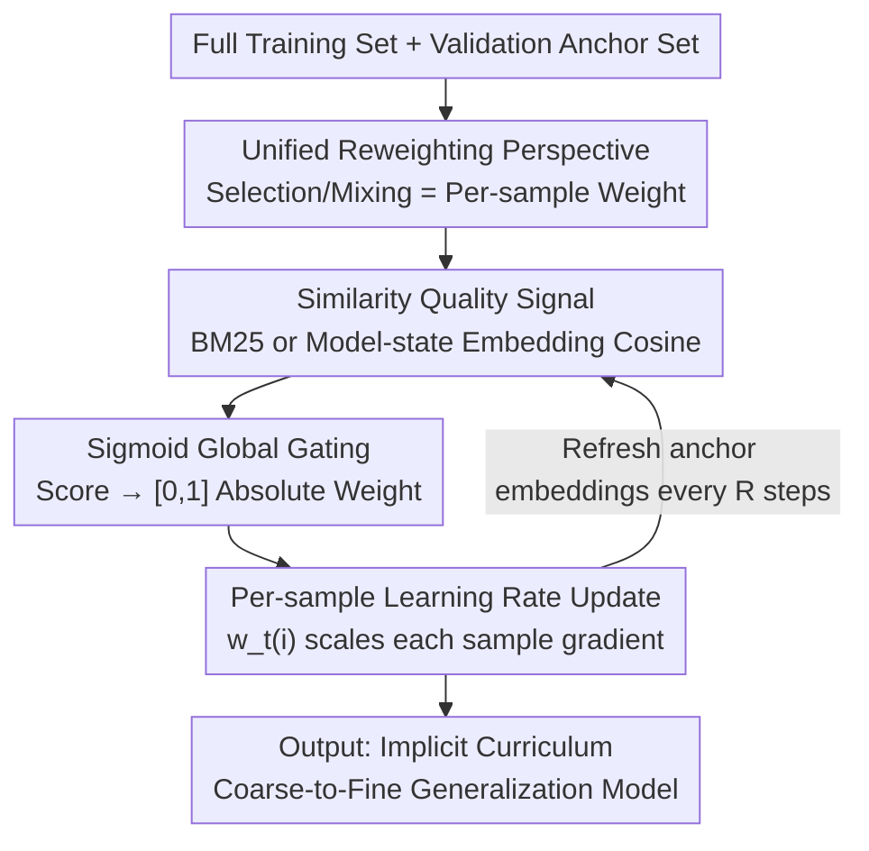

# Rethinking Data Curation in LLM Training: Online Reweighting Offers Better Generalization than Offline Methods

**Conference**: ICLR 2026  
**OpenReview**: [https://openreview.net/forum?id=UFwnsmFZ6R](https://openreview.net/forum?id=UFwnsmFZ6R)  
**Code**: https://github.com/Ryan0v0/ADAPT  
**Area**: LLM Pre-training / Data Curation  
**Keywords**: Data Curation, Online Reweighting, Implicit Curriculum Learning, Generalization, Per-sample Learning Rate

## TL;DR
This paper unifies LLM data curation (selection) and data mixing into an "online reweighting" problem. It proposes ADAPT, which dynamically adjusts the per-sample learning rate based on the semantic similarity between training samples and a validation set during training. Without removing any data and with near-zero additional overhead, ADAPT achieves stronger cross-benchmark generalization than offline selection/mixing methods in both instruction tuning and pre-training.

## Background & Motivation

**Background**: The generalization ability of LLMs depends heavily on the quality, diversity, and proportions of training data. Current mainstream data curation follows an "offline" route in two branches: **data selection**, which prunes the corpus into a subset based on quality scores, and **data mixing**, which adjusts sampling ratios of different domains. Both usually follow a multi-stage pipeline—using a proxy model for feature extraction/scoring, calculating quality signals on a validation set as curation criteria, and then training the main model from scratch on the curated data.

**Limitations of Prior Work**: The authors point out two fundamental flaws in the offline paradigm. First, it **ignores training dynamics**: the value of a sample is not static and changes as the model learns; offline selection "freezes" value before training begins, misaligning with the evolving needs of the actual training model. Second, it **sacrifices diversity**: using hard thresholds to cut a fixed subset discards broadly distributed data that is crucial for robust generalization.

**Key Challenge**: Through a series of experiments (§4), the authors expose the "illusion" of offline selection—models trained on data selected using MMLU as a validation set perform well on MMLU benchmarks but suffer a sharp collapse in generalization on the BBH benchmark. Methods like LESS (gradient influence) are particularly prone to this. In other words, offline methods **overfit the selected validation tasks** rather than learning true generalization; conversely, vanilla training on the full dataset is more stable across benchmarks. A possible reason is that offline curation changes data volume through repetition/resampling, causing the model to replace "generalization" with "memorization."

**Goal**: To find a data curation paradigm that preserves data diversity, adapts to the model state, and is truly cost-effective under a unified FLOPs metric.

**Key Insight + Core Idea**: Reframe data curation from "static pre-processing before training" to "dynamic loss weighting during training." Instead of hard-pruning subsets, the full dataset is retained, and the contribution of each sample to the gradient is dynamically adjusted using loss weights. This weight acts as a **per-sample learning rate**, controlling the "step size" of each sample in parameter updates. In short: **replace offline hard selection with online per-sample reweighting to solve generalization collapse.**

## Method

### Overall Architecture

ADAPT (Adaptive Data reweighting for Pretraining and FineTuning) can be viewed as follows: training proceeds on the **full training set** as usual, but samples within each mini-batch are no longer equal. Each sample is first assigned a similarity score with a validation (anchor) set. This score passes through a sigmoid gate with temperature to become a weight $w_t(i) \in [0, 1]$, which directly scales the gradient of that sample, equivalent to a **per-sample learning rate**. The entire process is embedded in the training loop with no pre-processing or data deletion, resulting in minimal overhead.

Formally, the parameter update for mini-batch $B_t$ at step $t$ is:

$$\theta_{t+1} = \theta_t - \eta \sum_{i \in B_t} w_t(i)\, \nabla_\theta \ell\big(f_\theta(x_i), y_i\big)$$

As $w_t(i) \ge 0$ increases, the effective step size for that sample increases. Samples with low weights have reduced contributions but are **never deleted**. This is the fundamental difference from offline "hard cutting": offline methods set weights to binary 0/1 or fixed domain-level scores, while ADAPT allows weights to float continuously in $[0, 1]$ and refresh according to the model state.

### Key Designs

**1. Unified Reweighting Formalization: Reducing Selection/Mixing/Balancing to Per-sample Weights**

Offline selection and offline mixing have long been treated as distinct techniques. The authors prove they are special cases of the same reweighting framework, enabling comparison under a single metric for the first time. All quality signals are written as a scoring function $s(x) \equiv s(x;\theta,\mathcal{D}_{val})$. In this view: **data selection** equals binary weights $w(x) = \mathbb{1}[s(x) \ge \tau] \in \{0,1\}$; **data mixing** equals domain-level score weights $w_d = g(s_d)/\sum_{d'} g(s_{d'})$; and **online reweighting** uses sample-level continuous weights $w(x)=g(s(x))$, scaled into the loss $\mathcal{L}^*(\theta)=\frac{1}{Z}\sum_x w(x)\mathcal{L}(\theta;x)$. This unification is conceptually elegant and leads to a fair FLOPs evaluation protocol—calculating "scoring pre-processing overhead" and "training overhead" together.

**2. Similarity Quality Signal: Using Model Representations Instead of Frozen Encoders**

Weights are driven by a signal indicating "how similar this sample is to my downstream distribution." ADAPT provides two levels of signals. One is the model-agnostic **ADAPT-BM25**, which uses BM25 sparse retrieval to measure term overlap $s_{BM25}(x)=\frac{1}{|\mathcal{D}_{val}|}\sum_{v} BM25(x,v)$. The primary signal is **ADAPT**: it uses the **model's current dense representations** instead of an external encoder. For input $x$, it takes the last-layer hidden states $\{h_i\}$ and applies **Position-Weighted Average Pooling** $\phi(x)=\sum_i w_i h_i$, where $w_i = i/\sum_j j$ gives higher weight to later tokens to counteract the bias of decoder-only causal masking. Similarity is $s_{ADAPT}(x)=\frac{1}{|\mathcal{D}_{val}|}\sum_v \cos(\phi(x),\phi(v))$. Compared to gradient influence methods like LESS, semantic embedding signals do not vibrate as violently as gradients in early training and avoid expensive gradient computations.

**3. Sigmoid Global Gating: Weights Dependent on Self-similarity, Independent of Batch Composition**

When converting similarity to weights, the authors avoid "batch-wise normalization" like softmax and use a sigmoid with temperature as a **global gate**:

$$w_t(i)=\sigma\!\left(\frac{s_{ADAPT}(x_i)}{\max(\tau,\epsilon)}\right)=\frac{1}{1+\exp(-s_{ADAPT}(x_i)/\max(\tau,\epsilon))}$$

The temperature $\tau$ controls the steepness of the sigmoid. This design ensures weights fall in the absolute range $[0, 1]$ and are **determined only by the sample's own similarity, not its rank within the current batch**. A sample receives the same weight regardless of whether it appears in a high-quality or low-quality batch, making it robust to batch-level quality fluctuations.

**4. Online Anchor Refreshing: Aligning Similarity with Evolving Model Representations**

Since signals come from the model's own representations which change during training, fixed anchor embeddings would quickly become obsolete. ADAPT performs a forward pass on the validation set every $R$ steps using the current parameters $\theta_t$ to **refresh anchor embeddings** $\{\phi(v)\}_{v\in\mathcal{D}_{val}}$. This ensures similarity scores reflect the current representation space. This mechanism allows ADAPT to exhibit **implicit curriculum learning**: similarity distributions shift from collapsed, homogeneous representations to more dispersed, fine-grained embeddings, effectively reproducing curriculum learning principles without explicit scheduling.

### Loss & Training

The training objective is the weighted loss scaled by per-sample weights (see the update equation in the overall architecture), without additional auxiliary losses. Instruction tuning uses LoRA on LLAMA-2-7B. Pre-training uses a 120M parameter TinyLlama architecture (with FlashAttention and Lit-GPT). Anchor sets are typically sampled from evaluation distributions.

## Key Experimental Results

### Main Results

Instruction Tuning: LoRA fine-tuning of LLAMA-2-7B on FLAN V2 / COT / DOLLY / OpenAssistant1. Data selected using MMLU(val), evaluated on MMLU(test, 5-shot) and BBH(test, 3-shot).

| Method | MMLU(val)→MMLU(test) | MMLU(val)→BBH(test, OOD) |
|------|------|------|
| BM25 (Offline) | 48.7 ± 0.9 | 42.3 ± 0.8 |
| Embedding (Offline) | 47.0 ± 0.6 | 40.1 ± 0.5 |
| LESS (Offline, Grad Influence) | 50.2 ± 0.5 | 38.7 ± 1.5 |
| PPL (Offline) | 46.2 ± 1.1 | 40.9 ± 0.9 |
| Random | 43.5 ± 0.3 | 38.4 ± 1.0 |
| Full Dataset SFT | 49.7 ± 0.2 | 44.4 ± 0.3 |
| **ADAPT-BM25** | **50.9 ± 0.6** | 43.7 ± 1.2 |
| **ADAPT** | 50.7 ± 0.7 | **44.8 ± 1.3** |

Note the OOD column: LESS achieves 50.2 in-domain but drops to 38.7 on BBH (worse than random), exposing offline selection overfitting. ADAPT reaches 44.8 on BBH, the highest in the table, with cross-benchmark generalization even slightly exceeding full fine-tuning.

Pre-training: TinyLlama-120M on 50B tokens from SlimPajama. Evaluated on 15 downstream benchmarks 0-shot.

| Method | Average (All) ↑ | Average (Unseen) ↑ | FLOPs Overhead ↓ |
|------|------|------|------|
| Uniform | 37.81 ± 0.13 | 31.98 ± 0.09 | 0 |
| LinUpper (Online) | 37.03 ± 0.12 | 30.56 ± 0.28 | 0 |
| DoReMi | 37.32 ± 0.15 | 31.95 ± 0.17 | $4.92\times10^{19}$ |
| RegMix | 37.97 ± 0.02 | 32.46 ± 0.39 | $3.07\times10^{18}$ |
| **ADAPT-BM25** | **38.05 ± 0.21** | 33.49 ± 0.37 | $\ll 1.0\times10^{14}$ |
| **ADAPT** | 38.00 ± 0.22 | **33.73 ± 0.39** | $\ll 1.1\times10^{15}$ |

ADAPT leads in Average (Unseen), the true measure of generalization, while scoring FLOPs are orders of magnitude lower than DoReMi/RegMix.

### Ablation Study

| Configuration | Key Phenomenon | Explanation |
|------|---------|------|
| ADAPT vs ADAPT-BM25 | OOD 44.8 vs 43.7 | Model-state embeddings generalize better than fixed BM25 |
| ADAPT-BM25 vs Offline BM25 | 50.9/43.7 vs 48.7/42.3 | "Online vs Offline" difference; online version is superior for the same signal |
| Sigmoid Global vs Softmax Batch-wise | Weights independent of batch composition | Global gating is robust to batch-level quality fluctuations |
| Effective Data Ratio | Sum of weights ≈ 0.501 | System automatically determines "effective use of half the data" |

### Key Findings
- **Generalization Collapse Evidence**: LESS is strong in-domain but collapses OOD; ADAPT preserves full diversity and refreshes with model state, remaining stable OOD.
- **Model-state Signal > Fixed Signal**: ADAPT (dynamic embeddings) outperforms ADAPT-BM25 (static), proving adaptation to the evolving model state is key to generalization.
- **Implicit Curriculum is Emergent**: Representations shift from coarse clustering to fine-grained differentiation without explicit scheduling.
- **Zero Overhead**: Scoring is amortized within the training loop, ensuring total FLOPs are much lower than offline methods requiring proxy model retraining.

## Highlights & Insights
- **Unified Perspective**: Mapping selection, mixing, and reweighting to per-sample weights allows comparison on the same scale and introduces a fair FLOPs evaluation protocol.
- **Per-sample Learning Rate**: Framing data curation as optimizer-level "step size" adjustment instead of data-level deletion avoids the diversity loss inherent in hard selection.
- **Position-Weighted Pooling**: A clever trick to counteract decoder-only causal masking bias, applicable to any scenario requiring sentence embeddings from autoregressive models.
- **Global Sigmoid Gating**: Replacing softmax batch normalization makes weights absolute rather than relative, providing robustness to batch compositions.

## Limitations & Future Work
- Scale: Experiments only reach TinyLlama-120M and LoRA 7B; superiority on larger models remains unverified.
- Dependency on Anchor Set: The signal essentially pulls the model toward the validation distribution; if the anchor set is poorly chosen, it might lead to narrow distributions.
- Sensitivity: Limited scanning of hyperparameters like refresh interval $R$, temperature $\tau$, and clipping thresholds.
- Data Ratio Control: The "0.501 effective ratio" is observed rather than controlled; how to predict or adjust this ratio in deployment is unclear.

## Related Work & Insights
- **vs LESS**: LESS uses proxy models for static gradient inner products and overfits in-domain; ADAPT uses online semantic similarity, is smoother, evolves with the model, and has significantly stronger OOD generalization with much lower overhead.
- **vs DoReMi / RegMix**: These adjust sampling at the **domain level** using proxy models; ADAPT performs continuous weighting at the **sample level** without changing volume and yields higher Unseen generalization.
- **vs LinUpper**: LinUpper weights based on normalized loss; ADAPT use similarity signals, avoiding loss noise and significantly outperforming LinUpper in pre-training Unseen benchmarks (33.73 vs 30.56).

## Rating
- **Novelty**: ⭐⭐⭐⭐⭐ High. Reconceptualizing curation as a unified "per-sample learning rate" is theoretical yet practical.
- **Experimental Thoroughness**: ⭐⭐⭐⭐ Good coverage across instruction tuning and pre-training, though model scales are small.
- **Writing Quality**: ⭐⭐⭐⭐ Clear chain of motivation-formalization-methodology.
- **Value**: ⭐⭐⭐⭐⭐ High. Near-zero overhead, plug-and-play, and strong engineering utility.

<!-- RELATED:START -->

## Related Papers

- [\[ICLR 2026\] Can Small Training Runs Reliably Guide Data Curation? Rethinking Proxy-Model Practice](can_small_training_runs_reliably_guide_data_curation_rethinking_proxy-model_prac.md)
- [\[ICLR 2026\] Token-level Data Selection for Safe LLM Fine-tuning](token-level_data_selection_for_safe_llm_fine-tuning.md)
- [\[ICLR 2026\] Rewriting Pre-training Data Boosts LLM Performance in Math and Code](rewriting_pre-training_data_boosts_llm_performance_in_math_and_code.md)
- [\[ICLR 2026\] Common Corpus: The Largest Collection of Ethical Data for LLM Pre-Training](common_corpus_ethical_data_for_llm_pretraining.md)
- [\[ICLR 2026\] Late-to-Early Training: Enabling LLMs to Learn Late-Stage Knowledge Earlier for Faster and Better Training](late-to-early_training_let_llms_learn_earlier_so_faster_and_better.md)

<!-- RELATED:END -->
