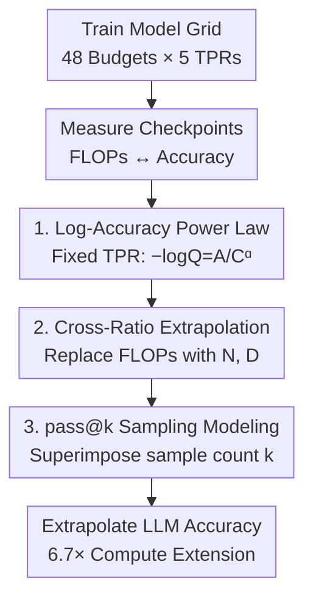

# Revisiting the Scaling Properties of Downstream Metrics in Large Language Model Training

**Conference**: ICLR 2026  
**OpenReview**: [https://openreview.net/forum?id=YnJ2s4WeNF](https://openreview.net/forum?id=YnJ2s4WeNF)  
**Code**: https://github.com/apple/ml-scaling-downstream-metrics  
**Area**: LLM Pre-training / Scaling Laws  
**Keywords**: Downstream metric scaling law, Power law, Direct prediction, Two-stage method, pass@k

## TL;DR
This paper challenges the conventional wisdom that "downstream benchmark accuracy is unpredictable" and proposes a two-parameter power law $-\log Q = A/C^{\alpha}$ to **directly** model downstream accuracy from training FLOPs. It extends this to different token-to-parameter ratios and repeated sampling (pass@k). Experiments on a grid up to 17B parameters and 350B tokens demonstrate that this method is more accurate and stable for extrapolation than the classic "two-stage method" (predicting proxy metrics first, then mapping to accuracy).

## Background & Motivation

**Background**: Scaling laws are standard tools for planning large-scale training. Traditionally, they only model **proxy metrics** (e.g., pre-training log-perplexity) because the loss-compute curve is smooth and predictable, allowing researchers to choose optimal token-parameter ratios and budget allocations.

**Limitations of Prior Work**: The primary interest lies in **downstream capabilities** (accuracy on benchmarks for commonsense, reasoning, math, and code). However, these metrics are widely considered "noisy and unreliable" for direct prediction. Consequently, the mainstream approach uses a **two-stage method**: first mapping the training budget to a proxy metric (loss or negative log-likelihood, NLL), then using a second function to map the proxy to accuracy (e.g., LLaMA 3, Chen et al., and the compute-efficient ladder by Bhagia et al.).

**Key Challenge**: While the two-stage method decomposes the problem, **errors accumulate across stages**. Fitting errors in the first stage (FLOPs $\rightarrow$ NLL) are amplified in the second stage (NLL $\rightarrow$ accuracy), leading to higher variance and poor extrapolation. Furthermore, it remains unclear how to select or calibrate proxy metrics for non-multiple-choice tasks like code generation (pass@k) or exact-match tasks. "Emergence" phenomena also challenge the assumption of a single global proxy-to-accuracy mapping.

**Goal**: (1) Verify if downstream accuracy itself is predictable from the training budget; (2) Identify a simple functional form for **direct** prediction from FLOPs; (3) Extend it to different token-parameter ratios and pass@k sampling for code tasks.

**Key Insight**: Authors observed a critical empirical phenomenon: in a log-log coordinate system, **log-accuracy $\log Q$ is approximately linear with training FLOPs**. This implies $-\log Q$ itself follows a power law relative to $C$, making intermediate proxy metrics unnecessary.

**Core Idea**: Directly replace the "FLOPs $\rightarrow$ proxy $\rightarrow$ accuracy" chain with a power law of log-accuracy to eliminate error accumulation.

## Method

### Overall Architecture
The objective is to predict benchmark accuracy using only training compute. The approach involves: training a **model grid** covering diverse compute budgets and token-parameter ratios; measuring training FLOPs and downstream accuracy for each checkpoint; fitting a **simple two-parameter power law** to the "log-accuracy vs. FLOPs" relationship; extending this base law to account for token-parameter ratios and pass@k sampling; and finally, validating prediction accuracy by extrapolating from low-compute intervals to held-out models with $6.7\times$ more compute.

The three key designs progress hierarchically: Design 1 provides the base law for fixed ratios, Design 2 adds degrees of freedom for model size $N$ and data volume $D$, and Design 3 incorporates the number of samples $k$ at inference time.

### Key Designs

**1. Direct Power Law: Modeling log-accuracy as a power law of compute**

To solve error accumulation, authors model the target accuracy directly. After excluding 4-parameter BNSL (Broken Neural Scaling Law) and standard power laws (which incorrectly force strict concavity on S-shaped curves like ARC-Easy), authors propose:

$$-\log(Q) = \frac{A}{C^{\alpha}}$$

where $A>0, \alpha>0$ are coefficients for each benchmark. This form naturally describes S-curves with only two parameters. For multiple-choice questions, accuracy is normalized to $[0,1]$ to account for random guessing ($Q_{\text{random}}$):

$$Q' = \frac{Q - Q_{\text{random}}}{1 - Q_{\text{random}}}$$

Only runs exceeding the random baseline by 5% are used for fitting to avoid high-variance noise. This approach achieves a validation MAE of $\approx 0.0195$ and MRE of $\approx 1.95\%$.

**2. Cross Token-Parameter Ratio Extrapolation: Splitting FLOPs into $N$ and $D$**

Authors expand the law to accommodate varying model sizes $N$ and data volumes $D$, mirroring Hoffmann et al.'s loss law but **removing the irreducible term**:

$$-\log Q = \frac{A}{N^{\alpha}} + \frac{B}{D^{\beta}}$$

The rationale is that while perplexity has an irreducible entropy floor, accuracy has a theoretical ceiling of 1. Authors assume perfect accuracy is achievable with infinite compute. Coefficients are fitted using L-BFGS-B minimizing Huber loss ($\delta=10^{-3}$). On held-out sets ($C > 6\times10^{21}$ FLOPs or TPR $>80$), validation MAE is $\approx 0.0191$.

**3. pass@k Repeated Sampling Modeling: Incorporating inference-side sampling**

For code tasks using pass@k, authors observed that at a fixed training budget, $-\log(\text{pass@k})$ is approximately linear with $\log k$, and the **slope steepens with training compute**. Coupling this with Design 1 yields a joint formulation with a cross-term:

$$\log(-\log Q(C,k)) = \log A + \alpha\log C + \beta\log k + \delta\log C\log k$$

The term $\delta\log C\log k$ captures how the benefit of sampling changes with model strength. Validation on HumanEval ($C > 6\times10^{21}$) shows an MAE of $\approx 0.0284$.

### Loss & Training
The study fits scaling law coefficients rather than training new objectives. Design 1 uses least squares, while Designs 2 and 3 use L-BFGS-B with Huber loss ($\delta=10^{-3}$). Models are standard pre-norm decoder-only Transformers (RoPE, SwiGLU, 150k vocab, 4096 seq len) trained on 75% DCLM + 15% Stack v2 + 10% OpenMathReasoning. A separate C4-based mix is used to verify that conclusions are data-agnostic.

## Key Experimental Results

**Scale**: 48 budgets × 5 token-parameter ratios (10/20/40/80/160), $\approx 130$ experiments, up to 17B parameters and 350B tokens. 12 benchmarks evaluated (ARC, HellaSwag, GSM8K, HumanEval, etc.).

### Main Results: Direct Power Law vs. BNSL vs. Two-Stage

Extrapolating from $3\times10^{18}\dots6\times10^{21}$ FLOPs to models with up to $6.7\times$ more compute:

| Scaling Law Strategy | MRE (%) | MAE | RMSE | $R^2$ |
|------|------|------|------|------|
| PowerLaw (Ours) | **1.96** | **0.015** | 0.011 | 0.986 |
| BNSL (Direct, 4-param) | 2.71 | 0.020 | **0.007** | **0.993** |
| TwoStage-Linear | 6.67 | 0.044 | 0.023 | 0.943 |
| TwoStage-Logistic | 6.35 | 0.047 | 0.017 | 0.974 |

**Insight**: Two-stage methods often show better **in-distribution fit** (higher $R^2$), but their extrapolation MRE is $3\times$ higher than the direct method, confirming significant error amplification.

### Key Findings
- **Direct > Two-Stage**: Even if two-stage models fit training data better, their extrapolation is significantly worse due to accumulated errors across mapping stages.
- **Simple Power Law $\approx$ BNSL**: The two-parameter power law matches or exceeds the four-parameter BNSL in extrapolation quality while being more robust.
- **Data Agnostic**: Trends hold across different data mixtures (DCLM vs. C4), suggesting scaling properties are not tied to specific data distributions.
- **Omission of Irreducible Term**: Accuracy scaling does not require an irreducible error term since the theoretical bound is 1, unlike perplexity.

## Highlights & Insights
- **Log-accuracy power law as a pivot**: Transforming accuracy via logarithms to achieve log-log linearity handles S-curves with minimal parameters.
- **Extrapolation Benchmark**: A cautionary methodological note—better training fit ($R^2$) does not equal better extrapolation. Scaling laws must be validated on held-out compute scales.
- **Boundary-driven functional form**: Selecting functional forms based on theoretical bounds (1 for accuracy vs. entropy floor for loss) is a transferable insight for modeling other metrics.
- **Unified Training-Inference Scaling**: The pass@k cross-term provides a practical recipe for balancing training budget vs. inference sampling compute.

## Limitations & Future Work
- The work is positioned as incremental; it provides a recipe for fixed datasets rather than a universal law.
- The assumption that accuracy reaches 1 may fail on benchmarks with structural upper bounds or noise/contamination.
- Scale is limited to 17B parameters; the $6.7\times$ extrapolation range, while significant, does not yet reach the $100\times$ jumps seen in frontier models.
- pass@k modeling accuracy (MRE $\approx 7.9\%$) remains lower than classification tasks.

## Related Work & Insights
- **vs. Two-Stage (LLaMA 3 / Bhagia et al.)**: Direct FLOPs-to-accuracy bypasses mapping errors and applies to non-multiple-choice tasks.
- **vs. BNSL**: Authors offer a simpler two-parameter alternative that is less prone to over-fitting on small scales.
- **vs. pass@k Scaling**: While prior work showed pass@k scales with $k$, this paper unifies it with training compute $C$ through a single equation.

## Rating
- Novelty: ⭐⭐⭐⭐
- Experimental Thoroughness: ⭐⭐⭐⭐⭐
- Writing Quality: ⭐⭐⭐⭐
- Value: ⭐⭐⭐⭐⭐

<!-- RELATED:START -->

## Related Papers

- [\[ICLR 2026\] Unveiling Downstream Performance Scaling of LLMs: A Clustering-Based Perspective](unveiling_downstream_performance_scaling_of_llms_a_clustering-based_perspective.md)
- [\[ICLR 2026\] SPICE: Submodular Penalized Information–Conflict Selection for Efficient Large Language Model Training](spice_submodular_penalized_informationconflict_selection_for_efficient_large_lan.md)
- [\[ICLR 2026\] Scaling Laws Revisited: Modeling the Role of Data Quality in Language Model Pretraining](scaling_laws_revisited_modeling_the_role_of_data_quality_in_language_model_pretr.md)
- [\[ICLR 2026\] Pretraining Scaling Laws for Generative Evaluations of Language Models](pretraining_scaling_laws_for_generative_evaluations_of_language_models.md)
- [\[ICLR 2026\] Scaling Behavior of Discrete Diffusion Language Models](scaling_behavior_of_discrete_diffusion_language_models.md)

<!-- RELATED:END -->
