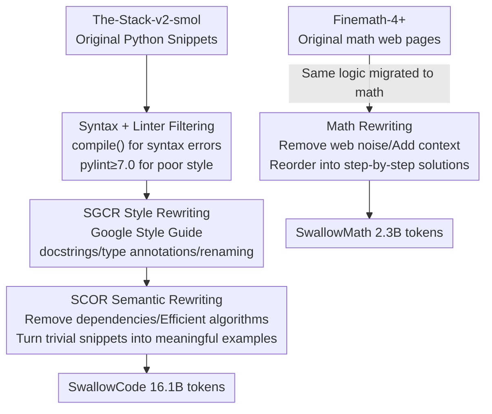

# Rewriting Pre-training Data Boosts LLM Performance in Math and Code

**Conference**: ICLR 2026  
**OpenReview**: [https://openreview.net/forum?id=45btPYgSSX](https://openreview.net/forum?id=45btPYgSSX)  
**Code**: https://github.com/rioyokotalab/swallow-code-math  
**Area**: LLM Pre-training / Data Engineering  
**Keywords**: Pre-training data, Data rewriting, Code generation, Mathematical reasoning, transform-and-retain

## TL;DR
Instead of "filtering and discarding," this paper uses a 70B model to "rewrite clean and retain" open-source code and math corpora, constructing two datasets: SwallowCode (≈16.1B tokens) and SwallowMath (≈2.3B tokens). In continued pre-training with a fixed budget of 50B tokens, Llama-3.1-8B achieves a +17.0 improvement in HumanEval pass@1 and a +12.4 improvement in GSM8K, proving that data quality is the fundamental bottleneck for code and mathematical capabilities.

## Background & Motivation
**Background**: The code synthesis and mathematical reasoning capabilities of LLMs are inherently limited by the quality of pre-training corpora. Current mainstream open corpora (e.g., The-Stack-v1/v2 for code, Finemath-4+ for math) rely on two main methods: rule-based extraction from web crawls like CommonCrawl, or training a quality classifier to score samples and discard low-scoring ones. Stack-Edu represents the latter—using Llama-3-70B to score 500k code snippets from 0–5 and training a language-related classifier with a threshold of 3, resulting in a 125B token "clean" subset.

**Limitations of Prior Work**: Such "exclusionary filtering" only discards low-quality samples without fixing them. Consequently, even filtered data contains many "garbage snippets" with missing context, inconsistent naming, dependencies on external libraries, inefficient algorithms, or simple constant printing. Discarding low-score samples entirely means losing potentially salvageable information and real-world diversity, leading to low data utilization.

**Key Challenge**: A trade-off exists between quality and data utilization. Achieving quality often requires aggressive filtering that discards many samples (and thus diversity); preserving diversity requires tolerating noise. Meanwhile, synthetic code data generated from scratch risks "diversity collapse" if it lacks diverse seeds, limiting model performance.

**Goal**: To "pull up" the quality of low-quality snippets without sacrificing real-world code diversity, constructing a reproducible, open-source, and sustainably updatable high-quality code/math pre-training corpus, and verifying that this method generalizes across domains.

**Key Insight**: The authors propose the **transform-and-retain** paradigm—rewriting low-quality snippets instead of discarding them. Low-quality snippets are not valueless; they are simply poorly written. Using a strong LLM to rewrite them into self-contained, algorithmically efficient examples according to style and semantic specifications eliminates noise while preserving the semantics and diversity of real data. To ensure "performance gains truly come from data quality" rather than a strong base model, the authors chose the non-saturated Llama-3.1-8B as the starting point (rather than Qwen2.5/3), allowing for clear attribution.

**Core Idea**: Use Llama-3.3-70B-Instruct to **rewrite** (instead of filter) pre-training corpora, transforming noisy code/math into pure samples that are self-contained, stylized, and efficient, thereby significantly boosting downstream code and math performance within a fixed compute budget.

## Method

### Overall Architecture
The paper applies the "transform-and-retain" concept to two domains. For code (SwallowCode), a four-stage pipeline is used: first, two rounds of **rule filtering** remove syntax errors and poor styles (ensuring LLM input is decent), followed by two rounds of **LLM rewriting** to refine samples—first for style (SGCR) and then for semantics (SCOR). For math (SwallowMath), the same strategy of "removing noise, adding context, and reordering steps" is applied via an LLM rewrite prompt on Finemath-4+. Every stage is validated by data ablation experiments.

### Key Designs

**1. transform-and-retain: Rewriting and retaining low-quality samples instead of filtering and discarding**

This is the central thesis addressing the pain point where "exclusionary filtering" discards useful information and diversity. The approach retains low-quality snippets but has a strong LLM rewrite them into high-quality versions based on defined specifications. Compared to the "score and keep" method used by Stack-Edu, rewriting fixes persistent defects (missing context, messy naming, external dependencies) that filtering cannot, maximizing data utilization. The authors distinguish this from "Rephrasing the Web / Nemotron-CC," as they maintain a code-only format (no text-code pairs) to ensure gains come from data quality rather than implicit instruction-following capabilities.

**2. Rule filtering: Ensuring input quality for the LLM**

The core pain point is that rewriting raw The-Stack-v2 data wastes compute on non-compilable/non-lintable garbage, and poor input yields poor output. The first stage is **syntax filtering**—using Python's `compile()` to check each sample, reducing sample count from ~41M to 37M (−9.7%). The second is **Linter filtering**—using pylint with a threshold of 7.0/10 and a custom heuristic penalty for "overly verbose comments," further reducing samples to 24.1M (−34.3%). Each filtering stage contributes over 1 point to HumanEval/HumanEval+. Syntax filtering precedes linting for efficiency.

**3. SGCR + SCOR: Two-stage LLM rewriting for style and semantics**

This is the primary driver of performance. Rewriting is split into two stages because tasking an LLM with both style and semantic changes simultaneously often degrades output quality. **SGCR (Style-Guided Code Rewriting)** modifies style without altering semantics: it adds docstrings, type annotations, standardizes variable reassignments, and normalizes function/class names based on ten standards. It improves performance by 7–9 points over filtering. **SCOR (Self-Contained Optimization Rewriting)** follows SGCR to address semantic issues: (i) missing dependencies, (ii) inefficient algorithms (e.g., converting naive recursion to DP), and (iii) trivial snippets (e.g., constant printing). SCOR adds another 5–6 points. Together, rewriting contributes ~14 points.

**4. Math Transfer: Generalizing to Finemath-4+**

To verify generalizability, the paradigm was applied to the math domain. Finemath-4+ content is often embedded in irrelevant web fragments across various difficulty levels. The authors designed an LLM rewrite prompt (using Llama-3.3-70B) to: (1) remove web noise and privacy statements, (2) strip irrelevant metadata, (3) restore context to fragmented problems/solutions, (4) rewrite derivations clearly, and (5) provide step-by-step solutions. This led to a +12.4 increase in GSM8K and +7.6 in MATH.

## Key Experimental Results

The experimental protocol used Llama-3.1-8B for continued pre-training with a fixed ~50B token budget. Ablations were performed by swapping target corpora while keeping all other variables (architecture, parameters, non-target data, budget, hyperparameters) constant.

### Main Results

| Task | Metric | Ours | Baseline | Gain |
|------|------|-----------|----------|------|
| HumanEval | pass@1 | SwallowCode | Stack-Edu | **+17.0** |
| HumanEval+ | pass@1 | SwallowCode | Stack-Edu | **+16.1** |
| GSM8K | accuracy | SwallowMath | Finemath-4+ | **+12.4** |
| MATH | accuracy | SwallowMath | Finemath-4+ | **+7.6** |
| HumanEval (Qwen2-7B, 20B token) | pass@1 | SwallowCode | Stack-Edu | +10.3 |
| HumanEval+ (Qwen2-7B, 20B token) | pass@1 | SwallowCode | Stack-Edu | +10.3 |

SwallowCode outperforms all comparable open corpora (CodeParrot-Clean, The-Stack-v1/v2, Stack-Edu). The results replicated on Qwen2-7B confirm the method is not tied to the Llama-3 family.

### Ablation Study (HumanEval/HumanEval+ Gains)

| Pipeline Stage | Relative Gain | Description |
|------------|-------------------|------|
| Syntax Filtering | ~ +1 point | Removes non-compilable samples (−9.7% count) |
| Linter Filtering | > 1 point | pylint ≥ 7.0 (−34.3% count) |
| LLM Score Filtering | < 1 point | Discarded due to high compute cost vs performance |
| SGCR Style Rewriting | +7~9 points | Uniform style, docstrings, type annotations |
| SCOR Semantic Rewriting | +5~6 points | Self-contained, algorithmic optimization |

### Key Findings
- **Rewriting is the major contributor**: Filtering adds 1–2 points total, while SGCR+SCOR add ~14 points, proving "enhancing quality" is more effective than "filtering."
- **Filtering before rewriting is optimal**: Performing SGCR after filtering outperforms SGCR on raw data by 0.4–2.1 points.
- **Two-stage rewrite is necessary**: Prompts showed that balancing both style and semantics in one pass degrades quality.
- **De-contamination**: Strict de-contamination (no exact matches/high similarity) was performed between SwallowCode/Math and evaluation sets.

## Highlights & Insights
- **Shift in Data Paradigms**: While data engineering has focused on "filtering classifiers" for a decade, this paper provides strong evidence that fixing "dirty" samples is more efficient than discarding them within a fixed compute budget.
- **Maintaining code-only output**: By avoiding prompt-response structures, the authors isolated performance gains to data quality rather than implicit instruction fine-tuning.
- **Non-saturated base + No SFT/RL**: Using Llama-3.1-8B (rather than frontier models) and focusing solely on pre-training effects ensures the improvements are correctly attributed to data quality.
- **Transferable "Recipe"**: The "filter → style → semantics" pipeline for code maps directly to "denoise → context → reorder" for math, suggesting it can be applied to other domains.

## Limitations & Future Work
- Rewriting might retain biases from the source data (e.g., specific coding patterns in Stack v2) or inherit preferences from Llama-3.3-70B.
- Evaluations were conducted at a 50B token scale; trends for massive-scale pre-training remain to be explored.
- The code results are Python-specific (though the pipeline is designed to be language-agnostic).
- Rewriting has higher upfront compute costs (22% more than LLM scoring), though the authors argue this is offset by higher data efficiency during training.

## Related Work & Insights
- **vs Stack-Edu**: Stack-Edu discards diversity; this work "lifts" quality to maximize utilization.
- **vs Rephrasing the Web / Nemotron-CC**: These transform data into QA formats; this work remains "code-only" to avoid attribution blurring.
- **vs Jain et al. 2023**: While they used renaming/modularization for SFT samples, this work applies a more comprehensive set of standards (style + semantics) to massive pre-training data.
- **vs Magpie / Cosmopedia**: Instead of pure synthesis, which risks diversity collapse, this work rewrites real-world code to maintain diverse seeds.

## Rating
- Novelty: ⭐⭐⭐⭐ Transforms "rewriting" into a complete, cross-domain pipeline.
- Experimental Thoroughness: ⭐⭐⭐⭐⭐ Rigorous ablations, cross-model replication, and strict de-contamination.
- Writing Quality: ⭐⭐⭐⭐⭐ Clear logical chain from motivation to method to results.
- Value: ⭐⭐⭐⭐⭐ Open-source dataset, prompts, and checkpoints provide high utility for the community.

<!-- RELATED:START -->

## Related Papers

- [\[ICLR 2026\] Common Corpus: The Largest Collection of Ethical Data for LLM Pre-Training](common_corpus_ethical_data_for_llm_pretraining.md)
- [\[ICLR 2026\] Nemotron-CC-Math: A 133 Billion-Token-Scale High Quality Math Pretraining Dataset](nemotron-cc-math_a_133_billion-token-scale_high_quality_math_pretraining_dataset.md)
- [\[ICLR 2026\] Pre-training LLM without Learning Rate Decay Enhances Supervised Fine-Tuning](pre-training_llm_without_learning_rate_decay_enhances_supervised_fine-tuning.md)
- [\[ICLR 2026\] Late-to-Early Training: 让 LLM 更早学到后期知识，从而更快更好](late-to-early_training_let_llms_learn_earlier_so_faster_and_better.md)
- [\[ICLR 2026\] Unveiling Downstream Performance Scaling of LLMs: A Clustering-Based Perspective](unveiling_downstream_performance_scaling_of_llms_a_clustering-based_perspective.md)

<!-- RELATED:END -->
