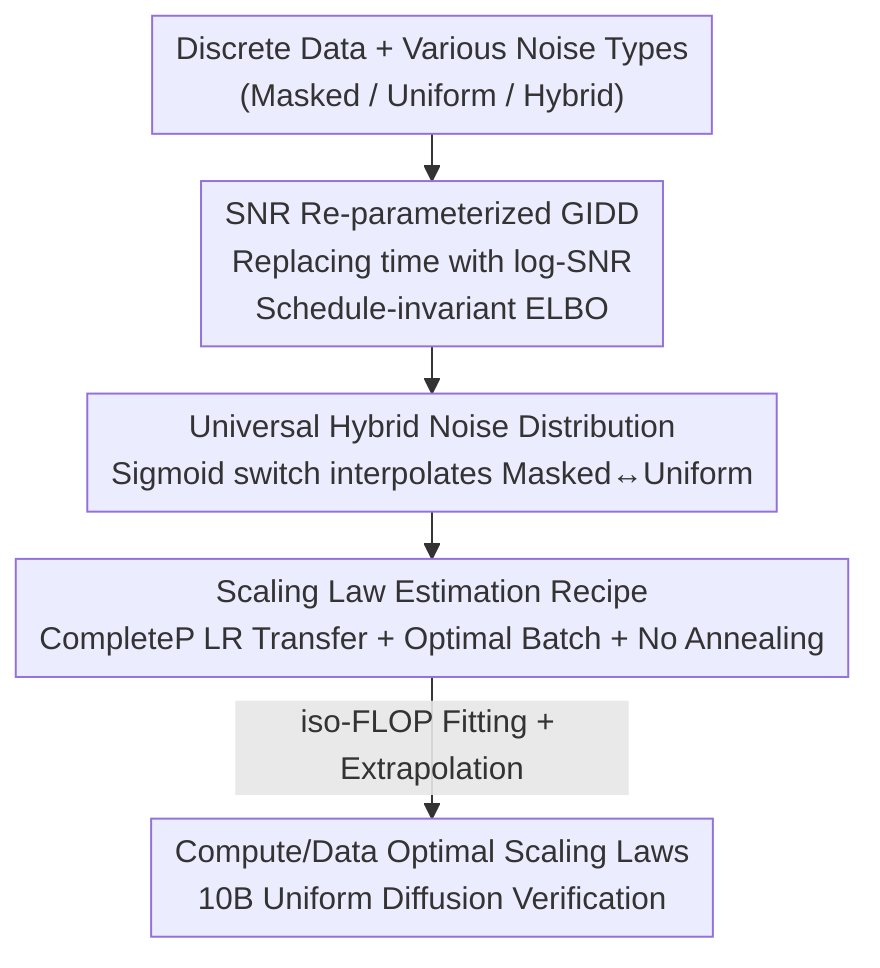

# Scaling Behavior of Discrete Diffusion Language Models

**Conference**: ICLR 2026  
**OpenReview**: [https://openreview.net/forum?id=GDYaNzxt9T](https://openreview.net/forum?id=GDYaNzxt9T)  
**Code**: [https://github.com/dvruette/gidd-easydel](https://github.com/dvruette/gidd-easydel)  
**Area**: Pre-training / Diffusion Language Models / Scaling Laws  
**Keywords**: Discrete Diffusion, Scaling Laws, Uniform Diffusion, Masked Diffusion, Compute-optimal  

## TL;DR
This paper systematically investigates the scaling laws of discrete diffusion language models (DLMs) under various noise types. By employing a unified diffusion framework parameterized by signal-to-noise ratio (SNR) that smoothly interpolates between masked and uniform diffusion, and carefully calibrating batch size and learning rate, the authors find that DLM scaling behavior heavily depends on the noise type. Uniform diffusion is more "data-efficient but parameter-hungry" in data-constrained scenarios. The study scales uniform diffusion models up to 10B parameters / $10^{22}$ FLOPs, verifying that their scaling laws can compete with autoregressive models (ALMs).

## Background & Motivation
**Background**: Modern LLM pre-training is almost entirely dominated by autoregressive language models (ALMs), with model size and data volume allocated according to Chinchilla scaling laws. Discrete diffusion language models (DLMs) have emerged as an alternative paradigm, decomposing the generation process into a sequence of denoising steps—refining $N$ tokens from pure noise to pure signal. The number of denoising steps $T$ can be selected independently of $N$, naturally supporting parallel multi-token generation and the revision of any token at each step, addressing two major shortfalls of ALMs.

**Limitations of Prior Work**: Within DLMs, masked diffusion (MDM) has become mainstream due to its strong small-scale performance. However, it faces two concerns: first, existing work (Nie et al.) reported that MDM requires $16\times$ more compute than ALMs to match the same loss in compute-optimal settings; second, each token in MDM undergoes only one state transition (masked $\leftrightarrow$ unmasked), preventing iterative revision between two "revealed" states. Meanwhile, the scaling behavior of "non-masked" variants like uniform or hybrid diffusion has rarely been studied beyond small-scale ablations.

**Key Challenge**: Moving from ALM to masked and then to uniform diffusion essentially removes structural constraints and inductive biases from the generation process. Fewer constraints make the task harder (uniform diffusion must not only fill in tokens but also determine which tokens are noise), leading to higher loss at small scales. Conversely, fewer constraints imply higher "plasticity," theoretically requiring more capacity but offering better scaling with compute. The question remains: does this intuition hold for actual scaling laws? Furthermore, prior MDM scaling studies made questionable assumptions—fixing learning rates and batch sizes as constants and assuming loss approaches zero at infinite compute.

**Goal**: To cleanly re-estimate the scaling laws of masked, uniform, and hybrid noise within a unified framework, comparing compute-bound and token-bound settings, and extrapolating predictions to 3B/10B models for verification.

**Key Insight**: Noticing that continuous diffusion relies on the principle that the process is invariant to the noise schedule (where time is a proxy for SNR), the authors re-parameterize discrete diffusion using log-SNR. This unifies the theory and allows the construction of a family of hybrid noises that slide smoothly between masked and uniform diffusion. Simultaneously, they relax assumptions on batch size, learning rate, and irreducible loss to re-estimate scaling laws from scratch.

**Core Idea**: A unified discrete diffusion family parameterized by SNR combined with a precise hyper-parameter scaling recipe to quantify "how noise types change scaling laws," proving that uniform diffusion is a promising candidate for the compute-heavy/data-limited era.

## Method

### Overall Architecture
The "method" is not a specific new model architecture but an experimental apparatus designed to fairly compare the scaling behavior of different noise types. The process follows three stages: first, re-parameterizing Generalized Interpolated Discrete Diffusion (GIDD) via log-SNR to obtain a schedule-invariant likelihood lower bound; second, defining a "universal hybrid noise distribution" using a sigmoid switch to interpolate between masked and uniform noise; and third, applying a scaling law estimation recipe (CompleteP for learning rate transfer, treating batch size as a critical hyper-parameter, and omitting LR annealing) to fit compute-optimal frontiers across a wide range of model/data/batch combinations, finally extrapolating to 3B/10B for validation.

### Key Designs

**1. SNR Re-parameterized GIDD: Unifying Discrete and Continuous Theory**

Discrete diffusion typically uses time $t$ to describe the noising process, but the authors argue that the signal-to-noise ratio is what truly matters. Using GIDD as a foundation, the noising process is written as an interpolation between one-hot data $x$ and a time-varying mix distribution $\pi_t$: $q_t(x)=\alpha_t x+\beta_t\pi_t$, where $\beta_t=1-\alpha_t$. Defining log-SNR as $\lambda=\log\frac{\alpha}{1-\alpha}$ leads to $\alpha=\sigma(\lambda)$ and a forward process simplified to $q_\lambda(x)=\sigma(\lambda)x+\sigma(-\lambda)\pi_\lambda$. The authors prove (Proposition 1) that the ELBO for GIDD can be rewritten as importance sampling over log-SNR:

$$-\log p(x)\le \mathbb{E}_{\lambda,z}\Big[\tfrac{w_\lambda(x)z}{p(\lambda)}\{D_{\mathrm{KL}}(q_\lambda(x)\|q_\lambda(x_\theta))+D_{\mathrm{IS}}(q_\lambda(x)z\|q_\lambda(x_\theta)z)\}\Big]+C$$

This yields three benefits: schedule invariance (allowing free choice of schedule), a simpler likelihood bound involving only the derivative $\pi'_\lambda$, and a theoretical bridge between discrete and continuous diffusion.

**2. Universal Hybrid Noise Distribution: A Sigmoid Switch**

To fairly compare noise types, the authors define a hybrid distribution that interpolates smoothly:

$$\pi_\lambda=\sigma(a\lambda+b)\,u+(1-\sigma(a\lambda+b))\,m$$

where $u$ is the uniform (random replacement) probability vector and $m$ is the mask probability vector. $a$ and $b$ control the transition point and speed. Fixing $a>0$, $b\to-\infty$ yields pure masked diffusion, while $b\to+\infty$ yields pure uniform diffusion. This allows the model to decide which stage of denoising uses masking versus random perturbation based on SNR. Since the ELBO is in SNR form, this only requires $\pi'_\lambda=a\sigma'(a\lambda+b)(u-m)$.

**3. Scaling Law Recipe: LR Transfer, Dynamic Batching, and No Annealing**

The authors relax old assumptions to ensure clean results. First, they use CompleteP (a $\mu$P variant) so optimal LR transfers across model widths and depths, requiring only one sweep at 25M/50M to set the baseline ($\sigma_{\text{base}}=0.4,\ \eta_{\text{base}}=0.3$). Second, they found batch size $B^*$ is not a constant but scales near-linearly with tokens $D$: $B^*=10^{2.4}D^{0.8225}$. The optimal LR is then a power law of the batch size: $\eta^*=10^{2.06}B^{0.3412}$. Third, they omit LR annealing in favor of a warmup-stable schedule, proving annealing provides a constant $2.45\%\pm0.138\%$ improvement without shifting optimal hyper-parameters. Fitting is done using the iso-FLOP profile (Approach 2 from Hoffmann et al.) using a precise FLOPs-per-token count.

### Loss & Training
The "unweighted ELBO" ($p(\lambda):=1$) is used as a proxy loss for better convergence, while the true ELBO is used for scaling law evaluation. The optimizer is LaProp (an Adam variant). The architecture is a standard Transformer with stability enhancements: Squared ReLU, pre-block RMSNorm, QK-norm, attention logit soft-capping, and attention sinks. Data is the unfiltered Nemotron-CC with a $2^{17}$ BPE vocabulary. Support is included for prefix completion, Diffusion Forcing (independent noise levels per token), and variable-length generation via random empty token padding.

## Key Experimental Results

### Main Results
Models from 25M to 570M parameters were trained across various token/batch/LR combinations (approx. 510 runs). The following table shows compute-optimal exponents ($M^*\propto C^{\alpha_M}$ model size, $D^*\propto C^{\alpha_D}$ data volume, $L^*\propto C^{\alpha_L}$ loss):

| Model Type | $\alpha_M$ (Parameter-heavy) | $\alpha_D$ (Data-light) | $\alpha_L$ (Loss Scaling) |
|----------|------|------|------|
| Masked | 0.566 | 0.434 | -0.0496 |
| Low-uniform | 0.535 | 0.465 | -0.0509 |
| Balanced | 0.534 | 0.466 | -0.0512 |
| High-uniform | 0.573 | 0.427 | -0.0514 |
| Uniform | **0.589** | **0.411** | **-0.0522** |
| ALM: Chinchilla | 0.49 | 0.51 | – |
| ALM: DeepSeek (Bi et al.) | 0.5243 | 0.4757 | – |

All diffusion types are more parameter-heavy/data-light than ALM, with uniform diffusion being the most extreme ($\alpha_M = 0.589$). Its most negative $\alpha_L$ indicates that uniform diffusion loss drops fastest as compute increases.

### Ablation Study
| Configuration | Key Results | Description |
|------|---------|------|
| LR Annealing vs No Annealing | Constant gain $2.45\%\pm0.138\%$ | Annealing shifts loss but not optimal hyper-parameters. |
| Optimal Batch Size Fit | $B^*=10^{2.4}D^{0.8225}$, $R^2=0.975$ | Batch size scales near-linearly with data, independent of noise type. |
| Optimal LR Fit | $\eta^*=10^{2.06}B^{0.3412}$, $R^2=0.909$ | LR is a power law of batch size. |
| Masked vs Uniform Likelihood Gap | $3.2\%\,(10^{18})\to1.7\%\,(10^{21})$ | The gap shrinks as compute increases, supporting the prediction that uniform catches up. |

### Key Findings
- **Noise Type Shifts Scaling Laws**: Moving from masked to uniform noise increases $\alpha_M$ and decreases $\alpha_D$, suggesting models should be larger given less data—crucial for the data-constrained era.
- **Compute-Bound Convergence**: Under compute-bound settings, different noise types converge to similar losses. However, uniform diffusion wins in token-bound settings.
- **Accurate Extrapolation**: Scaling laws fitted on small models (≤570M) accurately predicted performance for models $50\times$ larger (3B/10B).
- **Hyperbolic Batch-Step Relation**: Reaching a target loss follows a hyperbolic trade-off between steps and batch size: $\big((S/S_{\min})^\alpha-1\big)\big((B/B_{\min})^\alpha-1\big)=1$.

## Highlights & Insights
- **SNR Unification**: Applying continuous diffusion insights to discrete diffusion provides a cleaner theory and a simple implementation.
- **Sigmoid Parameterization**: Treating the noise spectrum as a continuous knob enabled the first fair large-scale comparison across noise types.
- **Batch Size as First-Class Citizen**: Proving that batch size is a predictable function of token volume allows for more efficient scaling studies.
- **The "Plasticity" Insight**: Uniform diffusion, while "slower to learn" at small scales due to fewer inductive biases, is more "plastic" and eventually scales better with high compute.

## Limitations & Future Work
- The bpb (bits-per-byte) metrics are a mix of conditional and unconditional likelihood and **cannot be directly compared to ALMs**.
- The hyperbolic $B$-$S$ relationship and minimum steps/batch are phenomenological and may not hold near the irreducible loss.
- Verification only reached 10B / $10^{22}$ FLOPs; claiming DLMs surpass ALMs at larger scales remains an extrapolation. Downstream quality (NLP benchmarks) is primarily in the appendix.
- Future Work: Using the SNR framework for adaptive schedules, testing uniform diffusion at even larger scales, and quantifying inference speedups from parallel generation.

## Related Work & Insights
- **vs Nie et al. (2025a)**: By relaxing fixed hyper-parameter assumptions, Ours suggests DLMs are more compute-competitive than previously reported.
- **vs Ni et al. (2025)**: Differences in scaling coefficients highlight the sensitivity of DLM scaling to experimental details (hyper-parameters and data).
- **vs ALM Scaling**: While ALMs are "data-hungry" ($\alpha_D \approx 0.5$), DLMs are significantly more "parameter-hungry," fitting well in scenarios where data is scarce but compute is available.

## Rating
- Novelty: ⭐⭐⭐⭐
- Experimental Thoroughness: ⭐⭐⭐⭐⭐
- Writing Quality: ⭐⭐⭐⭐
- Value: ⭐⭐⭐⭐⭐

<!-- RELATED:START -->

## Related Papers

- [\[ICLR 2026\] Pretraining Scaling Laws for Generative Evaluations of Language Models](pretraining_scaling_laws_for_generative_evaluations_of_language_models.md)
- [\[ICLR 2026\] Soft-Masked Diffusion Language Models](soft-masked_diffusion_language_models.md)
- [\[ICLR 2026\] Time is a Feature: Exploiting Temporal Dynamics in Diffusion Language Models](time_is_a_feature_exploiting_temporal_dynamics_in_diffusion_language_models.md)
- [\[ICLR 2026\] Autoregressive Models Rival Diffusion Models at Any-Order Generation](autoregressive_models_rival_diffusion_models_at_any-order_generation.md)
- [\[ICLR 2026\] The Diffusion Duality, Chapter II: Ψ-Samplers](the_diffusion_duality_chapter_ii_psi-samplers.md)

<!-- RELATED:END -->
