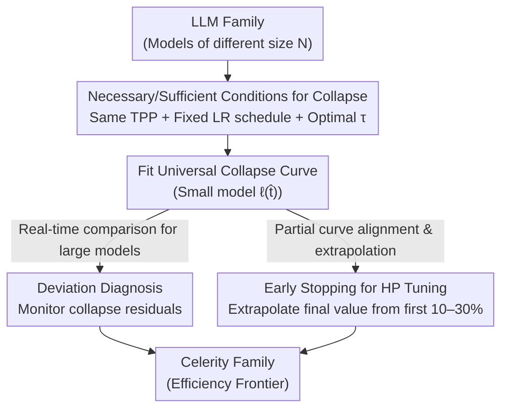

# Scaling with Collapse: Efficient and Predictable Training of LLM Families

**Conference**: ICLR 2026  
**arXiv**: [2509.25087](https://arxiv.org/abs/2509.25087)  
**Code**: None  
**Area**: Pre-training  
**Keywords**: Training loss curve collapse, Hyperparameter scaling, Training diagnostics, Early stopping, Cerebras

## TL;DR
It is demonstrated that training loss curves (TLC) of LLM families "collapse" onto a single universal curve when optimization hyperparameters are matched to the data budget. This phenomenon is leveraged for two practical applications: (1) using deviation from collapse as an early diagnostic signal for training pathologies, and (2) achieving early stopping in large-scale hyperparameter tuning through the predictability of the collapse curve.

## Background & Motivation

**Background**: Scaling pre-training remains the primary path to improving LLM performance. However, as sizes approach the frontier scale, direct experimentation for model sizes and hyperparameters becomes impossible. Fortunately, many quantities are predictable during scaling: scaling laws extrapolate final losses from small scales, and μP allows optimal learning rates to transfer across widths. Yet, these reflect predictability at the **scalar** level. Whether the **entire Training Loss Curve (TLC)** shape is predictable across scales had not been verified at realistic LLM scales.

**Key Challenge**: Qiu et al. (2025) discovered a surprising pattern—the TLCs of different model sizes "collapse" onto the same universal curve after simple normalization. However, this was only verified on small-scale autoregressive tasks using vanilla Adam without weight decay. They explicitly called for large-scale verification under realistic scaling recipes (joint scaling of width, depth, batch size, and weight decay).

**Limitations of Prior Work**: On one hand, frontier scales cannot be experimented on directly, necessitating extrapolation from small scales, while what determines the TLC shape lacked a principled explanation. On the other hand, determining whether a loss spike during training requires a rollback or restart has long relied on **human intuition**—by the time anomalies are visible on the raw curve, it is often too late, lacking objective early warning signals.

**Key Insight**: This paper demonstrates that the **necessary and sufficient condition** for TLC collapse under μP is that all models share the same tokens-per-parameter ($\text{TPP}=D/N$), a fixed LR decay shape, and an AdamW time scale $\tau$ that is optimal for the given TPP. In other words, collapse does not happen randomly; it is a **signature** of hyperparameters being compute-optimal for a given data budget. The authors distill this observation into two practical tools and use them to train the Celerity model family.

## Method

### Overall Architecture

This paper does not propose a new network architecture but rather engineeringly applies an empirical law. When models of different sizes in an LLM family are trained with the same tokens-per-parameter ($\text{TPP}=D/N$), a fixed LR decay shape, and an AdamW time scale $\tau$ optimized for their respective data budgets, their training loss curves—despite differing in scale, duration, and final values—will "collapse" onto a single universal curve after simple normalization. The normalization follows the form of Qiu et al.: representing training progress as $\hat t = t/T$ (where $T$ is the total optimization steps), and affine-scaling the loss as:

$$\ell(\hat t, N) = \frac{L(\hat t\cdot T^\star(N),\, N) - \hat L}{L(T^\star(N),\, N) - \hat L},$$

where $T^\star(N)$ is the compute-optimal steps for parameter count $N$, and $\hat L$ is the irreducible loss offset. The authors perform three tasks around this "collapse": characterizing its necessary and sufficient conditions to establish it as a signature of compute-optimal training (Contribution ①); using "deviation from collapse" as an online diagnostic signal for training pathologies (Contribution ②, Application 1); and leveraging the predictability of the collapse curve to transform expensive full-scale hyperparameter searches into an early-stopping process that extrapolates final values from the initial training segments (Contribution ③, Application 2). All three share the same underlying structure—fitting a universal collapse curve on small models first, which large models then use as a reference.

### Key Designs

**1. Conditions for Collapse: Transforming "Compute-Optimal Training" into an Observable Signature**

Existing scaling laws can only predict the final loss as a scalar. Whether the full shape of the loss curve transfers across scales was previously unverified for realistic LLMs. The authors find that collapse does not always occur but has strict prerequisites: all models must share the same TPP, the same fixed LR decay shape, and an AdamW time scale $\tau$ optimized for that TPP. A key variable previously overlooked is $\tau$—AdamW updates can be viewed as an exponential moving average (EMA) of weight updates, where the normalized time scale is:

$$\tau = \tau_{\text{iter}}/T = \frac{1}{\eta\lambda T} = \frac{B}{\eta\lambda D},$$

unifying the effects of learning rate $\eta$ and weight decay $\lambda$, characterizing how many past gradients the optimizer "remembers." Previous work showed that optimal $\tau$ only varies with TPP; thus, "fixed TPP + optimal $\tau$" ensures collapse. Conversely, a deviation of $\tau$ from the optimum stretches or compresses the TLC, and different LR decay shapes also break collapse (e.g., Llama-2 does not collapse due to TPP and $\tau$ mismatch). Consequently, whether a curve collapses serves as a necessary and sufficient criterion for whether a recipe is on the compute-efficiency frontier.

**2. Departure Diagnosis: Replacing Manual Monitoring with Objective Early Warnings**

Determining if a loss spike or slow upward drift requires a rollback traditionally relies on human experience, often reacting only after anomalies are visible on raw curves. Instead, the authors fit a universal collapse curve from small models. During large-scale training, the normalized TLC is subtracted from the universal curve in real-time to monitor **collapse residuals**. Since numerical instabilities (e.g., gradient accumulation drift caused by insufficient bf16 precision) manifest in the residuals first, this method can detect deviations hundreds of steps before anomalies appear in the raw TLC. In Celerity 1.8B training, residuals were used to identify a bf16 precision issue; once fixed, the curve returned to the collapse trajectory.

**3. Early Stopping for HP Tuning: Extrapolating Final Loss via Predictability**

Collapse implies that the shape of the entire curve is parameterizable and predictable, meaning one does not need to train every hyperparameter configuration to completion. The process involves: determining TLC control variables (LR schedule, $\tau$, TPP) for each candidate configuration, fitting a universal collapse curve $\ell(\hat t)$ for each combination on small models (e.g., 111M); then training each large-scale configuration for only a small segment (e.g., 10–30% of tokens). The divisor $L(T)$ that best aligns this partial curve with the corresponding universal TLC is used to read out the final loss—this divisor acts as both a normalization constant and a **calibrated extrapolation of the final value**. Finally, the configuration with the lowest predicted final loss is selected for full training. A key trick during tuning is to **fix $\tau$ (by tuning $\lambda$) rather than fixing $\lambda$**: fixing $\lambda$ causes $\tau$ to vary randomly, causing curves to cross and making intermediate loss unpredictable of the final value; fixing $\tau$ maintains the curve ranking, allowing reliable early selection. Experiments on 1.7B / 3.3B models showed that training for only 30% / 10% respectively could select configurations with virtually no gap from the full-training optimum.

### Loss & Training

The models use a GPT-2 style architecture (ALiBi positional embeddings + SwiGLU), pre-trained on SlimPajama for a single epoch using AdamW + μP parameterization, a linear LR decay to zero, and a context length of 2048. This paper does not change the training objective; the leverage of the method lies entirely in the "joint scaling of LR / batch size / weight decay such that $\tau$ is optimal for TPP" recipe.

## Key Experimental Results

### Main Results

| Phenomenon | Result |
|------|------|
| Llama-2 (Different TPP) | TLC does not collapse |
| Celerity (Same TPP + Optimal HP) | **Perfect TLC collapse** |
| Deviation Diagnosis | Detects loss spikes earlier than human judgment |
| Early Stopping HP Tuning | Configurations selected from 10–30% of tokens show near-zero gap from full optimum |

### Key Findings
- **Collapse is a necessary and sufficient condition for compute-optimal training**—it only appears when hyperparameters are optimized according to scaling laws.
- Deviation diagnosis can detect numerical stability issues (such as bf16 precision deficiency) much earlier.
- Early stopping requires only 10–30% of training to reliably select the best hyperparameters, significantly saving compute for hyperparameter searches.

## Ablation Study

### Verification of Collapse Conditions

| Condition | Collapse? | Note |
|------|---------|------|
| Fixed TPP + Optimal $\tau$ + Fixed LR schedule | ✓ Yes | Celerity family |
| Different TPP (e.g., Llama-2) | ✗ No | Different D/N ratios lead to different TLC shapes |
| Fixed TPP + Non-optimal $\tau$ | ✗ No | Deviation of $\tau$ from optimum stretches or compresses TLC |
| Fixed TPP + Different LR schedule | ✗ No | LR decay shape directly affects TLC shape |

### Real-world Case of Deviation Diagnosis
- During Celerity 1.8B training, stale losses in the cache showed a slight upward trend.
- Through collapse residual analysis (comparing normalized TLC to the universal curve), deviation was detected hundreds of steps before it became obvious in the raw TLC.
- Diagnosis: Gradient accumulation instability caused by bf16 numerical precision issues.
- After fixing, the TLC returned to the collapse trajectory.

### Early Stopping for Hyperparameter Tuning
- For a batch of HP configurations, only the first 10–30% of tokens were trained.
- Partial TLCs were fitted using the parameterized collapse model → extrapolated to predict final loss.
- Hyperparameters were tuned by fixing $\tau$ (rather than $\lambda$) to maintain curve ranking and reliable early selection.
- For 1.7B / 3.3B models, training only 30% / 10% selected configurations virtually identical to the full-training optimum.

### Celerity's Position on the Efficiency Frontier

| Model | Params | Training Tokens | Avg Accuracy |
|------|--------|-----------|-----------|
| Typical same-scale model | Equal | Equal | Baseline |
| **Celerity** | Equal | Equal | **Efficiency Frontier** |

## Highlights & Insights
- **Collapse as a "health signature"** is a simple yet powerful engineering tool—if the TLC does not collapse, it indicates an issue with hyperparameters or the training recipe. This is more intuitive than any single metric.
- The necessary and sufficient relationship between **Collapse = Compute-Optimal Training** is the core theoretical contribution, linking a visual phenomenon to optimization theory.
- **Practicality of Deviation Diagnosis**: Traditional methods rely on human judgment of whether a loss spike warrants a rollback; collapse curves provide an objective reference.
- **Early Stopping for HP Tuning**: The reliability of extrapolating final loss significantly reduces the cost of large-scale hyperparameter searches.
- **Unified role of $\tau$**: The AdamW EMA time scale $\tau = 1/(\eta\lambda)$ is an overlooked but extremely important hyperparameter—it unifies the effects of learning rate and weight decay.

## Limitations & Future Work
- The collapse condition requires all models to have the same TPP—in practice, different models might have different optimal TPPs (e.g., Chinchilla's 20 vs other estimates).
- Only pre-training loss was verified—collapse in downstream task performance remains unexplored (loss collapse does not guarantee downstream accuracy collapse).
- Early stopping extrapolation relies on the accuracy of the parameterized collapse model—very different training recipes might require re-fitting.
- All experiments were run on Cerebras CS-3—collapse behavior on different hardware (e.g., GPUs) might slightly differ (due to precision, communication patterns, etc.).
- Currently only verified under μP parameterization—whether it holds under other schemes (e.g., SP) is unknown.

## Related Work & Insights
- **vs Chinchilla (Hoffmann et al.)**: Chinchilla predicts the scaling law of the final loss (a scalar); this paper predicts the shape of the full training curve (a curve)—it is a "time-series version" of scaling laws.
- **vs Qiu et al. (2025) Supercollapse**: They discovered collapse on small-scale autoregressive tasks; this paper generalizes it to practical LLM training and reveals the necessary/sufficient conditions (TPP + optimal $\tau$).
- **vs μP (Yang & Hu)**: μP enables LR transfer across scales; this paper finds that under μP, the entire TLC shape transfers across scales—a stronger corollary of μP.
- **vs Wang & Aitchison (2024) AdamW EMA**: They found $\tau$ is stable across scales for vision tasks; this paper finds that the optimal $\tau$ depends on TPP and is the key control variable for TLC collapse in LLMs.
- **Insight**: Collapse theory can be generalized to other sequential training scenarios—e.g., whether training curves for diffusion models or reinforcement learning also exhibit similar universal shapes.

## Rating
- Novelty: ⭐⭐⭐⭐ Unique insights into collapse conditions and practical applications.
- Experimental Thoroughness: ⭐⭐⭐⭐⭐ Large-scale Cerebras experiments, multi-size validation, real training diagnostic cases.
- Writing Quality: ⭐⭐⭐⭐⭐ The three-column comparison in Figure 1 is extremely intuitive; the writing is clear.
- Value: ⭐⭐⭐⭐⭐ Extremely high engineering guidance value for large-scale LLM training.

<!-- RELATED:START -->

## Related Papers

- [\[ICML 2026\] POET-X: Memory-efficient LLM Training by Scaling Orthogonal Transformation](../../ICML2026/llm_pretraining/poet-x_memory-efficient_llm_training_by_scaling_orthogonal_transformation.md)
- [\[ICLR 2026\] Late-to-Early Training: 让 LLM 更早学到后期知识，从而更快更好](late-to-early_training_let_llms_learn_earlier_so_faster_and_better.md)
- [\[ICLR 2026\] Beyond URLs: Metadata Diversity and Position for Efficient LLM Pretraining](beyond_urls_metadata_diversity_and_position_for_efficient_llm_pretraining.md)
- [\[ICLR 2026\] SPICE: Submodular Penalized Information–Conflict Selection for Efficient Large Language Model Training](spice_submodular_penalized_informationconflict_selection_for_efficient_large_lan.md)
- [\[ICLR 2026\] Rewriting Pre-training Data Boosts LLM Performance in Math and Code](rewriting_pre-training_data_boosts_llm_performance_in_math_and_code.md)

<!-- RELATED:END -->
