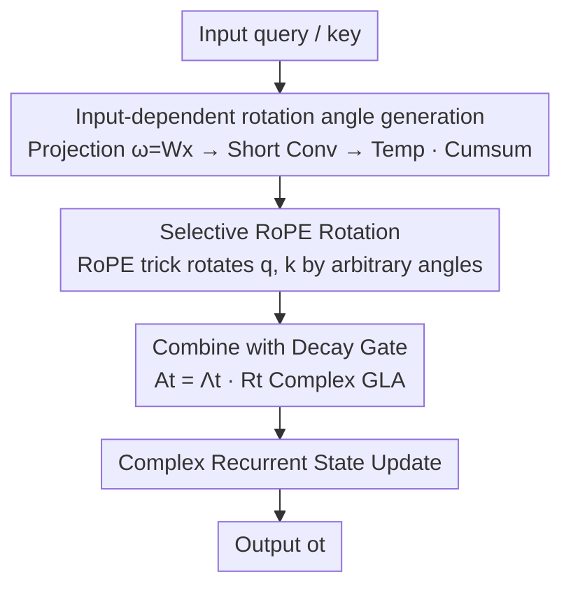

# Selective Rotary Position Embedding

**Conference**: ICLR 2026  
**OpenReview**: [https://openreview.net/forum?id=AQo1SEElNb](https://openreview.net/forum?id=AQo1SEElNb)  
**Code**: Available (Paper open-sourced, integrated into flash-linear-attention)  
**Area**: LLM Pre-training / Sequence Model Architecture  
**Keywords**: Rotary Position Embedding, Linear Attention, Gated Linear Attention, State Space Models, Complex Recurrence

## TL;DR
This paper theoretically demonstrates that "strong recall = rotation + decay" is indispensable. It notes that linear attention lacks the "rotation" implicitly performed by softmax. Consequently, it proposes **Selective RoPE**—an input-dependent, learnable rotary position embedding capable of rotating at arbitrary angles and seamlessly compounding with decay gates. Efficiently implemented as a layer of complex gated linear attention using the RoPE trick, it improves recall, expressivity, and perplexity on synthetic recall tasks and 370M/1.3B language modeling with minimal cost.

## Background & Motivation

**Background**: Softmax Transformers are powerful because each token can attend to all historical tokens without decay, providing excellent recall at the cost of quadratic complexity. To reduce complexity, a parallel line of sub-quadratic recurrent sequence models (Linear Attention, Mamba/SSM, GLA, DeltaNet) has emerged. These models offer linear time and constant memory but face a fixed-size state bottleneck: information must be selectively retained or overwritten, often damaging long-range retrieval. Recent progress has focused almost entirely on "how to manage states effectively."

**Limitations of Prior Work**: In practice, state management in these models primarily relies on **selective gating, more expressive state updates, and more complex readouts**—mechanisms that all share the commonality of **modulating the norm of key-value associations (i.e., how fast they decay)**. They do not directly provide the complementary capability: **rotating query-key representations to encode relative positions**. In other words, gating only "fades certain memories" but does not "rotate the phase."

**Key Challenge**: The authors' central claim is that strong recall requires **two complementary mechanisms**: (i) **Rotation**, to encode relative position while preserving the norm; (ii) **Decay**, to selectively discard past key-value associations. Softmax attention is powerful because it **implicitly performs both simultaneously**, whereas linear attention only inherits "decay" and loses "rotation." Rotation alone is also insufficient: pure complex linear recurrent models (only rotation) act like fixed-state-size spectrum analyzers and suffer from **spectral leakage**, requiring an exponential decay component (equivalent to windowing) for suppression.

**Goal**: To restore the missing "rotation" puzzle piece to linear attention such that it is (a) input-dependent, learnable, and capable of arbitrary angles, (b) seamlessly compatible with existing decay gates, and (c) implemented without introducing significant overhead.

**Key Insight**: Leveraging the relationship between softmax and **Random Fourier Features (RFF)**, the authors reveal that softmax attention can be interpreted as performing **input-dependent selective rotation** on query-key pairs, providing theoretical motivation for using RoPE-style rotation matrices in recurrent models.

**Core Idea**: Generalize the fixed angles of RoPE into **input-dependent, learnable rotations** as part of the linear attention state transition matrix, and efficiently implement this complex parameterization in the real domain using the RoPE trick.

## Method

### Overall Architecture

The proposed method is a plug-and-play rotary position embedding applied to recurrent architectures like Gated Linear Attention (GLA). Intuitively: standard GLA state transitions have only a decay gate $A_t$ (letting history fade by norm); this replaces/supplements it with an **input-dependent rotation matrix** $R_t$, allowing states to "rotate phase" in addition to "fading out." The complete transition is thus factorized as $A_t = \Lambda_t \bar{R}_t$—where the decay gate $\Lambda_t$ handles forgetting and the rotation $\bar{R}_t$ handles relative position encoding.

The specific forward pass involves: calculating a **rotation angle** $\omega$ for each channel from the input (via projection + short convolution + temperature scaling followed by a cumulative sum), generating $\sin/\cos$ from the angles, and applying the rotation to queries and keys using the **RoPE trick**. The rotated q and k enter the complex recurrent state of the GLA, updating the state alongside the built-in decay gate to produce output. Since the entire rotation can be expressed as "applying RoPE to q/k," it can directly reuse existing linear attention/RoPE kernels with near-zero additional architectural overhead.

### Key Designs

**1. Unified View: Recall = Rotation + Decay, both are indispensable**

This is the theoretical cornerstone of the paper. The authors use RFF to approximate the exponential kernel: defining $\phi_\omega(x)=\exp(\|x\|_2^2/2 + i\omega^\top x)$ where $\omega\sim\mathcal N(0,I)$, then $\Re\{\mathbb E_\omega[\phi_\omega(q_t)^\top\phi_\omega(k_\tau)]\}=\exp(q_t^\top k_\tau)$, which is exactly the softmax attention score. Writing this expectation as a recurrence yields a **diagonal, input-dependent rotation matrix** $\bar R_t=\mathrm{diag}(\exp(i\Omega(q_t-q_{t-1})))$—meaning softmax attention itself performs selective rotation on query-keys conditioned on $q_t-q_{t-1}$ using random Gaussian features $\Omega$. This is exactly what is missing in linear attention.

However, the authors argue that **rotation alone is not enough**: replacing the diagonal gate of GLA with pure rotation $\bar R_t$ (formula $S_t=S_{t-1}\bar R_t + v_t k_t^H$) results in an output that is a convolution of the input signal with a **pure imaginary exponential $e^{-i\omega\tau}$**, equivalent to performing a DFT on a finite-length signal. The discontinuities at both ends of finite sampling cause **spectral leakage**. The standard solution in signal processing is applying a **non-rectangular window (e.g., Hann window)** that tapers off at the ends. The counterpart of an "exponentially tapering window" in sequence models is exactly the **decay gate**. Thus, "rotation for relative position + decay for spectral leakage suppression" are unified under the same design principle: $A_t=\Lambda_t \bar R_t$, where the real part handles forgetting and the imaginary part handles position encoding.

**2. Selective RoPE: Generalizing fixed RoPE angles to input-dependent, learnable rotations**

To address the lack of rotation in linear attention, this paper generalizes standard RoPE. Standard RoPE uses a rotation matrix with fixed frequency $\omega$ for relative position encoding:

$$\text{Att}_{t,\tau}=\exp\big(k_\tau^\top R_\omega^{\,t-\tau} q_t\big)=\exp\big((R_\omega^{\tau}k_\tau)^\top(R_\omega^{t}q_t)\big),\quad R_\omega=\begin{pmatrix}\cos\omega & -\sin\omega\\ \sin\omega & \cos\omega\end{pmatrix}$$

Its angle depends only on the absolute position index $t$ and is content-independent. The core of Selective RoPE is changing this rotation into an **input-dependent** state transition matrix $R_t$, expressed as a linear attention recurrence:

$$S_t=S_{t-1}R_t+v_t k_t^\top,\qquad o_t=S_t q_t.$$

Defining the cumulative rotation $R_{i:j}=\prod_{\kappa=i}^{j} R_\kappa$ and leveraging the block-diagonal structure of the RoPE trick $R^{t-\tau}=(R^\tau)^\top R^t$, the output can be equivalently written as "applying cumulative rotations to q and k respectively":

$$\text{Selective RoPE:}\quad o_t=\sum_{\tau=1}^{t} v_\tau\big(k_\tau^\top R_{\tau+1:t}\, q_t\big)=\sum_{\tau=1}^{t} v_\tau\big(k_\tau^\top R_{1:\tau}^\top R_{1:t}\, q_t\big).$$

In implementation, rotation angles are computed from the input: $\omega=W_\omega x$, passed through a 1D short convolution, multiplied by a temperature, and cumulatively summed to get per-position phases. These phases generate $\sin/\cos$ for RoPE calls. Crucially, this allows a **complex-parameterized linear Transformer** to be computed in the real domain using the RoPE trick, **reusing existing kernels** with near-zero overhead while upgrading RoPE from "fixed angles" to "arbitrary, learnable, content-aware angles." Note that $R_t$ here is a selective modulation of the state transition, not writing the query into memory.

**3. Optimal Temperature Spectrum: Derived, not heuristic, rotation frequencies**

The equivalence between RFF and softmax holds strictly only as the number of samples $D\to\infty$. With finite samples, there exists an **optimal variance** for a single query-key pair, proportional to the angle between the two vectors. Based on this, the authors write the rotation matrix as $\hat R_t=\exp(i\Omega\Theta(q_t-q_{t-1}))$, where $\Theta$ is a **temperature diagonal matrix**. Assuming the query-key angle $\theta$ is uniformly distributed over $[0, 2\pi]$, the optimal temperature is derived to follow $\tan^2(\theta/2)$. Interestingly, this distribution is very close to the **exponentially decaying frequency spectrum** used in RoPE, though it decays slightly faster. The significance of this result is that it explains "why RoPE's exponential decay frequency is reasonable" from first principles and provides a theoretical basis for initializing Selective RoPE frequencies rather than relying on empirical tuning.

**4. Combination with Decay Gates & Engineering Stabilization**

The theoretical form alone causes issues during direct training. The authors found Selective RoPE becomes unstable earlier than RoPE/NoPE at higher learning rates. A series of engineering choices resolved this: (i) Using $\ell_2$-normalized input $x_t$ (rather than query $q_t$) to parameterize rotation angles significantly stabilized training; (ii) Adding **weight norm** to the $\omega$ projection or using low-rank MLPs (rank 8/16); (iii) Making the random features $\omega$ **learnable** (rather than fixed random), which is more effective than fixed features according to prior work; (iv) Adding a **sigmoid phase gate** to let the model decide whether to "rotate or not"; (v) Adding **SiLU activation** after the convolution following the $\omega$ projection—ablations show this item provides the largest performance boost. The decay part directly reuses the built-in forget gate of the baseline architecture. Individually these details seem minor, but collectively they allow the "rotation + decay" theory to converge stably at 370M/1.3B scales.

### Loss & Training

Language modeling used AdamW + warmup + cosine decay on the FineWeb corpus with a context length of 4096 and the Mistral 7B tokenizer (vocab size 32000). The 370M model was trained on 10B tokens, and the 1.3B model on 26B tokens. Since different position encodings have different optimal learning rates, the authors swept learning rates for each scheme, selecting the best configuration via perplexity on 4M held-out tokens before zero-shot evaluation on lm-eval-harness.

## Key Experimental Results

### Main Results (Language Modeling, lm-eval-harness zero-shot average accuracy)

| Architecture / Scale | Position Encoding | LAMBADA ppl ↓ | Avg-Acc ↑ |
|------|------|------|------|
| GLA 370M / 10B | NoPE | 15.83 | 46.8 |
| GLA 370M / 10B | RoPE | 16.32 | 46.5 |
| GLA 370M / 10B | **Selective RoPE** | 16.33 | **47.1** |
| FoX 370M / 10B | NoPE | 17.76 | 45.3 |
| FoX 370M / 10B | RoPE | 17.71 | 45.1 |
| FoX 370M / 10B | **Selective RoPE** | **17.29** | **46.1** |
| Gated DeltaNet ~400M / 10B | RoPE | 16.79 | 46.7 |
| Gated DeltaNet ~400M / 10B | **Selective RoPE†** | **15.93** | **47.5** |
| GLA 1.3B / 26B | RoPE | 8.88 | 54.4 |
| GLA 1.3B / 26B | **Selective RoPE** | **8.50** | 54.6 |

The authors honestly point out that Selective RoPE changes the trade-off between "perplexity ↔ downstream accuracy," and this change **varies by model/scale**—it often improves perplexity and/or specific downstream tasks, but the macro-average accuracy may remain flat or slightly decrease, rather than being a total win.

### Ablation Study (GLA 370M, MAD benchmark average; and Language Modeling)

| Config | MAD Average ↑ | Description |
|------|------|------|
| NoPE | 65.9 | Baseline without position embedding |
| RoPE | 72.5 | Fixed-angle RoPE |
| Selective RoPE | 72.0 | Base version of Ours |
| + phase gate | 72.3 | Added phase gate |
| + bias | 72.7 | Added learnable bias |
| + phase gate & bias | **73.2** | All components, best |

| LM Config (GLA 370M/10B) | Avg-PPL ↓ | Avg-Acc ↑ |
|------|------|------|
| Selective RoPE Baseline | 21.27 | 45.8 |
| + SiLU | 21.14 | 46.7 |
| + phase gate | 21.16 | **47.1** |

### Key Findings
- **SiLU activation provides the largest contribution**: In language modeling ablations, adding SiLU after the convolution following the $\omega$ projection was the most significant single improvement; the phase gate was second. On MAD, the phase gate + bias combination was strongest.
- **Domination in synthetic recall tasks**: GLA+Selective RoPE showed the largest improvement over NoPE on MQAR; on the copying task, Selective RoPE not only achieved high accuracy but also **robustly extrapolated in length** (whereas RoPE performed poorly on copying due to poor extrapolation without fine-tuning).
- **Qualitative leap in expressivity (state tracking)**: On the S2 parity check task, GLA+Selective RoPE could learn and extrapolate, whereas NoPE/RoPE failed to learn even the training length—because input-dependent rotation can model "flips" based on whether the input is 0 or 1. Transformer+Selective RoPE is, to the authors' knowledge, the **only** Transformer variant that can solve parity check at that sequence length with a single layer; 2-layer DeltaNet+Selective RoPE can even solve A3.

## Highlights & Insights
- **Elegant theoretical bridge**: Clarifies that "softmax is implicitly doing input-dependent rotation" using RFF, then uses the signal processing analogy of "spectral leakage ↔ windowing ↔ decay gate" to explain why decay is still needed—unifying two seemingly unrelated engineering tricks (RoPE, forget gate) into a single principle $A_t = \Lambda_t \bar R_t$.
- **RoPE trick reuse is a key engineering insight**: Computing a complex-parameterized linear Transformer in the real domain effectively amounts to "adding a preamble to compute $\sin/\cos$ from input before RoPE," with almost zero extra kernel cost, making the method truly practical.
- **Transferable unified perspective**: This principle explains why Forgetting Transformer (softmax already has rotation, just needs a forget gate) and DeltaNet with forget gates (Householder already provides rotation, adding decay is better) are effective—one can use this lens to examine what other sequence models are missing.

## Limitations & Future Work
- **Trade-off, not universal improvement**: The authors admit macro-average downstream accuracy may stay flat or slightly decrease; gains are highly dependent on architecture and scale, not a "no-brainer" addition.
- **Training stability is a weakness**: The original form diverges earlier than RoPE/NoPE at high learning rates, requiring a whole set of tricks ($\ell_2$ normalization, weight norm, low-rank MLP) to stabilize, indicating sensitivity to implementation details.
- **Restricted scale**: Maximum scale is only 1.3B / 26B tokens; whether benefits continue at larger scales or longer contexts remains to be verified; theoretical assumptions like "uniformly distributed angles" may not hold on real data.
- **Future directions**: Further utilize the $\tan^2(\theta/2)$ temperature spectrum theory for smarter frequency initialization/scheduling, or explore combinations of rotation with more expressive (DPLR) state transitions.

## Related Work & Insights
- **vs RoPE**: RoPE rotation angles depend only on absolute position bits and are fixed/unlearnable; Selective RoPE makes angles input-dependent, learnable, and arbitrary while compounding with decay gates, at the cost of being harder to stabilize.
- **vs GLA / Mamba2 (Gating only)**: These models encode history only through norm scaling (decay), keeping the direction unchanged and lacking rotation; Ours adds the rotation dimension, bringing qualitative changes to tasks like state tracking that require "flip" expressivity.
- **vs DeltaNet**: DeltaNet implicitly includes "rotation along key dimensions" via input-dependent generalized Householder transforms; the principles here explain "why adding forget gates on top is better" and generalize this insight into a universal design rule.
- **vs Performer / Learning Random Features**: This work similarly uses RFF and learnable random features, but the goal is not better softmax kernel approximation, but rather explicitly extracting the "rotation" structure for use as position encoding.

## Rating
- Novelty: ⭐⭐⭐⭐⭐ Uses RFF to reveal implicit rotation in softmax and unifies rotation with decay; fresh and explanatory perspective.
- Experimental Thoroughness: ⭐⭐⭐⭐ Synthetic tasks + multiple architectures (GLA/FoX/DeltaNet) + 370M/1.3B language modeling; solid ablations, but scale and context length are still limited.
- Writing Quality: ⭐⭐⭐⭐ Clear theoretical derivations, intuitive diagrams, and honest reporting of engineering stabilization.
- Value: ⭐⭐⭐⭐ Completes the "rotation" puzzle for sub-quadratic sequence models; plug-and-play with zero extra kernel cost provides both practical and theoretical value.

<!-- RELATED:START -->

## Related Papers

- [\[ICLR 2026\] MrRoPE: Mixed-radix Rotary Position Embedding](mrrope_mixed-radix_rotary_position_embedding.md)
- [\[ICLR 2026\] LLM-JEPA: Large Language Models Meet Joint Embedding Predictive Architectures](llm-jepa_large_language_models_meet_joint_embedding_predictive_architectures.md)
- [\[ICLR 2026\] Beyond URLs: Metadata Diversity and Position for Efficient LLM Pretraining](beyond_urls_metadata_diversity_and_position_for_efficient_llm_pretraining.md)
- [\[ICLR 2026\] Train on Validation (ToV): Fast Data Selection with Applications to Fine-Tuning](train_on_validation_tov_fast_data_selection_with_applications_to_fine-tuning.md)
- [\[ICLR 2026\] Pre-training Limited Memory Language Models with Internal and External Knowledge](pre-training_limited_memory_language_models_with_internal_and_external_knowledge.md)

<!-- RELATED:END -->
