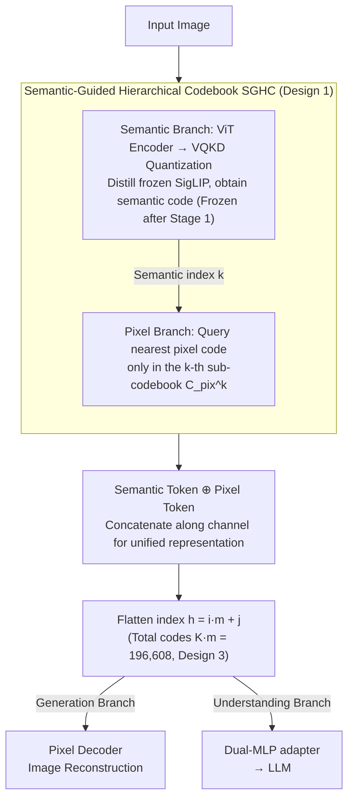

# SemHiTok: A Unified Image Tokenizer via Semantic-Guided Hierarchical Codebook

**Conference**: ICLR 2026  
**arXiv**: [2503.06764](https://arxiv.org/abs/2503.06764)  
**Area**: LLM Pre-training  
**Keywords**: Image Tokenizer, Hierarchical Codebook, Semantic Guidance, Unified Understanding and Generation, SGHC, MLLM

## TL;DR
Proposes SemHiTok—a unified tokenizer for understanding and generation via Semantic-Guided Hierarchical Codebook (SGHC). It establishes pixel sub-codebooks based on a pre-trained semantic codebook. Structural and training decoupling (staged optimization) avoids semantic-pixel conflicts, achieving SOTA in both understanding and reconstruction among discrete tokenizers under LLaVA settings.

## Background & Motivation

**Background**: Unified MLLMs require a tokenizer that simultaneously supports understanding (high-level semantics) and generation (low-level pixels).

**Limitations of Prior Work**:
   - (1) CLIP family: Good semantics but loses pixels; VQGAN family: Preserves pixels but lacks semantics.
   - (2) Joint training (VILA-U hybrid loss → sub-optimal; SDE encoder decoupled but codebook mixed).
   - (3) Dual encoders (Janus) → Doubled tokens or vocabulary explosion → Inefficient.
   - (4) TokenFlow shared mapping, but joint training still affects performance.

**Key Insight**: Observed that patches sharing the same semantic code exhibit similar pixel distributions → Build sub-codebooks under each semantic code → Decouple both structure and training.

## Method

### Overall Architecture

Unified MLLMs require a single tokenizer capable of handling both "understanding" (high-level semantics) and "generation" (low-level pixels). However, these objectives often conflict in previous methods: the CLIP family preserves semantics but loses pixels, while the VQGAN family preserves pixels but lacks semantics. Forcing both into a flat codebook leads to competition for codewords between semantics and pixels. SemHiTok decomposes the discrete representation of an image into two complementary branches through **hierarchical nesting**: the semantic branch first uses VQKD to distill a frozen SigLIP, learning a semantic codebook $C_\text{sem}$ focused solely on high-level semantics. The pixel branch then attaches a set of sub-codebooks under each semantic code to capture pixel details within that semantic cluster. During quantization, a patch first obtains its semantic index, then queries the corresponding pixel sub-codebook for the pixel code. Both tokens are concatenated along the channel dimension into a unified representation—capable of being decoded back to images for generation or flattened into vocabulary IDs for LLM understanding. The core design lies in making the pixel codebook parasitic to the hierarchical structure of the semantic codebook, combined with staged training to decouple the two objectives.

> Multi-stage training (Design 2) is the training schedule: first train the semantic branch alone and freeze $C_\text{sem}$, then train only the pixel branch on the frozen backbone.

### Key Designs

**1. Semantic-Guided Hierarchical Codebook (SGHC): Refining pixel space using "similar pixels for same-semantic patches"**

This step addresses the Key Challenge of semantic-pixel competition within a flat codebook. The semantic branch uses frozen SigLIP features as distillation targets. Encoder outputs are quantized via EMA-updated vectors to obtain semantic codes, aligned back to SigLIP using cosine similarity and $L_1$ loss, establishing a semantic backbone for "how the image should be understood." The authors observe that patches assigned to the same semantic code share highly similar pixel distributions. Instead of a flat pixel codebook, it is decomposed into a set of sub-codebooks $C_\text{pix}=\{C_\text{pix}^1,\dots,C_\text{pix}^K\}$, corresponding to $K$ semantic codes with $m$ sub-codes each. When quantizing patch $i$, the semantic index $k$ is obtained first, and the pixel code is queried only within $C_\text{pix}^k$. This ensures each sub-codebook only models pixel details within a specific semantic cluster, simplifying the modeling task and ensuring finer reconstruction without competing for the same codewords.

**2. Multi-stage training: Thoroughly separating semantic and pixel objectives in the workflow**

Even with a hierarchical structure, joint optimization would allow reconstruction loss to perturb semantic layers. SemHiTok utilizes two stages: Stage 1 trains only the semantic branch (VQKD distilling SigLIP) and freezes $C_\text{sem}$ immediately. Stage 2 trains only the pixel branch on this frozen backbone, driven by $L_1$, perceptual, and GAN losses. Since the optimization objectives do not compete simultaneously, semantic-pixel conflict is eliminated at the source, preventing understanding capability from degrading during reconstruction training. This is the key difference from VILA-U (hybrid loss causing sub-optimality) and TokenFlow (shared mapping but joint training interference).

**3. Unified MLLM Integration: Flattening hierarchical indices into a standard vocabulary**

Hierarchical codebooks can lead to doubled token counts or vocabulary explosion. SemHiTok uses a flattened index $h=i\cdot m+j$ to map the "$i$-th semantic code and its $j$-th pixel sub-code" into a single integer ID. The total vocabulary size $K\cdot m=196{,}108$ is comparable to the text vocabulary of Qwen2 (~150K). A Dual-MLP adapter projects semantic and pixel tokens separately before concatenation for the LLM, allowing the understanding side to consume semantics and the generation side to consume pixels.

### Loss & Training

General Hyperparameters: SigLIP is frozen throughout as a distillation anchor; $K$ semantic codes, $m=8$ sub-codes per semantic code, totaling 196,608 codes; Qwen2.5-7B-Instruct as the base MLLM. Stage 1 uses cosine plus $L_1$ to align with SigLIP. Stage 2 adds $L_1$, perceptual, and GAN reconstruction losses with weights $\lambda_1/\lambda_2/\lambda_3$.

## Key Experimental Results

### Main Results (Table 1, ImageNet-50k)

| Method | Type | Codebook | rFID↓ |
|------|------|----------|-------|
| LlamaGen | Only Recon | 16,384 | 2.19 |
| IBQ | Only Recon | 262,144 | 1.00 |
| VILA-U | Unified | 16,384 | 1.80 |
| TokenFlow | Unified | 32,768 | 1.37 |
| **Ours (SemHiTok)** | Unified | 196,608 | **1.16** |
| **Ours (SemHiTok-384)** | Unified | 196,608 | **0.66** |

### Understanding (Table 2, LLaVA-v1.5)

| Model | Resolution | POPE | MME-P | SEED | GQA |
|------|--------|------|-------|------|-----|
| SigLIP (Continuous) | 256 | 83.8 | 1481 | 65.3 | 61.9 |
| VILA-U | 256 | 81.6 | 1312 | 56.9 | 55.3 |
| **Ours (SemHiTok)** | 256 | **82.5** | **1356** | **62.9** | **60.3** |
| **Ours (SemHiTok-384)** | 384 | **86.3** | **1466** | **64.1** | **62.3** |

### Key Findings
- SOTA in understanding among discrete tokenizers → approaching or partially exceeding continuous SigLIP.
- rFID 1.16/0.66 → SOTA-level reconstruction among unified tokenizers.
- POPE 82.5 vs VILA-U 81.6 (+0.9); SEED 62.9 vs 56.9 (+6.0).
- Total codebook $K \cdot m=196K$ is comparable to LLM text vocab size (Qwen2 ~150K) → no explosion.

## Highlights & Insights
- **SGHC Design**: The observation that same semantics → similar pixels leads to sub-codebook refinement, which is simple and elegant.
- **Multi-stage training**: Completely avoids semantic-pixel conflict → better trade-off → key innovation.
- **No Token Explosion**: Flattened index stays controllable (196K) → compatible with existing LLM vocabularies → seamless integration.
- **Non-conflicting Extension**: Pixel training does not affect the frozen semantic codebook → no degradation in understanding.

## Limitations & Future Work
- Primarily validated on 256/384 resolutions → scalability to higher resolutions untested.
- Fixed sub-codebook size $m=8$ → adaptive $m$ remains unexplored.
- Validated only on Qwen2.5-7B and Vicuna-7B → larger LLMs need testing.
- Limited space for generation quality evaluation (MJHQ/GenEval).
- Impact of semantic codebook size $K$ on performance is not fully ablated.
- Pixel subspaces in SGHC might lack data under certain semantic codes → potential sub-codebook underfitting.
- Sensitivity analysis for loss weights ($\lambda_1/\lambda_2/\lambda_3$) is limited.

### Unified MLLM Results
- Surpasses previous unified discrete MLLMs in both understanding and generation tasks.
- SOTA in most benchmarks within the "Und. & Gen. Discrete" category.
- Comparable performance to some continuous tokenizers (Only Und.).

## Related Work & Insights
- VILA-U hybrid loss → sub-optimal → SemHiTok solves via staging.
- TokenFlow shared mapping → joint training conflict → SemHiTok fully decouples.
- VQKD semantic codebook methods → SemHiTok extends this with a pixel layer.
- Insight: Hierarchical structure (semantic → pixel) may be the optimal paradigm for unified visual tokenizers.

## Rating
- Novelty: ⭐⭐⭐⭐⭐ Pioneering SGHC + multi-stage training.
- Technical Depth: ⭐⭐⭐⭐ Simple yet effective, clear motivation.
- Experimental Thoroughness: ⭐⭐⭐⭐ Covers reconstruction, understanding, and generation.
- Value: ⭐⭐⭐⭐⭐ Direct integration into existing MLLMs for unified understanding and generation.
- Overall: ⭐⭐⭐⭐⭐ An elegant solution for unified visual tokenizers.

<!-- RELATED:START -->

## Related Papers

- [\[NeurIPS 2025\] Next Semantic Scale Prediction via Hierarchical Diffusion Language Models](../../NeurIPS2025/llm_pretraining/next_semantic_scale_prediction_via_hierarchical_diffusion_language_models.md)
- [\[ICLR 2026\] Pretraining with Hierarchical Memories: Separating Long-Tail and Common Knowledge](pretraining_with_hierarchical_memories_separating_long-tail_and_common_knowledge.md)
- [\[ICLR 2026\] OptimSyn: Influence-Guided Rubrics Optimization for Synthetic Data Generation](optimsyn_influence-guided_rubrics_optimization_for_synthetic_data_generation.md)
- [\[ICLR 2026\] ssToken: Self-modulated and Semantic-aware Token Selection for LLM Fine-tuning](sstoken_self-modulated_and_semantic-aware_token_selection_for_llm_fine-tuning.md)
- [\[ICLR 2026\] Dynamic Chunking for End-to-End Hierarchical Sequence Modeling](dynamic_chunking_for_end-to-end_hierarchical_sequence_modeling.md)

<!-- RELATED:END -->
