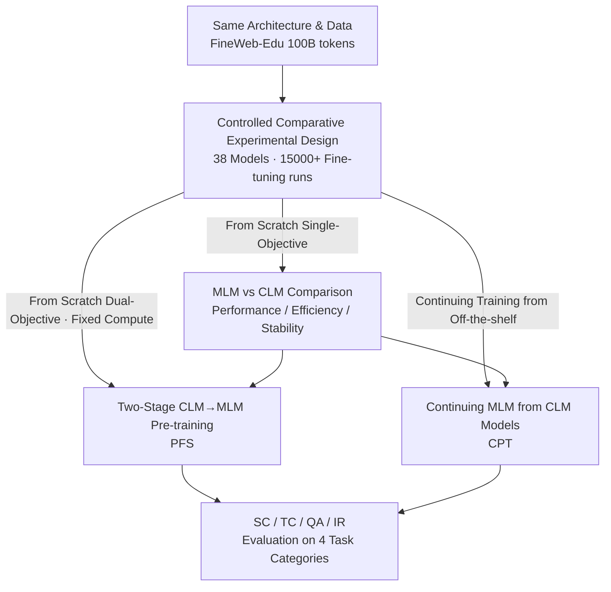

# Should We Still Pretrain Encoders with Masked Language Modeling?

**Conference**: ICLR 2026  
**OpenReview**: [https://openreview.net/forum?id=jpz7e3jhRq](https://openreview.net/forum?id=jpz7e3jhRq)  
**Code**: https://hf.co/MLMvsCLM ｜ https://github.com/Nicolas-BZRD/EuroBERT/tree/MLM_vs_CLM  
**Area**: LLM Pre-training / Text Representation  
**Keywords**: Encoder Pre-training, Masked Language Modeling (MLM), Causal Language Modeling (CLM), Controlled Ablation, Two-stage Pre-training

## TL;DR
The authors conducted a strictly controlled comparative experiment with 38 models (210M to 1B parameters) and over 15,000 fine-tuning runs to answer whether MLM is still necessary for pre-training encoders. The study concludes that while MLM remains generally stronger for text representation tasks, CLM is more data-efficient and offers more stable fine-tuning. Consequently, a **two-stage strategy of CLM followed by MLM** (especially performing MLM on off-the-shelf CLM decoders) yields the optimal encoder under a fixed compute budget.

## Background & Motivation

**Background**: High-quality text representation is the foundation for numerous NLP tasks, including sequence classification, named entity recognition, extractive question answering, and information retrieval. Traditional approaches involve pre-training encoders from scratch using **Masked Language Modeling (MLM)** with bidirectional attention (the BERT lineage). Recently, a counter-intuitive trend has emerged: decoder models pre-trained with **Causal Language Modeling (CLM)**, when adapted with MLM, outperform traditional encoders on embedding leaderboards like MTEB, challenging the dominance of "MLM-only" models.

**Limitations of Prior Work**: Evidence suggesting that "CLM decoders make better encoders" mostly comes from models that are **significantly larger and trained on much more data** than standard encoders. In other words, the success of the CLM route is **deeply entangled** with the factors of increased model scale and data volume, which have not been previously isolated.

**Key Challenge**: Does the CLM objective itself lead to better representations, or is it merely the effect of scaling? This is a causal question contaminated by confounding variables; leaderboard rankings alone cannot provide clear attribution.

**Goal**: Under the premise of **identical architecture, parameter count, and training data**, this study aims to fairly compare MLM, CLM, and their combinations. This isolates the "training objective" variable to evaluate its impact and determine the most cost-effective way to allocate compute in practice.

**Key Insight**: Instead of training a larger SOTA model to climb leaderboards, it is more valuable to conduct a **large-scale controlled ablation**. By fixing all other variables and varying only the training objectives and stage arrangements with sufficient seeds and training steps, statistical reliability can be ensured.

**Core Idea**: Through strictly controlled experiments, the study proves that MLM remains essential for robust representations. However, the data efficiency and fine-tuning stability of CLM can be harnessed via a "CLM→MLM two-stage" approach. Thus, the optimal engineering path is to "take an existing CLM model and continue training with a small amount of MLM."

## Method

### Overall Architecture

This paper is essentially an **empirical study**. The "method" lies in its experimental design: using a unified, controlled pre-training platform to propose and verify training strategies across three routes. All models are based on the EuroBERT architecture (210M / 610M / 1B, 2048 context, RoPE $\theta=10000$) and trained on the same English token sequences from FineWeb-Edu. The default pre-training uses 100B tokens (approximately 5x the Chinchilla optimal budget). Evaluation covers 12 datasets across four categories: Sequence Classification (SC), Token Classification (TC), Question Answering (QA), and Information Retrieval (IR). Each configuration was run with 6 learning rates and 5 random seeds, reporting 95% confidence intervals.

The three pre-training objectives are defined as follows: CLM uses causal masking for next-token prediction, minimizing $L_{\text{CLM}}(x) = -\sum_{t=1}^{T}\log p_{\theta\rightarrow}(x_t\mid x_1,\dots,x_{t-1})$; MLM uses bidirectional masking to reconstruct masked tokens, $L_{\text{MLM}}(x) = -\sum_{i\in M}\log p_{\theta\leftrightarrow}(x_i\mid x_M)$, with masking rates $p_{\text{mask}}\in\{20\%,30\%,40\%,50\%\}$; CLM+MLM involves sequential training (first CLM, then MLM). The research pipeline is illustrated below:

### Key Designs

**1. Controlled Comparative Experimental Design: Decoupling "Training Objective" from Scale**

To address the confounding question of whether "CLM decoders are stronger only because they are larger or trained on more data," the authors' core action was to **fix all other variables**: the same EuroBERT architecture, FineWeb-Edu data, sample sequences, and WSD learning rate schedule (2000-step warmup + 38000-step constant $5\times10^{-4}$ + 2000-step decay). The only change was the training objective. To ensure statistical reliability, the scale was maximal: 3 model sizes, 4 MLM masking rates, and both PFS/CPT scenarios, totaling 38 final models. Additionally, each checkpoint was fine-tuned on 12 datasets $\times$ 6 learning rates $\times$ 5 seeds, totaling 15,120 fine-tuning runs and approximately 110,000 MI250X GPU hours. By controlling for scale, all differences between MLM and CLM can be cleanly attributed to the objective itself.

The first set of key findings under this design: **MLM remains overall stronger for text representation tasks**, with gaps particularly evident in SC and QA (QA is most sensitive to the lack of bidirectional attention), consistent across sizes. However, **CLM is not entirely inferior**—it matches or significantly outperforms MLM in TC at the 610M scale, and its gap in IR narrows as model size increases. CLM also shows higher data efficiency in early training (leading in SC/QA before ~10k steps and IR before ~20k steps; TC lead is maintained throughout) and demonstrates **lower sensitivity to fine-tuning learning rates** (Figure 5 shows CLM initialization is more stable). Furthermore, there is **no universal optimal masking rate**: larger models prefer higher rates, IR consistently prefers high rates, while TC/QA show a U-shaped curve at 610M/1B. Subsequent experiments standardized on 610M + 40% as a compromise. ⚠️ These differences are primarily shown in figures (Fig 2–5); please refer to the original text for precise values.

**2. Two-stage CLM→MLM Pre-training From Scratch (PFS): Capturing the Strengths of Both Objectives**

Since CLM provides early data efficiency, token-level representations, and stability, while MLM provides task versatility, the authors proposed a **Pre-training From Scratch (PFS)** approach under a fixed compute budget: train with CLM for a period, then switch to MLM. Specifically, at 610M with a 40% masking rate, they assessed five splits (100%CLM / 75%-25% / 50%-50% / 25%-75% / 100%MLM) across three compute budgets (12K / 22K / 42K steps). The engineering insight here is that the PFS objective switch occurs while the CLM checkpoint **has not yet undergone LR decay, has a large gradient norm, and is still actively learning**, allowing the MLM stage to continue efficiently from a "non-converged" initialization.

Results show that **CLM+MLM consistently outperforms pure MLM**: the 25%-75% split stable surpassed the MLM baseline, and even allocating up to 75% to CLM matched pure MLM performance. In other words, "CLM followed by MLM" provides a performance gain without any additional compute, confirming the synergy between the two paradigms. An added benefit is that models pre-warmed with CLM are **less sensitive to masking rate selection** (Fig 7); the initial CLM pre-training acts as a stabilizer.

**3. Continuing MLM Pre-training from CLM Models (CPT): The Most Efficient Path to Optimal Encoders**

PFS involves retraining from scratch, but many pre-trained CLM decoders are already available. The authors asked: given a fixed amount of extra compute, is it more cost-effective to perform "MLM Continued Pre-training (CPT) on a CLM model" or "continue training an MLM model"? Unlike PFS, **CPT starts from a converged model that has already undergone LR decay**, reflecting real-world adaptation scenarios. Experiments at 610M with a 40% masking rate applied 2K / 12K / 22K steps of MLM CPT to both CLM and MLM bases.

The conclusion is clear: **MLM CPT on a CLM model is overall superior to continuing an MLM model**. It maintains CLM’s lead in TC, closes the gap in QA and IR, and significantly outperforms pure MLM in SC. Moreover, **training for the full 22K steps is not necessary**; performance matches or exceeds pure MLM by 12K steps, especially in TC/IR, with a steeper improvement curve in the final stages. This directly provides engineering advice: **The best current path to obtaining strong encoders is to leverage widely available pre-trained decoders and apply a short period of MLM CPT**, rather than starting MLM from zero.

## Key Experimental Results

> Results are primarily presented via line/error bar charts (Fig 2–9). The table below qualitatively summarizes trends; refer to the original text for precise values ⚠️.

### Main Results (MLM vs CLM, Single-Objective From Scratch)

| Task | Metric | MLM | CLM | Trend Description |
|------|------|-----|-----|---------|
| Sequence Classification (SC) | Accuracy | Stronger | Lagging | Gap widens as model size increases |
| Token Classification (TC) | F1 | Strong | Match/Surpass | CLM significantly surpasses at 610M |
| Question Answering (QA) | F1 | Significantly Stronger | Lagging | QA is most sensitive to lacks of bidirectionality |
| Information Retrieval (IR) | NDCG@10 | Slightly Stronger | Close | Gap narrows as model size increases |

### Two-Stage and Continued Training Experiments

| Configuration | Scenario | Key Finding |
|------|------|---------|
| 100% MLM | PFS Baseline | Comprehensive but not the most efficient |
| 25%-75% (CLM→MLM) | PFS | Consistently outperforms pure MLM baseline |
| 75%-25% (CLM→MLM) | PFS | Still matches pure MLM performance |
| MLM CPT on MLM Base | CPT | Limited Gain; SC plateaus |
| MLM CPT on CLM Base | CPT | Overall Outperformance; SC significantly higher; 12K steps sufficient |

### Key Findings
- **Bidirectional attention remains essential for robust representations**: MLM is overall the most stable; QA is the most sensitive to its absence. However, CLM’s ability in token-level tasks (TC) has been underestimated, showing causal pre-training can learn strong token representations.
- **The value of CLM lies in "Efficiency" rather than "Upper Limit"**: CLM offers higher early data efficiency and lower sensitivity to fine-tuning learning rates, making it ideal for low-resource scenarios or as a warm-up phase for MLM.
- **No universal masking rate exists**: It depends on model size and task. Larger models prefer higher rates, IR consistently prefers high rates, while TC/QA show a U-shape at 610M/1B. 40% at 610M is a strong cross-task compromise.
- **Two-stage > Pure MLM under fixed compute**, and CLM warm-up increases robustness to masking rates. In CPT scenarios, "CLM base + MLM" is the most cost-effective way to build an encoder.

## Highlights & Insights
- **Turning a confounded causal question into a credible conclusion**: With 38 models, 15,000+ fine-tuning runs, and 95% confidence intervals, the isolation of the "training objective" from "model scale" provides a highly valuable research paradigm.
- **The distinction between PFS and CPT is critical**: PFS switches objectives at a checkpoint where gradients are still large and decay hasn't occurred, while CPT continues from a converged model. The authors correctly identify that these initialization states differ, preventing "two-stage experiments" from being over-generalized.
- **Transferable engineering conclusions**: When pre-trained CLM decoders are available, a small amount of MLM CPT can create a best-in-class encoder. This "reuse decoder + short CPT" approach can be applied to multilingual, low-resource, or even vision-language pre-training for representation learning.

## Limitations & Future Work
- The scope was intentionally narrowed: only training objectives, model sizes, training scenarios, data budgets, and masking rates were varied. Architecture, tokenizer, language, and data mix were fixed. Scale peaked at 1B parameters / 100B tokens, whereas top MTEB models often exceed 1B.
- Internal Limitations: Results rely almost entirely on figures; the text lacks precise numerical tables, making replication dependent on open-sourced checkpoints. Evaluation only focused on fine-tuning pre-trained models and **did not include zero-shot retrieval through contrastive post-training**, leaving a gap regarding "final embedding models."
- Future Directions: Exploring more complex training curricula (e.g., alternating CLM/MLM), extending research to multilingual and multimodal domains, and investigating the mechanisms behind the U-shaped vs. monotonic masking rate curves in TC and IR.

## Related Work & Insights
- **vs. BehnamGhader et al. (LLM2Vec lineage)**: They proposed a framework to adapt decoders into embedding models and topped leaderboards with large models but did not decouple the CLM objective from scale. This paper provides that missing attribution via controlled comparisons.
- **vs. Wettig et al. (2023)**: They focused on the impact of masking rates in MLM-only settings. This paper replicates the finding that larger models prefer higher masking rates and extends it to CLM/MLM/Hybrid comparative routes.
- **vs. Weller et al. (2025)**: They analyzed MLM→CLM curricula on 2T tokens and evaluated on generative benchmarks. This paper takes the opposite direction (CLM→MLM), focuses on encoder-specific tasks, and systematically sweeps dimensions like masking rates and CLM-MLM ratios.

## Rating
- Novelty: ⭐⭐⭐⭐ While not a new model, it provides the first large-scale controlled attribution for the "Is MLM still needed" question, which is of significant importance.
- Experimental Thoroughness: ⭐⭐⭐⭐⭐ 38 models, 15,000+ fine-tuning runs, 110,000 GPU hours, and 95% confidence intervals denote a rare level of statistical rigor.
- Writing Quality: ⭐⭐⭐⭐ The logic is clear, and the three routes progress linearly. However, the reliance on figures for core conclusions without numerical tables makes it harder to extract exact data.
- Value: ⭐⭐⭐⭐⭐ Directly provides an actionable engineering path—"reuse CLM decoders + short MLM CPT"—which is highly instructive for practitioners building encoders.

<!-- RELATED:START -->

## Related Papers

- [\[ICLR 2026\] Soft-Masked Diffusion Language Models](soft-masked_diffusion_language_models.md)
- [\[ICLR 2026\] Learned Meta-Tokens for Language Modeling](learned_meta-tokens_for_language_modeling.md)
- [\[ICLR 2026\] Scaling Laws Revisited: Modeling the Role of Data Quality in Language Model Pretraining](scaling_laws_revisited_modeling_the_role_of_data_quality_in_language_model_pretr.md)
- [\[ICLR 2026\] Seq vs Seq: An Open Suite of Paired Encoders and Decoders](seq_vs_seq_an_open_suite_of_paired_encoders_and_decoders.md)
- [\[ICLR 2026\] Avey-B: Refactoring Attention-Free Architectures into Bidirectional Encoders](avey-b.md)

<!-- RELATED:END -->
