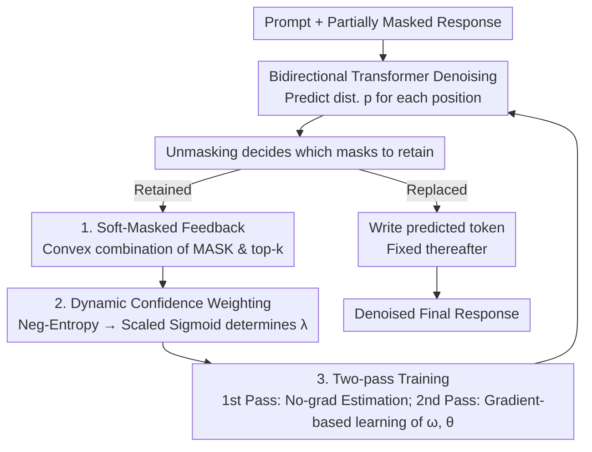

# Soft-Masked Diffusion Language Models

**Conference**: ICLR 2026  
**OpenReview**: [https://openreview.net/forum?id=Gba02UMvrG](https://openreview.net/forum?id=Gba02UMvrG)  
**Code**: https://github.com/IBM/soft-masked-diffusion-language-models  
**Area**: Diffusion Models / LLM Pre-training  
**Keywords**: Masked Diffusion Language Models, Soft-masking, Continuous Feedback, Self-correcting Decoding, Code Generation

## TL;DR
Addressing the issue where binary "keep mask or replace with prediction" decisions in Masked Diffusion Language Models (MDLM) discard valuable predictive information, this paper proposes **soft-masking (SM)**. By representing retained `[MASK]` positions as a confidence-weighted convex combination of the `[MASK]` embedding and top-k predictions from the previous step, information is propagated across steps. With only 3 additional trainable parameters, this method consistently improves perplexity, MAUVE, and code generation accuracy across training from scratch, continued pre-training, and Dream-7B fine-tuning, with significant gains in low-compute (fewer decoding steps / high-throughput) scenarios.

## Background & Motivation

**Background**: Autoregressive (AR) LLMs generate tokens sequentially, leading to high inference latency and cost, especially in long-chain-of-thought (CoT) scenarios. Diffusion Language Models (DLMs) serve as an alternative, enabling parallel generation and revision with inherent self-correction, bidirectional modeling, and higher data efficiency. **Masked Diffusion Language Models (MDLM)** are currently the most scalable and effective variant: the forward process gradually masks tokens, while the reverse process makes a **binary choice** for each mask—either replacing it with a predicted token or retaining the `[MASK]`.

**Limitations of Prior Work**: This binary unmasking process discards the model's current predictive distribution (even if highly informative) whenever a mask is retained. In the next step, the model perceives a pure `[MASK]` again, essentially re-guessing the position from scratch and failing to propagate previously computed contextual information.

**Key Challenge**: The AR domain has established the effectiveness of feeding **continuous feedback** (rather than just discretely sampled tokens) back into the model. This allows multiple candidates to exist in a "superposition" for parallel exploration, reducing the number of tokens to generate. However, continuous feedback training in AR is slow due to sequential dependencies. MDLMs are inherently parallel but are bottlenecked by "binary mask info loss," failing to leverage the benefits of continuous feedback.

**Goal**: Design a feedback mechanism for MDLMs that **retains and propagates predictive information** under the following requirements: (1) Seamless integration with existing MDLM architectures with negligible parameters; (2) Maintaining parallel training across sequence lengths; (3) Compatibility with existing unmasking schedules and efficiency optimizations (e.g., caching).

**Key Insight**: Relax the binary constraint on masks—retained masks are no longer pure `[MASK]` one-hots but a convex combination of the `[MASK]` embedding and the **top-k predictions** from the previous step. The mixing ratio is dynamically determined by the **confidence** of the prediction at that position. This allows information to propagate across steps, providing a richer prior for the next denoising iteration.

## Method

### Overall Architecture
SM utilizes the standard MDLM denoising skeleton: given a context (prompt), it starts from a fully masked response and iteratively calls a **bidirectional Transformer** $f_\theta$ for single-step denoising, followed by an unmasking function to decide which masks to keep. The only modification occurs during "mask retention": while the standard approach resets these positions to pure `[MASK]`, SM uses a **soft-masking operator** to replace them with a weighted superposition of `[MASK]` and the previous step's top-k predictions.

Since SM introduces dynamic dependencies on intermediate predictions, the standard MDLM training (sampling via marginal distribution $q(x_t|x_0)$) is no longer analytically tractable. Training therefore employs a **two-pass** approximation: the first pass estimates the previous step's predictive distribution without gradients to calculate the soft-masked representation; the second pass feeds this representation back into the model with gradients to compute the loss. The mechanism adds only 3 scalar parameters $\omega_a, \omega_b, \omega_s$, learned alongside the backbone $\theta$.

### Key Designs

**1. Soft-Masked Feedback: Replacing Retained Masks with a Convex Combination**

This directly addresses the loss of information in binary masking. For each position $l$ that **remains a mask** after unmasking, SM provides a hybrid feedback:

$$x^l_{t-1}=\big(1-\lambda(p^l_{t-1})\big)\cdot m+\lambda(p^l_{t-1})\sum_{i\in\text{top-}k(p^l_{t-1})}\pi_i\,v_i,$$

where $m$ is the one-hot of `[MASK]`, $v_i$ is the one-hot of the $i$-th token, and $\pi_i = [p^l_{t-1}]_i / \sum_{j\in\text{top-}k}[p^l_{t-1}]_j$ is the **renormalized** weight of top-k predictions (ensuring $\sum_i \pi_i = 1$). Positions already unmasked remain unchanged. The feedback $x^l_{t-1}$ is relaxed from a one-hot to a distribution on the simplex $\in \Delta^{|V|-1}$, allowing the model to "hedge bets" on multiple candidates. The mixing happens in the **embedding space**, maintaining the input dimension—crucial for architecture compatibility. $k=3$ is found optimal for language modeling, while $k=1$ is best for code tasks.

**2. Confidence-based Dynamic Weighting: Self-adaptive Trust**

The mixing ratio $\lambda$ is not a fixed hyperparameter but varies dynamically with the **confidence** of the prediciton: high confidence leads to a larger $\lambda$ (trusting predictions), while low confidence leads to a smaller $\lambda$ (retaining the original `[MASK]`). Confidence is quantified by the **negative entropy** $-H(p^l_{t-1})$ and mapped via a **scaled sigmoid** to $[0, \omega_s]$:

$$\lambda(p_{t-1})=\omega_s\cdot\sigma\big(\omega_a(-H(p^l_{t-1})-\omega_b)\big).$$

Three trainable scalars control the steepness $\omega_a$, offset $\omega_b$, and amplitude $\omega_s$. This design suppresses low-confidence noise while ensuring that some `[MASK]` signal is always preserved—essential because MDLMs are trained to predict "masked positions," and `[MASK]` itself carries structural cues. Experimentally, $\omega_s$ starts near 0 and learns to approach 1.

**3. Two-pass Training: Maintaining Parallelism for Non-tractable Distributions**

SM makes input dependent on intermediate predictions, meaning the forward marginal $\tilde q(x_t|x_0)$ has no closed-form solution. A two-pass scheme approximates this (Algorithm 1): $x_t$ is sampled by adding noise to $x_0$ using a bounded uniform distribution $t \sim U(b_l, b_h)$. **Pass one** uses the backbone $g_{\tilde\theta}$ (with detached gradients) to estimate $\tilde p_{t-1}$ as a self-conditioning signal. **Pass two** feeds the soft-masked representation $\mathrm{sm}_\omega(x_t, \tilde p_{t-1})$ through the backbone with gradients to update $\theta$ and $\omega$. Two engineering details stabilize training: narrowing the $t$ sampling range to reduce variance and randomly activating SM with probability $p_{sm}$ (80% being optimal) to ensure the model handles both standard and soft-masked inputs. Crucially, this remains **fully parallel** over the sequence length.

**4. Mechanism: SM as Interpolation between "Absorbing" and "Uniform" Diffusion**

The paper provides a conceptual interpretation by viewing SM at $k=1$. When $\lambda=0$, it recovers the **original absorbing MDLM**. When $\lambda=1$ (feeding back the argmax token), it behaves like a **uniform diffusion DLM**, where masked regions explore solutions via self-correction. Intermediate $\lambda \in [0, 1]$ effectively interpolates between the two paradigms in embedding space. This perspective explains why retaining parts of the `[MASK]` is beneficial: it dampens uncertain predictions while preserving the positional/structural anchors provided by the mask.

### Loss & Training
The objective follows the variational lower bound (ELBO) of standard MDLMs, but replaces the horizontal input with the "effective state" $\tilde x_t = \mathrm{sm}_\omega(x_t, g_\theta(x_t))$:

$$\mathcal L(\theta,\omega)=\tfrac1t\sum_{l=1}^{L}\mathbf 1_{x^l_t=m}\log\big((x^l_0)^\top p^l_{t-1}\big).$$

Backbone and SM parameters are updated using Adam with separate learning rates $\eta_{bb}, \eta_{sm}$. Evaluations compare two compute budgets: **iso-update** (aligned gradient steps; SM takes ~2x wall-clock time) and **iso-compute** (aligned total forward passes; SM trains for $N/2$ steps).

## Key Experimental Results

### Main Results

**Training from scratch (169M MDLM, OpenWebText, Unconditional)**: Under standard unmasking, SM significantly improves MAUVE and reduces perplexity across all NFE (Number of Function Evaluations) budgets. Combined with ReMDM remasking, it outperforms AR MAUVE.

| Configuration (NFE=1/1) | MAUVE ↑ | Gen. PPL ↓ |
|--------|------|------|
| MDLM Binary Mask (Standard) | 0.034 | 50.46 |
| **SM (iso-compute)** | 0.596 | 24.63 |
| **SM (iso-update)** | 0.602 | 23.53 |
| ReMDM + Binary Mask | 0.411 | 28.62 |
| **ReMDM + SM (iso-update)** | **0.774** | 16.72 |
| AR (T=1024, Ref) | 0.760 | 12.1 |

**Code Generation (Dream-Coder-7B / Dream-7B, DoRA fine-tuning, $k=1$)**: SM improves performance nearly across the board on HumanEval / MBPP, with the largest gains in low NFE (high-throughput) settings.

| NFE | Model | Task | Binary (FT) | **SM** | Gain |
|-----|------|------|------|------|------|
| 1/4 | Dream-7B | MBPP+ | 29.2 | **36.7** | +7.5 |
| 1/4 | Dream-Coder-7B | MBPP | 25.9 | **33.2** | +7.3 |
| 1/2 | Dream-7B | MBPP+ | 39.6 | **54.7** | +15.1 |
| 1/2 | Dream-Coder-7B | MBPP | 49.8 | **56.2** | +6.4 |
| 1/1 | Dream-Coder-7B | HumanEval | 75.7 | **76.2** | +0.5 |

### Ablation Study

| Config | Key Finding |
|------|---------|
| SM Activation Prob $p_{sm}$ | 80% is optimal; allows handling both soft and standard inputs. |
| top-k Value | $k=3$ for LM, $k=1$ for Code. |
| Early-step SM | Gains are most pronounced in the first 20% of decoding steps where information is sparsest. |
| Inference Overhead | Only ~+12% extra cost. |

### Key Findings
- **Highest gains in low-compute/high-throughput contexts**: SM's relative advantage is greatest when NFE is low—propagating info is most valuable when steps are scarce.
- **Iso-compute often matches iso-update**: At low NFEs (e.g., 1/4), SM trained for half the steps (iso-compute) can still outperform the binary baseline, proving efficiency.
- **Orthogonal to existing efficiency tricks**: SM stacks effectively with ReMDM scheduling and Fast-dLLM caching.

## Highlights & Insights
- **Minimalist extension**: Relaxing the binary constraint with only 3 parameters adapts effective AR continuous feedback ideas into MDLMs while preserving parallelism.
- **Confidence-based $\lambda$**: Self-adaptive weighting via entropy ensures high-confidence predictions are trusted while noise is dampened.
- **Two-pass as Self-conditioning**: The training scheme elegantly bypasses the lack of a closed-form marginal without sacrificing sequence parallelism.
- **Unified Perspective**: SM acts as a bridge between absorbing and uniform diffusion paradigms, justifying why retaining partial `[MASK]` signal preserves structural priors.

## Limitations & Future Work
- **Training overhead**: The two-pass scheme doubles wall-clock time per update (iso-update), though inference overhead is minimal.
- **NFE-dependent gains**: The advantage diminishes at very large NFE budgets (e.g., HumanEval 1/1), where binary MDLMs eventually converge to similar results.
- **Simple confidence metric**: Entropy and scaled-sigmoid are relatively basic; more sophisticated confidence measures could be explored.
- **Reinforcement Learning**: Future work could leverage RL to better exploit the richer feedback signals provided by SM.

## Related Work & Insights
- **vs AR Continuous Feedback (COCONUT, etc.)**: AR continuous feedback is inherently sequential and slow; SM maintains the constant-time parallelism of DLMs with only a constant training overhead.
- **vs Self-conditioning (Chen et al. 2023)**: Self-conditioning often uses concatenation, increasing input dimensionality; SM uses embedding-space convex combinations, keeping dimensions **constant** and allowing smooth adaptation of existing models.
- **vs Continuous DLMs**: Unlike continuous DLMs which struggle with performance and AR-compatibility, SM works directly on discrete token spaces while providing smoother decoding.

## Rating
- Novelty: ⭐⭐⭐⭐ Elegant transplantation of continuous feedback into MDLM via "soft masks."
- Experimental Thoroughness: ⭐⭐⭐⭐ Wide range of scales (169M to 7B) and tasks.
- Writing Quality: ⭐⭐⭐⭐ Clear motivation and solid conceptual unification.
- Value: ⭐⭐⭐⭐ Highly practical for high-throughput diffusion inference with minimal integration cost.

<!-- RELATED:START -->

## Related Papers

- [\[ICML 2026\] Tuning the Implicit Regularizer of Masked Diffusion Language Models: Enhancing Generalization via Insights from k-Parity](../../ICML2026/llm_pretraining/tuning_the_implicit_regularizer_of_masked_diffusion_language_models_enhancing_ge.md)
- [\[ICLR 2026\] Scaling Behavior of Discrete Diffusion Language Models](scaling_behavior_of_discrete_diffusion_language_models.md)
- [\[ICLR 2026\] Time is a Feature: Exploiting Temporal Dynamics in Diffusion Language Models](time_is_a_feature_exploiting_temporal_dynamics_in_diffusion_language_models.md)
- [\[ICLR 2026\] Should We Still Pretrain Encoders with Masked Language Modeling?](should_we_still_pretrain_encoders_with_masked_language_modeling.md)
- [\[ICLR 2026\] Autoregressive Models Rival Diffusion Models at Any-Order Generation](autoregressive_models_rival_diffusion_models_at_any-order_generation.md)

<!-- RELATED:END -->

## Related Papers

- [\[ICML 2026\] Tuning the Implicit Regularizer of Masked Diffusion Language Models: Enhancing Generalization via Insights from k-Parity](../../ICML2026/llm_pretraining/tuning_the_implicit_regularizer_of_masked_diffusion_language_models_enhancing_ge.md)
- [\[ICLR 2026\] Time is a Feature: Exploiting Temporal Dynamics in Diffusion Language Models](time_is_a_feature_exploiting_temporal_dynamics_in_diffusion_language_models.md)
- [\[ICLR 2026\] Autoregressive Models Rival Diffusion Models at Any-Order Generation](autoregressive_models_rival_diffusion_models_at_any-order_generation.md)
- [\[ICLR 2026\] The Diffusion Duality, Chapter II: Ψ-Samplers](the_diffusion_duality_chapter_ii_psi-samplers.md)
- [\[ICLR 2026\] Steering Language Models with Weight Arithmetic](steering_language_models_with_weight_arithmetic.md)

<!-- RELATED:END -->
