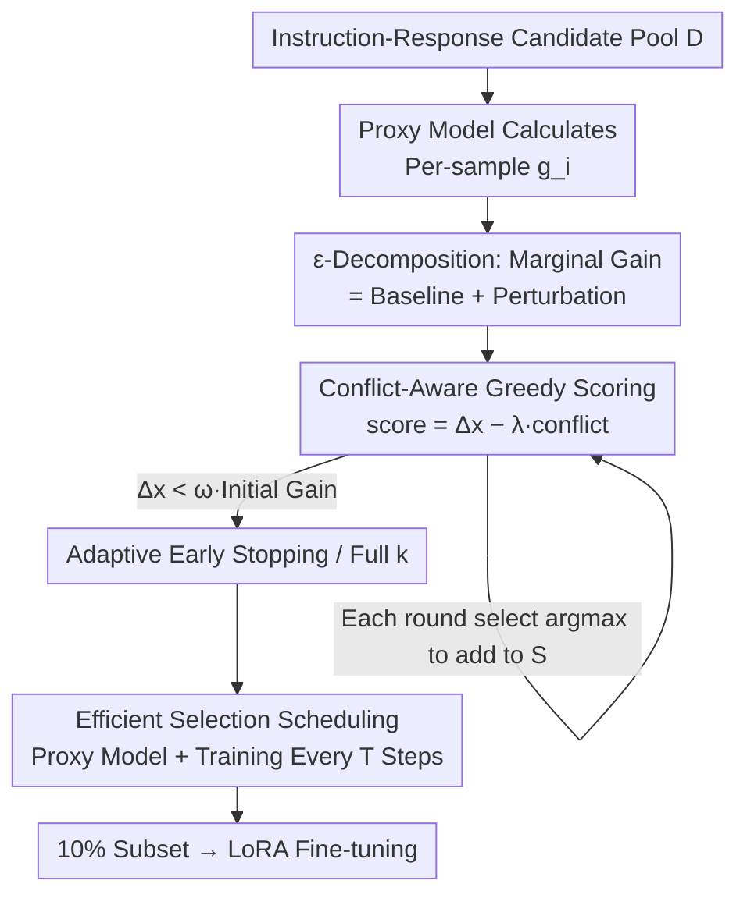

# SPICE: Submodular Penalized Information–Conflict Selection for Efficient Large Language Model Training

**Conference**: ICLR 2026  
**OpenReview**: [https://openreview.net/forum?id=9rCRy58TPF](https://openreview.net/forum?id=9rCRy58TPF)  
**Code**: Yes (Marked as code in paper, link placeholder to be updated)  
**Area**: LLM Training Data Selection / Instruction Tuning / Submodular Optimization  
**Keywords**: Data selection, Fisher Information, Submodularity, Gradient conflict, Instruction tuning

## TL;DR
SPICE identifies **gradient conflict between samples** as the primary culprit for why "greedy data selection based on Fisher information" collapses faster in practice than in theory. By using an $\varepsilon$-decomposition to quantify the "degree of deviation from ideal submodularity" into conflict statistics, a conflict-aware greedy selector is proposed: "Information Gain − Conflict Penalty." On LLaMA2-7B / Qwen2-7B, using only 10% of the data and 20 GPU-hours, it matches or exceeds full fine-tuning and 6 baselines across 8 benchmarks.

## Background & Motivation
**Background**: The effectiveness of instruction tuning depends heavily on data quality rather than quantity—it has been repeatedly observed that using only 10–20% of data can match or even exceed full-set training. Consequently, **data selection** has become a critical path for reducing large-scale training costs. Among various methods, gradient-based selection is highly regarded, particularly methods targeting the **log-determinant of the Fisher Information Matrix (log-det FIM)**. Its utility function $F(S)=\log\det(I+\alpha F_S)$ is a **monotone submodular function**, allowing the greedy algorithm to enjoy a $(1-1/e)$ approximation guarantee under a cardinality budget $k$, which is theoretically elegant.

**Limitations of Prior Work**: Theoretically beautiful, practically brittle. Practitioners find that greedy selection like FisherSFT **degrades much faster in practice than theory predicts**. Once the selected subset exceeds a certain threshold, the marginal information gain $\Delta_t$ of adding a sample collapses sharply, and actual performance often falls far short of what the $(1-1/e)$ bound suggests. Furthermore, these methods incur significant computational overhead (sometimes exceeding 100 GPU-hours), while theory only partially explains this behavior, leaving a conspicuous gap between theory and practice.

**Key Challenge**: Submodularity only guarantees "diminishing marginal returns" but **says nothing about the rate of decay**. What actually determines "how much cumulative information is gathered under the same budget $k$" is precisely this **decay rate**—the slower the decay, the larger the area under the curve and the higher the cumulative information. What controls this decay rate? The authors' key insight: it is **gradient conflicts between samples** (i.e., large angles between gradient directions of different samples resulting in mutual cancellation). Stronger conflicts push the "curvature" of submodularity higher, weakening the greedy guarantee and accelerating information collapse.

**Goal**: (1) To theoretically establish a quantitative link between "gradient conflict" and "marginal information gain decay" to explain the theory-practice gap; (2) To design a computationally efficient selection algorithm that preserves information while suppressing conflict.

**Key Insight**: Each marginal gain $\Delta_x(S)$ is decomposed into a "modular baseline + perturbation term." The baseline $\text{base}_x$ considers only the sample's own information, independent of the selected set; the perturbation term $\varepsilon_x(S)$ captures "how sample interactions drag down marginal utility." All "diminishing returns" in submodularity stem from the perturbation term, which is bounded by the **sum of squared gradient inner products**. This translates abstract "curvature" into measurable, optimizable "conflict."

**Core Idea**: Use "Information Gain − $\lambda\times$ Conflict Penalty" as the greedy score. High-information but conflicting samples are **not discarded**; they are simply down-weighted when conflicts are too strong, thereby suppressing the perturbation $|\varepsilon|$ and curvature to tighten the greedy approximation guarantee.

## Method

### Overall Architecture
SPICE aims to select a subset with maximum information and minimal mutual gradient conflict under a fixed budget. The pipeline is: first, use a **small proxy model** (e.g., 0.5B, same architecture as the target) to calculate the gradient $g_i$ for each candidate sample; then, in a greedy loop, calculate both the **Fisher marginal information gain** $\Delta_x$ and its **conflict** $\text{conflict}(x)$ relative to the current average gradient direction. Scoring is done via $\text{score}(x)=\Delta_x-\lambda\cdot\text{conflict}(x)$, adding the highest-scoring sample to the subset in each round. The loop either reaches the fixed budget $k$ or **stops early adaptively** when marginal gain falls below $\omega$ times the first-step gain. To improve efficiency, selection and training are interleaved—a training step is performed every $T$ selection steps before clearing the buffer. The theoretical side ($\varepsilon$-decomposition + curvature bound) explains "why suppressing conflict tightens the approximation guarantee," while the method side implements this insight into an executable algorithm.

### Key Designs

**1. ε-Decomposition: Quantifying "Submodular Deviation" as Gradient Conflict**

This design directly addresses the pain point—submodularity guarantees decay but fails to explain "why it collapses so fast sometimes." SPICE decomposes each marginal gain: the modular baseline $\text{base}_x\triangleq\log(1+\alpha\lVert g_x\rVert^2)$ reflects only the Fisher information of the sample itself, independent of the selected set $S$; the perturbation term

$$\varepsilon_x(S)\triangleq\Delta_x(S)-\text{base}_x=\log\frac{1+\alpha\,g_x^\top(I+\alpha F_S)^{-1}g_x}{1+\alpha\lVert g_x\rVert^2}$$

captures "how much the marginal utility is dragged down by interaction" after joining $S$. The paper proves (Theorem 1) that all "decay" of the function is driven entirely by the perturbation term: $\Delta_x(A)-\Delta_x(B)=\varepsilon_x(A)-\varepsilon_x(B)\ge0$, while the difference between baseline terms is always 0. Since $\varepsilon_x(S)\le0$ and is monotonically non-increasing as $|S|$ increases, $|\varepsilon_x(S)|$ exactly equals the "cumulative decay of sample $x$'s marginal gain relative to the empty set." This step transforms "decay rate," which was previously only qualitatively observable, into a measurable quantity with a closed-form expression.

**2. Curvature Bound + Gradient Inner Product Upper Bound: Proving "Low Conflict ⇒ Strong Guarantee"**

Decomposition alone is insufficient; it must be shown that controlling perturbation yields better approximation guarantees. SPICE introduces the **total curvature** $c\triangleq 1-\min_x \Delta_x(D\setminus\{x\})/\Delta_x(\varnothing)\in[0,1]$ and proves a curvature-dependent greedy bound $F(S_{\text{greedy}})\ge\frac{1-e^{-c}}{c}F(S^*)$: $c=1$ reverts to the classic $(1-1/e)$, while the factor approaches 1 (near-optimal) as $c\to0$. Through Lemma 1, the curvature is bounded by normalized perturbation $c\le\max_x |\varepsilon_x(D\setminus\{x\})|/\text{base}_x$, and through Theorem 4, the perturbation is bounded by the **sum of squared gradient inner products**:

$$|\varepsilon_x(S)|\le C\cdot\frac{\alpha^2\sum_{y\in S}(g_x^\top g_y)^2}{1+\alpha\lVert g_x\rVert^2}$$

Connecting these yield a data-dependent approximation guarantee $F(S_{\text{greedy}})\ge\frac{1-e^{-\hat c}}{\hat c}F(S^*)$, where $\hat c\propto\max_x\sum_{y\ne x}(g_x^\top g_y)^2$. The conclusion is straightforward: **Smaller gradient inner products (less conflict) ⇒ smaller perturbation ⇒ lower curvature ⇒ stronger approximation guarantee**. This provides a principled basis for suppressing conflict, rather than an ad-hoc regularization. The paper honestly notes that this closed-form bound depends on an assumption that holds in approximately 90% of steps and may fail in 10% (⚠️ refer to App. E/F of the original paper).

**3. Conflict-Aware Greedy Scoring + Adaptive Early Stopping: Implementing Theory into Algorithms**

Theory points to "controlling $\sum(g_x^\top g_y)^2$," but directly optimizing the sum of squared inner products is too expensive. SPICE uses a **cheap proxy**: for the average gradient $\bar g_S$ of the current selected set, define alignment $\text{Align}(g_i)=\frac{g_i^\top\bar g}{\lVert g_i\rVert\lVert\bar g\rVert+\eta}$, and define conflict as the hinge of negative alignment $\text{conflict}(g_i)=\max\{0,-\text{Align}(g_i)\}$ (punishing only truly "reverse" samples, not general similarity). The score is:

$$\text{score}(x\mid S_{t-1})=\Delta_x(S_{t-1})-\lambda\,\text{conflict}(x\mid S_{t-1}),\quad\lambda\ge0$$

The first term prefers high-information samples, and the second term suppresses samples that strongly conflict with the current update direction. Crucially, it **does not discard high-value conflicting samples**: if $\Delta_x$ is large enough, a conflicting sample can still be selected, consistent with the theory (suppressing conflict is to reduce perturbation $|\varepsilon|$ and curvature, not to eliminate information). For early stopping, the adaptive rule stops at $t_{\text{stop}}=\min\{t:\Delta_{x_t}(S_{t-1})\le\omega\cdot\Delta_{x_1}(S_0)\}$ when marginal gain first drops below $\omega$ times the initial gain (experiments show marginal gain often half-lives within 10–30 steps, making early stopping cost-effective). It also supports fixed budget modes for fair comparison.

**4. Efficient Selection Scheduling: Proxy Model + Periodic Training to Reduce Cost to 20 GPU-hours**

Directly performing gradient selection on 7B models is impractical. SPICE uses a **small proxy model of the same architecture** (0.5B/1.5B) to calculate gradients—leveraging the observation that gradient-based selection patterns migrate across model scales. It also adopts a **periodic selection-training schedule**: within a candidate pool, one sample is greedily selected and accumulated per round; a training step is performed every $T\in\{1,10,50\}$ rounds, and the buffer is then cleared for the next cycle. The overall selection complexity is $O(k|D|d)$ with peak memory $O(md)$, bringing the total cost down to approximately 20 GPU-hours, significantly lower than full training. Experiments show that smaller proxies + larger intervals significantly reduce costs while maintaining performance, though cross-architecture proxies (using LLaMA2 to select for Qwen2) degrade performance notably.

## Key Experimental Results

### Main Results
A 97.5K instruction corpus was constructed (covering GSM8K for math, Alpaca Code for code, ShareGPT/Alpaca for general knowledge) and evaluated on 8 benchmarks. Each baseline selected 10% of the data for training. SPICE used default $T=10, \lambda=0.1$ and was fine-tuned with LoRA (r=16, α=32) on 8×H20; results are averaged over three runs.

**Qwen2-7B (Average Score)**:

| Method | Data Size | Avg Score | Rel. to Full |
|------|--------|--------|----------|
| Full | 100% | 56.4 | — |
| Random | 10% | 55.5 | -0.9 |
| Fisher | 10% | 55.9 | -0.5 |
| DPP | 10% | 57.0 | +0.6 |
| LEAD | 10% | 56.5 | +0.1 |
| **SPICE** | **10%** | **58.0** | **+1.6** |

SPICE achieved the best results in 7 out of 8 benchmarks and the second-best in the remaining one. The improvement in IFEval was particularly large (38.6 vs 33.5 for full, +5.1). On LLaMA2-7B, SPICE averaged 31.1, also outperforming full training at 30.8 (+1.8).

### Ablation Study

| Configuration | Observation | Explanation |
|------|------|------|
| $\lambda=0$ (No Penalty) | Significant Performance Drop | Reverts to pure information greedy; validates necessity of conflict penalty |
| $\lambda\in[0.1,0.5]$ | Consistently Strong | Penalty coefficient is robust within a reasonable range |
| 0.5B/1.5B/7B Proxy | Similar Accuracy, 7B only +0.1 | Small proxies are sufficient and save costs |
| Cross-Arch Proxy | Significant Degradation | LLaMA2 proxy performs poorly when selecting for Qwen2 |
| Step Interval $T=1/10/50$ | Large Intervals Retain Perf. | $(T{=}10,1.5B)$ and $(T{=}1,7B)$ are optimal |

Diversity Analysis (Table 3, Qwen2-7B 10%): SPICE’s NovelSum/LDD (41.3 / 22.0) significantly exceeds Random and most baselines, matching DPP. Its domain coverage for code/math/general is close to the full corpus, indicating that compressing to 10% maintains broad and balanced semantic coverage.

### Key Findings
- **Conflict Penalty is Critical**: Performance drops significantly when $\lambda=0$, proving that pure Fisher greedy selection "pursuing info while ignoring conflict" is problematic—exactly as predicted by the "high conflict ⇒ fast collapse" theory.
- **Conflict Correlates Strongly with Decay**: Step-wise Spearman correlation shows conflict is strongly negatively correlated with marginal gain ($\rho=-0.792$) and strongly positively correlated with perturbation magnitude $|\varepsilon|$ ($\rho=0.901$), directly supporting Corollary 1.
- **Early Stopping is Cost-Effective**: Marginal gain often half-lives within 10–30 steps; adaptive early stopping saves time with almost no loss in accuracy (SPICE+ is slightly more accurate but slower).
- **Small Proxies and Sparse Scheduling Work**: Ours is insensitive to $\lambda$, proxy size, and step intervals within reasonable ranges, making it engineering-friendly.

## Highlights & Insights
- **Attributing the "Theory-Practice Gap" to a Measurable Quantity**: It doesn't just vaguely claim "greedy is insufficient"; it precisely points out that "perturbation is bounded by the sum of squared gradient inner products," translating abstract submodular curvature into optimizable gradient conflict.
- **ε-Decomposition is a Clean Analytical Tool**: With the baseline difference always being 0 and decay driven entirely by perturbation, this decomposition provides the first closed-form characterization of "decay rate," transferable to any log-det submodular objective analysis.
- **The "Penalty over Discarding" Trade-off is Clever**: High-information conflicting samples are down-weighted rather than deleted, avoiding the common trap of "losing valuable information to reduce conflict."
- **Proxy + Periodic Scheduling efficiency combo** can be directly migrated to other gradient-based selection methods, compressing costs from 100+ GPU-hours to 20.

## Limitations & Future Work
- **Closed-Form Perturbation Bound Relies on Assumptions**: The Neumann series bound in Theorem 4 holds in ~90% of steps and may fail in 10%; the theoretical guarantee is not strictly universal (honestly noted by authors).
- **Limited Cross-Architecture Transfer**: Proxies must share the same architecture as the target; using a LLaMA2 proxy for Qwen2 significantly degrades results, limiting "universal proxy" scenarios.
- **Conflict Approximation via Average Gradient Cosine**: Current optimization uses alignment with $\bar g_S$ rather than the theoretical sum of binary inner products $\sum(g_x^\top g_y)^2$; this cheap proxy’s validity relies on empirical correlation.
- **Evaluation Biased Toward Small Instruction-Tuned Models**: While effectiveness at 70B+ or with 1%/5% budgets is mentioned (Appendix), the main focus is 7B + 10%. Robustness at larger scales requires further validation.

## Related Work & Insights
- **vs Fisher / FisherSFT**: Both target log-det FIM with submodular guarantees. However, FisherSFT performs pure information greedy selection and ignores sample interaction; SPICE uses $\varepsilon$-decomposition to reveal the root cause of its "fast collapse" and adds conflict penalties, tightening the curvature bound theoretically and outperforming Qwen2-7B (58.0 vs 55.9).
- **vs LESS / SelectIT**: LESS uses one-time gradient selection, and SelectIT uses strong LLM scoring; both are empirical, often require full-set inference, and are costly. SPICE is backed by principled curvature-conflict analysis and reduces cost via proxy + periodic scheduling.
- **vs DPP / TSDS**: DPP promotes diversity via determinantal point processes, and TSDS performs task-conditional selection, focusing on "coverage/alignment" without theoretical characterization of greedy decay rates. SPICE matches DPP in diversity while providing an approximation guarantee for "why it works."
- **vs Gradient Alignment / Conflict Mitigation (e.g., PCGrad)**: Previous works discussed gradient conflict within training dynamics; SPICE is the first to connect conflict directly to **submodular data selection theory**, bridging the two fields.

## Rating
- Novelty: ⭐⭐⭐⭐⭐ First to quantify gradient conflict as a factor in submodular data selection approximation guarantees; $\varepsilon$-decomposition is powerful.
- Experimental Thoroughness: ⭐⭐⭐⭐ Complete across 8 benchmarks × 2 models + diversity/cost/sensitivity ablations, though focused primarily on 7B + 10%.
- Writing Quality: ⭐⭐⭐⭐ Theory-practice motivation is clear; formulas and figures are well-coordinated, though some sentences are dense.
- Value: ⭐⭐⭐⭐⭐ Provides both a transferable theoretical tool and a practical selector deployable in 20 GPU-hours.

<!-- RELATED:START -->

## Related Papers

- [\[ICLR 2026\] Joint Selection for Large-Scale Pre-Training Data via Policy Gradient-based Mask Learning](joint_selection_for_large-scale_pre-training_data_via_policy_gradient-based_mask.md)
- [\[ICLR 2026\] Train on Validation (ToV): Fast Data Selection with Applications to Fine-Tuning](train_on_validation_tov_fast_data_selection_with_applications_to_fine-tuning.md)
- [\[ACL 2025\] DavIR: Data Selection via Implicit Reward for Large Language Models](../../ACL2025/llm_pretraining/davir_data_selection_via_implicit_reward_for_large_language_models.md)
- [\[ACL 2025\] Towards Effective and Efficient Continual Pre-training of Large Language Models](../../ACL2025/llm_pretraining/towards_effective_and_efficient_continual_pre-training_of_large_language_models.md)
- [\[ICLR 2026\] Scaling with Collapse: Efficient and Predictable Training of LLM Families](scaling_with_collapse_efficient_and_predictable_training_of_llm_families.md)

<!-- RELATED:END -->
