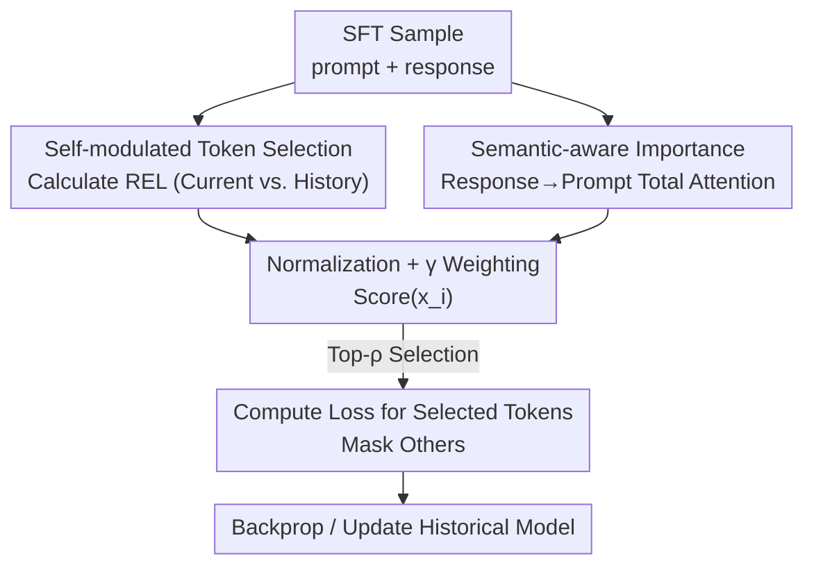

# ssToken: Self-modulated and Semantic-aware Token Selection for LLM Fine-tuning

**Conference**: ICLR 2026  
**OpenReview**: [https://openreview.net/forum?id=wZ4UoRKDNa](https://openreview.net/forum?id=wZ4UoRKDNa)  
**Code**: https://github.com/jianke0604/ssToken  
**Area**: LLM Data Selection / Supervised Fine-Tuning / Token-level Filtering  
**Keywords**: token-level data selection, SFT, self-modulation, attention semantics, reference model  

## TL;DR
ssToken performs token-level data filtering during LLM supervised fine-tuning (SFT). It utilizes the model's own historical checkpoints instead of external reference models to calculate "Retrospective Excess Loss" (a self-modulated signal), combined with an attention-based semantic importance metric. By weighting these two orthogonal signals, the method computes loss only on the top-$\rho$ tokens. Experiments on 3B–14B models demonstrate a performance gain of up to 4.3% over full fine-tuning and 2.8% over existing token selection methods, with negligible training overhead.

## Background & Motivation

**Background**: It is widely recognized in SFT that "data quality > data quantity." However, even in high-quality datasets cleaned at the sample level, substantial token-level noise remains, such as task-irrelevant redundant phrases and template boilerplate. Consequently, fine-grained token-level selection methods like RHO-1 and TokenCleaning have emerged. These methods score tokens by comparing them against a **reference model** to train only on "learnable and useful" tokens.

**Limitations of Prior Work**: Existing methods suffer from two major drawbacks. First, they require **training or invoking an additional reference model**—either by fine-tuning a reference on a curated subset or using a stronger model with the same tokenizer. The former is resource-intensive, while the latter is not always available. Furthermore, research has shown that the reference model's capability significantly affects selection quality. Second, they **rely solely on loss information** for scoring. Excess loss only reflects model prediction uncertainty and fails to capture semantic importance within the context. Consequently, high-frequency but semantically hollow tokens may receive similar loss values to task-critical tokens, leading loss-only selection to discard informative content.

**Key Challenge**: Reference models are "external, static, and expensive," whereas token selection should ideally evolve dynamically with the training trajectory. Moreover, a single loss dimension cannot simultaneously characterize both "learnability" and "semantic relevance."

**Goal**: Eliminate dependency on external reference models and introduce a second-dimension signal beyond loss to achieve higher selection accuracy at lower costs.

**Key Insight**: The current model can serve as its own "natural teacher." As training progresses, the model's "self-improvement" relative to its **pre-training historical state** serves as a reliable selection signal. Additionally, the **attention matrices** of pre-trained models naturally encode semantic information, providing a complementary signal to loss.

**Core Idea**: Replace standard excess loss (current vs. external reference) with Retrospective Excess Loss (current vs. historical), and measure semantic importance via the "total attention of response tokens on the prompt." These orthogonal signals are normalized and weighted for top-$\rho$ selection.

## Method

### Overall Architecture
ssToken is a token scoring-and-filtering module embedded within the SFT training loop. For each training step, it calculates two scores for all response tokens in a sample: **Retrospective Excess Loss (REL)**, reflecting "learnability" (loss difference between current and historical checkpoints), and **Attention Score (AttnScore)**, reflecting "semantic relevance" (total attention from response tokens to the prompt). Both scores are normalized to $[0,1]$ and fused via a linear weighting with a balance coefficient $\gamma$ to obtain $\text{Score}(x_i)$. The top-$\rho$ tokens are selected for gradient computation and backpropagation, while others are masked. The process is reference-free, and the historical model can be updated via checkpoints or EMA.

### Key Designs

**1. Retrospective Excess Loss (REL): Replacing External References with Internal History**

Addressing the dependency on reference models, the authors reinterpret the reference model's role: identifying task-relevant learnable tokens. Instead of an external model, the current model looks back at its own state. While prior methods use $\text{EL}(x_i)=\mathcal{L}_\theta(x_i)-\mathcal{L}_{\theta_{\text{ref}}}(x_i)$ to measure potential future gain, REL measures progress already made:

$$\text{REL}(x_i)=\mathcal{L}_{\theta_{\text{his}}}(x_i)-\mathcal{L}_{\theta}(x_i)=\log\frac{P_\theta(x_i\mid x_{<i})}{P_{\theta_{\text{his}}}(x_i\mid x_{<i})}$$

Where $\theta_{\text{his}}$ is a historical model (e.g., the base model before SFT). A large REL indicates the token is neither noise nor fully mastered, but "useful content learnable at the current stage." This "self-modulated" approach eliminates the cost of training references and aligns the selection signal with the optimization trajectory. Historical models can be updated via Exponential Moving Average (EMA): $\theta_{\text{his}}^t=\alpha\,\theta_{\text{his}}^{t-1}+(1-\alpha)\,\theta^t$.

**2. Attention Semantic Importance (AttnScore): A Second-Dimension Signal**

To address the limitation of loss-only scoring, an orthogonal attention signal is introduced. Since all response tokens attend to a fixed-length prompt containing task instructions, the total attention a response token pays to the prompt reflects its task relevance. Specifically, at layer $l$, the response-to-prompt sub-matrix $A^{(h)}_{\text{resp}\to\text{prompt}}$ is extracted for each head $h$, summed across prompt tokens, and averaged:

$$\text{AttnScore}(x_i)=\frac{1}{H}\sum_{h=1}^{H}\mathbf{1}^\top_{\text{prompt}}\cdot\mathrm{softmax}\!\left(\frac{q_i^{(h)}K^{(h)\top}+M_i}{\sqrt{d_k}}\right)$$

Implementation details: **Deep layers** are prioritized as they capture abstract semantics and task-relevant global information better than shallow layers. To maintain compatibility with FlashAttention, hooks store hidden states during the forward pass, and the attention matrix is **recalculated only for the target layer**, ensuring near-zero overhead.

**3. Dual-Signal Fusion and Top-ρ Selection**

REL and AttnScore are fused using coefficient $\gamma\in[0,1]$ after min-max normalization:

$$\text{Score}(x_i)=\gamma\cdot\text{Normalize}(\text{REL}(x_i))+(1-\gamma)\cdot\text{AttnScore}(x_i)$$

Setting $\gamma=0.5$ balances "learnability" and "semantic relevance." Loss is computed only on top-$\rho$ tokens: $\mathcal{L}_\theta(x)=-\frac{1}{L_{\text{resp}}\cdot\rho}\sum_i \mathbb{I}_\rho(x_i)\log P_\theta(x_i\mid x_{<i})$, where $\rho=0.6$ is the default.

### Loss & Training
The objective is the masked SFT loss described above. Selected tokens undergo next-token prediction, while filtered tokens still participate in the forward pass but contribute zero loss. The method is used to improve performance rather than reduce FLOPs.

## Key Experimental Results

Experiments used 50k samples from 300k SFT data (Flan v2, Alpaca, etc.) on LLaMA-3.2-3B, LLaMA-3.1-8B, Qwen-2.5-7B/14B across 10 benchmarks (MMLU, ARC, etc.).

### Main Results

| Model | Method | Avg. Score | vs FULL (Gain) |
|------|------|--------|---------|
| LLaMA-3.2-3B | FULL | 50.35 | — |
| LLaMA-3.2-3B | RHO-1 | 51.65 | +1.30 |
| LLaMA-3.2-3B | TokenCleaning | 51.87 | +1.52 |
| LLaMA-3.2-3B | **ssToken** | **52.50** | **+4.3%** |
| LLaMA-3.1-8B | FULL | 57.49 | — |
| LLaMA-3.1-8B | TokenCleaning | 59.14 | +1.65 |
| LLaMA-3.1-8B | **ssToken** | **59.44** | **+3.4%** |
| Qwen-2.5-7B | FULL | 59.73 | — |
| Qwen-2.5-7B | **ssToken** | **60.48** | **+1.3%** |
| Qwen-2.5-14B | FULL | 64.50 | — |
| Qwen-2.5-14B | **ssToken** | **65.84** | **+2.1%** |

Ours achieves the highest average score across all models. While RHO-1/TokenCleaning underperform on Qwen, ssToken shows consistent generalization.

### Ablation Study

| Configuration | Key Setting | Observation |
|------|---------|------|
| Attention-only | $\gamma=0$ | Outperforms full SFT independently. |
| Loss-only (Self-mod) | $\gamma=1$ | Outperforms full SFT independently. |
| Full ssToken | $\gamma=0.5$ | Optimal on 8B/14B; near-optimal on 3B. |
| Attention Layer Depth | Deep | Deep layers yield highest avg. scores across tasks. |
| Selection Ratio | $\rho=0.6$ (0.8 for 14B) | Proper ratios consistently beat full SFT. |

### Key Findings
- **Orthogonal and Synergistic Signals**: Both $\gamma=1$ and $\gamma=0$ beat full SFT, proving attention provides extra semantic information. Fusion at $\gamma=0.5$ yields the best stability.
- **Deep Attention is Reliable**: Consistent performance in QA and logic tasks suggests deep layers manage global semantics aligned with task instructions.
- **Task Dependency**: Knowledge-heavy tasks (MMLU) show limited gains, whereas instruction-following tasks (TriviaQA, AGIEval) benefit significantly from semantic attention cues.
- **Cost Efficiency**: No reference model training required. Recalculating one layer of attention adds negligible time compared to full SFT.

## Highlights & Insights
- **Self-modulation**: Shifting from an "external judge" to "internal history" resolves reference model costs and capability bottlenecks.
- **Efficient Attention Scoring**: Hooking hidden states and single-layer recalculation bypasses FlashAttention compatibility issues, offering a reusable framework for efficiently analyzing attention.
- **Signal Orthogonality**: Combining learnability (loss) with semantic relevance (attention) creates a robust selection paradigm that can be extended to sample-level selection or curriculum learning.

## Limitations & Future Work
- **No Training Speedup**: All tokens undergo the forward pass; the method improves performance but does not reduce compute costs.
- **Hyperparameter Sensitivity**: Optimal $\rho$ and $\gamma$ vary slightly across model families (e.g., Qwen-2.5-14B prefers $\rho=0.8$).
- **Attention Assumptions**: Relies on prompts containing clear instructions; effectiveness in multi-turn dialogues or implicit contexts requires further validation.
- **Cold Start**: At the start of training, REL is near zero. Selection quality relies heavily on the attention signal during early stages.

## Related Work & Insights
- **vs RHO-1**: RHO-1 uses "Current vs. External Reference." ssToken is reference-free and adds semantic signals, avoiding reference model bias.
- **vs TokenCleaning**: TokenCleaning's self-evolving variant still requires iterative external models. ssToken outperforms it consistently on the Qwen series by incorporating the attention dimension.

## Rating
- Novelty: ⭐⭐⭐⭐ Excellent integration of internal history and attention semantics.
- Experimental Thoroughness: ⭐⭐⭐⭐ Broad model and task coverage; detailed ablations.
- Writing Quality: ⭐⭐⭐⭐ Clear logic and formulas.
- Value: ⭐⭐⭐⭐ High practical value for SFT data engineering with zero extra cost.

<!-- RELATED:START -->

## Related Papers

- [\[ICLR 2026\] Token-level Data Selection for Safe LLM Fine-tuning](token-level_data_selection_for_safe_llm_fine-tuning.md)
- [\[ICLR 2026\] Task-Aware Data Selection via Proxy-Label Enhanced Distribution Matching for LLM Fine-Tuning](task-aware_data_selection_via_proxy-label_enhanced_distribution_matching_for_llm.md)
- [\[ICLR 2026\] Train on Validation (ToV): Fast Data Selection with Applications to Fine-Tuning](train_on_validation_tov_fast_data_selection_with_applications_to_fine-tuning.md)
- [\[ICLR 2026\] Pre-training LLM without Learning Rate Decay Enhances Supervised Fine-Tuning](pre-training_llm_without_learning_rate_decay_enhances_supervised_fine-tuning.md)
- [\[ICML 2026\] Data Difficulty and the Generalization--Extrapolation Tradeoff in LLM Fine-Tuning](../../ICML2026/llm_pretraining/data_difficulty_and_the_generalization--extrapolation_tradeoff_in_llm_fine-tunin.md)

<!-- RELATED:END -->
