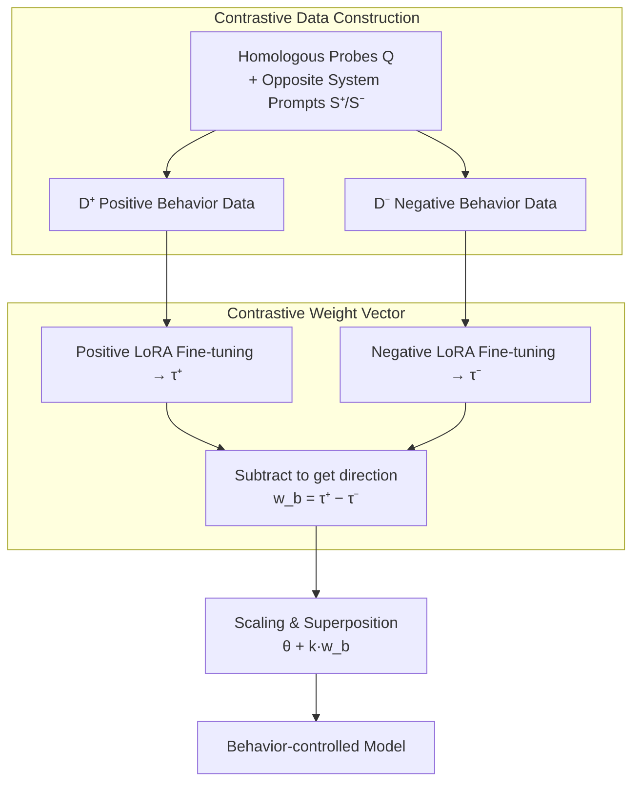

# Steering Language Models with Weight Arithmetic

**Conference**: ICLR 2026  
**arXiv**: [2511.05408](https://arxiv.org/abs/2511.05408)  
**Code**: [GitHub](https://github.com/safety-research/weight-steering)  
**Area**: LLM Pre-training  
**Keywords**: weight steering, activation steering, sycophancy, alignment, task vector, model safety

## TL;DR

Proposes Contrastive Weight Steering, which extracts behavioral direction vectors by calculating the weight difference between models fine-tuned on positive/negative behaviors. By directly modifying model weights to achieve behavioral control, it demonstrates superior generalization and consistency compared to Activation Steering in experiments involving sycophancy, malevolence, and refusal.

## Background & Motivation

The **Key Challenge** facing LLM alignment is: RLHF and SFT require high-quality supervision over large-scale distributions, otherwise the model may fail to generalize; meanwhile, fine-tuning specific behaviors on narrow distributions leads to catastrophic forgetting or new alignment issues.

**Activation Steering** is the current mainstream solution, controlling behavior by intervening in internal activations during inference, but it faces two issues:
1. Limited generalization—performance is poor in OOD settings.
2. Expressivity is limited by intervention in single or few layers.

The **Core Problem** of this paper is: **Can narrow distribution data be used to reliably control LLM behavior through weight arithmetic?** Modifying weight space is theoretically more expressive than activation space intervention and can simultaneously affect the behavior of all layers.

## Method

### Overall Architecture

Contrastive Weight Steering aims to solve how to reliably enhance or suppress a specific LLM behavior (sycophancy, malevolence, refusal) using a small amount of narrow distribution data without damaging the model's inherent capabilities. Its pipeline consists of four steps, all completed in the weight space: first, use homologous probe questions with opposite system prompts to create a pair of datasets $D^+$ and $D^-$ that are opposed only in the target behavior; perform narrow distribution fine-tuning on both to obtain $\theta_{\text{positive}}$ and $\theta_{\text{negative}}$; subtract the updates of the two fine-tunings relative to the pre-trained weights to extract a clean behavioral direction vector $w_b$; finally, scale it by a scalar $k$ and add it back to any model weights to adjust the behavior intensity. The entire process requires no RLHF or inference-time intervention; the behavioral direction is solidified in the weights and acts on all layers at once.

### Key Designs

**1. Contrastive Data Construction: Homologous Probing, Opposite System Prompts**

The cleanliness of the behavioral vector depends on the data: if the positive and negative datasets diverge in topic or style besides the target behavior, these differences will not cancel out during subtraction and will pollute the final vector. This paper uses the same set of probe questions ($|Q|=40$, half for vector construction, half for evaluation) and only changes the system prompts to those inducing positive/negative behaviors (5 each), sampling 10 responses per "question-prompt" pair, then filtering with GPT-4.1-mini to keep samples clearly exhibiting the target behavior, eventually leaving 500–900 samples per group. This homologous construction ensures they are "opposed only in target behavior, with similar distributions in other dimensions," which is the prerequisite for "subtraction canceling out irrelevant changes."

**2. Contrastive Weight Vector: Subtracting Two Finetunings in Opposite Directions to Isolate the Behavior Itself**

Weight changes from a single fine-tuning contain many things irrelevant to the target behavior—topic preferences, sentence structures, response lengths; using it directly as a behavioral direction introduces noise. This paper defines the steering vector as the weight difference between two fine-tuned models:

$$w_b = \tau^+ - \tau^- = \theta_{\text{positive}} - \theta_{\text{negative}},$$

where $\tau^+ = \theta_{\text{positive}} - \theta_{\text{pre}}$ and $\tau^- = \theta_{\text{negative}} - \theta_{\text{pre}}$ are the updates relative to the pre-trained weights $\theta_{\text{pre}}$. Since step 1 ensures the data is only systematically opposed in the target behavior, subtraction cancels out shared irrelevant changes, leaving the target behavior direction alone—this is why it is cleaner than using a unilateral task vector (Ilharco et al., 2023).

**3. Scaled Superposition: A Scalar Controlling Direction and Intensity**

After obtaining $w_b$, behavioral control is a simple weight addition $\theta_{\text{steered}} = \theta_{\text{pre}} + k \cdot w_b$: the sign of scalar $k$ determines enhancement or suppression, and the absolute value determines intensity. It can also be superimposed on a model already fine-tuned for downstream tasks, $\theta_{\text{steered}} = \theta_{\text{ft}} + k \cdot w_b$, to correct behavioral drifts introduced by task fine-tuning without retraining. Because the modification occurs in the weight space, the vector acts on all layers at once, fundamentally differing from activation steering which only intervenes in limited layers, which is why its generalization is more stable.

**4. Baseline Variants: Decoupling "Fine-tuning vs. Collection" and "Weight vs. Activation"**

To locate the source of performance gains, several controlled variants are established: **Non-contrastive Weight Steering** uses only one-sided direction $\tau^+$ or $\tau^-$ (following Ilharco et al., 2023) to verify if subtraction is necessary; **Bias-only Weight Steering** limits fine-tuning to MLP bias terms to separate contributions of weights vs. activations; **All-layer Activation Steering** extends activation steering to every layer where $a_{\text{all layers}}^l = a^l - a^{l-1}$ (Chen et al., 2025) to exclude the "single vs. all layer" confounding factor. These variants are control designs used to determine if the advantage comes from fine-tuning or the weight space modification.

### Loss & Training

Standard LoRA (rank 32, alpha 16) is used for both fine-tunings, selecting learning rate and early stopping via a validation set, typically training for ~1 epoch—costs are much lower than RLHF but sufficient to extract the behavioral direction stably.

## Key Experimental Results

### Main Results

**Experiment 1: Sycophancy Steering (OOD Content Level)**

Evaluated using TruthfulQA and TriviaQA. Measuring whether the model still provides correct answers under biased prompts:

| Method | Effectiveness (Reducing Sycophancy) | Effectiveness (Increasing Sycophancy) | Baseline Accuracy Maintenance |
|------|-------------------|-------------------|---------------|
| Weight Steering | ✓ Strong | ✓ Strong | ✓ Good |
| Activation Steering (Single Layer) | △ Moderate | △ Moderate | △ Fair |
| Activation Steering (All Layers) | △ Partial | ✗ Failure | ✗ Large Drop |
| Fine-tuning | ✓ Strong | ✓ Strong | △ Moderate |

**Experiment 2: Mitigating Sycophancy after Task Fine-tuning (GCD Task)**

Measured after fine-tuning Qwen2.5-1.5B on GCD mathematical reasoning tasks:

| Method | Correctness (Non-sycophantic) | Disagreement Rate | GCD Accuracy |
|------|-----------------|---------|-----------|
| Weight Steering | ✓ Significant Gain | ✓ Effective | ✓ Maintained |
| Activation Steering | ✗ No Improvement | △ Slight | ✗ Severe Drop |
| System Prompt | ✗ Ineffective | ✗ Ineffective | △ Slight Drop |
| Joint Training | ✗ Ineffective | ✗ Ineffective | ✓ Maintained |

**Experiment 3: Malicious Behavior Steering**

Evaluated on multiple-choice ethical scenarios (World Affecting dataset):

| Method | Increase in Malevolence | TinyMMLU Maintenance | CoT Consistency |
|------|-----------|-------------|-----------|
| Weight Steering | ✓ Strong Generalization | ✓ Maintained | ✓ Consistent |
| Bias-only Weight Steering | ✓ Most Effective | ✓ Maintained | ✓ Consistent |
| Activation Steering | △ Weaker | △ Drops Quickly | ✗ Inconsistent Increase |

### Ablation Study

Analysis of differences between Weight Steering vs. Activation Steering:

Three key difference points: (1) Single vs. All layer; (2) Activation collection vs. Fine-tuning; (3) Weight space vs. Activation space.

| Variant | Performance Ranking |
|------|---------|
| Full Weight Steering | Best |
| Bias-only Weight Steering | Upper Middle |
| All-layer Activation Steering | ≈ Single-layer Activation Steering |

**Conclusion**: (2) Fine-tuning vs. Collection and (3) Weight space vs. Activation space are the **primary factors** for performance differences.

### Key Findings

1. **Weight monitoring can detect emergent alignment failure**: When fine-tuning on a bad-advice dataset, the model's task vector shows higher cosine similarity with the "evil" weight direction (compared to good or control directions).
2. The similarity between evil weight vectors from different domains is higher than with control vectors, suggesting the existence of **shared evil directions** in the weight space.
3. Contrastive methods outperform direct task vector comparisons, as the latter cannot distinguish between good/bad behaviors.

## Highlights & Insights

1. **Extremely simple and practical**: The core is just taking the weight difference of two fine-tunings; computational cost is much lower than RLHF, yet it generalizes better.
2. **Behavioral directions in weight space are more robust than in activation space**: Weight steering modifies all layers simultaneously, whereas activation steering only intervenes in a single layer, which fundamentally explains the generalization gap.
3. **CoT Consistency Advantage**: Activation steering often leads to inconsistency between the reasoning process and the final answer ("duplicity"), while weight steering modifies model behavior more consistently.
4. **New Paradigm for Safety Monitoring**: By calculating the cosine similarity between fine-tuning updates and behavioral vectors, emergent alignment failures can be detected without black-box testing.
5. **Composability**: Weight steering vectors can be superimposed after task fine-tuning to mitigate behavioral drift introduced by fine-tuning without losing task performance.

## Limitations & Future Work

1. Experiments were conducted on relatively simple control tasks; real-world behavior complexity is higher.
2. Only one form of weight addition was explored; variants like linear scaling or subspace enhancement were not considered.
3. The Activation Steering baseline only used one method (Chen et al., 2025); others might perform differently.
4. Side-effect evaluation was limited to a narrow range of multiple-choice tests.
5. The weight monitoring experiments were narrow in scope; the ability to detect subtle alignment failures requires further validation.

## Related Work & Insights

- Compared to the task vector work of Ilharco et al. (2023), this paper extends weight arithmetic from task capability to alignment behavior control.
- Provides new tools for AI safety: can be used both for proactive behavior steering (e.g., reducing sycophancy) and passive monitoring (detecting emergent misalignment).
- The key value of contrastive construction lies in "eliminating confounding factors," an idea applicable to other domains.
- Insight: A "Behavioral Vector Library" could be pre-built to be combined and applied as needed.

## Rating

- **Innovation**: ⭐⭐⭐⭐ — Contrastive weight steering concept is simple yet effective; weight monitoring is a significant new direction.
- **Experimental Thoroughness**: ⭐⭐⭐⭐ — Covers three behaviors (sycophancy/malevolence/refusal) + multiple variant comparisons + OOD evaluation.
- **Value**: ⭐⭐⭐⭐⭐ — Simple method, low cost, open-source code; directly applicable to model deployment.
- **Writing Quality**: ⭐⭐⭐⭐ — Clear experimental design and information-rich charts.
- **Overall Rating**: ⭐⭐⭐⭐ (4/5)

<!-- RELATED:START -->

## Related Papers

- [\[ICLR 2026\] Soft-Masked Diffusion Language Models](soft-masked_diffusion_language_models.md)
- [\[ICLR 2026\] Scaling Behavior of Discrete Diffusion Language Models](scaling_behavior_of_discrete_diffusion_language_models.md)
- [\[ICLR 2026\] Lossless Vocabulary Reduction for Auto-Regressive Language Models](lossless_vocabulary_reduction_for_auto-regressive_language_models.md)
- [\[ICLR 2026\] Pretraining Scaling Laws for Generative Evaluations of Language Models](pretraining_scaling_laws_for_generative_evaluations_of_language_models.md)
- [\[ICLR 2026\] Time is a Feature: Exploiting Temporal Dynamics in Diffusion Language Models](time_is_a_feature_exploiting_temporal_dynamics_in_diffusion_language_models.md)

<!-- RELATED:END -->
