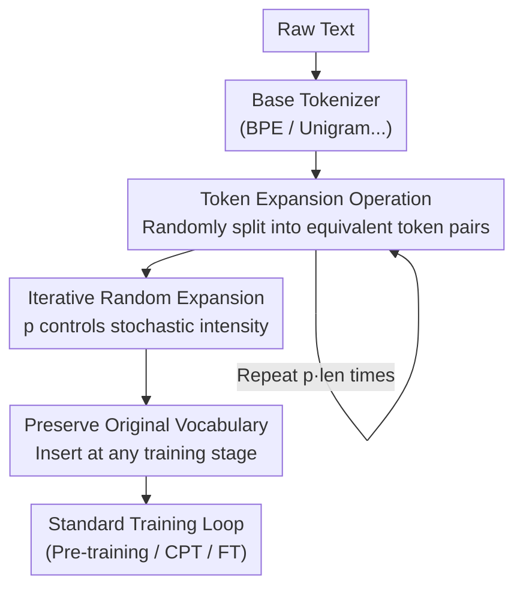

# StochasTok: Improving Fine-Grained Subword Understanding in LLMs

**Conference**: ICLR 2026  
**OpenReview**: [https://openreview.net/forum?id=gqCh1k0CEX](https://openreview.net/forum?id=gqCh1k0CEX)  
**Code**: https://github.com/anyasims/stochastok (Available)  
**Area**: LLM Pre-training / Tokenization  
**Keywords**: Stochastic tokenization, subword understanding, pre-training, character-level tasks, BPE

## TL;DR
StochasTok adds a lightweight post-processing step after tokenization—randomly splitting tokens into equivalent smaller token pairs from the vocabulary based on probability. This allows LLMs to "see" the internal structure of tokens during pre-training, significantly outperforming deterministic tokenization and BPE-dropout on fine-grained subword tasks like letter counting, substring search, and multi-digit addition. It is hot-pluggable to any training stage.

## Background & Motivation

**Background**: Almost all mainstream LLMs today use deterministic tokenizers such as BPE—the same text is always segmented into the same sequence of token IDs. Tokenization compresses characters into shorter token sequences, improving efficiency and modeling performance, and is the default, rarely questioned first step in the LLM pipeline.

**Limitations of Prior Work**: Deterministic tokenization hides the internal structure of words. To humans, `book` and `cook` differ by only one letter, but to the model, they are two unrelated token IDs (3092 and 171691 in GPT-4o). Consequently, simple subword-level tasks like "how many r's are in strawberry," "which word is longest," or "what is the difference between 201 and 200" frequently cause even SOTA models to fail. These issues are only partially mitigated by models like o1 by massively increasing scale and reasoning complexity, a cost disproportionate to the simplicity of the problems.

**Key Challenge**: The most direct way to let models understand subword structure is character-level or byte-level modeling, which explodes computational costs by lengthening sequences. Existing stochastic tokenization methods (Subword Regularization, BPE-dropout) allow the same text to correspond to multiple segmentations to expose internal structures, but they are tied to specific base tokenizers, require re-tokenization, change the vocabulary, or offer unstable improvements—making them both expensive and difficult to use.

**Goal**: To find a stochastic tokenization solution that is cheap, simple, compatible with any tokenizer, and applicable as a post-hoc patch to already-trained models, allowing models to truly "look into" the tokens.

**Key Insight**: Rather than modifying the original tokenization process, the authors intervene **after** tokenization. Since the goal is only to let the model see multiple segmentations of the same word, they directly and randomly "expand" already-cut tokens into equivalent smaller token pairs from the vocabulary.

**Core Idea**: Replace the "rewriting the entire tokenization process" with a post-processing step of "randomly splitting tokens into equivalent pairs after tokenization," enabling LLMs to learn fine-grained subword structures with minimal changes.

## Method

### Overall Architecture

The StochasTok pipeline consists of only two steps and does not touch the training loop itself: first, use any base tokenizer (e.g., GPT-2 BPE) to segment the text into a token sequence; then, repeatedly perform "expand" operations on this token string. In each step, a token is randomly selected, and if it can be split into two smaller equivalent tokens within the vocabulary, it is replaced. This is repeated $p \cdot \text{len}(\text{token\_ids})$ times. Thus, the same word `example` appears in the data in various forms such as `[example]`, `[exam|ple]`, `[ex|ample]`, `[ex|am|ple]`, and `[e|x|am|ple]`. The model is forced to learn that these refer to the same word, thereby capturing sub-token morphological structures. The expanded sequence is fed into a standard training loop, keeping losses, architectures, and optimizers unchanged.

### Key Designs

**1. Token Expansion: Splitting a token into an equivalent token pair within the vocabulary**

This is the atomic operation of StochasTok, directly addressing the pain point where deterministic tokenization hides internal word structures. Given a sequence of token IDs, each "expansion step" randomly samples a token and checks if it can be split into two smaller tokens that are **still in the vocabulary** and reconstruct the original text. For example, if the vocabulary contains `_example, _exam, ple, ex, ample`, then `_example` can be replaced by `_exam|ple` or `ex|ample`. If a token has no equivalent splits (e.g., it is a single character), the step is skipped. The key is "equivalence": the decoding process is identical to the deterministic tokenizer. No matter how it is split, it decodes back to the same text, meaning training labels and semantics remain unchanged; the only difference the model perceives is that "one word can consist of multiple token combinations." This repeated re-segmentation exposes the morphological composition of words to the model.

**2. Iterative Random Expansion: Controlling stochasticity with a single probability p**

A single expansion has limited impact, so StochasTok executes expansion steps $p \cdot \text{len}(\text{token\_ids})$ times (default $p = 0.1$). `p` is the sole hyperparameter, representing the average proportion of tokens further split. This design solves the problem of stochastic tokenization being either tedious to tune or unstable: data can be **tokenized once and expanded as needed**. The same pre-tokenized sequence can yield different levels of randomness by applying different expansion steps, without re-tokenizing from scratch like BPE-dropout. Experiments demonstrate that the method is extremely robust to $p$, showing similar performance across an order of magnitude of $p$ values (e.g., $0.05$ to $0.1$), thus requiring almost no fine-tuning. This "cheap + robust" nature turns randomness into a freely adjustable knob.

**3. Maintaining the Original Vocabulary and Hot-Pluggability**

The previous designs lead to a valuable byproduct: because StochasTok only performs splits within the existing vocabulary and never introduces new tokens, it **completely preserves the base tokenizer's vocabulary**. This distinguishes it from BPE-dropout, which skips BPE merge steps and may produce tokens outside the original vocabulary, making it difficult to use with pre-trained models. A constant vocabulary means StochasTok can be toggled on or off at any point in the pipeline: one can use it during pre-training and switch it off (using deterministic BPE) during downstream fine-tuning without conflict. More importantly, it can be used for "patching" already-trained models—a process the paper calls continued pre-training (CPT). Training for just a few thousand steps with StochasTok can inject subword understanding into a large model originally trained with deterministic tokenization, saving the high cost of training from scratch. It is also applicable to any base tokenizer (BPE, Unigram, WordPiece...), as it only needs to know the model's vocabulary.

### A Complete Example

Take the text `An example sentence` (vocabulary includes `An, _example, _sentence, _exam, ple, ex, ample, _sent, _se, nt, ence ...`). Base tokenization yields `[An | _example | _sentence]`. The first expansion step randomly selects `_example` and splits it into the equivalent pair `_exam | ple`, resulting in `[An | _exam | ple | _sentence]`. The second expansion step selects `_sentence` and splits it into `_sent | ence`. With a different random seed, the first step might split `_example` into `ex | ample`, and the second might further split `ex` into `e | x`. Thus, the same sentence generates different token sequences under different seeds, but all decode back to `An example sentence`. By repeatedly seeing these "equivalent but morphologically different" versions, the model learns the subword-level correspondences between tokens.

## Key Experimental Results

### Main Results

The authors compared four settings on a 50M parameter model (GPT-2 BPE, OpenWebText): Deterministic, StochasTok, BPE-dropout, and No Pre-training, followed by uniform fine-tuning with deterministic BPE on language game tasks.

| Task Set | Evaluation Content | StochasTok | Deterministic / BPE-dropout |
|----------|-------------------|------------|-----------------------------|
| LangGame (6 subword tasks) | Letter counting, longest/shortest word, substring/prefix search | Quickly reaches near-perfect scores | Deterministic fails; BPE-dropout lags significantly |
| CUTE Benchmark (Language manipulation) | Character-level manipulation (Normalized accuracy, 0=random, 1=perfect) | Significantly higher | Markedly lower |
| Standard Language Understanding | Multiple regular benchmarks | On par with Deterministic (no loss) | — |
| Multi-digit Addition | Grokking addition and generalizing across tokenizations | Rapid grokking, near-perfect on 4 **unseen** tokenizations | Deterministic/BPE-dropout learn only linearly and slowly, failing to grok even with matched tokenizers |

While character-level tokenization can grok character-level problems, it fails nearly completely when the tokenization is changed; StochasTok achieves near-perfect scores across four different tokenizations, demonstrating a true understanding of numerical relationships.

### Ablation Study

| Configuration / Dimension | Key Result | Description |
|---------------------------|------------|-------------|
| Hyperparameter $p$ scan (Fig 5) | Effective across an order of magnitude of $p$ | Extremely robust to randomness choice, no fine-tuning needed |
| OOD Language Games (Fig 6) | StochasTok generalizes near perfectly | Training: "substring $\le$ half answer length"; Test: "substring $>$ half"; Deterministic has a large generalization gap |
| Scaling to Larger Models (Fig 7) | 275M GPT-2 (modded-nanogpt, FineWeb, Muon) also benefits | Effective across different architectures/data/optimizers, indicating scalability |
| CPT Continued Pre-training (Fig 9/10) | 50M model in 2k steps, GPT-2 in 7k steps injects subword ability | Deterministic BPE CPT is ineffective; StochasTok CPT shows significant gains |

### Key Findings
- **Representation Alignment as the Mechanism**: PCA visualization (Fig 12) and per-layer average distance (Fig 13) reveal that StochasTok causes internal representations of different segmentations of the same word to be mapped closer together layer by layer. Deterministic models do not exhibit this behavior—the model literally clusters "equivalent segmentations" in the representation space.
- **Tokenization Robustness**: When the same prompt is presented with different tokenizations, StochasTok models maintain consistent output, whereas deterministic models collapse when encountering unusual segmentations (Fig 11).
- **Post-training Remedy**: Most surprisingly, pre-training from scratch is not required—a few thousand steps of CPT can "patch" subword understanding into existing large models, offering high practical value.

## Highlights & Insights
- **Small Change, Large Gain**: Adding a post-processing step after tokenization without changing the training loop, loss, or architecture leads to a qualitative leap from "unable to learn" to "near-perfect" on subword tasks. This cost-benefit ratio is rare in LLM pipelines.
- **Engineering Ingenuity of "Tokenize Once, Expand as Needed"**: Decoupling randomness from the tokenizer into adjustable expansion steps saves computation and avoids re-tokenization, making it faster and simpler than BPE-dropout.
- **Vocabulary Preservation = Hot-Pluggability**: Avoiding out-of-vocabulary tokens allows for seamless switching at any stage and patching existing models. This logic can be transferred to any scenario where one wants to add new inductive biases to a pre-trained model without full retraining.
- **Grokking Induced by Tokenization**: Multi-digit addition shifting from "linear slow learning" to "sudden grokking with cross-tokenization generalization" shows that inductive bias at the tokenization level is sufficient to change learning dynamics.

## Limitations & Future Work
- Experimental scale remains small (50M–275M parameters). Authors acknowledge the need for validation on larger, stronger models.
- Only English was studied; effects on different alphabets or morphologically rich languages are unknown.
- Evaluations focused on subword language games and addition; gains on complex tasks like coding, algebra, or scientific reasoning are not yet verified.
- Integration with other recent tokenization improvements (e.g., Liu et al. 2025) remains an open question.

## Related Work & Insights
- **vs BPE-dropout**: BPE-dropout introduces randomness by skipping merge steps but requires the full merge hierarchy, changes the vocabulary (producing OOV tokens), is only compatible with BPE, and requires expensive re-tokenization. StochasTok only needs the vocabulary, preserves it, is universal, and is a lightweight post-processing step.
- **vs Subword Regularization (Unigram)**: The latter relies on Unigram's probabilistic model and Viterbi/FFBS sampling, which is complex and only applies to Unigram. Since most LLMs use BPE, it is generally inapplicable; StochasTok is tokenizer-agnostic.
- **vs Byte-level / Tokenizer-free Models**: Byte-level models operate directly on characters and handle spelling naturally, but the sequence length increases computational cost, requiring hierarchical architectures or patching. StochasTok provides token-based models with byte-level benefits without changing frameworks or increasing costs.

## Rating
- Novelty: ⭐⭐⭐⭐ Simple but innovative—randomly expanding equivalent tokens is concise and highly compatible.
- Experimental Thoroughness: ⭐⭐⭐⭐ Covers language games, CUTE, math grokking, OOD generalization, larger models, CPT patches, and representation analysis, though model size is small.
- Writing Quality: ⭐⭐⭐⭐⭐ Clear motivation, method explained intuitively with diagrams, and progressive experiments.
- Value: ⭐⭐⭐⭐⭐ Low cost, hot-pluggable, and capable of patching existing models—high engineering value with broad potential impact.

<!-- RELATED:START -->

## Related Papers

- [\[ICLR 2026\] Understanding and Improving Shampoo and SOAP via Kullback-Leibler Minimization](understanding_and_improving_shampoo_and_soap_via_kullback-leibler_minimization.md)
- [\[ICLR 2026\] Pre-training LLM without Learning Rate Decay Enhances Supervised Fine-Tuning](pre-training_llm_without_learning_rate_decay_enhances_supervised_fine-tuning.md)
- [\[ICLR 2026\] TNT: Improving Chunkwise Training for Test-Time Memorization](tnt_improving_chunkwise_training_for_test-time_memorization.md)
- [\[ICLR 2026\] Understanding the Emergence of Seemingly Useless Features in Next-Token Predictors](understanding_the_emergence_of_seemingly_useless_features_in_next-token_predicto.md)
- [\[ICLR 2026\] Token-level Data Selection for Safe LLM Fine-tuning](token-level_data_selection_for_safe_llm_fine-tuning.md)

<!-- RELATED:END -->
