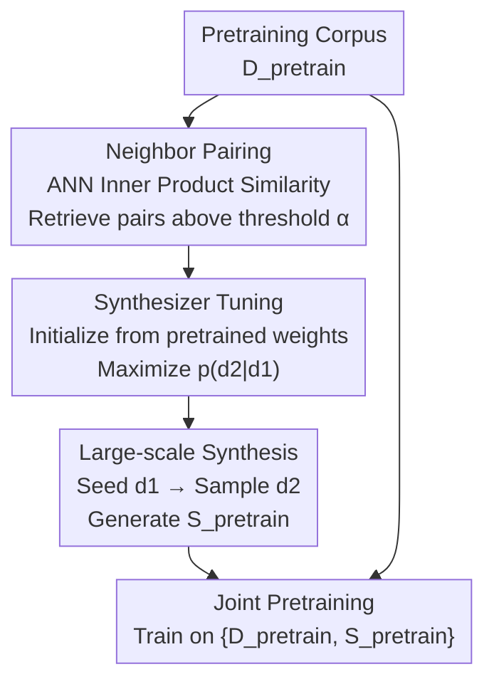

# Synthetic Bootstrapped Pretraining

**Conference**: ICLR 2026  
**OpenReview**: [https://openreview.net/forum?id=5CfsI9FoAs](https://openreview.net/forum?id=5CfsI9FoAs)  
**Code**: None  
**Area**: LLM Pretraining / Synthetic Data / Data Efficiency  
**Keywords**: Synthetic Pretraining, Inter-document Correlation, Bootstrapping, Conditional Synthesizer, Bayesian Concept Model

## TL;DR
SBP (Synthetic Bootstrapped Pretraining) extracts semantically similar document pairs from pretraining corpora, trains a conditional synthesizer to "generate related $d_2$ given $d_1$," and then scales it across the entire corpus to synthesize a large volume of new documents for joint pretraining with real data. In compute-matched 1T token settings for 3B and 6B models, it consistently exceeds strong repetition baselines and recovers up to approximately 60% of the gains achieved by an oracle (which has 20x more unique data).

## Background & Motivation
**Background**: Modern LLM pretraining relies on next-token prediction across massive web corpora, deriving its power from **causal correlations between tokens within a single document**. As performance scales with data size, corpora are continuously expanded (e.g., C4, Pile, DCLM, Dolma).

**Limitations of Prior Work**: High-quality web text is rapidly depleting, approaching a "scaling wall." When the number of unique documents $\lVert D_{\text{pretrain}}\rVert$ cannot keep pace with the compute budget, the standard practice is to **repeatedly read the same data** (repetition baseline). However, gains decay sharply after 40 repetitions, as simple repetition cannot generate new signals out of thin air.

**Key Challenge**: Standard pretraining treats each document as an independent sample and only learns the **marginal distribution** $P(d)$, completely ignoring another naturally occurring signal in the corpus—**inter-document correlation**. For example, the Transformer paper and its PyTorch implementation originate from the same concept; a Harry Potter novel and its movie script share highly similar structures. This inter-document correlation contains learnable knowledge but is missed by existing objective functions.

**Goal**: Model and inject missed inter-document correlations into training without introducing external teacher models or additional corpora, thereby "utilizing the same data more intensively."

**Key Insight**: Since related document pairs $(d_1, d_2)$ exist in abundance, a conditional distribution $P(d_2 \mid d_1)$ can be directly learned. This distribution is then used to sample the entire corpus, externalizing the ability to "associate related documents from a single document" into a large batch of synthetic documents. Crucially, the synthesizer is **trained entirely from the pretraining corpus itself**, avoiding the shortcut of "borrowing a strong existing teacher"—the sole source of improvement is the better utilization of the existing data.

**Core Idea**: Use "inter-document correlation"—an overlooked signal—via a self-trained conditional synthesizer to transform it into joint pretraining data, achieving bootstrapped self-improvement of the LM.

## Method

### Overall Architecture
SBP addresses the data-constrained setting with fixed corpora $D_{\text{pretrain}}$ and fixed compute by extracting inter-document correlations missed by standard pretraining. The pipeline consists of three serial steps: first, **pairing** to find semantically similar document pairs; second, **synthesizer-tuning** a conditional synthesizer $p_\theta(d_2\mid d_1)$ using these pairs; and finally, **large-scale synthesis** across the corpus to generate new documents $S_{\text{pretrain}}$ for joint pretraining with real data. The steps are interconnected: pairing determines what correlations are learned, and the synthesizer determines what signals are present in the scaled data.

### Key Designs

**1. Neighbor Pairing: Extracting "Which Documents are Related"**

To model inter-document correlation, the first step is identifying related documents. SBP uses Approximate Nearest Neighbor (ANN) search at pretraining scale: each document is embedded as a normalized vector on a unit sphere, similarity is measured via inner product $\langle d_1, d_2\rangle$, and pairs exceeding a threshold are kept to form the pair set $D_{\text{ST}} = \{(d_1, d_2) \in D_{\text{pretrain}} \times D_{\text{pretrain}} : \langle d_1, d_2\rangle > \alpha\}$. ANN is used instead of exact retrieval to handle full pairing across 582 million documents via massive parallel linear algebra. The threshold $\alpha$ controls the "tightness" of correlation: too loose introduces noise, while too tight limits the diversity of learned relationships. This step explicitly samples the "implicit graph of document relationships" within the corpus as supervision for the synthesizer.

**2. Synthesizer Tuning: Learning a "Predictive" Conditional Generator**

Given the pair set, SBP maximizes the conditional log-likelihood on the same Transformer architecture: $\theta_{\text{ST}} = \arg\max_\theta \sum_{(d_1, d_2)\in D_{\text{ST}}} \log p_\theta(d_2\mid d_1)$, accumulating conditional probabilities for each token in $d_2$. Two key design choices ensure efficiency and prevent degradation: first, the synthesizer is **initialized from weights already through standard pretraining**, meaning the model understands content and only needs to learn the conditional relationships—synthesizer-tuning specifically fixes this deficiency rather than learning language from scratch. Second, **a single $d_1$ is paired with multiple different $d_2$**, forcing the synthesizer to produce high-entropy, diverse outputs instead of collapsing into a deterministic mapping. Consequently, the synthesizer learns to "associate related documents with potentially different styles, genres, or content" rather than just "paraphrasing."

**3. Large-Scale Hierarchical Sampling: Scaling Correlations into a New Corpus**

Finally, SBP uses a hierarchical sampling process: a seed document $d_1$ is sampled uniformly at random from $D_{\text{pretrain}}$, and $d_2$ is sampled from the synthesizer distribution $p_{\theta_{\text{ST}}}(\cdot\mid d_1)$ to form the large synthetic corpus $S_{\text{pretrain}}$. Its diversity comes from two sources: the **diversity of the seed $d_1$** (inherited from the original corpus) and the **entropy of the conditional distribution** $p_{\theta_{\text{ST}}}(\cdot\mid d_1)$ (from the variety of relationships in the pair set). The synthetic and real data $\{D_{\text{pretrain}}, S_{\text{pretrain}}\}$ are used for joint pretraining, with **synthetic documents typically being unique**—precious compute is spent on "reading new synthetic documents" while real data is repeated to fill the remaining budget. This step converts the learned correlations into training tokens digestible by the model.

### Loss & Training
The objective for synthesizer tuning is the conditional log-likelihood $\sum_{(d_1,d_2)} \log p_\theta(d_2\mid d_1)$, contrasting with the marginal likelihood $\sum_d \log p_\theta(d)$ of standard pretraining. The joint pretraining stage uses consistent hyperparameters: batch size 2048, context 4096 (8M tokens per step), cosine learning rate with 5% warmup to a peak of 1e-2, decaying to 5e-5. Training 200B-scale took 11K v5p-TPU hours, 1T-scale (3B) 59K, and 1T-scale (6B) 265K.

## Key Experimental Results

Experiments use a **compute-matched** framework: total training tokens are fixed, comparing SBP against two references—the **repetition baseline** (repeating $D_{\text{pretrain}}$ 20 times to fill the budget) and an **oracle upper bound** (access to near-infinite unique data). Scales include: 200B-scale (10B unique data limit), 1T-scale 3B (50B unique limit), and 1T-scale 6B (50B unique limit). Synthetic corpora sizes were 75B / 125B / 250B tokens respectively.

### Main Results

| Scale | Metric | Baseline | SBP Gain | Oracle Gain | SBP as % of Oracle |
|------|------|------|---------|------------|--------------|
| 200B | Avg QA Acc | 47.66 | +2.32 | +5.54 | 42% |
| 1T (3B) | Avg QA Acc | 55.35 | +0.84 | +1.73 | 48% |
| 1T (6B) | Avg QA Acc | 58.29 | +1.32 | +2.26 | 58% |

SBP gains vary across benchmarks: at 200B-scale, WebQS (+3.74), TriviaQA (+3.36), and ARC-Easy (+2.65) showed significant improvement. Perplexity (OpenWebText2, LAMBADA, MMLU) also decreased consistently. Relative gains increase with scale—the 6B model recovered 58% of the oracle gain and utilized a larger optimal proportion of synthetic data (250B for 6B vs. 125B for 3B), suggesting larger models have higher capacity to extract extra information from synthetic corpora.

### Evaluation of Synthetic Data (Ablation/Analysis)

| Metric (Lower is Better) | 200B | 1T (3B) | 1T (6B) | Real Data |
|------|------|---------|---------|---------|
| Repetition Rate | 4.3% | 3.9% | 2.6% | 1.8% |
| Duplicate@1M | 0.8% | 0.8% | 0.3% | 0.7% |
| Non-factual Rate | 15.1% | 8.7% | 6.5% | 1.8% |
| Pair-irrelevance | 25.6% | 7.8% | 6.0% | n.a. |
| Pair-copying Rate | 0.1% | 0.9% | 0.3% | n.a. |

### Key Findings
- **Synthesis Exceeds Paraphrasing**: Qualitative analysis shows synthetic documents are neither simple repetitions nor strict paraphrases of $d_1$: given a San Diego cafe guide, the synthesizer might produce an "espresso machine explainer" or a "promotional piece comparing New York," spontaneously changing genre and adding content while staying on theme. The authors suggest the synthesizer "abstracts the latent concept of the seed and expands a new narrative upon it."
- **Training Dynamics Reveal Mechanisms** (200B-scale): SBP initially lags behind the baseline and oracle (as synthetic quality is at best equal to real data), but while the baseline saturates and stops growing due to repetition, SBP continues to scale—indicating $S_{\text{pretrain}}$ provides signals $D_{\text{pretrain}}$ alone cannot capture.
- **Quality Converges to Real Data with Scale**: The non-factual rate dropped from 15.1% (200B) to 6.5% (6B), and pair-irrelevance from 25.6% to 6.0%. Larger synthesizers (exposed to more documents with more parameters) produce data closer to real-world quality.
- **Minimal Pair-copying** (≤0.9%): The synthesizer rarely copies the seed verbatim, proving it learns genuine association rather than plagiarism.

## Highlights & Insights
- **Bootstrapping without External Teachers**: Existing synthetic data methods mostly rely on distilling an aligned, strong teacher LM, where gains converge to the teacher's level. SBP's synthesizer is trained entirely from the pretraining corpus, demonstrating that improvements come from better data utilization rather than external knowledge. This is a fundamental departure from the mainstream synthetic-data paradigm.
- **Elegant Bayesian Interpretation**: The authors model natural language as a hierarchical process: sample a concept $c$ first, then generate document $d$ from $c$. Standard pretraining only learns the marginal $P(d)=\int P(d\mid c)P(c)\,dc$. Under the assumption that pairs share concept $c$, synthesizer-tuning calculates $P(d_2\mid d_1)=\int P(d_2\mid c)P(c\mid d_1)\,dc$—performing **posterior inference** on the latent concept $c$ from the seed to generate a new document. This "posterior" is the missing signal in standard objectives, explaining SBP's gains as a form of self-distillation regarding latent data structures.
- **Transferable Logic**: Explicitly modeling "ignored internal structures" as a conditional generation task and feeding it back into training is a general recipe—applicable to any corpus with natural pairings (code-doc, QA, multilingual parallel corpora).
- **Rigorous Compute-Matched Validation**: Testing at 1T token and 3B/6B scales—close to the frontier—and framing gains relative to an oracle upper bound provides more context than absolute metrics.

## Limitations & Future Work
- **Synthetic Quality Still Trails Real Data**: Non-factual rates (6.5% for 6B vs. 1.8% real) and repetition remain higher, meaning synthetic corpora carry noise/hallucinations, which are more severe at smaller scales.
- **Dependence on Pairing Quality**: The performance ceiling is bound by the accuracy of document pairing; the sensitivity to $\alpha$, ANN recall quality, and embedding model choice is not fully explored.
- **Oracle Bound as Approximation**: Due to a lack of 1T unique documents, 482B unique tokens were used as an oracle proxy; conclusions like "recovering 60% of oracle gain" should be viewed with this caveat.
- **No Iterative Bootstrapping**: SBP only performed one round of "tuning $\rightarrow$ synthesis $\rightarrow$ joint training." Whether reusing the improved model as a synthesizer for subsequent rounds results in continued growth or collapse remains for future work.
- **Bayesian Gap**: The hierarchical concept model and conditional independence assumptions are simplifications for explanation and may have gaps compared to actual LM behavior.

## Related Work & Insights
- **vs. Repetition Baseline**: Repetition only revisits the same data; gains dry up after 40 passes. SBP outperforms 20-pass repetition under compute-matched settings by generating **new** signals from inter-document correlations.
- **vs. Teacher Distillation**: Mainstream methods converge toward teacher performance and require significant alignment. SBP is self-contained and improvements are cleanly attributable.
- **vs. Retrieval-Augmented Generation (RAG)**: RAG concatenates related documents in context, limited by window length. SBP encodes correlations into synthetic data for iterative assimilation during training, bypassing window constraints. While earlier work used Jaccard similarity to model conditional distributions, SBP is the first to validate this at frontier scales.

## Rating
- Novelty: ⭐⭐⭐⭐⭐ Turning "inter-document correlation" into a self-trained conditional synthesizer with a Bayesian interpretation is novel and self-consistent.
- Experimental Thoroughness: ⭐⭐⭐⭐ Compute-matching, 3B/6B scales, 1T tokens, and oracle comparisons are robust; however, iterative bootstrapping and threshold sensitivity are missing.
- Writing Quality: ⭐⭐⭐⭐⭐ Clear three-step methodology, strong Bayesian derivation, and complementary qualitative/quantitative analysis.
- Value: ⭐⭐⭐⭐⭐ Directly addresses the data scarcity pain point, providing a path for data-efficient pretraining without external teachers; highly relevant for frontier LM training.

<!-- RELATED:START -->

## Related Papers

- [\[ICLR 2026\] OptimSyn: Influence-Guided Rubrics Optimization for Synthetic Data Generation](optimsyn_influence-guided_rubrics_optimization_for_synthetic_data_generation.md)
- [\[ICLR 2026\] Reformulation for Pretraining Data Augmentation](reformulation_for_pretraining_data_augmentation.md)
- [\[ICLR 2026\] LLM Pretraining with Continuous Concepts](llm_pretraining_with_continuous_concepts.md)
- [\[ECCV 2024\] Scaling Backwards: Minimal Synthetic Pre-training?](../../ECCV2024/llm_pretraining/scaling_backwards_minimal_synthetic_pre-training.md)
- [\[ICLR 2026\] Pretraining Scaling Laws for Generative Evaluations of Language Models](pretraining_scaling_laws_for_generative_evaluations_of_language_models.md)

<!-- RELATED:END -->
