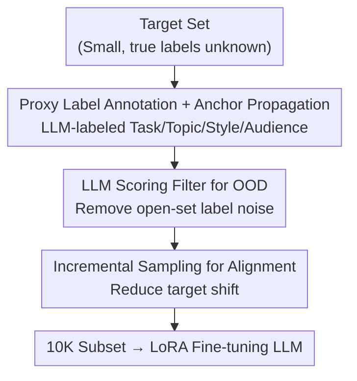

# Task-Aware Data Selection via Proxy-Label Enhanced Distribution Matching for LLM Fine-Tuning

**Conference**: ICLR 2026  
**OpenReview**: [https://openreview.net/forum?id=R40WoYbYab](https://openreview.net/forum?id=R40WoYbYab)  
**Code**: https://github.com/tmlr-group/TADS  
**Area**: LLM Efficiency / Instruction Tuning Data Selection  
**Keywords**: Task-aware data selection, joint distribution alignment, proxy labels, open-set label noise, incremental sampling  

## TL;DR
Addressing the task of selecting the most relevant instruction data from a large corpus given a small target set, this paper argues that aligning only input features $X$ is insufficient. It proposes reconstructing the problem as joint distribution $P(X,Y)$ alignment by using LLMs to infer **proxy labels** $Y$. This is implemented via a four-step pipeline called TADS: "annotation → cluster propagation → LLM scoring/filtering → incremental sampling." Selecting only 10K samples from a 300K pool to fine-tune LLaMA-3.1-8B achieves performance comparable to or exceeding SOTA methods like LESS and TSDS.

## Background & Motivation
**Background**: Adapting base models to specific downstream tasks typically involves instruction fine-tuning, the success of which depends heavily on the quality and relevance of the instruction data. In the line of "task-specific data selection," the goal is to retrieve the most relevant instruction samples from a large general source pool given a small set of target samples. Prevailing methods (e.g., LESS, TSDS) focus almost exclusively on **input features $X$**, using embedding or gradient similarity to measure how similar source samples are to target samples.

**Limitations of Prior Work**: Aligning only $X$ has inherent flaws. The paper provides an intuitive example: if the target set is in the legal domain (e.g., "marriage disputes" and "construction contracts"), a source sample regarding a "cell phone contract" might be selected due to high embedding similarity based on the shared concept of "contract." If gradient similarity is used, the model may also incorrectly select it due to high influence assigned to the shared "contract" concept. However, the true domain label of this sample is "telecommunications services," which does not match the target label distribution.

**Key Challenge**: Input similarity $\neq$ task relevance. While the $X$ of two instructions may appear similar, their corresponding labels $Y$ (task or domain attribution) might be irrelevant or contradictory. Aligning only the marginal distribution $P(X)$ systematically ignores this information. The authors elaborate on this using mutual information: $I(T;(X_S,Y_S)) = I(T;X_S) + I(T;Y_S\mid X_S)$. Traditional methods only maximize the first term, neglecting the second term—the additional task information that labels provide given the input.

**Goal & Key Insight**: Replace the marginal distribution $P(X)$ with the joint distribution $P(X,Y)$ for alignment. The difficulty lies in the fact that true labels $Y$ are unobservable in both target and source sets. Furthermore, aligning two random variables is harder than aligning one, and proxy labels inferred by LLMs inherently contain noise.

**Core Idea**: Leverage the reasoning capabilities of LLMs to infer **proxy labels** for each instruction, reformulating task-aware data selection as a joint distribution alignment problem, and implementing it via a pipeline specifically designed to handle "label noise + domain shift."

## Method

### Overall Architecture
TADS aims to ensure that the empirical distribution $P_S$ of the selected subset $S$ closely approximates the target joint distribution $P_{\text{target}}(X,Y)$ when true labels $Y$ are unobservable. The overall strategy is to "create labels" first and then "align distributions": use an LLM to assign structured proxy labels to the target set, cluster these labels into stable semantic anchors to propagate them to the source pool (giving every source sample a noisy task label), filter out samples with mispropagated labels, and finally perform incremental sampling based on the label distribution. This produces a 10K subset with a label distribution aligned to the target for LLM fine-tuning.

The pipeline consists of four sequential steps: target set → proxy label annotation and anchor propagation → LLM scoring/filtering of OOD samples → incremental sampling for distribution alignment → fine-tuning subset.

### Key Designs

**1. Reformulating Data Selection as $P(X,Y)$ Joint Alignment**

This is the core contribution: a reformulation of the problem rather than a specific module. The authors argue that task relevance is defined by the **joint distribution** of data and labels. Formally, target samples follow $P_{\text{target}}(X,Y_t)$, and the source pool $D$ is a union of $K$ domains $D=\bigcup_k D_k$ following $P_k(X,Y_k)$. The goal is to select a subset $S$ of size $N$ such that $P_S \approx P_{\text{target}}$. From an information-theory perspective, joint alignment implicitly maximizes the full objective $I(T;(X_S,Y_S))$, utilizing the conditional term $I(T;Y_S\mid X_S)$, which allows the model to distinguish between samples like "cell phone contracts" vs. "construction contracts."

**2. Structured Proxy Label Annotation & Anchor Propagation: Generating $Y$**

Since true labels are unavailable, proxy labels are inferred via LLM. A structured label space is designed with four semantic fields: **Task** (core functional intent, single-label), **Topic**, **Style**, and **Audience** (last three are multi-label). A pre-trained LLM uses a structured summary template to assign free-form phrase labels to each instruction. Using open-ended phrases instead of a fixed taxonomy allows for a more continuous representation space.

To bridge the semantic gap between source data and LLM-generated labels, target labels for each field are encoded using sentence embeddings and clustered via **k-means ($k=100$)**. These cluster centers, or **anchors**, serve as stable, denoised representations of the target domain's conceptual map. Source samples are projected into the same vector space and assigned to the most relevant anchors (top-1 for Task, top-3 for others) based on cosine similarity.

**3. LLM Scoring to Filter Open-Set Label Noise: Removing Mispropagated Samples**

Propagating target anchors to the source domain introduces **open-set label noise**—source instructions irrelevant to any target labels are forced into an anchor. While typical noise detection in DNNs relies on the "memorization effect" (high loss samples are noise), this multi-field setting makes training independent DNNs for each field costly and non-scalable.

Instead, the authors use LLM reasoning to grade samples: the LLM evaluates the semantic fit between a sample and its assigned anchor. Samples with scores below a threshold (e.g., score < 6) are treated as out-of-distribution (OOD) noise and removed.

**4. Incremental Sampling to Mitigate Target Shift: Aligning the Subset**

After OOD filtering, a distribution shift may still exist between the source and target. Drawing from domain adaptation theory, the authors identify **target shift (prior probability shift)** as crucial: assuming the conditional distribution $P(X\mid Y)$ is stable across the target and cleaned source domains, the goal is to align the label distribution $P(Y)$.

The objective is to minimize the $L_1$ distance between anchor distributions: $\lVert P^*(Y)-\hat P(Y)\rVert_1$, where $P^*(Y)$ is the target empirical distribution and $\hat P(Y)$ is the subset distribution. A greedy **incremental sampling** algorithm (Algorithm 1) is used: at each step, the algorithm identifies the label $y^*$ with the largest gap $g(y)=P^*(y)-\hat P(y)$ and adds a candidate sample with that label to $S$. This balances dense semantic fields and accelerates convergence to $P^*(Y)$.

### Loss & Training
No new training loss is introduced. TADS is a data selection pipeline. The selected 10K subset is used for standard LoRA instruction fine-tuning of LLaMA-3.1-8B. Three off-the-shelf models are used: Qwen2.5-7B-Instruct for annotation/scoring, BGE-M3 for embeddings/clustering, and LLaMA-3.1-8B as the target model.

## Key Experimental Results

The source pool (300K) is a synthesis of Flan V2, Open-Assistant 1, WizardLM, Dolly, and Stanford Alpaca. Evaluation is conducted across MMLU, TruthfulQA, GSM8K, BBH, and TyDiQA. For each benchmark, 20% of the test set is used as the target set for selection, with the remaining 80% for final evaluation. All selection methods (except Full and Vanilla) select 10K samples.

### Main Results

| Method | MMLU | TruthfulQA | GSM | BBH | TyDiQA |
|------|------|------------|-----|-----|--------|
| Vanilla Base Model | 64.3 | 32.8 | 51.0 | 54.8 | 22.7 |
| Full (300K) | 63.6 | 44.1 | 49.0 | 57.9 | **66.4** |
| Random | 63.7 | 29.1 | 54.0 | 60.2 | 60.5 |
| BM25 | 63.2 | 25.2 | 51.3 | 58.8 | 62.0 |
| RDS+ | 63.8 | 3.6 | 53.8 | 59.4 | 60.3 |
| LESS | 63.3 | 35.1 | 56.1 | 61.1 | 64.0 |
| TSDS | 63.6 | 44.1 | 50.0 | **62.1** | 63.5 |
| **Align_topic (Ours)** | **64.5** | 46.9 | 57.0 | 60.2 | 58.6 |
| **Align_style (Ours)** | 64.2 | **47.2** | **57.8** | 58.9 | 59.3 |
| **Align_task (Ours)** | 64.4 | 46.5 | 57.5 | 58.9 | 59.3 |

(min score ≥ 7.) The proposed method leads across MMLU, TruthfulQA, and GSM. Performance on TyDiQA is significantly lower, which the authors attribute to the four English semantic fields failing to capture the characteristics of a multilingual dataset, leading to relevant samples being filtered out.

### Ablation Study

| Configuration | MMLU | TruthfulQA | GSM | BBH | TyDiQA |
|------|------|-----------|-----|-----|--------|
| Incremental Sampling Only (No OOD Filter) | 64.3 | 3.5 | 55.0 | 49.1 | 60.5 |
| OOD Filter Only + Random Sampling | 64.8 | 42.1 | 55.0 | 61.9 | 56.4 |
| Complete Method (Filter + Sampling) | **65.1** | **42.6** | **55.5** | **62.5** | 59.1 |

| Design Comparison (Joint Alignment Necessity) | MMLU | TruthfulQA | GSM | BBH | TyDiQA |
|------|------|-----------|-----|-----|--------|
| RDS+ | 63.6 | 3.5 | 54.0 | 59.1 | 60.2 |
| RDS+ (with explicit semantic labels) | 63.7 | 5.4 | 53.5 | 60.7 | 59.7 |
| Ours via $X$ (No annotation) | 63.4 | 40.8 | 54.0 | 59.9 | 58.2 |
| Similarity Filter (replacing LLM) | 63.0 | 28.3 | 51.0 | 57.4 | 61.6 |
| Complete Pipeline (align topic, min score 7) | **64.6** | **46.4** | **57.0** | 60.0 | 59.3 |

### Key Findings
- **Both modules are essential**: Incremental sampling without filtering poisons TruthfulQA (3.5 score). Filtering without distribution alignment hurts BBH (61.9).
- **Gains come from joint alignment, not just clustering**: Running the pipeline on $X$ instead of inferred labels leads to performance drops, proving that $P(X,Y)$ alignment is the primary driver.
- **LLM filtering outperforms similarity filtering**: Replacing LLM scoring with cosine similarity significantly degrades performance, suggesting LLMs provide more reliable semantic judgment.
- **Hyperparameter robustness**: Results are stable for $k$ between 50 and 150.

## Highlights & Insights
- **Theoretical justification through MI**: The decomposition $I(T;(X_S,Y_S))=I(T;X_S)+I(T;Y_S\mid X_S)$ provides a clear narrative for why labels are necessary.
- **Proxy labels as a key trick**: Converting the "unobservable label" constraint into a "noisy label learning" problem allows the use of established domain adaptation and noise-robustness tools.
- **Target shift mapping**: By focusing on aligning the label distribution $P(Y)$, the method simplifies selection into a greedy balancing act across semantic fields, which is both flexible and interpretable.

## Limitations & Future Work
- **Field failure on niche tasks**: The current semantic fields are ill-suited for multilingual (TyDiQA) or highly specialized tasks.
- **LLM dependency**: The pipeline is sensitive to the quality of the LLM used for annotation and scoring.
- **Target shift assumption**: The assumption that $P(X \mid Y)$ is stable may not always hold in reality.
- **Evaluation target set同源**: Because target sets are derived from the same distribution as the evaluation data (sub-sampling benchmarks), the performance in real-world scenarios with scarcer target information might be lower.

## Related Work & Insights
- **vs. LESS / TSDS**: Both focus on marginal input distributions. TADS identifies their shared flaw: ignoring the target label makes it impossible to verify semantic alignment between candidate and target outputs.
- **vs. InsTag**: While InsTag uses LLM tags for selection, it is **task-agnostic**. TADS introduces explicit task-aware distribution alignment.
- **vs. Domain Adaptation**: TADS maps the data selection problem to classic noise-handling and target-shift theories, demonstrating a successful cross-pollination of these fields into LLM research.

## Rating
- Novelty: ⭐⭐⭐⭐ Reformulating task-aware data selection as $P(X,Y)$ alignment via proxy labels is conceptually significant.
- Experimental Thoroughness: ⭐⭐⭐⭐ Solid results across five benchmarks and multiple scales, though the multilingual failure case defines a clear boundary.
- Writing Quality: ⭐⭐⭐⭐ Clear motivation using both examples and theoretical MI decomposition.
- Value: ⭐⭐⭐⭐ High practical utility; the "proxy labels + OOD filter + alignment" framework is easily transferable.

<!-- RELATED:START -->

## Related Papers

- [\[ICLR 2026\] ssToken: Self-modulated and Semantic-aware Token Selection for LLM Fine-tuning](sstoken_self-modulated_and_semantic-aware_token_selection_for_llm_fine-tuning.md)
- [\[ICLR 2026\] Token-level Data Selection for Safe LLM Fine-tuning](token-level_data_selection_for_safe_llm_fine-tuning.md)
- [\[ICLR 2026\] Train on Validation (ToV): Fast Data Selection with Applications to Fine-Tuning](train_on_validation_tov_fast_data_selection_with_applications_to_fine-tuning.md)
- [\[ACL 2025\] Data Whisperer: Efficient Data Selection for Task-Specific LLM Fine-Tuning via Few-Shot In-Context Learning](../../ACL2025/llm_pretraining/data_whisperer_data_selection.md)
- [\[ICLR 2026\] Pre-training LLM without Learning Rate Decay Enhances Supervised Fine-Tuning](pre-training_llm_without_learning_rate_decay_enhances_supervised_fine-tuning.md)

<!-- RELATED:END -->
