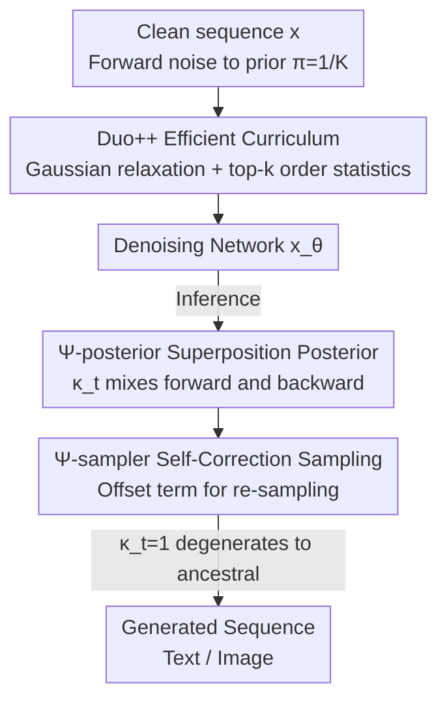

# The Diffusion Duality, Chapter II: Ψ-Samplers

**Conference**: ICLR 2026  
**OpenReview**: [https://openreview.net/forum?id=RSIoYWIzaP](https://openreview.net/forum?id=RSIoYWIzaP)  
**Code**: https://s-sahoo.com/duo-ch2 (Available)  
**Area**: Diffusion Models / Discrete Diffusion Language Models  
**Keywords**: Discrete Diffusion, Uniform State Diffusion, Predictor-Corrector Sampling, Curriculum Learning, Language Modeling

## TL;DR
Addressing the issue where Uniform State Discrete Diffusion (USDM) quality saturates rather than improves at high sampling steps, this paper proposes a family of "superposition posteriors" (Ψ-posterior) and its corresponding Ψ-sampler (Predictor-Corrector sampler). This generalizes correction methods like ReMDM to arbitrary noise priors, allowing USDM text/image generation quality to scale with sampling steps. Additionally, an efficient curriculum using top-k order statistics to approximate softmax is introduced, reducing training memory by 33% and time by 25%.

## Background & Motivation

**Background**: Discrete diffusion language models primarily use two types of noise priors. One is **Masked Diffusion (MDM)**, which concentrates all probability mass on a special `[MASK]` token, where each token is decoded only once. The other is **Uniform State Diffusion (USDM)**, where the prior is a uniform distribution $\pi=1/K$, allowing tokens to be repeatedly rewritten during generation. The "rewritable" nature of the latter provides **self-correction** capabilities, excelling in few-step generation and controllable guidance scenarios.

**Limitations of Prior Work**: While USDM dominates in low-step regimes, it suffers from **early saturation** in generation quality as the Number of Function Evaluations (NFE) increases when using standard **ancestral samplers**. It is eventually outperformed by Masked Diffusion combined with re-masking samplers (e.g., ReMDM) in high-NFE ranges. Furthermore, the likelihood of USDM has consistently trailed behind MDM. The Gaussian relaxation curriculum proposed by Duo narrowed the likelihood gap but is **computationally prohibited**—it requires materializing a $K$-dimensional weight vector for every token at every step, which is infeasible for modern vocabularies where $K>10^5$.

**Key Challenge**: The continuous improvement of MDM with more steps relies on **Predictor-Corrector (PC)** samplers like ReMDM, which allow previously decoded tokens to be "re-masked" and revised. However, effective PC samplers for USDM have remained elusive; PC methods based on Continuous-Time Markov Chain (CTMC) rate matrices are known to perform worse than ancestral samplers. Consequently, the potential for USDM to perform self-correction is not fully realized at high step counts.

**Goal**: (1) Design a unified PC sampling framework for arbitrary noise priors (not just MDM) to allow USDM to scale with sampling steps. (2) Transform the expensive Gaussian relaxation curriculum into a version with manageable memory and time costs.

**Key Insight**: The authors observe that the joint distribution yielding the **same marginal distribution** as standard discrete diffusion is not unique. By constructing a family of "non-Markovian" posteriors that maintain the same marginals while injecting additional noise, erroneous tokens can be "pushed back" and re-sampled during the reverse process, thereby achieving correction.

**Core Idea**: Construct the Ψ-posterior (superposition posterior) using a **linear superposition** of the forward process and reverse posterior. The resulting Ψ-sampler subsumes PC methods like ReMDM as special cases and generalizes them to any prior $\pi$. Coupled with an efficient curriculum that only samples top-k items using order statistics, this forms **Duo++**.

## Method

### Overall Architecture

Duo++ consists of two components: the **training side** utilizes an efficient Gaussian relaxation curriculum to train the denoising network $x_\theta$, while the **inference side** employs the Ψ-sampler for predictor-corrector sampling. Both share the same underlying "Discrete Diffusion ↔ Gaussian Diffusion Duality" framework (Chapter I of Diffusion Duality).

The forward process gradually adds noise to a clean sequence toward the prior: $z_t^\ell \sim q_t(\cdot|x^\ell;\alpha_t)=\mathrm{Cat}(\cdot;\alpha_t x^\ell+(1-\alpha_t)\pi)$, where USDM sets $\pi=1/K$. During training, instead of denoising from "completely corrupted discrete tokens," Gaussian latent variables are relaxed into "superimposed embeddings of clean + noise" via a low-temperature softmax and fed into the Transformer, reducing denoising difficulty—this is the Duo curriculum, which this paper optimizes by avoiding the materialization of $K$-dimensional vectors via top-k order statistics. During inference, standard ancestral samplers only follow the reverse posterior $q_{s|t}$, making it difficult to recover once an incorrect token is written. The Ψ-sampler mixes the reverse posterior (prediction) with a re-noising term (correction) using a coefficient $\kappa_t$ at each step. When $\kappa_t<1$, it leaves a probability for each token to be "rewritten," enabling continuous error correction.

### Key Designs

**1. Ψ-posterior: Using non-Markovian superposition of forward and backward to create correction space while preserving marginals**

The saturation of USDM under ancestral sampling at high steps occurs because the reverse posterior $q_{s|t}$ is Markovian and becomes "increasingly deterministic," lacking a mechanism to revert incorrectly written tokens. This paper constructs a family of superposition posteriors by linearly mixing the reverse posterior and a "re-noised" forward term with a coefficient $\kappa_t\in[0,1]$:

$$\Psi_{s|t}(\cdot|x^\ell,z_t^\ell)=\kappa_t\, q_{s|t}(\cdot|z_t^\ell,x^\ell)+(1-\kappa_t)\, q_s(\cdot|x^\ell),\qquad \Psi_1(\cdot|x^\ell)=\mathrm{Cat}(\cdot;\pi).$$

The crucial property is that although the trajectory **as a whole is no longer a Markov process** ($z_t^\ell$ depends on both $z_s^\ell$ and $x^\ell$), its **marginal distribution at every time step remains identical to standard discrete diffusion**, ensuring convergence to the correct distribution given sufficient samples. $q_{s|t}$ acts as the "predictor," while the re-injected $q_s$ acts as the "corrector," analogous to the PC sampler of Song et al. in Gaussian diffusion where extra noise is injected in the correction step. This construction holds for both MDM ($\pi=m$) and USDM ($\pi=1/K$), providing the mathematical foundation for generalizing PC from masked diffusion to arbitrary priors.

**2. Ψ-sampler: Implementing true self-correction via an offset term that allows every token to be rewritten**

By substituting the denoising network $x_\theta$ into the superposition posterior, we obtain the Ψ-sampler for direct use in sampling:

$$[\Psi^\theta_{s|t}(\cdot|z_t)]^\ell=\kappa_t\, q_{s|t}(\cdot|z_t^\ell,x_\theta^\ell)+(1-\kappa_t)\big[\alpha_s\, q_{0|t}(\cdot|z_t^\ell,x_\theta^\ell)+(1-\alpha_s)\pi\big].$$

When $\kappa_t=1$, it exactly reverts to the standard ancestral sampler for MDM or USDM; thus, the Ψ-sampler is a **strict superset** of ancestral sampling. When $\kappa_t<1$, the additional **offset term $(1-\kappa_t)(1-\alpha_s)\pi$** serves as the engine for correction. For MDM, this term provides a probability for already decoded tokens to return to the `[MASK]` state (prohibited in ancestral sampling). For USDM, it ensures every token has a non-zero sampling probability—even if the denoiser assigns nearly zero probability to the correct token, the Ψ-sampler provides a chance for it to appear. Occasional errors are smoothed out over multiple steps due to the marginal preservation property. The paper further proves that with $\pi=m$, different choices of $\{\kappa_t\}$ precisely replicate existing PC formulas such as Campbell, Gat, and ReMDM, demonstrating that the Ψ framework generalizes them all. In practice, the ReMDM-equivalent rescale schedule with $\eta=0.05$ and nucleus $p=0.9$ is recommended.

**3. Duo++ Efficient Curriculum: Using order statistics to sample only top-k items without materializing $K$-dimensional vectors**

The Duo curriculum passes Gaussian latents through a low-temperature softmax ($\tau=10^{-3}$) and computes a weighted sum with the entire $K\times d$ embedding table, requiring the materialization of a $K$-dimensional weight vector per token per step—which is unsustainable for $K>10^5$. The key observation is that at extremely low $\tau$, the softmax concentrates nearly all mass on **very few** coordinates, making most weights negligible. Thus, only the top-k ($k\ll K$) terms are kept. The challenge is sampling the top-k without constructing the full $K$-dimensional vector. Given $w_t^\ell=\tilde\alpha_t x^\ell+\tilde\sigma_t\epsilon$, only the ground-truth coordinate $o$ has a shifted mean, while the other $K-1$ coordinates are i.i.d. zero-mean Gaussians. By exploiting the fact that **order statistics of uniform random variables can be sampled recursively** (the max CDF is $u^m$, etc.), and applying the inverse normal CDF $\Phi^{-1}(\cdot)\tilde\sigma_t$, one can sample only $O(k)$ random variables to obtain top-k values and indices. The softmax weighted embedding is approximated as:

$$\mathrm{softmax}(w_t^\ell)^\top\mathbf{emb}\approx\sum_{i=1}^{k}\frac{\exp(\mathcal{K}_i/\tau)}{\tilde Z}\,\mathbf{emb}[\mathcal{I}_i],$$

where the normalization term $\tilde Z$ includes a closed-form approximation for unsampled terms. This reduces memory by 33% and doubles speed during the curriculum phase.

### Loss & Training
The curriculum phase optimizes the Gaussian relaxation NELBO: $L_{\text{train}}=\mathbb{E}_{x,t\sim U[\beta,\gamma],\tilde q_t}\sum_\ell f\big(z_t^\ell:=\arg\max(w_t^\ell),\,x_\theta^\ell(\mathrm{softmax}(w_t/\tau),t),\,\alpha_t:=T(\tilde\alpha_t);x^\ell\big)$. As $\tau\to0$ and $(\beta, \gamma)=(0,1)$, it reverts to the standard discrete NELBO. Implementation uses the curriculum for the first 50% of training steps ($\tau=10^{-3}$, $(\beta, \gamma)=(0.03, 0.15)$) before switching to the standard discrete objective. Trained on OWT/LM1B for 1M steps with batch 512 using 16×H100.

## Key Experimental Results

### Main Results

Language modeling on OpenWebText (context 1024) comparison of Generation Perplexity (Gen. PPL, measured by GPT-2 Large) vs NFE: Duo++ + Ψ-sampler outperforms MDLM+ReMDM and ancestral sampling across the entire NFE range. When NFE exceeds the sequence length, Ψ-sampler and ReMDM continue to improve while ancestral sampling saturates. Likelihood results (Test PPL, lower is better):

| Model | LM1B | OWT | Notes |
|------|------|-----|------|
| AR Transformer | 22.3 | 17.5 | Autoregressive Upper Bound |
| MDLM (Masked) | 27.0 | 23.2 | — |
| SEDD Uniform (USDM) | 40.3 | 29.7 | Former USDM |
| Duo (Expensive Curriculum) | 29.9 | 25.2 | Previous USDM SOTA |
| **Duo++ (k=2)** | **30.0** | **25.2** | 25% GPU time saved |
| Duo++ (k=3) | 30.1 | 25.3 | — |
| Duo++ (k=5) | 30.2 | 25.4 | — |

Image modeling on CIFAR-10 (35M U-Net + Discrete CFG): Duo++ + Ψ-sampler comprehensively outperforms MDLM (including ReMDM) and ancestral sampling across FID/IS metrics, achieving the best overall scores.

### Ablation Study

| Configuration | Key Metric | Description |
|------|---------|------|
| Duo++ + Ψ-sampler (rescale, η=0.05, p=0.9) | Best Gen. PPL | Default text configuration |
| Ancestral Sampling (κ_t=1) | Saturation at high NFE | No correction; quality plateaus |
| Curriculum k=2 / 3 / 5 | Stable PPL and memory | k=2 yields best likelihood and efficiency |
| Efficient vs Duo Curriculum | Memory -33%, Time -25% | 2x speedup in curriculum phase |
| Downstream MCQ | Duo++ ≈ Duo | Still trails behind MDLM |

### Key Findings
- **Correction is vital for high-NFE scaling**: Removing the offset term ($\kappa_t=1$, reverting to ancestral sampling) causes text Gen. PPL to saturate early. Only $\kappa_t<1$ noise injection allows quality to continue improving, matching or exceeding masked diffusion at high NFE.
- **Small k is sufficient**: $k=2$ in the curriculum yielded the best likelihood. Performance is similar for $k\in\{2,3,5\}$, confirming the extreme sparsity of low-temperature softmax.
- **USDM shortcomings remain in likelihood/downstream**: Duo++ matches Duo on MCQ but generally falls below MDLM, consistent with its higher perplexity. This paper improves sampling quality and training cost but does not close the modeling capacity gap between USDM and MDM.

## Highlights & Insights
- **Marginal preservation as a safety net**: The Ψ-posterior boldy adopts non-Markovian dynamics and injects extra noise. It remains distributionally correct because the marginal distribution at every step is strictly aligned with standard diffusion.
- **A single $\kappa_t$ unifies various samplers**: $\kappa_t=1$ is ancestral; specific $\{\kappa_t\}$ recover ReMDM/Campbell/Gat. This provides a clean theoretical framework where a family of discrete diffusion samplers is controlled by a single scalar knob.
- **Order statistics for survival of expensive curricula**: The chain of "low-temp softmax sparsity → top-k sampling → order statistics to avoid $K$-dim vectors" is transferrable to any scenario requiring low-temperature weighted embeddings for massive vocabularies.
- **Cache-free training**: Modifying $T(\cdot)$ from pre-calculated $(\alpha, T)$ pairs to online Taylor expansion removes a cumbersome engineering dependency.

## Limitations & Future Work
- **Modeling capacity gap persists**: The likelihood and downstream QA of USDM (including Duo++) still lag behind masked diffusion.
- **Hyperparameter sensitivity**: The schedule for $\kappa_t$, step size $\eta$, activation intervals $[t_{off}, t_{on}]$, nucleus $p$, and $k$ all require tuning.
- **Scale constraints**: Experiments were conducted on 1M steps for OWT/LM1B. While concurrent work suggests Duo can outperform AR at 1.7B scale, Ψ-sampler hasn't been validated on large-scale models here.
- **First-order only**: The Ψ-sampler uses first-order posteriors and uniform steps; it is complementary to, but not yet integrated with, higher-order samplers or adaptive step sizes.

## Related Work & Insights
- **vs ReMDM (Wang et al. 2025)**: ReMDM generalized PC sampling for masked diffusion. This paper shows ReMDM is a special case of the Ψ framework and extends it to **any prior**, enabling PC benefits for USDM for the first time.
- **vs Duo / Chapter I (Sahoo et al. 2025a)**: Chapter I established the duality and curriculum but used expensive training and saturating samplers. Chapter II solves both issues.
- **vs CTMC PC methods**: Those methods rely on rate matrices and often perform worse than ancestral sampling; the Ψ framework unifies them as special cases while providing a stronger alternative.
- **vs Trained correction modules**: Unlike methods requiring an extra trained corrector, this approach achieves correction entirely through the sampling formula **without adding learnable components**.

## Rating
- Novelty: ⭐⭐⭐⭐⭐ Unified PC framework for discrete diffusion with arbitrary priors.
- Experimental Thoroughness: ⭐⭐⭐⭐ Dual modalities and multiple metrics, though still at medium scale.
- Writing Quality: ⭐⭐⭐⭐ Clear formulas and intuition, though notation is dense.
- Value: ⭐⭐⭐⭐⭐ Vital for challenging the assumption that masked diffusion is the only viable path for diffusion language models.

<!-- RELATED:START -->

## Related Papers

- [\[ICLR 2026\] Scaling Behavior of Discrete Diffusion Language Models](scaling_behavior_of_discrete_diffusion_language_models.md)
- [\[ICLR 2026\] Soft-Masked Diffusion Language Models](soft-masked_diffusion_language_models.md)
- [\[ICLR 2026\] Autoregressive Models Rival Diffusion Models at Any-Order Generation](autoregressive_models_rival_diffusion_models_at_any-order_generation.md)
- [\[ICLR 2026\] Time is a Feature: Exploiting Temporal Dynamics in Diffusion Language Models](time_is_a_feature_exploiting_temporal_dynamics_in_diffusion_language_models.md)
- [\[NeurIPS 2025\] Next Semantic Scale Prediction via Hierarchical Diffusion Language Models](../../NeurIPS2025/llm_pretraining/next_semantic_scale_prediction_via_hierarchical_diffusion_language_models.md)

<!-- RELATED:END -->
