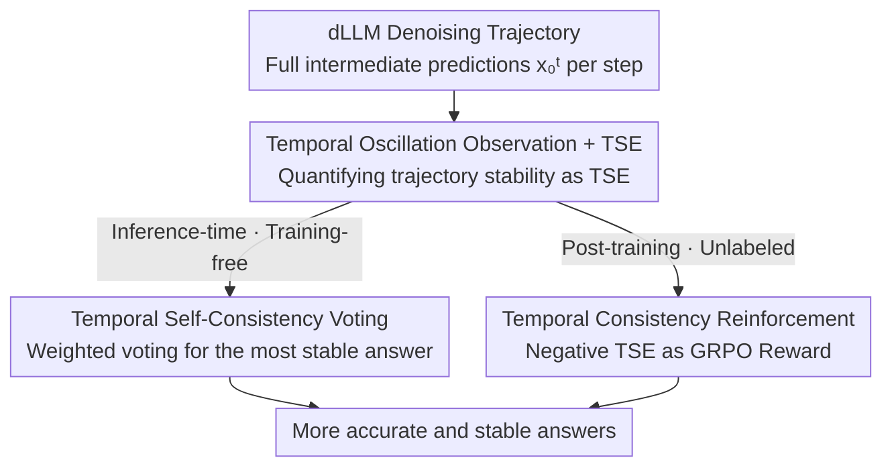

# Time is a Feature: Exploiting Temporal Dynamics in Diffusion Language Models

**Conference**: ICLR 2026  
**OpenReview**: [https://openreview.net/forum?id=HsB6CtagP7](https://openreview.net/forum?id=HsB6CtagP7)  
**Project Page**: https://aim-uofa.github.io/dLLM-MidTruth  
**Code**: The paper promises to open-source upon acceptance (models + training/inference code)  
**Area**: Diffusion Language Models / LLM Inference  
**Keywords**: Diffusion Language Models, Temporal Oscillation, Temporal Semantic Entropy, Self-Consistency Voting, Reinforcement Learning

## TL;DR
Authors find that Diffusion Language Models (dLLMs) often "get it right in the middle but change to wrong at the end" (temporal oscillation) during denoising. They exploit discarded intermediate step predictions as signals using two methods: a training-free **Temporal Self-Consistency** voting that selects the most stable answer across steps within a single sampling trajectory, and a **Temporal Consistency Reinforcement** post-training via GRPO using "Negative Temporal Semantic Entropy" as an unlabeled reward. These yield improvements of ~1.5% and up to 25.3% across four math reasoning benchmarks, respectively.

## Background & Motivation

**Background**: Diffusion Language Models (e.g., LLaDA, Dream) are emerging alternatives to autoregressive LLMs. Instead of left-to-right token generation, they start from a fully masked sequence and iteratively "denoise-remask." In each step, they predict all masked positions in parallel, retain a few high-confidence tokens, and remask the rest for refinement. Despite the architectural differences, current dLLM decoding strategies mimic autoregressive habits: **taking only the prediction from the final denoising step as the final answer and discarding all intermediate predictions.**

**Limitations of Prior Work**: The authors empirically find this to be a significant waste. On four benchmarks (GSM8K, MATH500, SVAMP, Countdown) with two representative models (LLaDA-8B-Instruct and LLaDA-1.5), they compared two metrics: "final pass rate" (only the last step matters) and "ever-pass rate" (correct if any step in the trajectory is right). A stable and significant gap exists: for LLaDA-8B on GSM8K (length 128), the final pass rate is 68.5%, while the ever-pass rate reaches 80.5% (+12%). This implies many problems are **solved correctly by the model mid-way but changed to incorrect answers during subsequent refinements**. In one specific case, the model provided the correct answer "25" at step 55, only to replace it with the incorrect "2" at step 64.

**Key Challenge**: The authors name this phenomenon **temporal oscillation**—the answer oscillates between "correct" and "incorrect" during denoising, and the final state is not necessarily the best. The root cause is the instability of iterative denoising: single-step predictions are inaccurate under high noise in early stages, and current decoding's exclusive trust in the final step completely wastes the "temporal dynamics" information embedded in the trajectory.

**Goal**: Reframe temporal oscillation as a "feature" rather than a "problem" to extract signals from the trajectory via two complementary paths: (1) Inference-time: How to select more stable answers from existing intermediate predictions without retraining; (2) Training-time: How to explicitly encourage the model to generate temporally consistent answers that are less likely to be revoked.

**Key Insight**: Characterizing stability from an entropy perspective, the authors propose **Temporal Semantic Entropy (TSE)**: intermediate answers on a trajectory are clustered into semantically equivalent clusters, and the entropy of this distribution is calculated. Statistically, correct final answers have lower TSE (semantic convergence), while incorrect ones have higher TSE (frequent oscillation). This provides an endogenous signal to judge generation quality without ground-truth labels.

**Core Idea**: Treat "intermediate predictions as signals rather than noise"—using cross-timestep consistency for both training-free voting decoding and unsupervised RL rewards.

## Method

### Overall Architecture

The work builds on a chain of observation-measurement-utilization: observing temporal oscillation in dLLM denoising trajectories $\{x_0^t\}_{t=1}^{T}$, quantifying stability as a value using TSE, and utilizing this signal via two paths. Both paths share the intermediate predictions of the same sampling trajectory but operate at different stages: **inference-time** Temporal Self-Consistency voting (training-free, weighted voting) and **post-training** Temporal Consistency Reinforcement (using negative TSE as a GRPO reward).

### Key Designs

**1. Temporal Semantic Entropy (TSE): Turning "trajectory stability" into an optimizable value**

This is the foundation. Token-level entropy only reflects local uncertainty and cannot measure whether an answer "jumps back and forth semantically" across the trajectory. Drawing from semantic entropy, the authors cluster $T$ intermediate answers $\{x_0^t\}_{t=1}^{T}$ into $K$ semantically equivalent clusters $\mathcal{C}=\{C_1,\dots,C_K\}$. The probability mass of each cluster is defined by its frequency $P(C_k)=|C_k|/T$. The TSE of the trajectory is:

$$\text{TSE}(\{x_0^t\}_{t=1}^{T}) = -\sum_{k=1}^{K} P(C_k)\log P(C_k).$$

Higher TSE indicates more frequent answer changes and semantic divergence; lower TSE indicates convergence to a stable meaning. Experiments confirm that correct final answers (both "finally correct" and "mid-way correct") generally have lower TSE than consistently incorrect ones. This statistical rule allows TSE to work without ground-truth labels.

**2. Temporal Self-Consistency Voting: Cross-step voting within a single trajectory to recover correct answers**

Addressing the loss of better answers when trusting only the last step, the authors perform weighted voting across all timesteps of a single sampling trajectory without retraining or resampling. Given a trajectory $\{x_0^t\}_{t=1}^{T}$, the final answer $a^{*}$ is selected by:

$$a^{*} = \arg\max_{a}\ \sum_{t=1}^{T} f(t)\cdot \mathbf{1}\big(\text{meaning}(x_0^t)=a\big)$$

where $\mathbf{1}(\cdot)$ checks if answer $a$ is decoded at step $t$, and $f(t)$ is the timestep weight. Since accuracy generally increases as sampling progresses, weights favor later steps. Exponential weighting $f(t)=\exp(\alpha(1-t/T))$ ($\alpha=5$) is used by default. Unlike standard Self-Consistency in autoregressive models which requires multiple full forward passes (high cost), this method **leverages the sequence of intermediate predictions naturally produced by diffusion inference; a single trajectory suffices for voting**, incurring near-zero overhead.

**3. Temporal Consistency Reinforcement: Using negative TSE as an unlabeled reward via GRPO**

To reduce oscillation at the source, the authors use GRPO for post-training. **Unlabeled version**: For each prompt, a group of $G$ responses is sampled. The reward for each response is $r_i=-\text{TSE}(o_i)$, with advantages normalized by the group mean $A_i = r_i-\text{mean}(\{r_j\}_{j=1}^{G})$. Larger negative TSE (smaller TSE, higher consistency) yields higher rewards. This requires **no ground-truth labels**, making it ideal for unsupervised scenarios. **Labeled version**: When ground truth is available, accuracy and consistency rewards are fused. TSE is normalized to a confidence score $c(o_i)=\frac{H_{\max}-\text{TSE}(o_i)}{H_{\max}}$ ($H_{\max}=\log T$), and passed through a spherical scoring rule:

$$r_i = \mathbf{1}_{o_i=o^{*}} + \frac{c(o_i)}{\sqrt{c(o_i)^2+(1-c(o_i))^2}}.$$

The first term manages correctness and the second manages stability, ensuring rewards consider both accuracy and process stability.

### Loss & Training
The reinforcement learning objective follows standard GRPO (with importance sampling ratio $\rho_i^k$, clip threshold $\varepsilon$, and KL penalty $\beta$ against the reference policy). LLaDA-8B-Instruct is first SFT-ed on s1K for 20 epochs before Reinforcement Fine-Tuning (RFT). LLaDA-1.5 skips SFT (as it is already post-trained) and goes directly to RFT. Training used 8 H800 GPUs, semi-autoregressive decoding with low-confidence remasking, block size 32, and diffusion steps set to half the target output length.

## Key Experimental Results

### Main Results: Temporal Consistency Reinforcement (RFT, average gain over SFT baseline)

| Dataset | LLaDA-8B Avg Gain | Max Single Point | Note |
|:---|:---|:---|:---|
| GSM8K | +2.0% | +2.9% (len 512) | Combined Reward |
| MATH500 | +4.3% | +7.4% (len 128) | Combined Reward |
| SVAMP | +6.6% | +9.6% (len 512) | Combined Reward |
| Countdown | +25.3% | +33.6% (len 256) | Highest gain in hard tasks (Negative TSE only) |

Key comparison: On Countdown, **using only negative TSE (unlabeled)** outperforms the accuracy-based reward (d1)—LLaDA-8B improves by 24.7% vs. d1's 15.1%.

### Ablation Study: Weighting Schemes for TSC Voting (LLaDA-8B-Instruct)

| Weighting Scheme | GSM8K-128 | MATH500-128 | SVAMP-128 | Countdown-128 |
|:---|:---:|:---:|:---:|:---:|
| baseline (Last step) | 68.5 | 27.4 | 84.0 | 20.3 |
| fixed (Equal) | 68.0 | 26.6 | 87.0 | 22.7 |
| linear | 70.0 | 28.0 | 87.0 | 24.2 |
| **exp (Default α=5)** | **70.1** | **28.4** | **86.0** | **25.0** |
| Upper Bound EverPass@1 | 80.5 | 40.2 | 91.3 | 28.1 |

Exponential weighting provides the largest gains across benchmarks (avg ~1.5%) with near-zero overhead. Fixed weighting occasionally drops performance by over-weighting early inaccurate predictions.

### Key Findings
- **Ubiquity of Temporal Oscillation**: A stable 10%+ gap exists between final and ever-pass rates, proving many correct mid-way answers are overwritten.
- **TSE-Correctness Correlation**: Correct answers have lower TSE, validating negative TSE as a reward signal. Harder tasks have higher TSE, explaining the massive gains on Countdown.
- **Hard Task Gains**: Tasks like Countdown, which rely on iterative refinement, benefit most from consistency constraints.
- **Side Effect of RFT**: Post-RFT outputs are more concise (fewer tokens). Shorter generation might inherently reduce oscillation, though this requires further study.

## Highlights & Insights
- **"Recovering the Discarded"**: Diffusion decoding provides a sequence of full intermediate predictions for free. This work treats them as "multiple samples" within a single trajectory, enabling efficient voting without the multiple forward passes required by AR Self-Consistency.
- **Unlabeled RL Rewards**: Using the model's own temporal consistency (negative TSE) as a reward bypasses the need for ground truth. It is particularly valuable in unsupervised/weakly supervised settings and complements accuracy rewards.
- **Transferable Insight**: TSE as a "trajectory-level semantic stability" metric can potentially be applied to any iterative generation process (e.g., multiple AR resamplings) as an endogenous quality signal.

## Limitations & Future Work
- **Dependency on Semantic Clustering**: TSE and voting require clustering intermediate answers and parsing `<answer>` tags. This is specialized for math-like tasks where answers are easily extracted and compared.
- **Benchmark Scope**: Evaluated only on four math benchmarks and LLaDA models; generalization to code, common sense, or long-form text is unverified.
- **Conciseness vs. Oscillation**: Whether shorter outputs are the cause or the result of reduced oscillation remains unclear.
- **Upper Bound Gap**: Ever-pass rates remain higher than final rates even after RFT/Voting, suggesting some "mid-way correct" signals are still unexploited.

## Related Work & Insights
- **vs. Self-Consistency (AR)**: Conventional SC requires multiple full inference chains, which is costly. TSC votes on the **temporal dimension of a single diffusion trajectory**, involving zero extra forward passes.
- **vs. diffu-GRPO / d1**: These rely on ground-truth for RL. This work uses negative TSE for **fully unsupervised** rewards, outperforming accuracy-based rewards in hard tasks.
- **vs. Concurrent Temporal Works**: Other works observe "mid-way correct" and propose early stopping; this work provides both "lightweight inference-time voting" and "trajectory-level consistency RL signals" while explicitly quantifying stability via TSE.

## Rating
- Novelty: ⭐⭐⭐⭐⭐ Redefining discarded intermediate predictions as signals and proposing TSE as a quantifiable, unlabeled trajectory-level reward is highly novel.
- Experimental Thoroughness: ⭐⭐⭐⭐ Covers two models across four benchmarks and multiple lengths, with thorough ablations for voting and RFT, though limited to math reasoning.
- Writing Quality: ⭐⭐⭐⭐⭐ Clear logical chain of Observe-Measure-Utilize.
- Value: ⭐⭐⭐⭐⭐ Offers a training-free plug-and-play trick and an unlabeled RL approach with low deployment overhead, opening "temporal dynamics" as a new direction for dLLM decoding.

<!-- RELATED:START -->

## Related Papers

- [\[ICLR 2026\] Soft-Masked Diffusion Language Models](soft-masked_diffusion_language_models.md)
- [\[ICLR 2026\] Scaling Behavior of Discrete Diffusion Language Models](scaling_behavior_of_discrete_diffusion_language_models.md)
- [\[ICLR 2026\] Autoregressive Models Rival Diffusion Models at Any-Order Generation](autoregressive_models_rival_diffusion_models_at_any-order_generation.md)
- [\[NeurIPS 2025\] Retrospective In-Context Learning for Temporal Credit Assignment with Large Language Models](../../NeurIPS2025/llm_pretraining/ricl_temporal_credit.md)
- [\[ICLR 2026\] Intrinsic Training Dynamics of Deep Neural Networks](intrinsic_training_dynamics_of_deep_neural_networks.md)

<!-- RELATED:END -->
