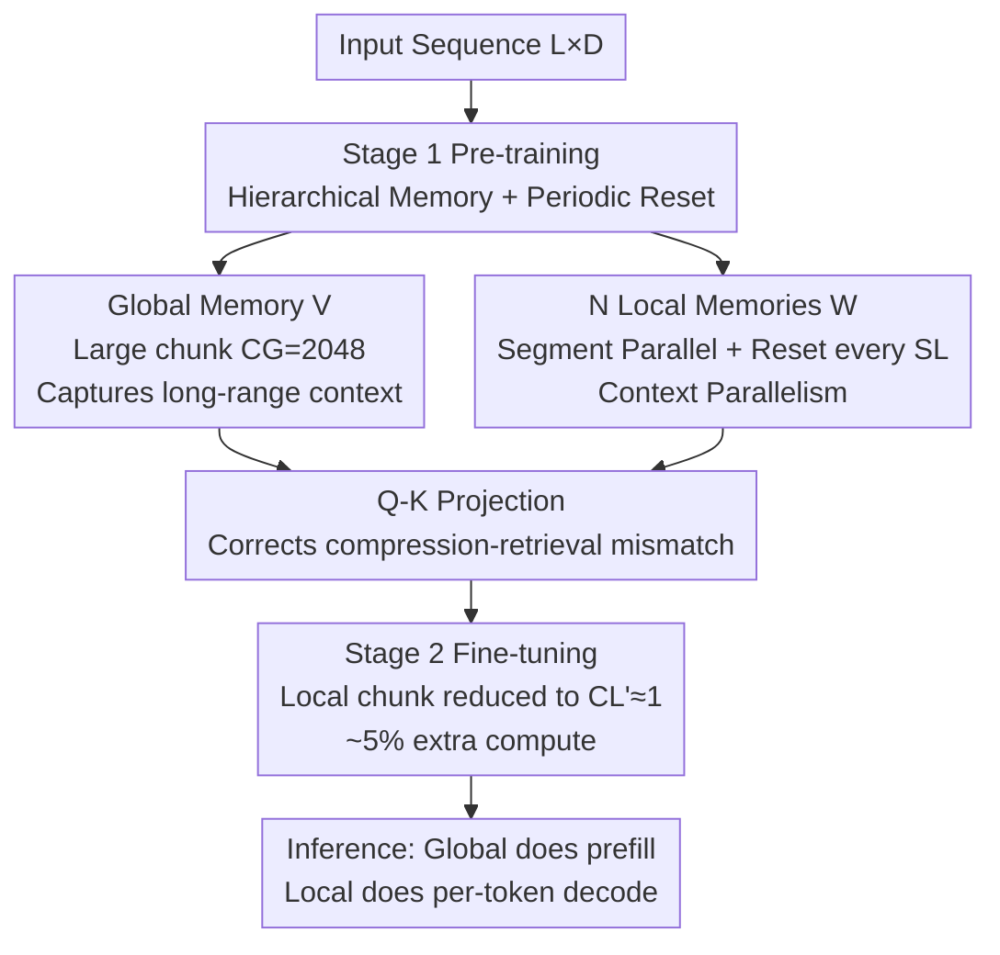

# TNT: Improving Chunkwise Training for Test-Time Memorization

**Conference**: ICLR 2026  
**OpenReview**: [https://openreview.net/forum?id=rajioNWfRs](https://openreview.net/forum?id=rajioNWfRs)  
**Area**: LLM Pre-training / Sequence Modeling / Efficient Training  
**Keywords**: Test-time memorization, deep memory modules, chunkwise training, context parallelism, Titans

## TL;DR
Ours proposes the TNT training paradigm, which utilizes "hierarchical memory + periodic state reset" to break the sequential dependencies of non-linear RNNs to achieve large-scale context parallelism. A subsequent lightweight fine-tuning stage adapts local memory to small chunks, accelerating the training of Titans-like deep memory models by up to $17 \times$ while improving accuracy.

## Background & Motivation

**Background**: Among efficient architectures replacing softmax attention, deep memory modules based on "test-time memorization" (e.g., Titans, TTT, Atlas) represent a promising linear scaling path. These modules augment models with a set of "fast weights" $W$ that update online during both inference and training: for each token, the key $k_t$ is associated with the value $v_t$, compressing the context into a fixed-size sub-network via gradient descent. Retrieval is performed using queries $q_t$ to compute $o_t = f(W_t, q_t)$. Compared to linear memory modules using linear state transitions and matrix-valued hidden states, deep memory modules utilize non-linear update rules, offering stronger expressivity.

**Limitations of Prior Work**: Deep memory modules lack efficient training algorithms, resulting in extremely low hardware utilization—FLOPs utilization is often below 5–10% of peak performance. To maintain fine-grained learning signals, they are forced to use very small chunks (16–64 tokens) for chunkwise parallel training. Small chunks fail to saturate accelerators, making training memory-bound rather than compute-bound and rendering pre-training prohibitively slow.

**Key Challenge**: The primary bottleneck is the chunksize hyperparameter $C$. Large chunks accelerate training but degrade accuracy, while small chunks preserve accuracy but are too slow; existing methods must settle for a compromise. Furthermore, Ours identifies a third mismatch between training and inference: a model pre-trained with $C=64$ achieves optimal perplexity only when inference also uses $C=64$. Switching to smaller chunks actually causes perplexity to spike (Figure 2)—the model becomes over-specialized to the training chunk resolution.

**Goal**: Decouple training efficiency from inference performance, enabling models to achieve high-throughput training with large chunks while maintaining peak accuracy with small chunks during inference. The authors decompose this into three challenges: ① lack of efficient training implementations; ② domain mismatch caused by using $k$ for compression and $q$ for retrieval; ③ training/inference chunksize mismatch.

**Key Insight**: Different components of the model should process information at different granularities across different training stages. Long-range context is handled by a global module using large chunks, while fine-grained details are managed by a set of parallelizable local modules. A low-cost fine-tuning stage is then used to eliminate the chunk mismatch.

**Core Idea**: Use "hierarchical memory + periodic reset" to allow non-linear RNNs to achieve context parallelism across sequences (high-throughput pre-training), followed by a fine-tuning stage that modifies only local memory and reduces the chunksize to 1 to restore inference resolution—a universal two-stage training paradigm.

## Method

### Overall Architecture
TNT is not a specific architecture but a two-stage training paradigm applicable to any deep memory module. Stage 1 is "Efficiency-first Pre-training": it introduces a hierarchical memory system where one global memory $V$ uses large chunks ($C_G=2048$) to capture long-range context, and $N$ local memories $W$ process fine-grained information in parallel across sequence segments. Crucially, periodic resets are added to local memories: the state is reset to a shared learnable initial state $W_{\text{init}}$ every $S_L$ tokens, breaking cross-segment sequential dependencies and unlocking large-scale context parallelism. Retrieval uses Q-K projection to correct the domain mismatch. Stage 2 is "Performance-first Fine-tuning": most structures are frozen, and the local memory chunksize is reduced from $C_L$ to a smaller $C_L'$ (ideally 1). This adapts the model to high-resolution inference using approximately 5% of the pre-training compute.

### Key Designs

**1. Hierarchical Memory + Periodic Reset: Enabling Context Parallelism for Non-linear RNNs**

This design directly addresses challenge ①. The fundamental bottleneck of deep memory modules is the sequential dependency where $W_t$ depends on $W_{t-1}$, preventing parallelism across segments. TNT breaks this by starting all parallel segments with the same learned initial state $W_{\text{init}}$. Local memory updates include a periodic reset: whenever $t$ reaches a segment boundary of length $S_L$ ($t \equiv 0 \bmod S_L$), the state resets to $W_{\text{init}}$; otherwise, chunkwise gradient accumulation proceeds normally within the segment using chunksize $C_L$:

$$W_t \leftarrow \begin{cases} W_{\text{init}} & \text{if } t \equiv 0 \ (\bmod\ S_L) \\ W_{t-1} - \sum_{\tau=\xi(t,C_L)}^{t} \eta_\tau \nabla_W L\big(f(W_{\xi(t,C_L)}, k_\tau), v_\tau\big) & \text{otherwise} \end{cases}$$

To compensate for the loss of global context due to resets, a global memory $V$ is run in parallel. It evolves sequentially using a very large chunk $C_G$ (e.g., 2048): $V_{(k+1)C_G} \leftarrow V_{kC_G} - \sum_t \eta_t \nabla_V L(f(V_{kC_G}, k_t), v_t)$. The large chunk makes its updates compute-bound. This creates a clear division of labor: global memory handles long-range dependencies, while local memory focuses on details. Efficiency gains are twofold: the global module makes operators compute-bound, while local resets allow sequences to be split into independent blocks for multi-device distribution, significantly increasing throughput.

**2. Q-K Projection: Eliminating the Compression-Retrieval Domain Mismatch**

This addresses challenge ②. During memory compression, the sub-network $f(W,\cdot)$ is optimized to map the key space to the value space (associating $k_t$ with $v_t$). During retrieval, however, it is fed queries $q_t$, which may fall outside the learned key domain, degrading retrieval performance. TNT solves this by projecting $q_t$ onto the subspace spanned by observed keys. The final output is the sum of global memory (using original $q_t$) and local memory (using projected queries):

$$o_t = f\big(V_{\xi(t,C_G)}, q_t\big) + f\Big(W_t, \sum_{\tau=\xi(t,C_L)}^{t} \frac{k_\tau k_\tau^\top}{\|k_\tau\|^2} q_t\Big)$$

The projection matrix $\sum_\tau \frac{k_\tau k_\tau^\top}{\|k_\tau\|^2} \in \mathbb{R}^{d\times d}$ can be maintained as a constant-size rolling state. Since many modules apply L2 normalization to $q$ and $k$, the denominator simplifies to $\sum_\tau k_\tau k_\tau^\top$.

**3. Stage 2 Fine-Resolution Fine-Tuning: Mending the Chunksize Mismatch**

This addresses challenge ③. Stage 1 uses large chunks for throughput, but Figure 2 shows that using large-chunk pre-trained models for small-chunk inference results in significant performance drops. Ours observes that this mismatch can be corrected with minimal cost: continuing training for a few steps with a smaller local chunk $C_L' < C_L$. This stage only updates local memory and consumes about 5% of pre-training compute. When fine-tuned to $C_L'=1$, the model aligns perfectly with the autoregressive prefill-and-decode paradigm.

## Key Experimental Results

### Main Results
Evaluation was conducted using 150M parameter models trained on 10B tokens, measuring perplexity (C4 / FineWeb / PG19) and commonsense reasoning accuracy.

| Model | $C$ / $C_L$ | Avg. ppl ↓ | Commonsense Avg. acc ↑ |
|------|------|------|------|
| Transformer (w/o gating) | - | 23.58 | 38.3 |
| Transformer (w gating) | - | **22.39** | 39.7 |
| TTT | 256 | 27.62 | 38.1 |
| Titans | 8 | 25.07 | 39.0 |
| TNT Stage 1 | {4,8,16,32} | 23.13 | 40.6 |
| TNT Stage 2 | {2,4,8,16} | **23.09** | **40.9** |

Training speed (time to reach target loss 3.20 for 150M model):

| Model | $C$ / $C_L$ | Training Time (hrs) | Gain |
|------|------|------|------|
| Titans | 8 | 19.48 | 1.00× |
| Titans | 128 | 3.71 | 5.25× |
| TNT | {8} | 2.54 | 7.68× |
| TNT | {64} | **1.12** | **17.37×** |

### Ablation Study

| Config | ppl ↓ | Commonsense acc ↑ |
|------|------|------|
| Base (Titans) | 23.53 | 38.8 |
| TNT Stage 1, +1 Local Memory | 21.04 | 40.6 |
| w/o Global Memory | 25.60 | 35.5 |
| w/o Q-K Projection | 22.01 | 36.4 |
| w Stage 2 | 20.86 | 40.9 |

### Key Findings
- **Global Memory is Essential**: Removing it causes perplexity to jump from 21.04 to 25.60, as periodic resets lose long-range context.
- **Q-K Projection Contributions**: Removing it drops commonsense accuracy from 40.6 to 36.4, confirming the compression-retrieval domain mismatch is a real bottleneck.
- **Stage 2 is Cost-Effective**: With only ~5% additional compute, it further reduces perplexity and improves reasoning.

## Highlights & Insights
- **Active Dependence Cutting**: Instead of bypassing dependencies, the core trick is to "cut" them via periodic resets and compensated with hierarchical memory—a "break then compensate" strategy applicable to other hard-to-parallelize non-linear models.
- **Running Sum Projection**: Maintaining $\sum_\tau k_\tau k_\tau^\top$ as a constant-size state avoids storing historical keys, making Q-K projection nearly zero-cost.
- **Complete Decoupling**: The "large-chunk train, small-chunk infer, 5% fine-tune" paradigm is model-agnostic and aligns naturally with autoregressive prefill-decode.

## Limitations & Future Work
- **No Custom Kernels**: Currently implemented in native JAX; performance still lags behind Gated Transformers optimized with FlashAttention.
- **Scale Restrictions**: Experiments are limited to 150M parameters; advantages at larger scales remain to be verified.
- **Perplexity Gap**: Still hasn't fully closed the gap with SOTA Transformers (23.09 vs 22.39).

## Related Work & Insights
- **vs Titans / TTT**: These models settle for a compromise between expressivity and efficiency. TNT decouples them, making the system both faster and more accurate.
- **vs Guo et al. 2025**: Previous hierarchical systems applied only to linear memory; TNT addresses non-linear deep memory modules and explicitly models multi-resolution local dynamics.

## Rating
- Novelty: ⭐⭐⭐⭐⭐ First to achieve cross-sequence parallelism for non-linear deep memory via periodic resets.
- Experimental Thoroughness: ⭐⭐⭐⭐ Comprehensive speed and quality benchmarks, though limited to 150M scale.
- Writing Quality: ⭐⭐⭐⭐⭐ Clear mapping between challenges and designs.
- Value: ⭐⭐⭐⭐⭐ Removes a critical scalability barrier for expressive RNN architectures.

<!-- RELATED:START -->

## Related Papers

- [\[ICLR 2026\] Distilled Pretraining: A modern lens of Data, In-Context Learning and Test-Time Scaling](distilled_pretraining_a_modern_lens_of_data_in-context_learning_and_test-time_sc.md)
- [\[ICLR 2026\] FictionalQA: A Dataset for Studying Memorization and Knowledge Acquisition](fictionalqa_a_dataset_for_studying_memorization_and_knowledge_acquisition.md)
- [\[ICCV 2025\] ETA: Energy-based Test-time Adaptation for Depth Completion](../../ICCV2025/llm_pretraining/eta_energy-based_test-time_adaptation_for_depth_completion.md)
- [\[ICLR 2026\] StochasTok: Improving Fine-Grained Subword Understanding in LLMs](stochastok_improving_fine-grained_subword_understanding_in_llms.md)
- [\[ICLR 2026\] Time is a Feature: Exploiting Temporal Dynamics in Diffusion Language Models](time_is_a_feature_exploiting_temporal_dynamics_in_diffusion_language_models.md)

<!-- RELATED:END -->
