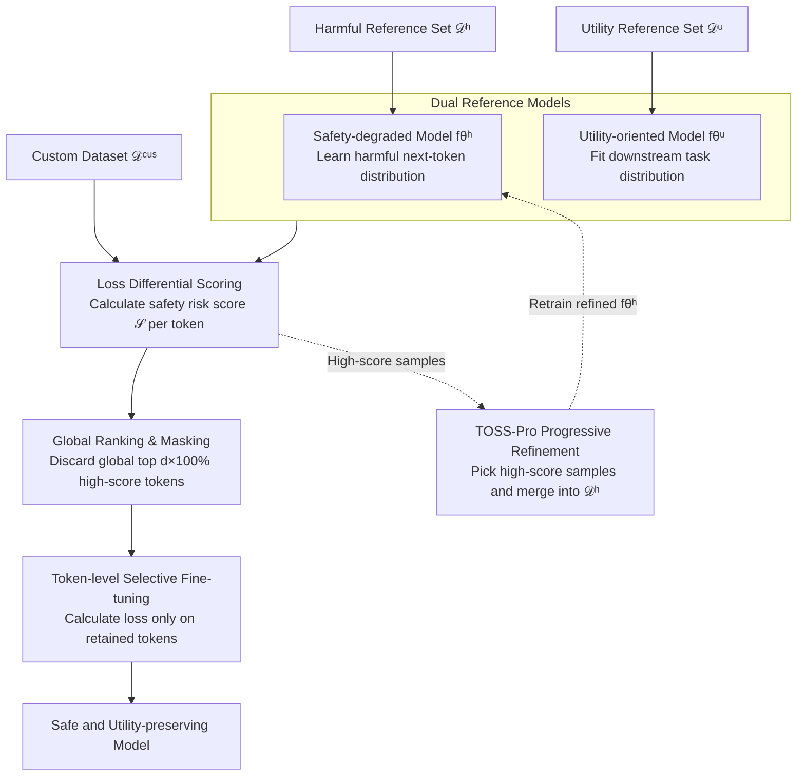

# Token-level Data Selection for Safe LLM Fine-tuning

**Conference**: ICLR 2026  
**arXiv**: [2603.01185](https://arxiv.org/abs/2603.01185)  
**Code**: [github.com/Polly-LYP/TOSS](https://github.com/Polly-LYP/TOSS)  
**Area**: LLM Pre-training  
**Keywords**: LLM safety, fine-tuning safety, token-level selection, data curation, safety-utility tradeoff

## TL;DR

TOSS (Token-level data Selection for Safe LLM fine-tuning) is proposed as the first token-level data selection framework. By evaluating the safety risk of each token through the loss difference between a safety-degraded model and a utility-oriented model, it achieves a superior safety-utility tradeoff compared to sample-level methods.

## Background & Motivation

Fine-tuning LLMs on custom datasets is a standard practice for domain adaptation, but **the fine-tuning process severely erodes the safety alignment of the model**. Existing defense mechanisms operate at the **sample level**:

**Data Mixing** (Bianchi et al., 2023): Mixing safety data into custom datasets, which often leads to over-refusal if excessive safety data is used.

**Sample Filtering** (SEAL, Shen et al., 2024): Identifying and discarding entire samples judged as unsafe, which discards valuable downstream task information.

**Key Findings**: Safety degradation is not a sample-level issue but a **token-level issue**. Diagnostic analysis at the token level reveals:
- The most significant distribution shifts occur at the **initial tokens of the response**—where the model replaces safety refusal prefixes with prefixes complying with harmful instructions.
- However, harm is not limited to initial tokens: middle and late tokens also show significant deviation toward the safety-degraded model.
- Even seemingly benign data can erode safety alignment at the token level.
- Simple fixed-position token masking (e.g., masking the first 5 tokens) improves safety but hurts utility.

Therefore, a **fine-grained token-level selection mechanism** is required to accurately identify and remove harmful tokens while preserving critical task-adaptation tokens.

## Method

### Overall Architecture

TOSS addresses a granularity problem ignored by prior work: the root of safety alignment erosion during fine-tuning lies not in "which samples are harmful" but in "which tokens within samples are harmful." In any given sample, tokens inducing compliance with harmful instructions and tokens carrying downstream task knowledge are often intertwined. Sample-level removal either deletes useful information or misses embedded dangerous tokens. TOSS translates data cleansing to the token granularity through a "surgical" approach: it first calibrates the base model into two reference models—one learning harmful patterns and another learning downstream task utility. It then calculates a safety risk score based on the loss difference between these models for every token. Subsequently, a global ranking is performed across **all tokens** in the custom dataset to mask the top high-risk tokens. Finally, fine-tuning is conducted only on the retained tokens. Furthermore, TOSS-Pro introduces a bootstrap cycle where high-risk samples are fed back to retrain the harmful model, progressively refining the scoring accuracy.

### Key Designs

**1. Dual Reference Models: Decoupling Safety and Utility**

Loss on a single token alone cannot determine whether it is harmful or useful. TOSS calibrates the base model into two specialized reference models as comparative benchmarks. The safety-degraded model $f_{\theta^h}$ is fine-tuned on a small-scale harmful reference set $\mathcal{D}^h$ (harmful instructions paired with harmful responses) to intentionally learn the distribution of harmful next-token predictions, with loss defined as $\mathcal{L}_{f_{\theta^h}} = \frac{1}{\sum_{i=1}^H L_i} \sum_{i=1}^H \sum_{j=1}^{L_i} -\log P(y_{i,j}^h | \boldsymbol{x}_i^h, \boldsymbol{y}_{i,:j-1}^h; \theta)$. The utility-oriented model $f_{\theta^u}$ is trained similarly on a high-quality utility reference set $\mathcal{D}^u$ to fit the downstream task distribution. Both are essential: ablation studies show that using only the safety-degraded model misidentifies task-critical tokens, causing utility to drop, while using only the utility model fails to identify harmful tokens. This dual-target structure provides tokens with both safety and utility references.

**2. Loss Differential Scoring: Exposing Safety Risks through Model Divergence**

With the two references, the safety risk of each token can be quantified by the difference in their log probabilities:

$$\mathcal{S}(y_{i,j}^{\text{cus}}) = -\log P(y_{i,j}^{\text{cus}}|\boldsymbol{x}_i^{\text{cus}}, \boldsymbol{y}_{i,:j-1}^{\text{cus}}; \theta^u) + \log P(y_{i,j}^{\text{cus}}|\boldsymbol{x}_i^{\text{cus}}, \boldsymbol{y}_{i,:j-1}^{\text{cus}}; \theta^h)$$

Expanded relative to the base model, this score is the sum of two competing components: one measuring the token's alignment with the expected task distribution (utility-related, more negative is better) and another measuring its alignment with harmful patterns (safety-related, more positive is worse). A high-scoring token implies a high probability under the safety-degraded model (the harmful model "likes" it, resulting in low loss) and a low probability under the utility model (the task model "dislikes" it, resulting in high loss), precisely identifying targets that are both dangerous and useless for the task.

**3. Global Ranking & Masking: Global Thresholding instead of Per-sample Masking**

After obtaining scores for all tokens, TOSS does not rank them within individual samples. Instead, it performs a global ranking of **all tokens** across the custom dataset and discards the top $d \times 100\%$ highest-scoring tokens (in experiments, $d=0.1$). The masking function is defined such that $m_{i,j}=0$ if $\mathcal{S}(y_{i,j}^{\text{cus}})$ falls in the global top $d \times 100\%$, and $m_{i,j}=1$ otherwise. Global ranking is chosen because harmful tokens are highly unevenly distributed across samples—some samples consist almost entirely of harmful tokens, while others contain only a few. A local proportional cut would unfairly damage clean samples and miss high-risk ones. Ablation results confirm that global ranking significantly outperforms local ranking.

**4. TOSS-Pro Progressive Refinement: Boosting Accuracy via Feedback Loops**

The quality of the fixed safety-degraded model determines the upper bound of token identification. TOSS-Pro makes this process iterative. Starting from an initial harmful set $\mathcal{D}_0^h = \mathcal{D}^h$, the model $f_{\theta_0^h}$ is trained. In each round, token scores are calculated using the current $f_{\theta_t^h}$ and the fixed utility model $f_{\theta^u}$. Samples containing the highest-scoring tokens are traced back and added (skipping duplicates) until $k$ informative high-risk samples $\mathcal{D}_t^s$ are collected. These are merged to form $\mathcal{D}_{t+1}^h = \mathcal{D}_t^h \cup \mathcal{D}_t^s$ to retrain $f_{\theta_{t+1}^h}$. This is repeated $T$ times. Unlike prior methods that split data into $T$ parts for independent fine-tuning, the gain here comes from the positive feedback loop: more accurate harmful model $\rightarrow$ more accurate token identification $\rightarrow$ higher quality harmful samples $\rightarrow$ even more accurate harmful model.

### Loss & Training

Final token-level selective fine-tuning only calculates cross-entropy on the retained tokens; high-risk tokens ($m_{i,j}=0$) do not contribute to gradients:

$$\mathcal{L}^{\text{cus}} = \frac{1}{\sum_{i=1}^N L_i} \sum_{i=1}^N \sum_{j=1}^{L_i} -m_{i,j} \log P(y_{i,j}^{\text{cus}} | \boldsymbol{x}_i^{\text{cus}}, \boldsymbol{y}_{i,:j-1}^{\text{cus}}; \theta)$$

## Key Experimental Results

### Main Results

| Method | Llama-3-8B (HH / HEx-PHI / SLIMORCA / AVG) | Llama-2-7B (HH / HEx-PHI / SLIMORCA / AVG) |
|------|---------------------------------------------|---------------------------------------------|
| Standard SFT | 50 / 50 / 50 / 50 | 50 / 50 / 50 / 50 |
| SafeInstr | 51.5 / 64.6 / 50.5 / 55.5 | 48.2 / 51.3 / 53.1 / 50.9 |
| DSIR | 67.4 / 60.8 / 53.8 / 60.7 | 63.7 / 57.0 / 52.0 / 57.6 |
| SEAL | 58.2 / 68.8 / 57.4 / 61.5 | 58.6 / 50.3 / 52.5 / 53.8 |
| **Ours (TOSS)** | **88.8 / 87.5 / 68.4 / 81.6** | **83.2 / 69.9 / 57.3 / 70.1** |
| **Ours (TOSS-Pro)** | **88.9 / 93.8 / 68.9 / 83.8** | **87.0 / 74.4 / 60.7 / 74.0** |

Compared to SEAL, TOSS improves safety by up to 30% and utility by up to 11%. TOSS-Pro further improves safety by an additional 6% over TOSS.

### Transferability

Data selected using Llama-3-8B-Instruct was applied directly to Llama-3.2-1B/3B (sharing the same tokenizer):

| Method | Llama-3.2-1B AVG | Llama-3.2-3B AVG |
|------|-------------------|-------------------|
| Standard SFT | 50 | 50 |
| SEAL | 56.3 | 53.7 |
| **Ours (TOSS)** | **63.9** | **68.1** |

Token-level selection only needs to be performed once and can be reused across models sharing the same tokenizer.

### Ablation Study

| Ablation Item | Finding |
|--------|------|
| Global vs. Local Ranking | Global ranking is significantly better due to uneven distribution of harmful tokens. |
| Token-level vs. Sample-level | Token-level is superior in both safety and utility. |
| Safety-degraded Model Only | Safety increases but utility drops significantly as task-critical tokens are discarded. |
| Utility-oriented Model Only | Utility is acceptable but safety shows no improvement—fails to identify harmful tokens. |
| Random vs. Metric Selection (TOSS-Pro) | Random selection is ineffective; precise selection of informative samples is key. |
| TOSS-Pro Iterations | 1-2 iterations are sufficient to continuously improve safety performance. |

### Key Findings

1. **Safety degradation is a token-level issue**: Harmful and beneficial signals are intertwined within the same sample.
2. **Complementarity of the two reference models is crucial**: Missing either results in significant degradation of safety or utility.
3. **Global ranking is superior to local ranking**: Distribution of harmful tokens is highly uneven across samples.
4. **Progressive refinement is more effective than one-step selection**: Iteratively selecting high-quality harmful samples continuously improves identification accuracy.

## Highlights & Insights

1. **"The basic unit of safety degradation is not the sample but the token"**—this core hypothesis is fully validated through diagnostic analysis and represents a key methodological breakthrough.
2. **The loss differential metric** elegantly unifies safety and utility goals: high score = harmful model "likes" + utility model "dislikes" = discard.
3. **TOSS-Pro's progressive refinement** leverages a bootstrap effect: better safety-degraded model $\rightarrow$ more accurate token identification $\rightarrow$ higher quality harmful samples $\rightarrow$ better safety-degraded model.
4. **Transferability across shared tokenizers** gives the method significant practical value—token selection done on a large model can be directly reused by smaller models.

## Limitations & Future Work

1. **Requires construction of harmful and utility reference sets**: Although the volume is small (~10%), domain knowledge is still required.
2. **Token discard ratio $d$ is fixed at 0.1**: Different datasets might require different ratios.
3. **Training safety-degraded models** involves explicit ethical considerations—training a "harmful" model is required.
4. **Evaluation relies on GPT-4o as a judge**, which may introduce evaluation bias.
5. **Experiments were limited to the Llama series**; architectures like Mistral or Qwen were not tested.
6. **Differences between types of harmful content were not discussed**: Token-level features might vary across safety categories.

## Related Work & Insights

- **SEAL** (Shen et al., 2024): Sample-level data selection baseline and direct target for TOSS improvement.
- **SafeInstr** (Bianchi et al., 2023): Data mixing method.
- **DSIR** (Xie et al., 2023): Sample selection based on importance resampling.
- **TokenTune** (Simoulin et al., 2024): Token-level activation pruning (focuses on efficiency rather than safety).
- **DPO/RLHF**: Training-stage safety alignment methods, complementary to TOSS.

The core insight from TOSS: **The granularity of data cleansing determines the upper bound of the safety-utility tradeoff**. Improving granularity from sample-level to token-level brings a significant performance leap, suggesting potential future work at the sub-token or semantic unit level.

## Rating

- Novelty: ⭐⭐⭐⭐⭐ — First to systematically diagnose and solve fine-tuning safety degradation at the token level.
- Experimental Thoroughness: ⭐⭐⭐⭐ — Multiple models, benchmarks, comprehensive ablations, and transferability validation.
- Writing Quality: ⭐⭐⭐⭐ — Clear logic with a complete loop between diagnosis, design, and verification.
- Value: ⭐⭐⭐⭐⭐ — Provides a new paradigm for safe fine-tuning, significantly outperforming existing methods with open-source code.

<!-- RELATED:START -->

## Related Papers

- [\[ICLR 2026\] ssToken: Self-modulated and Semantic-aware Token Selection for LLM Fine-tuning](sstoken_self-modulated_and_semantic-aware_token_selection_for_llm_fine-tuning.md)
- [\[ICLR 2026\] Task-Aware Data Selection via Proxy-Label Enhanced Distribution Matching for LLM Fine-Tuning](task-aware_data_selection_via_proxy-label_enhanced_distribution_matching_for_llm.md)
- [\[ICLR 2026\] Train on Validation (ToV): Fast Data Selection with Applications to Fine-Tuning](train_on_validation_tov_fast_data_selection_with_applications_to_fine-tuning.md)
- [\[ICLR 2026\] Pre-training LLM without Learning Rate Decay Enhances Supervised Fine-Tuning](pre-training_llm_without_learning_rate_decay_enhances_supervised_fine-tuning.md)
- [\[ICML 2026\] Data Difficulty and the Generalization--Extrapolation Tradeoff in LLM Fine-Tuning](../../ICML2026/llm_pretraining/data_difficulty_and_the_generalization--extrapolation_tradeoff_in_llm_fine-tunin.md)

<!-- RELATED:END -->
