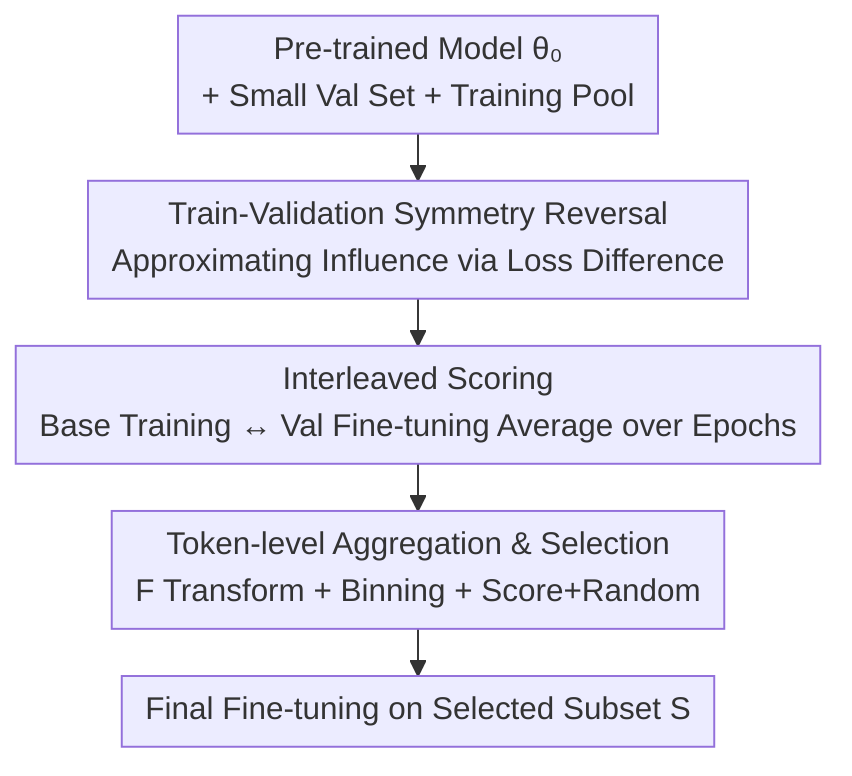

# Train on Validation (ToV): Fast Data Selection with Applications to Fine-Tuning

**Conference**: ICLR 2026  
**OpenReview**: [https://openreview.net/forum?id=fWHd3yYicX](https://openreview.net/forum?id=fWHd3yYicX)  
**Area**: LLM Pre-training / Data Selection  
**Keywords**: Data selection, Instruction tuning, Influence functions, Train-validation symmetry, Forward loss

## TL;DR
ToV **reverses** the process of "estimating the impact of each sample on validation loss" by leveraging train-validation symmetry revealed through first-order Taylor expansion. It fine-tunes on a small validation set for one step and identifies samples in the training pool with the largest loss reduction—using only forward loss evaluations without requiring per-sample gradients or Hessians. This achieves 2–6× speedups over LESS while selecting higher-quality data for instruction tuning and NER.

## Background & Motivation

**Background**: Foundation models follow a two-stage paradigm of "large-scale pre-training + task-specific fine-tuning," where the quality of fine-tuning data often determines downstream performance. When the target distribution contains only a few samples and the training pool comes from heterogeneous sources, the core problem of data selection is identifying the subset that "most resembles the target distribution and best reduces the target test loss."

**Limitations of Prior Work**: Existing methods (e.g., LESS, TracIn) treat these target samples as a validation set and use **influence functions** to estimate the impact of adding/removing a training sample on validation loss. To compute this, one must calculate **per-sample gradients** for every training and validation sample, followed by dot products, random projections, or low-rank approximations, while accounting for training dynamics backpropagation. This process imposes heavy computational and disk I/O burdens due to storing massive gradients/checkpoints.

**Key Challenge**: Directly evaluating "the decrease in validation loss caused by each training sample $x$" requires $N$ validation set inferences ($N+1$ total evaluations), which scales linearly with the training pool. Conversely, avoiding this cost via per-sample gradient approximations shifts the burden to storage and backpropagation. Both paths are computationally expensive.

**Key Insight**: The authors observe that under first-order Taylor expansion, the "loss reduction on a validation sample $z$ after taking a gradient step on $x$" is **symmetrical** to the "loss reduction on $x$ after taking a gradient step on $z$"—the right-hand side of Equation (4), $\eta\langle\nabla\ell(\theta,z),\nabla\ell(\theta,x)\rangle$, is symmetric w.r.t. $x$ and $z$. Therefore, rather than perturbing each training sample to observe the validation set, it is more efficient to **fine-tune once on the validation set** and observe which samples in the training pool exhibit the largest loss changes.

**Core Idea**: The loss change of a training sample $x$ before and after validation fine-tuning, $\ell(\theta,x)-\ell(\theta_{Z_{val}},x)$, is used to approximate the "average validation loss reduction brought by training on $x$." This allows scoring using **forward loss only**, bypassing per-sample gradients entirely.

## Method

### Overall Architecture

ToV addresses the problem: "Given a pre-trained model $\theta_0$, a small validation set $Z_{val}$, and a large training pool $X=(x_1,\dots,x_N)$, select a subset $S$ of size $n$ such that fine-tuning on $S$ minimizes the target test loss." The framework performs one primary action: **reversing the roles of training and validation**—instead of perturbing every training sample, it fine-tunes on the validation set for one step and scans the training pool for the largest changes.

The critical derivation is Equation (6): taking a batch gradient step on the validation set yields $\theta_{Z_{val}}=\theta-\eta\frac{1}{m_{val}}\sum_i\nabla\ell(\theta,z_i)$. Combined with symmetry:

$$\frac{1}{m_{val}}\sum_{i=1}^{m_{val}}\big[\ell(\theta,z_i)-\ell(\theta_x,z_i)\big]\approx\langle\theta-\theta_{Z_{val}},\nabla\ell(\theta,x)\rangle\approx\ell(\theta,x)-\ell(\theta_{Z_{val}},x).$$

The left side represents the "average validation loss reduction from training on $x$" (the ideal score), while the right side requires only "one validation fine-tune + two training pool forward passes." This compresses $N$ validation set evaluations into 1 validation epoch and 2 training pool scans, eliminating per-sample gradients.

This is implemented via an "Interleaved ToV" scoring-selection-final training loop (Algorithm 1): a small base set $U$ is used to alternately "train for one epoch to get base model $\hat\theta^{bas}_k$ $\rightarrow$ fine-tune on validation set with a smaller learning rate $\varepsilon\eta_k$ to get $\hat\theta^{val}_k$ $\rightarrow$ score training samples based on loss difference and average across epochs." Finally, subset $S$ is selected for final fine-tuning.

### Key Designs

**1. Reversing Train-Validation Roles: Approximating Influence via Forward Loss Difference**

This design directly addresses the bottleneck of per-sample gradients. Traditional methods (Pruthi 2020; LESS by Xia 2024) estimate external influence by computing gradients for every $x$ and $z$ and taking their dot product. ToV notes the symmetry of the inner product $\eta\langle\nabla\ell(\theta,z),\nabla\ell(\theta,x)\rangle$ in Equation (4). Taking a step on $x$ to reduce $z$'s loss is equivalent to taking a step on $z$ to reduce $x$'s loss. By reversing the direction, the scoring simplifies to $\ell(\theta,x)-\ell(\theta_{Z_{val}},x)$ (Eq. 6). This relies only on first-order Taylor expansion validity, necessitating small validation steps and local smoothness—enforced by setting the validation learning rate $\varepsilon=1/10$ of the base learning rate.

**2. Interleaved and Parallel Scoring Trajectories**

Single-point approximations are only valid near the initial $\theta$. As the model evolves, scores may drift. ToV embeds scoring into a training trajectory: starting from a random base set $U$ for $L$ epochs, each checkpoint $\hat\theta^{bas}_k$ undergoes a "validation fine-tuning to $\hat\theta^{val}_k$." Scores $\ell(\hat\theta^{val}_k;x_i)-\ell(\hat\theta^{bas}_k;x_i)$ are averaged across epochs to capture influence at different training stages. Two variants are provided: **Interleaved ToV** (incorporating validation updates into the base trajectory) performs better empirically, while **Parallel ToV** (maintaining a separate validation-free trajectory) is used for theoretical analysis.

**3. Token-level Aggregation, Length Binning, and Score+Random Selection**

Since predictions occur at the token level but selection occurs at the sample or instruction level, token-wise differences must be aggregated. ToV defines the per-token log-loss difference $\Delta_t(z;\theta,\theta')=\log\frac{p_t(z_{out}(t)\mid z;\theta')}{p_t(z_{out}(t)\mid z;\theta)}$, averages them after a transformation $F$: $\phi=\frac{1}{T}\sum_t F(\Delta_t)$. Instances of $F$ include $F(y)=y$ (max improvement), $F(y)=|y|$ (max absolute change), and $F(y)=\max\{y,0\}$ (positive improvement only). To counteract the high-variance bias often seen in short samples, authors use 10 equal-capacity length bins and select high-scoring samples from each. The final **Score+Random** strategy takes half based on scores and half via uniform random sampling from the base set $U$ to maintain diversity.

### Loss & Training

Training utilizes token-level log-loss $\ell(\theta,z)=-\frac{1}{T(z)}\sum_t\log p_t(z_{out}(t)\mid z;\theta)$ (Eq. 7). The number of scoring epochs $L$ is set via $L=(16\times1024)/n_{tr}$ to maintain **constant compute** (fixed at 1024 batches); for $|U|=4\times1024$, $L=4$. Validation learning rate is $\varepsilon=1/10$ of the base rate. LoRA is used throughout ($\alpha=32$, dropout=0.2), with rank=1 for NER and rank=256 for instruction tuning.

## Key Experimental Results

### Main Results

Instruction tuning used Llama-3-8B across 5 configurations of Slim Orca, Alpaca GPT-4, and Alpaca GPT-3.5. NER used xlm-roberta-base across 6 configurations (Multinerd, Ai4p, C4, Syn-big). Metrics focus on the percentage improvement of test log-loss relative to random selection ($n=8\times1024$, averaged over 10 runs).

| Task | Config | ToV Best Variant Gain | LESS | Max Uncertainty |
|------|------|------|------|------|
| Instruction Tuning | Exp 1/3/4/5 | +5%~+10% vs Random | Usually outperformed by ToV | Little to no improvement |
| Instruction Tuning | Exp 2 (Non-target Pool) | Better than Random | Slightly better than ToV | No improvement |
| NER | Exp 1–6 | Systematic improvement, largest gains (~+30%) | No better than Random | Some gain, but weaker than ToV |

A key observation: the performance gain from effective data selection is comparable to or exceeds the effect of doubling the sample size $n$.

### Ablation Study

| Config / Dimension | Key Metric | Description |
|------|---------|------|
| $F(y)=y$ / $|y|$ / $\max\{y,0\}$ | Consistent Gain | All variants outperform random; specific best choice varies by config. |
| Interleaved vs Parallel | Interleaved slightly better | Parallel used mainly for cleaner theoretical analysis. |
| Score+Random vs Score-Only | Score+Random preferred | Half-random sampling increases data diversity. |
| Length Binning | Bias Mitigation | Prevents short samples from being over-selected due to high variance. |

### Runtime & Storage (ToV vs LESS, 5-run average)

| Setting | Method | Runtime | Storage |
|------|------|------|------|
| Instruction Tuning | LESS | 4h 5m | 4.9 GB |
| Instruction Tuning | ToV | 2h 3m | 1.84 GB |
| NER | LESS | 46m | 4.1 GB |
| NER | ToV | 8m | 0.24 GB |

ToV reduces runtime by 2–6× and disk storage by 2.5–16× compared to LESS.

### Key Findings
- **Symmetry is the root of efficiency**: Replacing "per-sample gradient dot products" with "one validation fine-tune + two forward passes" saves time and storage without sacrificing accuracy.
- **Stronger gains in NER**: While LESS struggles with NER (often worse than random), ToV maintains systematic leads, suggesting forward loss differences are more robust for sequence labeling.
- **Performance in extreme shifts**: In Exp 2 (instruction tuning pool completely non-target), LESS slightly outperforms ToV, indicating pure forward loss differences may lose discriminative power under extreme distribution shifts.
- **Theoretical support**: Proposition 1 proves that the linearized ideal score $S_i^{lin}$ quantitatively approximates the ideal score $S_i$ under local convexity and smoothness, providing mathematical grounding for the reversal trick.

## Highlights & Insights
- **Ingenious "Reversal Perspective"**: Applying train-validation symmetry to transform $O(N)$ validation evaluations into a single validation fine-tune is a clever maneuver that could be applied to other influence-based attribution tasks.
- **Forward-Loss Only**: By avoiding per-sample gradients, Hessian-vector products, and backpropagation through training dynamics, the implementation is simplified and applicable to any model capable of loss calculation.
- **Constant Compute Evaluation**: Fixing total batches via $L=(16\times1024)/n_{tr}$ ensures fair comparison across sampling scales, a commendable evaluation standard.
- **Length Binning**: Identifying and correcting the systematic bias where short samples are over-valued due to token-level variance is a crucial practical detail.

## Limitations & Future Work
- **Reliance on First-order Approximation**: Equation (6) holds only when validation updates are small and the loss is locally smooth. This may fail under high non-linearity or large updates.
- **Distribution Mismatch**: The drop in relative performance when the training pool differs significantly from the target distribution suggests a need for hybrid methods in out-of-distribution scenarios.
- **Assumption Gap**: Proposition 1 assumes local strong convexity and Hessian Lipschitz continuity, which may not perfectly describe SGD/LoRA training in LLMs.
- **Hyperparameter Sensitivity**: Scoring choices ($F$), $\varepsilon$, and binning counts require tuning; no automated configuration scheme was provided.

## Related Work & Insights
- **vs LESS (Xia et al., 2024)**: LESS uses gradient dot products with random projections and low-rank approximations. ToV relies on symmetry to reduce the cost to forward passes, yielding 2–6× speedups and saving up to 16× storage while being more robust in NER.
- **vs TracIn / Pruthi et al. (2020)**: Both approximate influence via gradients. ToV avoids per-sample gradients and provides better coverage of training dynamics via interleaved trajectories.
- **vs Max Uncertainty (Hardness score)**: Uncertainty-based selection identifies "hard" samples, but hard samples are not necessarily helpful for a specific target distribution. ToV aligns directly with target influence.
- **vs TSDS / DSIR**: These methods align training distributions with target sets. ToV is complementary, focusing on high-efficiency estimation of individual sample influence.

## Rating
- Novelty: ⭐⭐⭐⭐⭐ High. Reverses expensive influence estimation into pure forward scoring via symmetry.
- Experimental Thoroughness: ⭐⭐⭐⭐ Good coverage of instruction tuning and NER, with runtime comparisons, though scale remains limited.
- Writing Quality: ⭐⭐⭐⭐ Clear derivations and logical progression from motivation to theory.
- Value: ⭐⭐⭐⭐⭐ Practical due to low barriers to implementation and significant acceleration for constrained fine-tuning.

<!-- RELATED:START -->

## Related Papers

- [\[ICLR 2026\] Token-level Data Selection for Safe LLM Fine-tuning](token-level_data_selection_for_safe_llm_fine-tuning.md)
- [\[ICLR 2026\] Task-Aware Data Selection via Proxy-Label Enhanced Distribution Matching for LLM Fine-Tuning](task-aware_data_selection_via_proxy-label_enhanced_distribution_matching_for_llm.md)
- [\[ICLR 2026\] How to Train Data-Efficient LLMs](how_to_train_data-efficient_llms.md)
- [\[ICLR 2026\] ssToken: Self-modulated and Semantic-aware Token Selection for LLM Fine-tuning](sstoken_self-modulated_and_semantic-aware_token_selection_for_llm_fine-tuning.md)
- [\[ICLR 2026\] SPICE: Submodular Penalized Information–Conflict Selection for Efficient Large Language Model Training](spice_submodular_penalized_informationconflict_selection_for_efficient_large_lan.md)

<!-- RELATED:END -->
