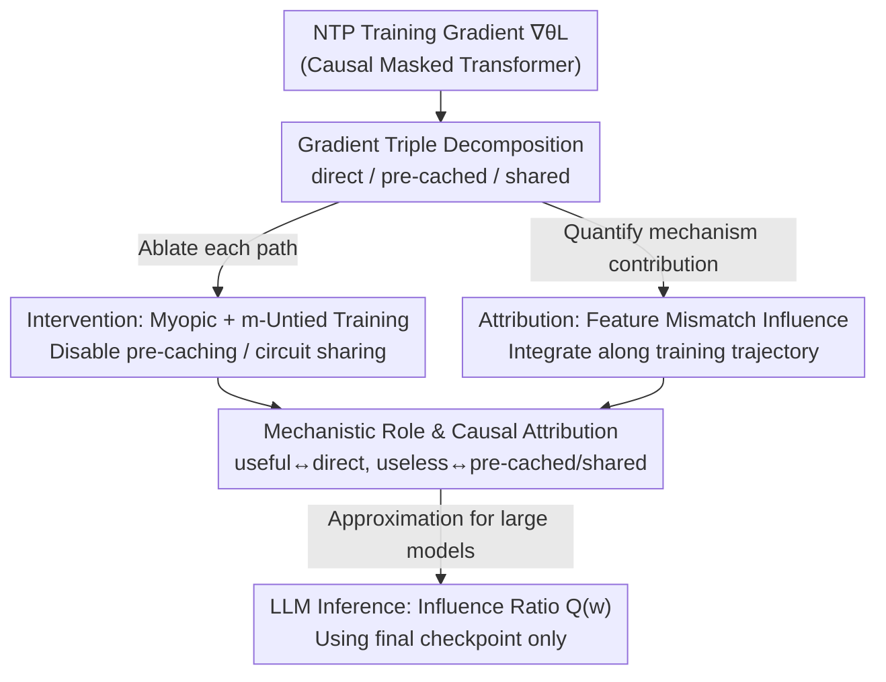

# Understanding the Emergence of Seemingly Useless Features in Next-Token Predictors

**Conference**: ICLR 2026  
**arXiv**: [2603.14087](https://arxiv.org/abs/2603.14087)  
**Code**: [https://github.com/Markfryazino/useless-features-iclr-code](https://github.com/Markfryazino/useless-features-iclr-code)  
**Area**: LLM Pre-training  
**Keywords**: Next-token prediction, feature emergence, pre-caching, circuit sharing, mechanistic interpretability

## TL;DR
By decomposing training gradient signals into three components—direct, pre-cached, and circuit sharing—this work explains why Transformers trained with NTP learn features "useless" for predicting the current next token. The explanatory power of this framework is validated on OthelloGPT, small language models, and a pre-trained LLM (Gemma 2).

## Background & Motivation

**Background**: LLMs are trained via the NTP (Next-Token Prediction) objective, learning $p(x_{t+1}|x_1 \cdots x_t)$. Intuitively, models should only learn features beneficial for predicting the next token. Some studies on synthetic tasks have confirmed that NTP training indeed only learns immediately useful features.

**Limitations of Prior Work**: However, extensive empirical evidence shows that LLMs learn rich features far beyond what is required for immediate NTP—including abstract input feature reconstruction, "world models" (e.g., board states encoded by OthelloGPT), and multi-step look-ahead capabilities. Why does the NTP objective drive the emergence of these "seemingly useless" features? Existing interpretability research primarily analyzes this from a teleological perspective (the algorithmic role of features in the finalized model) without exploring the source of gradient signals during the training process.

**Key Challenge**: The NTP objective only provides supervision signals for the "next token," yet the model learns features concerning the "global state" and "future tokens." How does the gradient signal "travel through" an objective function that only optimizes immediate prediction to drive the learning of these cross-position features?

**Goal**: To explain the emergence mechanism of NTP-useless features from the perspective of gradient signal information flow. Specifically: (a) through which paths do gradient signals reach the parameters? (b) which paths are responsible for learning "useless" features? (c) can the contribution of each mechanism be quantified?

**Key Insight**: Leveraging the computation graph structure of causal masked Transformers, the gradient signal is decomposed into three independent paths. Two analysis methods are developed: intervention (observing impact by ablating mechanisms) and attribution (quantifying the influence of each mechanism).

**Core Idea**: NTP-useless features emerge from the NTP objective through two mechanisms: pre-caching (loss signals from future positions passed back via attention) and circuit sharing (parameter sharing leading to feature transfer across positions).

## Method

### Overall Architecture
This is a **mechanism analysis** paper. Its goal is not to propose a new model but to answer a question: How does the NTP objective, which only supervises the "next token," allow the model to learn "seemingly useless" features like global states and future tokens? The analysis framework first **decomposes the gradients and then examines each piece**. First, by fixing the residual stream $r_{\theta,i}^k(x)$ at a specific position $i$ and layer $k$, the training gradient backpropagated to the parameters is precisely split into three paths (**Gradient Triple Decomposition**): direct, pre-cached, and shared. "Direct" signals are only linked to immediate prediction, while the other two are potential sources of "useless" features. Once these three paths are obtained, the paper analyzes them using two complementary tools: **intervention**, using myopic/m-untied training to "turn off" pre-caching and circuit sharing respectively to see if the model can still learn those features; and **attribution**, defining feature mismatch influence and integrating it along the training trajectory to quantitatively calculate how much each mechanism contributed to the emergence of a specific feature. Since both tools require full retraining (unfeasible for models like Gemma 2), an approximate metric $Q(w)$ is provided using only the final checkpoint to migrate the "pre-cached vs. direct dominance" judgment to real-world LLMs.

### Key Designs

**1. Gradient Triple Decomposition (Proposition 3.1): Precisely splitting the NTP training gradient into direct, pre-cached, and shared paths**

To understand where "useless" features come from, the first step is to see which paths the gradient takes to return to the parameters. By fixing the residual stream $r_{\theta,i}^k(x)$ at position $i$ and layer $k$, and using stop-gradient operations, the total gradient is sliced into three parts: the direct term $\nabla_\theta L_i - \nabla_\theta L_i^{sg(k,i)}$, which keeps only the signal passing through this residual stream toward the immediate prediction $\hat{x}_{i+1}$; the pre-cached term $\nabla_\theta \sum_{j \neq i} [L_j - L_j^{sg(k,i)}]$, which captures signals flowing through this residual stream toward future position losses $\hat{x}_j$ ($j>i+1$); and the shared term $\sum_j \nabla_\theta L_j^{sg(k,i)}$, representing indirect influence through parameter sharing without passing through that specific residual stream. The sum of these three equals $\nabla_\theta L$, forming a complete decomposition. This is crucial because the direct component is only tied to immediate prediction (driving NTP-useful features), while pre-cached and shared paths are the potential sources of "useless" features.

**2. Intervention: Myopic Training and m-Untied Training—disabling pre-caching and circuit sharing to observe consequences**

With the triple decomposition, mechanisms can be ablated individually. Myopic training (proposed by Wu et al. 2024) cuts cross-position gradients at the K and V matrices of attention, preventing position $i$ from being incentivized to compute features useful for future positions, thereby disabling pre-caching. m-Untied training (proposed in this paper) uses independent sets of parameters to process sequences before and after position $m$, preventing the two segments from sharing circuits and thus cutting circuit sharing. These are separated because they play different roles: pre-caching provides additional expressivity, enabling complex multi-layer attention constructions (like two-layer induction head circuits), while circuit sharing provides cross-position transfer—features that are NTP-useful at one position can be encoded at another position via shared parameters.

**3. Attribution: Feature Mismatch Influence—quantifying the actual contribution of each gradient component**

Intervention only answers if a mechanism is "necessary"; it does not say how much it "actually contributed." Therefore, a quantitative attribution is provided. First, feature mismatch is defined to measure representation differences for a feature direction $w_i^k$ under two parameter sets:

$$R(x|\theta_1, \theta_2, w_i^k) = \frac{1}{2}\big(\langle w_i^k, r_{\theta_1,i}^k(x) \rangle - \langle w_i^k, r_{\theta_2,i}^k(x) \rangle\big)^2$$

The marginal influence of a gradient component $G$ on this difference is defined as influence $I_i^k(\theta, x | w_i^k, \theta^*, G) = \frac{d}{d\varepsilon} R(x|\theta + \varepsilon G, \theta^*, w_i^k)|_{\varepsilon=0}$. To make this hold under real optimizers like Adam, separate momentums are maintained for direct, pre-cached, and shared components. Integrating this influence along the training trajectory yields the cumulative quantitative contribution of each mechanism to a feature's emergence.

**4. LLM Inference: Intervention-based Influence Ratio $Q(w)$—estimating the influence ratio without retraining**

Since full attribution is too expensive for Gemma 2, an approximation metric is provided. Proposition 5.1 proves that performing activation intervention (ablation) on a feature in a post-trained model and calculating the ratio of the sum of KL divergences at future positions to the KL divergence at the immediate position:

$$Q(w) = \frac{\sum_{j>i+1} d_j^{/i}}{d_{i+1}^{/i}}$$

approximates the ratio of pre-cached to direct influence. Thus, for large models, one can infer whether a feature was shaped more by "future preparation" or "immediate prediction" using only final-model intervention experiments.

### Loss & Training
Standard NTP cross-entropy loss is used. Myopic and untied variants modify the gradient propagation paths via stop-gradients rather than changing the loss function itself.

## Key Experimental Results

### Main Results

Influence analysis of NTP-useful vs. NTP-useless features in OthelloGPT (95% confidence intervals):

| Gradient Component | NTP-useful Features | NTP-useless Features | Meaning |
|---------|----------------|-----------------|------|
| Direct | [2.85, 12.38] | [-4.69, 2.74] | Direct only drives useful features |
| Pre-cached | [-1.99, 0.66] | [0.55, 3.05] | Pre-cached drives useless features |
| Shared | [4.80, 12.48] | [2.93, 9.91] | Shared contributes to both |
| Combined | [12.14, 19.05] | [4.42, 10.07] | Useful features are learned better |

The direct influence on NTP-useless features is not significantly different from zero, while pre-cached and shared components contribute positively. This precisely explains the source of vulnerability in OthelloGPT's "world model."

### Ablation Study

Impact of different training modes on the representation quality of NTP-useless features in a toy task:

| Training Mode | Majority | Conditioned Majority | Description |
|---------|----------------|-------------------------------|------|
| Standard Training | High probe accuracy | High probe accuracy | All mechanisms enabled |
| Myopic (No pre-cache) | Decreased | Significant decrease | Blocks pre-caching |
| m-Untied (No sharing) | Decreased | Decreased | Blocks circuit sharing |
| Myopic + Untied | Worst | Failed completely | Cannot learn NTP-useless features |

Conditioned Majority requires a two-layer attention construction similar to an induction head; myopic training completely prevents the development of such circuits.

### Key Findings
- **Syntactic features are primarily driven by direct signals**: In small LMs, pre-cached influence for POS tags and dependency tags is much lower than direct influence, suggesting simple syntax can be learned without relying on pre-caching.
- **Pre-caching is indispensable for coherent text generation**: The loss for myopic models (3.29) is much higher than standard models (2.53), showing that pre-caching is vital for complex language modeling.
- **Extreme $Q(w)$ values in Gemma 2 correlate with formal reasoning**: SAE features with extremely high or low $Q(w)$ are concentrated in code and formal domains. Pre-caching is particularly important for tasks involving the simulation of formal computational devices (like AST parsing).
- **Pre-caching $\neq$ Look-ahead**: The correlation between $Q(w)$ and the feature directions of a look-ahead predictor is negative—pre-cached features actually contribute less to forward prediction. This supports the "breadcrumbs" hypothesis: look-ahead emerges because different positions require similar features, not from explicit planning.

## Highlights & Insights
- **Shift from "Static Function" to "Developmental Process"**: Traditional interpretability asks "what is this feature doing," while this paper asks "how was this feature trained." This developmental perspective provides a new tool for understanding LLM internal mechanisms.
- **Universality of Triple Decomposition**: The direct/pre-cached/shared decomposition is based on the computation graph of causal masked Transformers and is applicable to all autoregressive models.
- **Causal Explanation for OthelloGPT World Model Vulnerability**: Previously, it was known that the world model is fragile; now it is understood that NTP-useless board squares only receive pre-cached and shared signals, lacking direct signals, which naturally makes them more vulnerable.

## Limitations & Future Work
- **High Computational Cost for Attribution**: Requires full model retraining and calculating three gradient components at each step, making it unfeasible for very large models.
- **$Q(w)$ Metric is an Approximation**: It is only valid in the local region of the post-trained model and does not represent the integrated influence over the entire training trajectory.
- **Gap Between Toy Tasks and Real LLMs**: Primary experiments were done on small models; large model analysis is limited to the indirect $Q(w)$ metric.
- **Future Directions**: Developing more efficient attribution methods (e.g., using intermediate checkpoints instead of full retraining); using gradient decomposition to discover unknown interpretable features.

## Related Work & Insights
- **vs. Wu et al. (2024)**: They first proposed the pre-caching concept and myopic training. This work builds on that by introducing circuit sharing, establishing a quantitative attribution framework, and discovering that pre-caching $\neq$ look-ahead.
- **vs. Vafa et al. (2025)**: They found the OthelloGPT world model is fragile to boards sharing the same legal next moves. This work provides a causal explanation via gradient decomposition: direct influence for NTP-useless squares is zero, making them reliant on pre-cached and shared signals.
- **vs. Bachmann & Nagarajan (2024)**: They pointed out NTP deficiencies (potential failure to learn useful features). This work analyzes the opposite: why NTP can learn features "beyond expectations."

## Rating
- Novelty: ⭐⭐⭐⭐⭐ Proposes a new framework for understanding feature emergence in Transformers with depth.
- Experimental Thoroughness: ⭐⭐⭐⭐ Progressive validation from toy tasks to Gemma 2 is clear, though large model analysis relies on indirect metrics.
- Writing Quality: ⭐⭐⭐⭐⭐ The logical flow from intuition to formalization to experiments is extremely smooth.
- Value: ⭐⭐⭐⭐⭐ Makes a fundamental contribution to understanding how NTP produces unexpected capabilities.

<!-- RELATED:START -->

## Related Papers

- [\[ICLR 2026\] Next-ToBE: Probabilistic Next Token-Bag Exploitation for Activating Anticipatory Capacity in LLMs](next-tobe_probabilistic_next_token-bag_exploitation_for_activating_anticipatory_.md)
- [\[ICLR 2026\] FoNE: Precise Single-Token Number Embeddings via Fourier Features](fone_precise_single-token_number_embeddings_via_fourier_features.md)
- [\[ICLR 2026\] A Law of Data Reconstruction for Random Features (and Beyond)](a_law_of_data_reconstruction_for_random_features_and_beyond.md)
- [\[ICLR 2026\] StochasTok: Improving Fine-Grained Subword Understanding in LLMs](stochastok_improving_fine-grained_subword_understanding_in_llms.md)
- [\[ICLR 2026\] Understanding and Improving Shampoo and SOAP via Kullback-Leibler Minimization](understanding_and_improving_shampoo_and_soap_via_kullback-leibler_minimization.md)

<!-- RELATED:END -->
