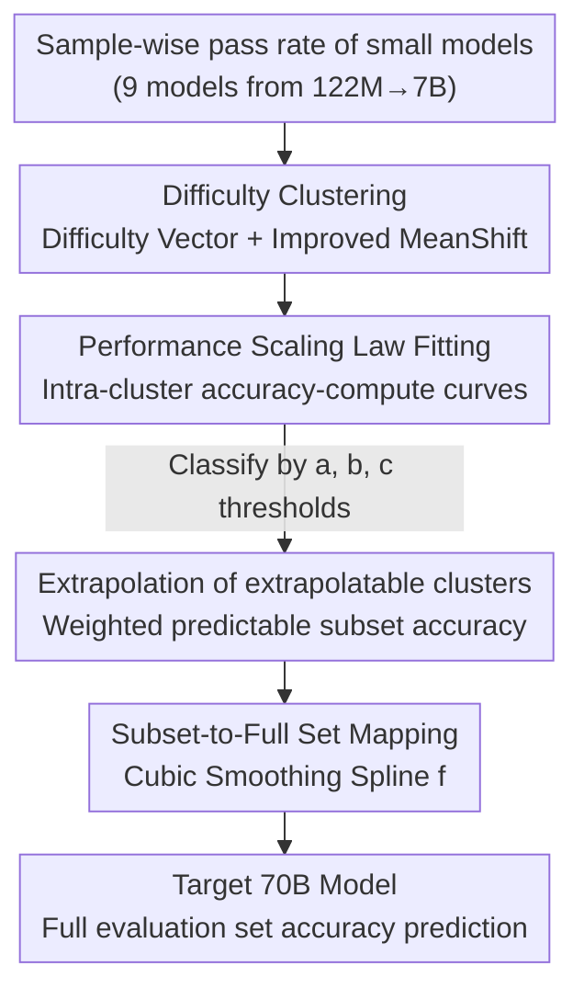

# Unveiling Downstream Performance Scaling of LLMs: A Clustering-Based Perspective

**Conference**: ICLR 2026  
**OpenReview**: [https://openreview.net/forum?id=3HrDPUi4jx](https://openreview.net/forum?id=3HrDPUi4jx)  
**Area**: LLM Pre-training / Scaling Law  
**Keywords**: Downstream Performance Prediction, Scaling Law, Difficulty Clustering, Emergent Phenomena, Training Monitoring

## TL;DR
This paper proposes the Clustering-On-Difficulty (COD) framework: it first clusters evaluation samples based on "difficulty scaling features," filters out non-extrapolatable clusters, applies a newly derived downstream performance scaling law to perform compute-performance extrapolation for each cluster, and finally uses a smooth mapping function to restore the accuracy of the "predictable subset" to the full evaluation set—reducing the average prediction error to 1.55% across 8 mainstream benchmarks for a 70B model.

## Background & Motivation
**Background**: It is widely recognized that training loss decreases as a power law with respect to compute ($L \propto C^{-\beta}$); however, the true value of a model is determined by its downstream task accuracy. Consequently, there is a demand to "predict the performance of large models on benchmarks using evaluation results of small models." Mainstream approaches follow two lines: **loss-intermediate** (predicting loss first, then converting loss to accuracy) and **end-to-end** (directly fitting performance-compute or performance-parameter curves).

**Limitations of Prior Work**: Neither approach is sufficiently accurate. The mapping between loss and downstream accuracy is unstable—at the same loss value, smaller models might even have higher accuracy than larger ones (because reaching the same loss may require more training steps, leading to better generalization). Additionally, different learning rate schedules cause "same loss, different accuracy." For end-to-end methods, a single curve family cannot capture the complex distribution of "varying sample difficulties" within a benchmark; Broken Neural Scaling Laws (BNSL) fail at large scales like 70B due to unexpected inflection points caused by emergence or saturation.

**Key Challenge**: All existing methods implicitly rely on an **unreasonable assumption—that all samples in the entire evaluation set follow the same performance scaling curve**. However, the authors observed in a pilot study that even within the same benchmark (e.g., BBH), samples of different difficulties have distinct "compute thresholds, growth slopes, and performance upper bounds." Forcing a single formula is naturally suboptimal; meanwhile, low-difficulty samples exhibit non-emergent noise that oscillates near the random guess level in small models, which misleads the fitting process.

**Goal**: To find a prediction method $\phi$ that is reliable across various downstream tasks and optimizes the worst-case prediction error, using only the evaluation results of a set of small models $\{M_{C_1},\dots,M_{C_n}\}$ to infer the accuracy of a target large model $M_{C_{\text{target}}}$ ($C_i \ll C_{\text{target}}$).

**Key Insight**: Since heterogeneity stems from the "difficulty distribution," the samples should **first be grouped by difficulty** so that the scaling behavior within each group is consistent. Fitting and extrapolation are then performed per group. Small difficulty variance (low intra-group loss variance) is the prerequisite for the subsequent downstream performance scaling law to approximately hold.

**Core Idea**: A four-stage process—"clustering by difficulty → screening extrapolatable clusters → intra-cluster scaling law extrapolation → mapping subset back to full set"—decomposes an unpredictable whole into several predictable sub-problems and recombines them.

## Method

### Overall Architecture
COD decomposes the task of "predicting downstream accuracy of large models from small models" into four serial stages (corresponding to Fig. 2 a/b/c/d in the paper). The input is the sample-wise pass rate of a set of small models (ranging from 122M to 7B) on the evaluation set, and the output is the predicted accuracy of the target 70B model on the full evaluation set.

The four stages are: (a) representing each sample as a "difficulty vector" and performing improved MeanShift clustering while removing outliers; (b) fitting an accuracy-compute curve for each cluster using a newly derived downstream performance scaling law, categorizing clusters into extrapolatable, non-extrapolatable, or non-emergent based on fitted parameters; (c) extrapolating extrapolatable clusters to the target compute and weighting them by cluster size to obtain the "predictable subset" accuracy; (d) using a smooth mapping function to restore the predictable subset accuracy to the full evaluation set accuracy.

### Key Designs

**1. Difficulty Clustering: Partitioning heterogeneous evaluation sets into homogeneous sub-clusters using pass rate vectors**

Addressing the fundamental pain point of "one curve fits all," COD no longer assumes the full set is homogeneous. Instead, it creates a **difficulty feature vector** for each sample: a set of small models of increasing size is trained with a fixed token/compute ratio (notably **excluding the target large model** to avoid feature leakage). For each task, the pass rate is calculated using 100 samples with `top_p=0.7, temperature=1.0`. These pass rates across different sizes are concatenated in ascending order of model size to form a vector. For most tasks, this vector rises monotonically with scale, characterizing the difficulty curve of "capability increasing with scale." Subsequently, an **improved MeanShift** clustering is used, which adds two constraints over the original MeanShift/DBSCAN: **limiting cluster diameter to reduce intra-group variance** (ensuring consistent extrapolation properties) and **ensuring a minimum number of samples per cluster** (≈10, to reduce metric jitter), while automatically determining the number of clusters. t-SNE visualization shows the improved version can split dense regions, whereas DBSCAN/original MeanShift often merge them into large clusters with high intra-group distances. Low intra-group variance is a critical prerequisite for the scaling law to hold in the next step.

**2. Downstream Performance Scaling Law: Deriving the accuracy-compute formula strictly from the loss power law**

Addressing the "instability of loss-accuracy mapping," this paper does not take the detour through loss but directly provides a formula for accuracy extrapolation (Theorem 1). It starts from three assumptions: answer loss follows a power law $L_P(C)=\alpha C^{-\beta}+\gamma$ ($\gamma$ is irreducible loss), each question has a unique certain answer, and a random guess baseline $g$ can be factored out. From $p(a_{\text{true}}|q)=\exp(-L)$, a Taylor expansion is applied to the pass rate $E[\exp(-L)]$ (the key being that accuracy is the arithmetic mean of pass rates, while loss scaling provides a geometric mean), yielding:

$$E_P[\text{Acc}(C)] = g + (1-g)\left(\exp(-\alpha C^{-\beta}-\gamma) + \frac{\sigma_L^2(C)}{2\mu_L(C)}\right) + o(\sigma_L^2(C))$$

This approximation is accurate only when **intra-group loss variance is small** ($\sigma_L^2/\mu_L^2 \ll 1$), which is the theoretical motivation for Design 1 (difficulty clustering). For engineering fitting, it is simplified into a four-parameter curve:

$$y(C) = g + (1-g)\,e^{-aC^{-b}-c}$$

where $a, b$ jointly determine the growth shape of accuracy with respect to $C$, $c$ constrains the upper bound of the fitted curve, and $g$ is the expected random guess rate for that cluster. $a, b, c, g$ are all trainable. Each cluster fits this curve independently.

**3. Filter & Extrapolation: Trusting only "robustly growing" clusters and using subsets as intermediaries**

To address the issue where "low-difficulty clusters oscillate near random guess on small models and high-difficulty clusters have not yet emerged," COD performs screening before extrapolation. A cluster is deemed **extrapolatable** if and only if (1) expected accuracy monotonically increases with scale, and (2) performance converges to at least a threshold $P$. Specifically, two rules are applied based on parameters fitted in Eq. (4)—clusters with near-zero growth ($a$ or $b$ too small) are discarded, and those with poor extrapolation reliability (excessive $c$) are discarded; in practice, thresholds are set to $a>1, b>0.1, 0\le c<1$. The union of these clusters forms the **predictable subset**. The target model's accuracy on this subset is the weighted average of the extrapolated values of each cluster. The reason for using a "subset intermediary" instead of direct full-set prediction is that the metrics of the predictable subset are strongly correlated with the full set and can be fitted with a smooth curve, thereby bypassing the severe fluctuations caused by non-emergent samples.

**4. Subset-to-Full Set Mapping: Restoring subset accuracy to the full set using monotonic smoothing splines**

The predictable subset is only part of the full set, so its accuracy must be mapped back to the complete benchmark. The authors' rationale is that although extrapolatable and non-extrapolatable samples differ in difficulty, they **usually belong to the same type of problems**; hence, the relative order of their metrics is consistent, and a stable mapping exists. The mapping function $f:\text{Acc}(P')\to\text{Acc}(P)$ is required to be continuous, smooth on $[0,1]$, monotonically increasing, and forced to pass through $(0,0)$ and $(1,1)$. Empirically, **cubic smoothing splines** fit best. During implementation, endpoints are fixed, and the number of segments (knots) is dynamically increased until the fitting RMSE is below 0.005. The mapping is calibrated using evaluation results from existing models (even external ones like Qwen2-72B), making it robust across architectures/data. Finally, for a target model with training compute $C_0$, the prediction is $p = f\circ y(C_0)$.

### Loss & Training
The paper does not train new models for prediction; instead, it **reuses a set of small models of increasing size** (9 models in total, 122M–70B, same data distribution and architecture, training data scaled proportionally with size). The "training" on the prediction side consists only of using least squares to fit the four parameters $a, b, c, g$ in Eq. (4) and the cubic smoothing spline $f$. Evaluation is standardized using few-shot in-context learning, aligned with LLaMA3 settings.

## Key Experimental Results

### Main Results
The 70B model's performance was predicted using 8 small models across 8 mainstream benchmarks (GSM8K / MATH / BBH / TriviaQA / MBPP / AGIEval / DROP / MMLU-pro), evaluated by absolute prediction error (%). Error < 2% is considered accurate, while > 5% is considered a failure.

| Method | Avg. Error ↓ | Max Error ↓ |
|------|-----------|-----------|
| Loss-intermediate | 5.29 | 9.39 |
| End-to-end(exp) | 3.10 | 6.00 |
| End-to-end(passrate) | 5.02 | 8.80 |
| End-to-end(BNSL) | 5.17 | 13.05 |
| COD (w/o mapping) | 2.24 | 5.26 |
| **COD (Complete)** | **1.55** | **2.68** |

Complete COD significantly outperforms baselines in both average and maximum error. While baselines might perform adequately on some datasets, they often fail catastrophically on others (e.g., BNSL has a 13.05% error on MATH). COD not only extends existing trends but also predicts future deceleration and captures the curvature of the scaling.

### Ablation Study

| Configuration | Avg. Error | Description |
|------|---------|------|
| COD (Complete) | 1.55 | Full four-stage process |
| COD w/o mapping | 2.24 | Removing subset→full mapping; error increases by 0.69 |
| Improved MeanShift (Clustering comparison, FE mean) | 1.55 | Proposed clustering |
| Original MeanShift | 2.51 | Large intra-group distance; FE increases |
| DBScan | 6.43 | Merges into large clusters; worst performance |
| Improved-KMeans | 2.82 | Lowest IAD but performance drops on GSM8k/AGIEval |

In cross-architecture tests, using clusters derived from dense small models to predict a **32B MoE** model, COD achieved an average error of 3.11%, still outperforming loss-intermediate (3.65) and end-to-end(exp) (3.95). This suggests that difficulty features/clustering are largely model-agnostic and transferable, though dense→MoE accuracy is lower than dense→dense. Scaling law formula ablations show that removing the random guess term $g$ (BBH FE 11.65) or the constant $c$ (BBH FE 4.10) significantly degrades performance.

### Key Findings
- **Clustering quality directly determines prediction accuracy**: Improved MeanShift minimizes the Intra-cluster Average Distance (IAD) by constraining cluster diameter, thereby achieving the lowest Extrapolation Error (EE) and Final Error (FE). DBSCAN's cluster merging led to an FE as high as 6.43%.
- **The mapping stage is a necessary patch**: Removing the subset-to-full set mapping increased the average error from 1.55% to 2.24%, indicating that "predicting only the predictable subset" is insufficient; the full set must be restored.
- **Difficulty features are task-inherent and nearly model-agnostic**: Clustering transfers across dense/MoE architectures, but aligning the "difficulty estimation model" with the "target model" further reduces intra-group scaling differences and improves accuracy.

## Highlights & Insights
- **Turning "heterogeneity" from a bug into a modelable quantity**: Previous methods were hindered by varying difficulty within evaluation sets. This paper treats difficulty as a clusterable feature vector, relaxing the strict "one curve fits all" assumption—this is the fulcrum of the entire method.
- **Scaling law based on strict derivation rather than pure empirical fitting**: Theorem 1 derives the accuracy formula from the loss power law + Taylor expansion, naturally explaining "why difficulty clustering must come first" (the approximation only holds when intra-group variance is small). Theory and method are tightly coupled.
- **The "predictive subset as intermediary" is a reusable paradigm**: Instead of struggling with a full set full of emergent noise, it is better to lock onto a robustly growing subset strongly correlated with the full set, predict it first, and then map back. This strategy can be transferred to the extrapolation of other high-variance metrics.

## Limitations & Future Work
- **High extra evaluation overhead**: COD relies on sample-wise repeated sampling (100 times per task) + clustering, making it significantly more expensive than direct compute fitting.
- **Dependence on a set of distributionally similar small models**: It requires pre-training 9 small models with the same architecture and data distribution. Whether difficulty features remain stable when transferred to heterogeneous training recipes or different data mixes remains to be verified.
- **Cross-architecture accuracy drop**: The prediction error for dense→MoE is higher than dense→dense, indicating that "model-agnosticism" is only an approximation. The authors admit that aligning the difficulty estimation model with the target model is more accurate.
- **Strict assumptions might not hold**: Assumptions in Theorem 1, such as "unique certain answer" and "decomposable accuracy," might not be satisfied in open-ended generation or multi-solution tasks; this is discussed separately in Appendix H.

## Related Work & Insights
- **vs. Loss-intermediate (Chen et al. 2024)**: They predict loss first then convert to accuracy, suffering from unstable loss-accuracy mapping (same loss, different accuracy). COD derives a scaling law directly for accuracy, bypassing this unstable intermediate.
- **vs. End-to-end (exp/passrate) (Xiao/Hu/Achiam)**: They use single exponential or pass rate curves for direct extrapolation, failing to capture intra-benchmark difficulty heterogeneity. COD employs clustering before cluster-wise extrapolation to capture multi-phase trajectories.
- **vs. End-to-end (BNSL) (Caballero et al. 2022)**: Broken power laws fail at 70B scales due to unexpected inflection points (13.05% error on MATH). COD's difficulty-awareness and subset mapping are more robust to such bends.

## Rating
- Novelty: ⭐⭐⭐⭐⭐ Combining difficulty clustering with a newly derived downstream scaling law breaks the "homogeneous full set" assumption paradigm.
- Experimental Thoroughness: ⭐⭐⭐⭐ 8 benchmarks + dense/MoE cross-architecture + multiple ablations on clustering/formulas, though the model families remain somewhat limited.
- Writing Quality: ⭐⭐⭐⭐ The four-stage narrative is clear, theory and motivation are well-aligned, and the formulas and pilot study are convincing.
- Value: ⭐⭐⭐⭐⭐ Directly serves performance prediction and training monitoring in LLM pre-training, with a 1.55% average error for 70B models offering practical utility.

<!-- RELATED:START -->

## Related Papers

- [\[ICLR 2026\] Rewriting Pre-training Data Boosts LLM Performance in Math and Code](rewriting_pre-training_data_boosts_llm_performance_in_math_and_code.md)
- [\[ICLR 2026\] Identifying and Evaluating Inactive Heads in Pretrained LLMs](identifying_and_evaluating_inactive_heads_in_pretrained_llms.md)
- [\[ICLR 2026\] How to Train Data-Efficient LLMs](how_to_train_data-efficient_llms.md)
- [\[ACL 2025\] How Do LLMs Acquire New Knowledge? A Knowledge Circuits Perspective on Continual Pre-Training](../../ACL2025/llm_pretraining/how_do_llms_acquire_new_knowledge_a_knowledge_circuits_perspective_on_continual_.md)
- [\[ICLR 2026\] StochasTok: Improving Fine-Grained Subword Understanding in LLMs](stochastok_improving_fine-grained_subword_understanding_in_llms.md)

<!-- RELATED:END -->
