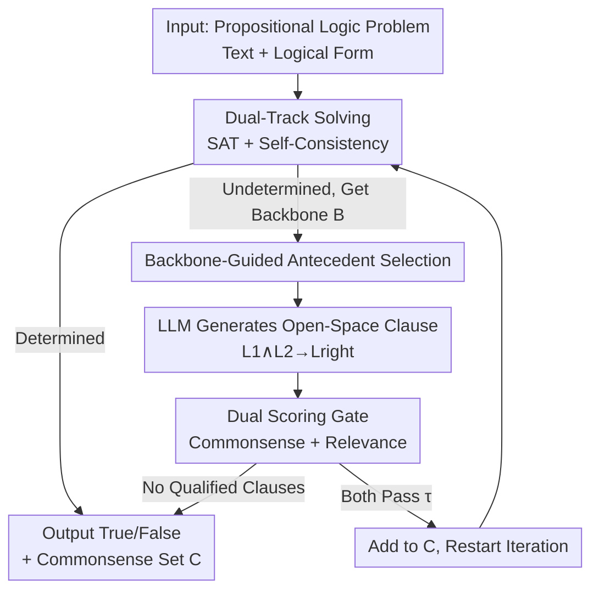

# A Balanced Neuro-Symbolic Approach for Commonsense Abductive Logic

**Conference**: ICLR 2026  
**OpenReview**: [https://openreview.net/forum?id=RCsBoUr72G](https://openreview.net/forum?id=RCsBoUr72G)  
**Code**: TBD  
**Area**: LLM Reasoning / Neuro-Symbolic / Abductive Reasoning  
**Keywords**: Abductive reasoning, Commonsense reasoning, Neuro-symbolic, SAT solver, Self-consistency

## TL;DR
ARGOS facilitates bidirectional information exchange between LLMs and SAT solvers: the solver outputs "confirmed true literals" (the backbone), which the LLM uses to hypothesize missing commonsense clauses. These candidates are then filtered by scorers and fed back into the solver. This iterative completion of logic problems lacking explicitly stated commonsense premises outperforms pure neural or symbolic methods by up to 13% across multiple datasets.

## Background & Motivation

**Background**: A promising direction for rigorous logical reasoning with LLMs is "neuro-symbolic"—where the LLM translates natural language into formal logic and a SAT or logic solver performs deduction. Solvers are logically reliable and efficient, compensating for the LLM's weaknesses in "proof planning."

**Limitations of Prior Work**: Such systems are inherently **deductive**—the solver only utilizes premises **explicitly stated** in the text. If a piece of "universally known" commonsense is missing, the solver returns "unknown." A children's reading problem illustrates this: if a question asks if an Arctic fox turns white to stay warm by absorbing sunlight, the solver cannot conclude an answer without the missing commonsense premise that "white surfaces reflect sunlight." Humans instinctively perform **abductive reasoning** to supply $\text{turns\_white}(\text{fox},\text{winter}) \to \text{reflects}(\text{fox},\text{sun})$.

**Key Challenge**: Existing attempts to use LLMs for filling commonsense gaps restrict the search space too severely. Toroghi et al. (LLM-Tres) only perform exhaustive single-step modus ponens on existing propositions; Liu et al. (Logic-of-Thought) only allow LLMs to produce clauses that "could already be deduced from existing logic"—but **deducible clauses provide no new information**, while real-world problems often lack propositions entirely absent from the premise text. A narrow search space fails to find useful commonsense, while an open space risks combinatorial explosion or the introduction of irrelevant/incorrect clauses that corrupt the logic.

**Goal**: To perform abduction without strictly limiting the structure and content of commonsense clauses, allowing for the introduction of new propositions while maintaining controllable search costs and logical integrity.

**Core Idea**: Use feedback from the **logical solver** (specifically the "backbone" of the SAT problem) to guide the LLM's commonsense search. The solver informs the LLM which literals are confirmed true and which entities are most relevant. The LLM generates candidate commonsense clauses, which are then vetted by two scorers (commonsense and relevance), iteratively completing the problem. This system is named **ARGOS** (Abductive Reasoning with Generalization Over Symbolics).

## Method

### Overall Architecture

ARGOS transforms an "underdetermined" propositional logic problem into a solvable one through **iterative completion**. Each round consists of two phases: ① **Determination**—attempting an answer using both a SAT solver and LLM self-consistency; if successful, the process terminates. ② **Expansion**—if unresolved, the LLM uses the backbone from the solver to generate a new commonsense clause. If the clause passes the gatekeepers, it is added to the premises for the next iteration. 

Key concepts: A problem consists of premises $P=\{P_1,\dots,P_K\}$ and a query $Q$. The goal is to determine if $P\vdash Q$ or $P\vdash\neg Q$. In **abductive problems**, $P$ implies neither $Q$ nor $\neg Q$. A set of commonsense propositions $C$ must be added such that $(P\wedge C)\vdash Q$ or $(P\wedge C)\vdash\neg Q$. The **backbone** of $P$ is defined as $\text{backbone}(P)=\{L\in\mathcal{L}\mid P\vdash L\}$, representing literals that are undeniably true under current premises. The paper proves (Appendix A) that as long as the added $C$ is consistent with $P$, the final answer does not depend on the specific $C$ chosen, providing a logical foundation for iterative completion.

### Key Designs

**1. Dual-Track Solving and Adaptive Self-Consistency Budget: Focusing Compute on Harder Problems**

In each round, ARGOS first uses `sat_solve` to check if $(P\wedge C)$ entails $Q$ or $\neg Q$. If unsuccessful, it obtains the backbone $B$. Simultaneously, it uses $k$-shot self-consistency (experimental $k=5$) for LLM voting. If the vote proportion exceeds a threshold $\gamma$, it concludes. Crucially, $\gamma$ **decays**: starting at $\gamma=1$ (requiring unanimity), it decreases as $\gamma\leftarrow\gamma-\alpha$ ($\alpha=0.1$) per round. This implies "high trust in LLMs initially, decreasing as iterations progress." This mechanism caps the CoT cost at $\text{cost}<k\,\frac{\gamma-0.5}{\alpha}$ and concentrates compute on difficult, information-deficient problems.

**2. Backbone-Guided Antecedent Selection: Narrowing Search via Solver Feedback**

To prevent combinatorial explosion in the open search space, ARGOS selects antecedents only from the backbone literals, constructing clauses of the form $L_1\wedge L_2\to L_{right}$ where $L_1,L_2\in B$. Selection is ordered by an **entity overlap score**: $\text{score}_B(L)=\#\{L'\in B\mid L'\text{ shares entities with }L\}$. High-scoring literals are prioritized, based on the intuition that relevant information typically focuses on the problem's central entities.

**3. LLM Generation in Open Space: Abducing Novel Propositions**

Unlike previous works, ARGOS allows `llm_generate` to produce a right-hand literal $L_{right}$ that introduces brand **new** variables or propositions not present in the original premises. This is the key to solving real-world abduction tasks. The authors chose **forward chaining** (similar to CoT) over goal-oriented backward chaining because prompting LLMs to "infer forward from the known" is significantly more stable than recursive backtracking.

**4. Dual Scoring Gate: Commonsense + Relevance to Prevent Logic Contamination**

Candidate clauses are not automatically accepted. ARGOS uses the LLM to provide two scores: `llm_commonsense_score` (Is $L_1\wedge L_2\to L_{right}$ true without context?) and `llm_relevance_score` (Is it relevant to the current problem?). Both must exceed a threshold $\tau$ (experimental $\tau=0.3$). If a round fails to find a qualified clause, the system reverts to the best guess from the LLM's self-consistency voting.

## Key Experimental Results

**Models**: Llama3-8B (L8B), Llama3-70B (L70B), Mistral-7B (M7B). SAT solver: Cadical. Average CoT calls per problem $\leq$ 20 to align with 20-shot self-consistency and LoT-20.

### Main Results

Binary (True/False) Accuracy using Llama3-8B:

| Dataset (L8B) | SC-20 | COT | SAT-LM | LoT-20 | LLM-Tres | ARGOS |
|--------------|-------|-----|--------|--------|----------|-------|
| FOLIO | 71% | 68% | 43% | 69% | 63% | **81%** |
| CLUTRR | 69% | 68% | 50% | 70% | 51% | **76%** |
| QUAIL | 68% | 65% | 53% | 56% | 60% | **82%** |
| ProntoQA | 95% | 90% | 50% | 97% | 83% | 97% |

ARGOS outperforms the strongest baseline by up to 13% (QUAIL). Purely symbolic methods (SAT-LM, LoT-20, LLM-Tres) fail significantly on tasks requiring implicit knowledge.

### Ablation Study

Impact of core components (FOLIO, Llama3-8B):

| Configuration | Accuracy | Description |
|------|--------|------|
| ARGOS (Full) | 81% | Complete model |
| ARGOS − No T | 79% | Without scoring threshold; taking first sampled clause |
| ARGOS − No BB | 79% | Without backbone tracking; random variable selection |
| ARGOS − No Both | 76% | Both components removed |
| SC-20 (Baseline) | 71% | Strongest baseline |

### Key Findings

- **Synergy > Sum of Parts**: Removing both scoring and the backbone (76%) results in a larger drop than removing either individually (79% each), proving that "backbone guidance" (search direction) and "scoring" (verification) are complementary.
- **Adaptive Compute**: As iterations increase, the accuracy of standard self-consistency drops (indicating harder problems), while ARGOS remains steady, proving the threshold decay effectively allocates effort.
- **Low Contamination**: On CLUTRR with L70B, ARGOS flipped answers from incorrect to correct 112 times, while only flipping from correct to incorrect 35 times.
- **Translation Robustness**: Even with imperfect logic translation, ARGOS maintains superior performance over baselines, suggesting that decoupling "translation" and "reasoning" is a viable strategy.

## Highlights & Insights

- **Navigating LLM Search via Solver "By-products"**: While others only use SAT solvers for the final answer, ARGOS uses the failed state (the backbone) to guide the search for missing premises.
- **Decaying Threshold as a Low-Cost Resource Manager**: A simple decay rule $\gamma\leftarrow\gamma-\alpha$ eliminates the need for a separate complexity predictor, ensuring more compute for harder tasks.
- **Balance of Open Search and Dual-Gating**: Allowing new propositions (high ceiling) while using commonsense + relevance gates (high floor) provides a controllable framework for abduction.

## Limitations & Future Work

- **Dependence on Logit Output**: SC and scoring require probability outputs, excluding many closed-source models (e.g., GPT-4).
- **Sub-optimal Commonsense Scoring**: The `llm_commonsense_score` is not infallible and may occasionally allow incorrect clauses.
- **Reliance on Logic Translation**: The pipeline depends on the quality of natural-language-to-logic translation, though it shows some robustness.
- **Future Directions**: Integrating external knowledge bases for cross-validation and extending the backbone guidance to First-Order Logic (FOL) rather than grounding to propositional logic.

## Related Work & Insights

- **vs Chain-of-Thought / Self-Consistency**: These are purely neural; they struggle with proof planning. ARGOS provides logical structure through the solver.
- **vs SAT-LM / Logic-LM**: These are purely symbolic; they return "unknown" when commonsense is missing. ARGOS fills these gaps.
- **vs Logic-of-Thought**: LoT produces redundant, already deducible clauses. ARGOS abduces truly novel information.
- **vs LLM-Tres**: LLM-Tres is restricted to a narrow, exhaustive search of existing predicates. ARGOS supports open-space generation.

## Rating
- Novelty: ⭐⭐⭐⭐ Uses SAT backbone as feedback for open-space abduction with a dual-gated framework.
- Experimental Thoroughness: ⭐⭐⭐⭐ 8 datasets across 3 models, including ablation and robustness tests.
- Writing Quality: ⭐⭐⭐⭐ Technical concepts are clearly explained using the recurring Arctic fox example.
- Value: ⭐⭐⭐⭐ Advances neuro-symbolic reasoning from "pure deduction" to "abduction," offering a practical paradigm for real-world logic tasks.

<!-- RELATED:START -->

## Related Papers

- [\[AAAI 2026\] NeSTR: A Neuro-Symbolic Abductive Framework for Temporal Reasoning in Large Language Models](../../AAAI2026/llm_reasoning/nestr_a_neuro-symbolic_abductive_framework_for_temporal_reasoning_in_large_langu.md)
- [\[ICLR 2026\] VERICOT: Neuro-Symbolic Chain-of-Thought Validation via Logical Consistency Checks](vericot_neuro-symbolic_chain-of-thought_validation_via_logical_consistency_check.md)
- [\[ACL 2025\] Commonsense Abductive Reasoning using Knowledge from Multiple Sources](../../ACL2025/llm_reasoning/commonsense_abductive_reasoning_using_knowledge_from_multiple_sources.md)
- [\[ACL 2026\] Accurate Legal Reasoning at Scale: Neuro-Symbolic Offloading and Structural Auditability for Robust Legal Adjudication](../../ACL2026/llm_reasoning/accurate_legal_reasoning_at_scale_neuro-symbolic_offloading_and_structural_audit.md)
- [\[ICLR 2026\] ProofFlow: A Dependency Graph Approach to Faithful Proof Autoformalization](proofflow_a_dependency_graph_approach_to_faithful_proof_autoformalization.md)

<!-- RELATED:END -->
