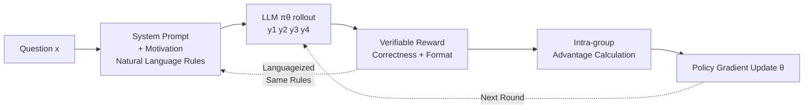

# A Simple "Motivation" Can Enhance Reinforcement Finetuning of Large Reasoning Models

**Conference**: ICLR 2026  
**OpenReview**: [https://openreview.net/forum?id=3owSlsYDQf](https://openreview.net/forum?id=3owSlsYDQf)  
**Code**: To be confirmed  
**Area**: LLM Reasoning / Reinforcement Learning  
**Keywords**: RLVR, In-context Learning, Reward Function Description, GRPO, Verifiable Reward, Exploration Efficiency  

## TL;DR
MeRF writes verifiable reward functions into prompts as a "rulebook" in natural language. By explicitly informing the model of optimization goals during RL training, it moves away from blind trial-and-error, significantly outperforming RLVR baselines in logic and mathematical reasoning tasks.

## Background & Motivation
**Background**: Reinforcement Learning with Verifiable Rewards (RLVR) has become a mainstream paradigm for enhancing large reasoning models. It treats reasoning as sequential decision-making and optimizes models using rule-verifiable rewards (e.g., answer matching ground truth, code passing unit tests), as exemplified by DeepSeek-R1 and OpenAI-o1.

**Limitations of Prior Work**: RLVR follows the "trial-and-error" essence of traditional RL. During training, the model is **blind to optimization goals** and must slowly piece together task patterns from fragmented, sparse reward signals through repeated rollouts, sampling, and reward comparison. When the reward space is sparse and desired behaviors are hard to reach, models often fall into the paradox of "needing to learn something they don't know how to do or even know exists," requiring massive compute or converging to local optima via reward hacking (e.g., only earning format scores).

**Key Challenge**: On one hand, RLVR reward functions are **rule-verifiable** and naturally describable in natural language. On the other hand, LLMs possess strong **in-context learning** (ICL) capabilities. Therefore, **why not tell the model the "scoring rules" directly during training?** Similar to human learning, understanding rules and goals before starting allows effort to align with expectations, leading to faster and more accurate learning.

**Goal**: To inject information about the reward function into the training process more directly without changing the RL algorithm or increasing training costs, allowing the model to "know the rules" during generation and thus improve RL finetuning efficiency and effectiveness.

**Core Idea**: **Writing the reward function as natural language and inserting it into the prompt as a "motivation."** MeRF directly injects scoring rules (correctness score + format score) as in-context motivation into the system prompt during training, driving the model through both intrinsic motivation and extrinsic rewards.

## Method

### Overall Architecture
MeRF (Motivation-enhanced Reinforcement Finetuning) makes only one change to the standard RLVR pipeline: during training rollouts, a natural language description (motivation) of the reward function is appended to the system prompt. The rest—sampling a group of responses via GRPO, scoring with a rule-based reward function, calculating advantage, and updating $\theta$ via policy gradient—remains unchanged. The key intuition is that while standard RLVR allows the model to perceive the reward space only indirectly through parameter updates, MeRF provides global awareness of the reward space at the moment of generation, transforming "indirect black-box learning" into a dual-channel alignment of "intrinsic motivation + extrinsic rewards."

### Key Designs

**1. In-context Motivation Injection.** The core of MeRF lies in translating verifiable rewards into natural language within the system prompt. For instance, in K&K logic puzzles, the reward includes a Correctness Score (Correct answer +2, intelligible but wrong -1.5, unparsable/incomplete -2) and a Format Score (+1 for strict adherence to `<think>...</think><answer>...</answer>`, otherwise -1). These "Evaluation Scoring Rules" are written verbatim into the prompt. The model optimizes against these rules during generation, aligning the distribution $\pi_\theta(\cdot|x)$ directly with the goal $\arg\max_\theta \mathbb{E}[R(y)]$. This step introduces no extra parameters or changes to the reward function itself.

**2. Dual-Drive Alignment.** In standard RLVR, the model is guided only by external rewards, learning only when a rollout happens to achieve a high score. MeRF drives the model with both intrinsic motivation (rule awareness in prompts) and extrinsic rewards (actual scoring). Control experiments (Figure 2 Right) reveal that the base model does not gain performance by merely "reading rules" without training. Significant gains (27%/25% over RLVR) appear only when motivation is used during training. The conclusion is that **performance gains stem primarily from the training process rather than inference-time prompting.** Motivation functions as a "directional guide" for exploration in early training.

**3. Exploration Capability Amplification.** MeRF improves RL exploration dynamics. Using pass@k and entropy metrics, the authors show that MeRF maintains higher entropy throughout training compared to RLVR. While MeRF entropy is slightly lower initially (structured exploration focusing on promising regions), RLVR entropy rapidly decays and collapses to sub-optimal solutions (e.g., only format scores). MeRF maintains exploration capability via global reward space information. As GRPO uses a rollout group size of 8, the sustained improvement in pass@8 is crucial: the training process **gradually amplifies** the initial pass@8 advantage from motivation, making the model more likely to sample positive reward instances for optimization.

**4. Motivation Consistency and Adversarial Robustness.** The authors explored how alignment between motivation and the actual reward function affects performance across three tiers: Ground-Truth, Suboptimal (incomplete correctness description), and Adverse (complete but inverted scores to mislead the model). Results show that higher consistency leads to better performance. Paradoxically, even with Adverse motivation—which initially causes performance drops—the **model learns to "discount or invert" the misleading signal** after several RL rounds. It eventually surpasses the RLVR baseline, suggesting that "completeness" of the reward structure is more valuable than "correctness," as RL training grants models the adaptability to counter erroneous prompts.

## Key Experimental Results

### Main Results (K&K Logic Puzzles, by difficulty/crowd size, **without motivation during verification**)

| Model | Avg (3-7 ppl, in-domain) | 2 ppl (OOD) | 8 ppl (OOD) | Total Avg |
|------|:---:|:---:|:---:|:---:|
| Qwen2.5-7B-Instruct (Baseline) | 0.10 | 0.43 | 0.00 | 0.13 |
| +RLVR (Baseline) | 0.51 | 0.71 | 0.28 | 0.51 |
| **+MeRF (Ours)** | **0.65** | **0.76** | **0.39** | **0.63** |
| Qwen2.5-14B-Instruct (Baseline) | 0.23 | 0.63 | 0.06 | 0.27 |
| +RLVR (Baseline) | 0.75 | 0.90 | 0.42 | 0.72 |
| **+MeRF (Ours)** | **0.83** | **0.99** | **0.65** | **0.83** |
| DeepSeek-R1-Distill-Llama-8B + MeRF | **0.88** | **0.99** | **0.64** | **0.86** |

MeRF outperforms RLVR across 6 models of varying scales and families. The 14B version matches commercial-grade performance, with significant improvements in OOD scenarios.

### Ablation Study (MATH Reasoning, Qwen2.5-7B-Base, pass@k)

| Dataset | RLVR pass@1 | MeRF pass@1 | RLVR pass@8 | MeRF pass@8 |
|------|:---:|:---:|:---:|:---:|
| AIME24 | 16.7 | **20.0** | 26.7 | **30.0** |
| AIME25 | 6.7 | 6.7 | 20.0 | **26.7** |
| AMC23 | 47.5 | **55.0** | 72.5 | **77.5** |
| MATH500 | 62.6 | **65.4** | 82.6 | **85.6** |
| **Average** | 33.38 | **36.78 (+3.40)** | 50.45 | **54.95 (+4.50)** |

Average gains for pass@1/2/4/8 were +3.40 / +1.13 / +3.50 / +4.50 respectively.

### Key Findings
- **High Training Efficiency**: On K&K, MeRF’s pass@4/8 at step 140 exceeds RLVR's final results at step 280. 
- **Gains from Training, Not Inference**: The gap between providing motivation at inference versus not is only 2-4%, whereas MeRF gains 25-27% over RLVR.
- **Negligible Training-Validation Gap**: Training with motivation and validating without it yields comparable results, indicating strong generalization.
- **No Entropy Collapse**: MeRF maintains higher entropy and correct ratios throughout training, avoiding the rapid collapse to sub-optimal solutions seen in RLVR.
- **Adversarial Adaptation**: Models can learn to ignore or invert misleading "Adverse" motivation through RL training, still eventually outperforming the baseline.

## Highlights & Insights
- **Minimalist yet Effective**: The method essentially only "changes the prompt"—zero extra parameters, zero extra compute, and no changes to the RL algorithm—yet yields consistent, significant gains.
- **Reinterpreting RLVR Information Flow**: The authors attribute RLVR's inefficiency to the model's "blindness" to the reward space and exploit the fact that RLVR rewards are verifiable $\implies$ verbalizable $\implies$ usable as in-context signals.
- **Robust Mechanism Analysis**: Uses pass@k amplification and entropy maintenance to explain efficiency, particularly how pass@8 corresponds to GRPO group sizes.
- **Adversarial Experiments**: Reveals the robustness and adaptive capacity of LLMs to incorrect contexts during RL, a valuable independent observation.

## Limitations & Future Work
- **Static Motivation**: Motivation remains fixed throughout training; future work could explore **dynamic motivation** that adjusts in detail or focus based on training stages.
- **Weak Generalization Models**: Smaller models (e.g., 1.5B) struggle to utilize in-context motivation effectively during RLVR.
- **Dependence on Verbalizable Rewards**: Prerequisite is that reward functions must be clearly describable; this becomes a bottleneck for implicit preference or complex human feedback.
- **Prompt Length Cost**: Including full scoring rules in every training sample increases context length, which might impact long-context task overhead.

## Related Work & Insights
- **RL for LLMs**: Transitions from RLHF (human preference alignment) to RLVR (verifiable success criteria). This work suggests RLVR has underutilized LLM in-context capabilities.
- **In-context Learning**: While ICL typically involves zero/few-shot prompting without gradient updates, this work combines ICL with RL finetuning—**using prompt-injected rule information to guide the direction of gradient updates.**
- **Insight**: For any RL scenario where the goal is verbalizable (e.g., code, tool use, agents), one should consider injecting reward specifications as in-context motivation to convert "post-hoc feedback" into "prior cognition."

## Rating
- **Novelty**: ⭐⭐⭐⭐ — Minimalist but novel; reinterpreting RLVR through the lens of verbalized reward flow is insightful.
- **Experimental Thoroughness**: ⭐⭐⭐⭐ — Covers multiple models and tasks with multi-dimensional analysis (pass@k, entropy, adversarial); lacks broader tasks like code generation.
- **Writing Quality**: ⭐⭐⭐⭐ — Clear motivation (effective human learning analogy) and logical progression of analysis.
- **Value**: ⭐⭐⭐⭐ — Practically zero-cost, plug-and-play improvement for RLV efficiency with broad applicability.

<!-- RELATED:START -->

## Related Papers

- [\[ICLR 2026\] GPG: A Simple and Strong Reinforcement Learning Baseline for Model Reasoning](gpg_a_simple_and_strong_reinforcement_learning_baseline_for_model_reasoning.md)
- [\[ICLR 2026\] Conditional Advantage Estimation for Reinforcement Learning in Large Reasoning Models](conditional_advantage_estimation_for_reinforcement_learning_in_large_reasoning_m.md)
- [\[ICLR 2026\] Dynamics-Predictive Sampling for Active RL Finetuning of Large Reasoning Models](dynamics-predictive_sampling_for_active_rl_finetuning_of_large_reasoning_models.md)
- [\[ICLR 2026\] Learning What Reinforcement Learning Can't: Interleaved Online Fine-Tuning for Hardest Questions](learning_what_reinforcement_learning_cant_interleaved_online_fine-tuning_for_har.md)
- [\[ACL 2026\] Revisiting Entropy in Reinforcement Learning for Large Reasoning Models](../../ACL2026/llm_reasoning/revisiting_entropy_in_reinforcement_learning_for_large_reasoning_models.md)

<!-- RELATED:END -->
