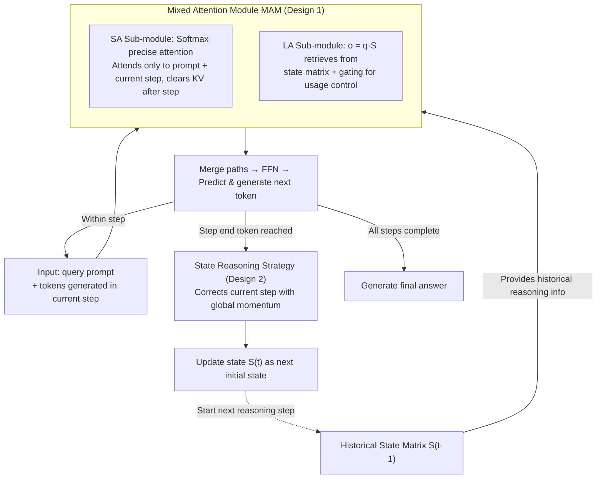

# A State-Transition Framework for Efficient LLM Reasoning

**Conference**: ICLR 2026  
**arXiv**: [2602.01198](https://arxiv.org/abs/2602.01198)  
**Code**: Available  
**Area**: Model Compression  
**Keywords**: efficient reasoning, linear attention, state transition, KV cache, long CoT  

## TL;DR
This paper proposes an efficient reasoning framework that models the LLM reasoning process as a state-transition process. By using Linear Attention to compress information from historical reasoning steps into a state matrix, the framework reduces attention complexity from $O(C^2)$ to $O(C)$ and KV cache from $O(C)$ to $O(1)$, while maintaining reasoning capabilities without shortening the CoT sequence. An additional momentum strategy is introduced to mitigate the "overthinking" problem caused by noisy reasoning steps.

## Background & Motivation
**Background**: Long CoT (e.g., o1, R1) significantly enhances the reasoning capabilities of LLMs. However, the quadratic complexity of Transformer attention makes the computational and memory costs of long CoT extremely high.

**Limitations of Prior Work**: Existing efficient reasoning methods mainly compress CoT sequences (shortening, token pruning, rewriting), which contradicts test-time scaling—compressing CoT tends to damage reasoning performance.

**Key Challenge**: Efficiency requires reduced computation, but reasoning capability requires preserving the complete reasoning chain. Compressing CoT content versus compressing CoT attention computation are two different objectives.

**Goal**: How to reduce the computational and memory overhead of reasoning without shortening the CoT?

**Key Insight**: In each reasoning step, useful reasoning information (conclusions) is significantly sparser than linguistic information (syntax, phrasing). A linear attention state matrix can be used to record only reasoning information, discarding redundant linguistic details.

**Core Idea**: Enable each token in a reasoning step to efficiently access historical reasoning information via a linear attention state matrix, rather than explicitly attending to all historical tokens.

## Method

### Overall Architecture
The paper aims to reduce the attention computation and memory overhead of long reasoning chains **without shortening the CoT**. This is based on the observation that the "conclusive" information in a reasoning step is sparse, while most tokens handle syntax and phrasing. Thus, it is unnecessary for the current step to attend to thousands of historical tokens individually.

The approach involves segmenting a long CoT into a sequence of **reasoning steps** based on high-entropy transition tokens (e.g., "Alternatively", "Wait"). The softmax attention in each LLM layer is replaced with a **Mixed Attention Module (MAM)**, which treats the "currently being generated step" and "completed historical steps" through two different paths: the current step still utilizes precise softmax attention, while information from completed steps is compressed into a fixed-size **state matrix** $S_t$ via linear attention. Each token in the current step retrieves historical information with a single operation $\mathbf{o}=\mathbf{q}\cdot S_t$. Upon completing a step, a **state reasoning strategy** applies momentum correction to the state update before merging it into $S_t$, serving as the initial state for the next step. The CoT can extend infinitely while the state matrix size remains constant.

### Key Designs

**1. Mixed Attention Module (MAM): Replacing Softmax Attention with Dual SA+LA Paths**

The conflict lies in the requirement for precise attention within the current step to ensure local correctness, while global historical lookback is costly. MAM decouples these into two paths. The SA sub-module retains the original softmax attention but restricts each token to only attend to the query prompt and tokens within the current reasoning step—once a step is finished, its vectors in the KV cache are cleared. Consequently, precise attention always operates within the range of a single step. Historical info is handled by the LA sub-module, which maintains a state matrix $S_t=\sum_{i=1}^{t}\mathbf{k}_i^\top \mathbf{v}_i$ by accumulating the outer products of keys/values from completed steps. Current tokens use query vectors for $\mathbf{o}=\mathbf{q}\cdot S_t$ to retrieve historical reasoning information, followed by a sigmoid **gating** $\sigma(W_g h)$ to control the influence (earlier tokens rely more on history; later ones less). The outputs are combined and passed to linear layers and FFNs. This reduces attention complexity to $O(C)$ and KV cache to $O(1)$ ($C$ is CoT length). Linear attention is chosen over CNN/Q-Former for its compatibility as a softmax variant and its property where state updates are equivalent to gradient descent steps.

**2. State Reasoning Strategy: Correcting Noisy Steps with Global Momentum**

Long CoTs inevitably include deviated or redundant steps. Directly accumulating these into $S_t$ can mislead subsequent retrieval and exacerbate overthinking. Utilizing the equivalence between LA and Test-Time Training (TTT)—where state updates are essentially gradient descent—the authors view the state change $\nabla_t=S_t-S_{t-1}$ from step $t$ as a "reasoning direction (gradient)". Since noisy steps often deviate from the general trend, the historical average direction $\bar{\nabla}_{t-1}=\frac{1}{t-1}\sum_{i<t}\nabla_i$ is accumulated via momentum. After completing step $t$, the current direction is pulled back toward the global trend:

$$\hat{\nabla}_t=(1-\alpha)\nabla_t+\alpha\bar{\nabla}_{t-1},\qquad \alpha=\max\{\alpha_{\max},\tfrac{t}{|T|}\}$$

The state is then updated using $\hat{\nabla}_t$ instead of $\nabla_t$: $S_t=S_{t-1}+\hat{\nabla}_t$. The correction coefficient $\alpha$ increases linearly as reasoning progresses until it reaches $\alpha_{\max}$—minimizing correction early on to encourage exploration and increasing it later as the global trend becomes reliable. This migrates classic gradient noise mitigation to reasoning states, grounded in TTT theory and proven effective on difficult tasks like AIME.

### Loss & Training
To preserve the reasoning capacity of the base model, **only the LA sub-modules (using LoRA) and special tokens marking thought patterns are updated** during training; all other weights are frozen. CoT sequences are segmented into reasoning steps via high-entropy tokens and clustered into thought patterns, with each step wrapped in special tokens for tracking. The model is trained using a dual loss $\mathcal{L}=\mathcal{L}_{AR}+\beta\mathcal{L}_{KD}$: the auto-regressive loss $\mathcal{L}_{AR}=-\log P(A,T\mid Q)$ ensures generation quality, while the knowledge distillation loss $\mathcal{L}_{KD}=\mathrm{KL}(\hat{P}\,\|\,P)$ uses the distribution $\hat{P}$ of the original full-attention base model to regularize the modified model $P$, forcing the LA sub-module to learn global reasoning information and preventing distribution drift. Data consists of 95K high-quality mathematical CoT samples from OpenR1-Math-220K. The backbone is the Qwen2.5 series (initialized with corresponding DeepSeek-R1 distilled versions), spanning 1.5B to 14B parameters.

## Key Experimental Results

### Main Results (vs. Efficient Reasoning Baselines)

| Method | Type | GSM8K Acc | MATH-500 Acc | Reasoning Latency↓ |
|------|------|-----------|-------------|---------|
| Base model | Full Attention | 80.1 | 78.8 | Baseline |
| LightThinker | CoT Compression | Lower | Lower | Low |
| INFTYTHINK | Abstractive Comp. | Lower | Lower | Low |
| H2O | KV cache Pruning | Low | Low | Low |
| **Ours** | **State Transition** | **≥Base** | **≥Base** | **Significantly Reduced** |

### Key Findings
- Reasoning performance is maintained or improved: The state-transition framework matches or exceeds the full-attention base model across multiple benchmarks.
- Significant latency reduction: The advantage grows with CoT length due to the constant state matrix size.
- Effective momentum: Ablations show significant accuracy improvements on difficult problems (e.g., AIME).
- Consistent results across 1.5B, 7B, and 14B scales.
- Knowledge distillation is crucial for training LA sub-modules.

## Highlights & Insights
- **"Shorten Attention, Not CoT" Strategy**: This avoids the tradeoff between efficiency and reasoning capacity by keeping the full chain but making attention calculation local per step.
- **Momentum Correction via TTT Perspective**: Leveraging the theoretical property that linear attention is equivalent to online learning, the authors naturally introduce momentum to suppress noise, which is both theoretically elegant and experimentally effective.
- **Friendly to Test-Time Scaling**: The framework allows CoT to extend indefinitely with only linear growth in computation and constant memory per layer.

## Limitations & Future Work
- The expressivity of linear attention may be inferior to softmax attention—complex cross-step dependencies might be lost in the state matrix.
- Segmentation of reasoning steps via high-entropy tokens might lack precision and depends on data quality.
- Evaluation is limited to mathematical reasoning; efficacy in other domains like coding or scientific reasoning is unknown.
- Initialization requires DeepSeek-R1 distilled versions, increasing training pipeline complexity.

## Related Work & Insights
- **vs. LightThinker (CoT Compression)**: LightThinker uses special tokens to compress information but remains within the softmax attention framework; Ours replaces attention with linear attention for more thorough efficiency.
- **vs. TTT (Test-Time Training)**: Ours utilizes the theoretical perspective of TTT for linear attention but applies it to reasoning efficiency rather than performance enhancement.
- **vs. KV Cache Compression (H2O, SapLLM)**: Those methods selectively retain KV pairs based on attention scores, potentially losing critical info; Ours ensures intra-step precision and historical efficiency via the dual-path (SA+LA) design.

## Rating
- Novelty: ⭐⭐⭐⭐⭐ The state-transition modeling and mixed attention design are highly novel.
- Experimental Thoroughness: ⭐⭐⭐⭐ Covered multiple scales, 7 benchmarks, and various baselines.
- Writing Quality: ⭐⭐⭐⭐ Clear framework, though math-heavy.
- Value: ⭐⭐⭐⭐⭐ Provides a fundamental solution for scaling long CoT reasoning efficiently.

<!-- RELATED:START -->

## Related Papers

- [\[ICLR 2026\] Thinking-Free Policy Initialization Makes Distilled Reasoning Models More Effective and Efficient Reasoners](thinking-free_policy_initialization_makes_distilled_reasoning_models_more_effect.md)
- [\[ICLR 2026\] The Path of Least Resistance: Guiding LLM Reasoning Trajectories for Efficient Consistency](the_path_of_least_resistance_guiding_llm_reasoning_trajectories_for_efficient_co.md)
- [\[ICLR 2026\] ChainGPT: Dual-Reasoning Model with Recurrent Depth and Multi-Rank State Updates](chaingpt_dual-reasoning_model_with_recurrent_depth_and_multi-rank_state_updates.md)
- [\[ICLR 2026\] CaTS: Calibrated Test-Time Scaling for Efficient LLM Reasoning](cats_calibrated_test-time_scaling_for_efficient_llm_reasoning.md)
- [\[ICML 2026\] Beyond Test-Time Memory: State-Space Optimal Control for LLM Reasoning](../../ICML2026/llm_reasoning/beyond_test-time_memory_state-space_optimal_control_for_llm_reasoning.md)

<!-- RELATED:END -->
