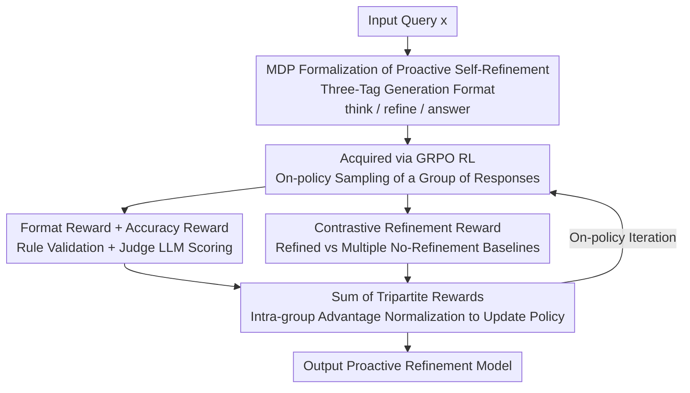

# A Stitch in Time Saves Nine: Proactive Self-Refinement for Language Models

**Conference**: ICLR2026  
**OpenReview**: [https://openreview.net/forum?id=0GaCfBRFnf](https://openreview.net/forum?id=0GaCfBRFnf)  
**Code**: https://github.com/JinyiHan99/Proactive-Self-Refine-in-LLMs/  
**Area**: LLM Reasoning  
**Keywords**: Self-Refinement, Reinforcement Learning, GRPO, In-process Refinement, Reward Design

## TL;DR
PASR uses Reinforcement Learning (GRPO) to train LLMs to proactively decide "whether, when, and how" to refine their reasoning trajectories **during the generation process** (rather than post-hoc rework). By designing a "contrastive refinement reward" to encourage valuable corrections, it reduces average token consumption by 41.6% while improving accuracy by 8.2% on Qwen3-8B compared to standard generation.

## Background & Motivation

**Background**: Self-refinement is considered a crucial direction for improving LLM output quality. Existing methods mostly follow a "post-hoc" (patch-after-failure) paradigm: generate a complete answer first, then revise it round by round based on feedback. Implementations typically fall into two categories—one relies on carefully designed prompts to explicitly command the model to "check and correct the previous output," while the other relies on SFT on synthetic "inferior answer → improved answer" pairs to teach the model automatic rewriting.

**Limitations of Prior Work**: These post-hoc methods are inherently **reactive** and lack the proactive judgment capability of "whether, when, and how" to refine. The paper breaks down these pain points:

- **Whether**: Refinement is often applied mindlessly after the initial generation across a fixed number of iterations, yet the optimal number of rounds is unclear and often requires extensive hyperparameter tuning.
- **When**: Errors in the initial generation phase propagate through subsequent steps. Waiting until the entire generation is finished before correcting increases the difficulty of rectification—"A stitch in time saves nine."
- **How**: These methods highly depend on external feedback (tool evaluation, auxiliary models), and inappropriate feedback can actually degrade performance.

**Key Challenge**: The goal is to enable models to autonomously judge whether to change and where to change based on the context **during the generation process**. While reasoning models like DeepSeek-R1 and o1 show some signs of "in-process correction," these behaviors are neither explicitly designed for proactive self-refinement nor systematically evaluated for their impact on output quality, leaving the underlying mechanism unclear.

**Key Insight**: A direct idea is to "train the model with demonstration data of proactive refinement," but the authors point out two fatal flaws: ① Demonstration data is hard to construct—the "optimal timing for refinement during generation" is difficult to define, and distillation from stronger LLMs is impractical; ② Mere imitation is insufficient for models to truly acquire this capability; it is difficult for models to generalize adaptive refinement to unseen tasks, sometimes leading to performance degradation.

**Core Idea**: Use **Reinforcement Learning** instead of imitation to acquire this capability. Ours proposes PASR (ProActive Self-Refinement), which allows the model to explore "whether, when, and how" to refine through on-policy rollouts. It uses a **contrastive reward** to tell the model "what constitutes an effective refinement"—providing positive rewards only when refinement brings measurable gains, and otherwise penalizing redundant or harmful modifications.

## Method

### Overall Architecture

PASR formalizes "proactive self-refinement" as a sequential decision-making (MDP) problem and uses GRPO reinforcement learning for training. Given an input query $x$, the model generates an intermediate trajectory $z=(z_1,\dots,z_T)$ while choosing between two actions at each step: **content generation** $a_{\text{gen}}$ (pushing the reasoning one step forward by appending to the trajectory) or **trajectory refinement** $a_{\text{refine}}$ (instead of advancing, looking back at generated content to identify weaknesses and insert corrections/clarifications). The final answer $y'$ is derived from the complete trajectory.

During training, the model's output is forced into a structured format consisting of three tags: `<think> / <refine> / <answer>` (guided by a system prompt during rollout). A total reward $R_{y'}$ is calculated for each sampled response, and the policy is updated using GRPO with intra-group advantage normalization. The total reward is the sum of three parts: format reward, accuracy reward, and the critical "contrastive refinement reward." The pipeline is illustrated below:

### Key Designs

**1. MDP Formalization and Three-Tag Generation Format: Making In-process Refinement a Generatable Structure**

Addressing the "When" pain point of post-hoc methods where errors have already propagated, PASR moves refinement into the generation process itself. It first formalizes the task as an MDP: at step $i$, the state $s_i$ is determined by input $x$ and the generated trajectory $z_{1:i-1}$, the action $a_i$ is chosen from $\{a_{\text{gen}}, a_{\text{refine}}\}$, and the training goal is to learn a policy that maximizes expected refinement rewards $\max_\pi \sum_x \mathbb{E}_{y'\sim\pi(\cdot|x)}[R_{y'}]$. The paper further categorizes "refinement" into four semantic types: **error correction** (fixing factual/logical/computational errors), **information completion** (adding missing but critical details), **solution improvement** (switching to better strategies or more concise expressions), and **task alignment** (pulling back when the model drifts from the goal).

This is implemented via a three-tag format: `<think>` encloses the entire reasoning trajectory, `<refine>` **must be nested inside `<think>`** to mark segments where the model revises previous content, and `<answer>` provides the final answer. After each `<refine>` segment, the model continues reasoning based on the updated content, allowing refinement to directly influence subsequent steps; the model is also encouraged to perform **recursive refinement**—triggering `<refine>` multiple times in one generation. This structure makes "reasoning / refinement / answering" semantically distinct and transforms "whether/when/how to refine" into behaviors the model can generate itself and that are shaped by reward signals.

**2. Acquisition via GRPO RL instead of Prompt or SFT**

Addressing the two flaws identified in the motivation (hard to construct demonstrations, and imitation fails to generalize), PASR chooses RL for self-exploration. Specifically, it uses GRPO (a variant of PPO that stabilizes training via intra-group advantage normalization): for each query $x$, the policy $\pi_\theta$ samples a group of candidate responses $G_x=\{(y'_1,R_{y'_1}),\dots,(y'_n,R_{y'_n})\}$. Advantages are normalized by the group's mean and variance:

$$A_i(y'_i|x)=\frac{R_{y'_i}-\mu_x}{\sigma_x+\xi}$$

The objective function $J_{\text{GRPO}}(\theta)$ adds a KL penalty term $-\beta D_{\text{KL}}(\pi_\theta\|\pi_{\text{ref}})$ to the PPO-style clipping ratio to prevent excessive policy drift. Experiments show this choice is necessary: injecting the same capability via prompting (PASR+prompt) causes performance to drop (averaging -16.9 and -9.5 across two backbones), and injection via Instruction Fine-Tuning (PASR+IFT) results in poor generalization (dropping 8.3 below the base model on Qwen3-8B)—demonstrating that proactive self-refinement is neither an innate ability nor reliably learned through SFT; it must be shaped by reward signals.

**3. Format Reward + Judge Accuracy Reward: The Foundation of Mixed Rewards**

RL requires computable rewards to be trainable. PASR constructs the first two terms using a mix of rules and models. The **format reward** $r_{\text{format}}$ checks three structural constraints: C1 the output must contain `<think>` and `<answer>` tag pairs (`<refine>` is optional), C2 if `<refine>` appears, it must be correctly nested within `<think>`, and C3 the relative order of the three tags must be correct. A reward of +1 is given if and only if all three are met; otherwise, -1:

$$r_{\text{format}}(y')=2\big(C_1(y')\,C_2(y')\,C_3(y')\big)-1$$

This strict binary scheme ensures only perfectly structured outputs are positively reinforced. For the **accuracy reward** $r_{\text{acc}}$, since the training data comes from open-domain instructions (free-form answers where rule matching fails), a stronger LLM is used as a judge: given the original question $x$, generated answer $y'$, and reference answer $\hat y$, the judge function $J$ outputs a continuous score $r_{\text{acc}}(y')=J(x,\hat y,y') \in [0,1]$, reflecting the semantic quality and task relevance.

**4. Contrastive Refinement Reward: Proxy Evaluation for Effective Refinement**

This is the core innovation of PASR, addressing the hardest problem in RL: if rewards are misaligned, the model either misses refinement opportunities or makes redundant changes to correct outputs. Since "whether adaptive refinement is effective" is hard to measure directly, the authors use **proxy evaluation**: comparing the refined response $y'$ against a batch of **non-refined** standard responses $y$. To account for generation stochasticity, multiple standard responses are sampled per query to estimate the model's expected accuracy $\bar r_{\text{acc}}(y)$:

$$r_{\text{refine}}(y')=\begin{cases}1,& r_{\text{acc}}(y')>\bar r_{\text{acc}}(y)+\zeta\\ -1,& r_{\text{acc}}(y')<\bar r_{\text{acc}}(y)-\zeta\\ -0.5,& |r_{\text{acc}}(y')-\bar r_{\text{acc}}(y)|\le\zeta\end{cases}$$

where $\zeta$ is a tolerance parameter providing robustness against noise. Three principles are clear: **reward effective refinement** (+1 if significantly better than the baseline mean), **punish harmful refinement** (-1 if worse than the baseline mean), and **suppress redundant refinement** (-0.5 if comparable to the baseline mean, discouraging unnecessary edits). Individual rewards are summed:

$$R_{y'}=r_{\text{format}}(y')+r_{\text{acc}}(y')+r_{\text{refine}}(y')$$

Ablations show that replacing the multi-answer baseline with a single reference comparison (w/o multi-answer) drops performance by 4.5, and replacing the contrastive reward with "positive score for any refinement trigger" (w/o comparison) drops it by 5.5—proving both "multi-answer expectation" and "contrastive gain determination" are essential.

## Key Experimental Results

### Main Results

Evaluated on Qwen2.5-7B and Qwen3-8B across 10 datasets (GSM8K/MATH/AIME24, ARC/GPQA, Wino/CSQA, MMLU, DROP, XSum). PASR† denotes the full RL version.

| Backbone | Method | AVG | Relative to Vanilla |
|----------|------|-----|--------------|
| Qwen2.5-7B | Vanilla | 55.9 | — |
| Qwen2.5-7B | Self-Refine+ (w/ oracle) | 62.3 | +6.4 |
| Qwen2.5-7B | PTR (ICLR'25) | 61.6 | +5.7 |
| Qwen2.5-7B | **PASR†** | **61.7** | **+5.8 (Note: paper says +4.8)** |
| Qwen3-8B | Vanilla | 60.9 | — |
| Qwen3-8B | Self-Refine+ (w/ oracle) | 72.8 | +11.9 |
| Qwen3-8B | SCoRe (ICLR'25) | 64.0 | +3.1 |
| Qwen3-8B | **PASR†** | **69.1** | **+8.2** |

Key Observations: ① Gains are more significant on harder tasks (e.g., +14.1 on DROP for Qwen3-8B); ② The only method consistently outperforming PASR is **Self-Refine+, which requires ground-truth as an oracle**, whereas PASR requires no external feedback; ③ Stronger backbones (Qwen3-8B) better utilize proactive refinement.

### Ablation Study

Refinement reward design ablation (Qwen2.5-7B):

| Configuration | AVG | Description |
|------|-----|------|
| PASR (Full contrastive reward) | 61.7 | Multi-answer baseline + contrastive judgment |
| w/o multi-answer | 57.2 (-4.5) | Compare with only one standard answer |
| w/o comparison | 56.2 (-5.5) | Positive reward whenever refinement is triggered |

### Key Findings

- **Both parts of the contrastive reward are crucial**: Removing the multi-answer expectation drops accuracy by 4.5; removing the contrastive judgment (blindly rewarding refinement) drops it by 5.5. The latter is more severe, indicating that "determining gain through comparison" is key to preventing redundant refinement.
- **Efficiency varies by backbone**: On the long-thinking Qwen3-8B, PASR reduces token usage by 41.6% while increasing accuracy (refining is cheaper than whole-sequence rewriting).
- **RL is a necessary condition**: Neither prompting nor SFT can reliably induce proactive self-refinement; reward shaping through RL is required.

## Highlights & Insights

- **Turning "Refinement Timing" from a Hyperparameter into a Learned Policy**: Post-hoc methods struggle with "how many iterations." PASR allows the model to decide whether/when/how to refine during generation, bypassing the iteration tuning problem—a paradigm shift from "reactive" to "proactive."
- **Nested `<refine>` within `<think>`**: This simple text-based format encodes the fact that refinement is part of reasoning and influences subsequent steps, requiring no architectural changes.
- **Contrastive Proxy Reward Solves the "Indeterminable Effectiveness" Problem**: By calculating the difference between "refined vs. mean of no-refinement," it converts the abstract "is this refinement worth it?" into a computable scalar. This logic is transferable to any task where "is an extra action worth it?" is relevant (e.g., tool use).

## Limitations & Future Work

- **Reliance on Judge LLM**: Using a stronger LLM as a judge for open-ended accuracy rewards introduces potential bias and costs not fully explored.
- **Generalization Ceiling**: PASR may not outperform baselines on domain-specific tasks not covered in training data; weak backbones fail to manifest the capability.
- **Training Overhead**: Sampling multiple standard responses per query to estimate expected accuracy increases training costs compared to single-reference methods.

## Related Work & Insights

- **vs SCoRe (ICLR'25)**: SCoRe also uses multi-turn RL for self-correction without an oracle, but it remains "generate-then-correct" in turns. PASR embeds refinement within a single generation trajectory (in-process vs turn-level).
- **vs PTR (ICLR'25)**: PTR uses IFT on progressive refinement data and rewrites the whole answer at each step. This is token-heavy and the gains diminish on strong backbones.
- **vs STaR / ISC / RISE**: These rely on SFT with constructed trajectories. PASR’s ablation shows this path has poor generalization, whereas RL exploration + contrastive rewards are the key to acquiring proactive refinement.

## Rating
- Novelty: ⭐⭐⭐⭐⭐ Moves self-refinement from "post-hoc turns" to "in-process active decision-making."
- Experimental Thoroughness: ⭐⭐⭐⭐ Solid across 10 tasks and 2 backbones with dual ablations.
- Writing Quality: ⭐⭐⭐⭐ Clear motivation organized around "Whether/When/How."
- Value: ⭐⭐⭐⭐⭐ Simultaneously saves tokens and improves accuracy without external feedback; reward design logic is highly transferable.

<!-- RELATED:START -->

## Related Papers

- [\[ICLR 2026\] Plan-Answer-Refine-on-Graph: Structured Planning and Self-Refinement for Large Language Model Reasoning on Knowledge Graphs](plan-answer-refine-on-graph_structured_planning_and_self-refinement_for_large_la.md)
- [\[ICLR 2026\] Selection, Reflection and Self-Refinement: Revisit Reasoning Tasks via a Causal Lens](selection_reflection_and_self-refinement_revisit_reasoning_tasks_via_a_causal_le.md)
- [\[ICLR 2026\] Native Reasoning Models: Training Language Models to Reason on Unverifiable Data](native_reasoning_models_training_language_models_to_reason_on_unverifiable_data.md)
- [\[ICLR 2026\] Co-rewarding: Stable Self-supervised RL for Eliciting Reasoning in Large Language Models](co-rewarding_stable_self-supervised_rl_for_eliciting_reasoning_in_large_language.md)
- [\[ACL 2026\] Self-Awareness before Action: Mitigating Logical Inertia via Proactive Cognitive Awareness](../../ACL2026/llm_reasoning/self-awareness_before_action_mitigating_logical_inertia_via_proactive_cognitive_.md)

<!-- RELATED:END -->
