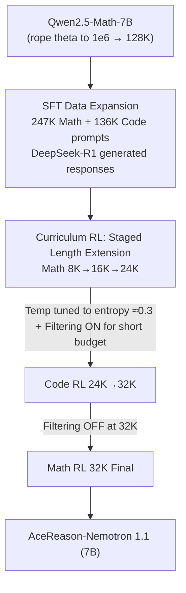

# AceReason-Nemotron 1.1: Advancing Math and Code Reasoning through SFT and RL Synergy

**Conference**: ICLR2026  
**OpenReview**: [https://openreview.net/forum?id=IaEqjWXd1d](https://openreview.net/forum?id=IaEqjWXd1d)  
**Code**: TBD  
**Area**: LLM Reasoning  
**Keywords**: Math and Code Reasoning, SFT-RL Synergy, Curriculum RL, Sampling Temperature, Overlength Filtering

## TL;DR
NVIDIA systematically decomposes the synergistic relationship between "Supervised Fine-Tuning (SFT) + Large-scale Reinforcement Learning (RL)" in building reasoning models. By expanding SFT data, tuning RL sampling temperature to target "entropy $\approx 0.3$", and staging response lengths, a 7B model (AceReason-Nemotron-1.1) achieves new SOTA results for math/code reasoning among 7B-scale models (AIME25 64.8, LiveCodeBench v6 52.1).

## Background & Motivation
**Background**: Since OpenAI o1 and DeepSeek-R1, "long Chain-of-Thought (CoT) reasoning" has become the primary engine for advancing LLM reasoning capabilities, primarily achieved through large-scale RL based on rule-based verifiers. Two parallel paths have emerged: distilling frontier models into small-to-medium models for SFT (e.g., DeepSeek-R1-Distill-Qwen, Light-R1), or reproducing large-scale RL on 7B/14B base or SFT models (often using DeepSeek-R1-Distill-Qwen as initialization).

**Limitations of Prior Work**: Almost all works treat SFT and RL as isolated stages. **The synergistic relationship between SFT and RL has rarely been systematically studied**, a gap prevalent in frontier model technical reports. Specifically, three questions remain: (1) Does a stronger SFT starting point guarantee a stronger RL endpoint? (2) Given an SFT initialization, how should the RL sampling temperature be set to balance exploration and exploitation? (3) When responses are truncated by length budgets (e.g., 24K tokens) without a final answer, should they receive a negative reward or be filtered out (overlength filtering)?

**Key Challenge**: The exploration-exploitation trade-off in RL training is highly dependent on sampling temperature; too low leads to over-exploitation and entropy collapse, while too high leads to over-exploration and low initial rewards. Furthermore, the causal relationship between "SFT strength" and "RL height" is not necessarily linear.

**Goal**: This work investigates the post-training pipeline as a holistic SFT-RL system to answer these questions and demonstrates a SOTA 7B reasoning model as evidence.

**Core Idea**: First, build a strong base by expanding SFT data along both "multi-prompt" and "multi-response" axes. Then, push limits using curriculum RL with staged length extensions, temperature tuning (target entropy $\approx 0.3$), and staged overlength filtering. This proves that with a sufficiently strong SFT starting point, a carefully designed RL recipe still yields substantial gains.

## Method

### Overall Architecture
AceReason-Nemotron-1.1-7B is produced via an "SFT → Multi-stage RL" pipeline. Initial math and code SFT is performed on the Qwen2.5-Math-7B base model. Then, curriculum RL is applied: three stages of pure math RL (length budget increasing 8K → 16K → 24K), followed by pure code RL (24K → 32K), and a final mathematics RL round at 32K. To support the 128K context, rope theta was modified from $10{,}000$ to $1{,}000{,}000$. RL utilizes GRPO and is strictly on-policy: each question is sampled for $G=8$ or $16$ rollouts within a 128-prompt global batch, performing a single policy gradient update without a KL term, using a token-level policy gradient loss (larger rewards for longer correct samples, heavier penalties for wrong ones).

### Key Designs

**1. SFT data expansion along "prompt count" and "responses per prompt" axes, where prompt diversity yields higher returns**

A strong SFT base is required for effective RL. Prompts were collected from AceMath, NuminaMath, OpenMathReasoning (math) and TACO, APPs, OpenCoder, OpenCodeReasoning (code), decontaminated using 9-gram overlap, and processed with DeepSeek-R1 responses. Simple samples were filtered based on response length ($ \le 2000$ tokens), resulting in 383K prompts. Seven datasets (v1–v7, 36K to 2.2M samples) were created: v1–v4 focused on prompt count, while v5 onwards expanded both axes. Conclusions show **both axes contribute to gains, but expanding prompt diversity has a higher marginal return** (e.g., adding 16K samples from v3 to v4 improved AIME24 +4%). SFT performance continued to improve through 5 epochs, which the authors suggest mitigates exposure bias for long CoT generation.

**2. Curriculum RL with staged response length extension: from easy to hard, math before code**

RL directly on long budgets is slow and unstable. Following the AceReason-1.0 stage-wise recipe, RL was split into a curriculum: Math Stage-1 (8K, simple prompts) → Stage-2 (16K, higher difficulty, noticeable performance gain) → Stage-3 (24K, hard prompts only). This was followed by Code Stage-I (24K) → Stage-II (32K with epoch-level filtering for solved prompts) → and a final Math Stage-4 (32K). Gains primarily occurred in Stage-2/3 alongside increasing average token counts, indicating the model learned to "utilize longer reasoning for harder problems." This also revealed that **strong SFT starting points lead to higher RL endpoints, but the gap is significantly narrowed by RL** (the 6.6% AIME24 difference between SFT v5 and v7 narrowed to 1.6% after RL).

**3. Empowering RL with the rule of "Temperature-Adjusted Entropy $\approx 0.3$"**

The RL training temperature governs exploration vs. exploitation. The authors discovered a transferable rule of thumb: **adjust the training sampling temperature so the "temperature-adjusted entropy" remains near 0.3**. Using a training temperature of 0.6 caused entropy to stay below 0.2, leading to over-exploitation and suboptimal performance. At 1.0, entropy dropped from 0.4 to 0.22 because sampling quality was poor, and low early rewards suppressed exploration. A temperature of 0.85 (in this case) maintained entropy between 0.26 and 0.38, yielding a balanced AIME24 score of 67.6. Note: Training sampling temperature follows this rule (0.85), while inference temperature is fixed at 0.6.

**4. Staged gating for overlength filtering: ON for short budgets, OFF for long budgets**

The authors resolved conflicting prior conclusions regarding whether to use negative rewards or filtering for truncated responses. The answer is ** бюджет-dependent: ON for short budgets, OFF for long budgets**. In Stage-1 (8K), ~30% of outputs exceed the budget; filtering is **mandatory** to prevent noise from truncated samples. As the budget increases, the overlength ratio drops; by Stage-4 (32K), **disabling filtering is better**. Disabling filtering at 32K encourages the model to generate more token-efficient and concise reasoning, which even outperformed filtered versions on coding benchmarks when tested at 64K lengths.

### Loss & Training
The RL utilizes GRPO in a strictly on-policy manner (batch size 128, $G=8/16$, single-step updates). **The KL divergence term is removed**, and a token-level policy gradient loss is applied—assignment of rewards and penalties scales with sample length to encourage "long reasoning for difficult problems." On-policy training without KL stabilizes the RL and prevents entropy collapse. RL prompts reuse the high-quality AceReason-1.0 sets, emphasizing "quality over quantity" and balanced reward signals.

## Key Experimental Results

### Main Results
Evaluation covers math (AIME24/25, MATH500, HMMT2025, BRUMO2025) and code (LiveCodeBench v5/v6, EvalPlus), using temperature=0.6, top-p=0.95, and max length 32K. Pass@1 is reported via avg@n (n=64 for AIME).

| Model | AIME24 | AIME25 | MATH500 | LCB v5 | LCB v6 |
|------|--------|--------|---------|--------|--------|
| DeepSeek-R1-Distill-Qwen-7B | 55.5 | 39.0 | 92.8 | 37.6 | 34.1 |
| AceReason-Nemotron-1.0-7B | 69.0 | 53.6 | 94.1 | 51.8 | 44.1 |
| Ours SFT-7B (RL Start) | 62.0 | 48.4 | 94.1 | 48.8 | 43.8 |
| **AceReason-Nemotron-1.1-7B** | **72.6** | **64.8** | **95.3** | **57.2** | **52.1** |

The RL recipe applied to the stronger SFT base yielded absolute gains of +10.6 for AIME24 and +16.4 for AIME25 over the SFT baseline, setting new records for the 7B scale on AIME25 and LCB v6.

### Ablation Study

| Configuration | Key Metric | Description |
|------|---------|------|
| SFT v6 → v7 (Responses per prompt) | AIME25 41.3 → 49.3 | +8% gain by adding responses only |
| RL Temp 0.6 / 0.85 / 1.0 (AIME24) | 64.6 / **67.6** / 65.3 | 0.85 (Entropy $\approx 0.3$) is best |
| Overlength Filtering Stage-1 (8K, AIME24) | Filtering ON is better | 30% overlength; filtering removes noise |
| Overlength Filtering Stage-4 (32K, AIME24) | 70.2 (ON) vs **71.4** (OFF) | OFF is more token-efficient for long budgets |

### Key Findings
- **Strong SFT starts lead to higher RL endpoints, but RL narrows the gap**: The 6.6% difference between SFT v5 and v7 on AIME24 shrank to 1.6% after RL, suggesting diminishing marginal returns for "maximizing SFT" when strong RL is used.
- **Prompt Diversity > Responses per Prompt**: Both axes are effective, but adding new prompts provides higher marginal returns.
- **Separate Training and Inference Temperatures**: Training should target "Entropy $\approx 0.3$" (0.85 in this study), while inference remains at 0.6.
- **Overlength filtering logic depends on budget**: ON for 8K/16K, OFF for 32K. This reconciles conflicting findings from DAPO, Skywork-OR1, and DeepCoder.

## Highlights & Insights
- **Systematic study of SFT-RL synergy**: By utilizing seven SFT datasets and multiple RL start points, the study clarifies the relationship between SFT quality and RL performance.
- **The "Entropy $\approx 0.3$" rule as a transferable engineering heuristic**: This grounds abstract exploration-exploitation trade-offs into an observable scalar.
- **Staged switching of overlength filtering**: Explaining the shift from filtering "noise" in short budgets to allowing "token efficiency" in long budgets unifies previously contradictory research.
- **Guided compute allocation**: Observation of diminishing SFT returns suggests it may not be necessary to maximize SFT data if robust RL follows.

## Limitations & Future Work
- **Base model specificity**: Results are tied to Qwen2.5-Math-7B; transferability to larger models or other bases (e.g., Llama) is not fully verified.
- **Lack of formal entropy definition**: "Temperature-adjusted entropy" is presented via trajectory values rather than an explicit formula, complicating direct replication.
- **Restricted to rule-based verification**: The recipe relies on automated verifiers; applicability to open-ended reasoning is unknown.
- **Heavy reliance on Appendix**: Critical arguments regarding Stage-1 necessity, pass@k behavior, and math-code cross-impact are moved to the appendix.

## Related Work & Insights
- **vs AceReason-Nemotron-1.0**: Inherits the stage-wise RL recipe and on-policy GRPO but shifts focus to SFT-RL synergy and engineering heuristics.
- **vs DAPO / DeepCoder (Overlength)**: Reconciles conflict by proving filtering is budget-dependent. Contrary to DeepCoder, found disabling filtering at long budgets improves efficiency.
- **vs SFT-only Distillation**: Unlike DeepSeek-R1-Distill-Qwen, this work uses a higher-quality SFT base and layers RL to further elevate the performance ceiling.

## Rating
- Novelty: ⭐⭐⭐⭐ Does not invent new algorithms, but transforms SFT-RL synergy into a systematic, reproducible engineering science.
- Experimental Thoroughness: ⭐⭐⭐⭐⭐ Extremely solid with multiple SFT variants, RL stages, and statistical reliability (avg@64).
- Writing Quality: ⭐⭐⭐⭐ Clear conclusions and problem-driven structure, though key definitions are relegated to the appendix.
- Value: ⭐⭐⭐⭐⭐ Provides a SOTA recipe and actionable engineering heuristics for 7B-scale reasoning model post-training.

<!-- RELATED:START -->

## Related Papers

- [\[ICLR 2026\] Executable Counterfactuals: Improving LLMs' Causal Reasoning Through Code](executable_counterfactuals_improving_llms_causal_reasoning_through_code.md)
- [\[ICML 2026\] Beyond Two-Stage Training: Cooperative SFT and RL for LLM Reasoning](../../ICML2026/llm_reasoning/beyond_two-stage_training_cooperative_sft_and_rl_for_llm_reasoning.md)
- [\[ICLR 2026\] On Code-Induced Reasoning in LLMs](on_code-induced_reasoning_in_llms.md)
- [\[ICLR 2026\] DeepMath-103K: A Large-Scale, Challenging, Decontaminated, and Verifiable Mathematical Dataset for Advancing Reasoning](deepmath-103k_a_large-scale_challenging_decontaminated_and_verifiable_mathematic.md)
- [\[ICLR 2026\] Front-Loading Reasoning: The Synergy between Pretraining and Post-Training Data](front-loading_reasoning_the_synergy_between_pretraining_and_post-training_data.md)

<!-- RELATED:END -->
