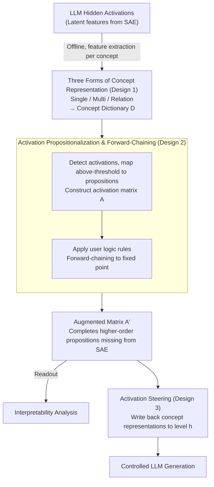

# ActivationReasoning: Logical Reasoning in Latent Activation Spaces

**Conference**: ICLR 2026  
**arXiv**: [2510.18184](https://arxiv.org/abs/2510.18184)  
**Code**: [https://github.com/ml-research/ActivationReasoning](https://github.com/ml-research/ActivationReasoning)  
**Area**: LLM Interpretability / Reasoning  
**Keywords**: Sparse Autoencoders (SAE), Logical Reasoning, Latent Space Intervention, Concept Composition, Model Control  

## TL;DR
The ActivationReasoning (AR) framework is proposed to embed explicit logical reasoning into the latent activation space of LLMs (via features extracted by SAEs). Through a three-stage pipeline (discovering concept representations → detecting activation propositions → reasoning with logical rules), it achieves multi-hop reasoning, concept composition, and safety control. On PrOntoQA, an 8B model achieves 95%+ accuracy, surpassing GPT-4o.

## Background & Motivation

**Background**: SAEs make the implicit activations of LLMs more interpretable by exposing latent features aligned with human concepts. Reasoning LLMs (e.g., o1, R1) improve performance by extending reasoning chains, but their reasoning processes remain opaque.

**Limitations of Prior Work**: SAE features are passive and fragile—they may be polysemous, contextually unstable, or too low-level. A key deficiency is that SAEs lack mechanisms for composition and higher-order reasoning. They cannot derive "Golden Gate Bridge" from "Bridge" + "San Francisco" + "USA."

**Key Challenge**: Logical reasoning requires discrete propositional units and compositional rules, whereas LLMs rely on continuous, entangled representations. While SAEs provide approximately discrete features, they lack a formal framework for reasoning.

**Goal**: To embed explicit logical reasoning capabilities into the latent space of LLMs, achieving interpretable and controllable structured reasoning.

**Key Insight**: SAE features are treated as logical propositions. Logical rules (conjunction, disjunction, implication, negation) are defined and applied over these features to generate new higher-order propositions through forward-chaining reasoning.

**Core Idea**: Treat SAE features as propositions, use user-defined logical rules as a reasoning engine, perform forward-chaining reasoning in the activation space, and then control LLM generation via activation steering.

## Method

### Overall Architecture
AR addresses a specific problem: human concepts are already "hidden" in LLM activations but are passive, fragmented, and do not compose themselves—a model might simultaneously activate "Bridge," "San Francisco," and "USA" without deriving "Golden Gate Bridge." AR moves the entire reasoning process into the SAE latent space explicitly. The pipeline consists of three stages: first, offline discovery of latent representations for each target concept in the SAE space to build a concept dictionary $\mathcal{D}$; during inference, detect activation intensity for each token and map those exceeding a threshold to logical propositions to form an activation matrix $A$; finally, apply user-defined logical rules to $A$ for forward-chaining reasoning to obtain an augmented matrix $A'$ supplemented with higher-order propositions. $A'$ can be read directly for interpretability analysis or used to write back activations to steer LLM generation.

### Key Designs

**1. Three Forms of Concept Representation: Making SAE Features Usable as Propositions**

While assuming "one SAE feature = one concept" is clean, it often fails—SAE features are frequently polysemous, where one dimension might encode "hate" alongside irrelevant content. AR thus provides three representations of increasing strength: Single Feature $\mathcal{R}_{single}$ follows the one-to-one assumption; Multi-Feature $\mathcal{R}_{multi}$ aggregates multiple SAE features via weighting into one concept; Relation Feature $\mathcal{R}_{relation}$ further models structured interactions between features using decision trees. The latter two address different issues: Multi-Feature handles insufficient expressivity of a single dimension, while Relation Feature handles cases where a "concept is a logical combination of features"—e.g., "hate" might require both "slander" and "stereotype" activations while excluding educational contexts. All three are automatically extracted based on a statistical criterion determining which features maximize activation differences between positive and negative samples:

$$r_c = \arg\max\big(\mathbb{E}[l_t \mid y=1] - \mathbb{E}[l_t \mid y=0]\big)$$

Decision trees are used instead of end-to-end training to balance expressivity and interpretability.

**2. Activation Propositionalization and Forward Chaining: Filling SAE Gaps with Logic**

With a concept dictionary, activations are discretized into propositions during inference. AR calculates two types of activation for each concept $c$: token-level $A_{local}[c,t] = \max(a_{c,t} - \tau_c,\, 0)$ to track where a concept is triggered, and global-level $A_{global}[c] = \max(\mathrm{Agg}_t\, a_{c,t} - \tau_c,\, 0)$ to aggregate whether a concept is present in the sequence. Propositions exceeding threshold $\tau_c$ enter the matrix $A$, and user-defined rules—e.g., "Bridge ∧ SF ∧ USA → Golden Gate Bridge"—are applied for forward-chaining. This step is crucial for filling expressivity gaps: the latent space might lack a specific "Golden Gate Bridge" feature, but logic can derive it from constituent features. Multi-hop reasoning follows the same principle, relying on explicit rule chains rather than the model's continuous representation.

**3. Activation Steering Control: From Understanding to Governing**

The resulting $A'$ can modify the model's hidden states. AR retrieves the representation $SAE_D[r_c]$ for a concept to be reinforced or suppressed and injects it into the activation at layer $h$:

$$h' = h + \alpha \cdot \frac{(SAE_D[r_c] \times w) \times \|h\|_2}{\|SAE_D[r_c]\|_2}$$

Here $w$ controls direction (positive for promotion, negative for suppression), and $\alpha$ controls intensity. Norm-normalization ensures the injection magnitude remains controlled. This allows AR to evolve from a retrospective interpretability tool into an alignment tool that imposes active constraints during inference—for instance, suppressing a concept immediately upon triggering a safety rule.

### Loss & Training
AR does not train the LLM itself. Concept extraction utilizes lightweight statistical methods (mean difference, decision trees), and logical rules are user-defined; thus, the framework incurs negligible training overhead during inference.

## Key Experimental Results

### Main Results

**PrOntoQA Multi-hop Reasoning (Accuracy %↑):**

| Model | 1-hop | 3-hop | 5-hop |
|------|-----|-----|-----|
| Llama-3.1-8B | 51.0 | 50.8 | 50.3 |
| **+ AR (Ours)** | **95.0** | **95.6** | **95.3** |
| Gemma-2-9B | 48.5 | 47.5 | 47.9 |
| **+ AR (Ours)** | **93.5** | **93.5** | **93.5** |
| GPT-4o | 95.5 | 88.0 | 79.5 |
| DeepSeek-R1-8B | 86.0 | 79.5 | 67.5 |

**Rail2Country Meta-concept Generalization:**

| Model | Explicit Concepts | Meta-concepts (Metaphor) |
|------|---------|-----------|
| Llama-3.1-8B | 41.0 | 29.7 |
| **+ AR (Ours)** | **74.7** | **62.7** |

### Ablation Study

| Representation Type | BeaverTails Safety Detection F1 |
|------------|---------------------|
| $\mathcal{R}_{single}$ | Lower |
| $\mathcal{R}_{multi}$ | Medium |
| $\mathcal{R}_{relation}$ | **Highest** |

### Key Findings
- AR enables an 8B model to surpass GPT-4o and DeepSeek-R1 in multi-hop reasoning—8B+AR (95.3%) vs GPT-4o (79.5%) on 5-hop tasks.
- Crucially, AR performance does not degrade with reasoning depth, whereas all baseline models (including GPT-4o) show significant accuracy drops as hops increase.
- Meta-concept generalization (e.g., "color like a tomato" → "red") validates AR's ability to go beyond literal matching.
- In BeaverTails safety tasks, $\mathcal{R}_{relation}$ outperforms $\mathcal{R}_{single}$ and $\mathcal{R}_{multi}$, indicating that safety concepts require structured feature interactions.

## Highlights & Insights
- **SAE Features as a Bridge to Logical Propositions**: This is a natural way to connect continuous neural representations with discrete symbolic reasoning—SAE features are designed to be monosemantic, making them ideal propositions.
- **8B Outperforming GPT-4o in Reasoning**: This is achieved not through better training, but by adding a logical reasoning layer over existing representations—the model "knows" the answer but lacks the compositional ability.
- **Modular and Auditable**: The entire reasoning chain is transparent—one can inspect where concepts come from, how rules are applied, and how conclusions are reached.
- **Cross-model Transferability**: The framework works effectively on both Llama and Gemma, suggesting that the propositionalization of SAE features is model-agnostic.

## Limitations & Future Work
- Logical rules currently require manual definition; automated rule discovery is an important future direction.
- Concept extraction depends on token-level labeled data; cross-domain generalization may require new labeling techniques.
- Currently supports only propositional logic; extensions to first-order logic (with quantifiers and variables) are yet to be explored.
- Performance is directly limited by SAE feature quality—if features are not sufficiently monosemantic, reasoning may be unreliable.
- Computational overhead of rule application scales with the number of concepts and rules.

## Related Work & Insights
- **vs. Reasoning LLMs (o1, R1)**: Reasoning LLMs improve outcomes via chain-of-thought but remain opaque; AR performs reasoning in the activation space, making every step auditable.
- **vs. Neuro-symbolic Methods (DeepProbLog)**: Traditional neuro-symbolic methods require end-to-end differentiable training; AR applies rules directly during inference without retraining the model.
- **vs. SAE Analysis (Anthropic)**: SAEs are typically used for passive analysis and feature visualization; AR actively utilizes SAE features for reasoning and control.

## Rating
- Novelty: ⭐⭐⭐⭐⭐ The idea of embedding logical reasoning into the LLM latent space is natural yet powerful, representing a major expansion of SAE applications.
- Experimental Thoroughness: ⭐⭐⭐⭐⭐ Validated across four complementary tasks (Multi-hop/Meta-concept/NLI/Safety) and multiple models.
- Writing Quality: ⭐⭐⭐⭐⭐ Procedural narrative from motivation to experiments is fluid, with the Golden Gate Bridge example providing clarity.
- Value: ⭐⭐⭐⭐⭐ Provides a new paradigm for interpretable reasoning and controllable alignment in LLMs.

## Related Papers

- [\[ICLR 2026\] Learning to Reason via Mixture-of-Thought for Logical Reasoning](learning_to_reason_via_mixture-of-thought_for_logical_reasoning.md)
- [\[ICLR 2026\] LogicReward: Incentivizing LLM Reasoning via Step-Wise Logical Supervision](logicreward_incentivizing_llm_reasoning_via_step-wise_logical_supervision.md)
- [\[ACL 2026\] Logical Phase Transitions: Understanding Collapse in LLM Logical Reasoning](../../ACL2026/llm_reasoning/logical_phase_transitions_understanding_collapse_in_llm_logical_reasoning.md)
- [\[ICLR 2026\] Rethinking LLM Reasoning: From Explicit Trajectories to Latent Representations](rethinking_llm_reasoning_from_explicit_trajectories_to_latent_representations.md)
- [\[ICLR 2026\] KaVa: Latent Reasoning via Compressed KV-Cache Distillation](kava_latent_reasoning_via_compressed_kv-cache_distillation.md)

<!-- RELATED:END -->

<!-- RELATED:START -->

## Related Papers

- [\[ICLR 2026\] Learning to Reason via Mixture-of-Thought for Logical Reasoning](learning_to_reason_via_mixture-of-thought_for_logical_reasoning.md)
- [\[ACL 2026\] Logical Phase Transitions: Understanding Collapse in LLM Logical Reasoning](../../ACL2026/llm_reasoning/logical_phase_transitions_understanding_collapse_in_llm_logical_reasoning.md)
- [\[ICLR 2026\] LogicReward: Incentivizing LLM Reasoning via Step-Wise Logical Supervision](logicreward_incentivizing_llm_reasoning_via_step-wise_logical_supervision.md)
- [\[ACL 2026\] Discovering a Shared Logical Subspace: Steering LLM Logical Reasoning via Alignment of Natural-Language and Symbolic Views](../../ACL2026/llm_reasoning/discovering_a_shared_logical_subspace_steering_llm_logical_reasoning_via_alignme.md)
- [\[ACL 2026\] Semantic-Aware Logical Reasoning via a Semiotic Framework](../../ACL2026/llm_reasoning/semantic-aware_logical_reasoning_via_a_semiotic_framework.md)

<!-- RELATED:END -->
